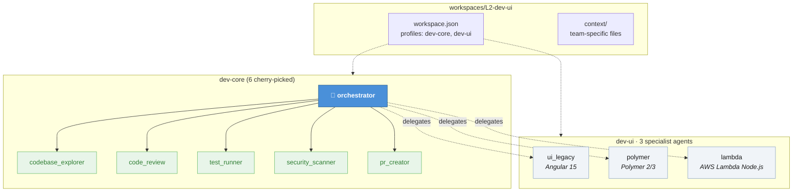

# Design Document: dev-ui Profile

## Overview

The `dev-ui` profile creates a lean, composable agent profile for the L2 studio team focused on legacy UI uplift (Angular 15, Polymer 2/3) and lightweight Lambda development within Config Studio. It follows the same conventions as existing profiles (`dev-core`, `dev-web`, etc.) — a directory under `profiles/dev-ui/` with `agents/`, `context/`, `prompts/`, and a `README.md`. A companion workspace at `workspaces/L2-dev-ui/` binds the team to the profile with appropriate rules and context.

The profile contains 3 new/adapted specialist agents (ui_legacy, polymer, lambda) and references 6 cherry-picked agents from `dev-core` (orchestrator, codebase_explorer, code_review, test_runner, security_scanner, pr_creator) for a total of 9 agents. The orchestrator's delegation configuration is extended to route Angular 15, Polymer, and Lambda tasks to the correct specialist.

### Design Decisions

1. **Profile-level agents only for specialists**: The 3 new agents (ui_legacy, polymer, lambda) live in `profiles/dev-ui/agents/`. The 6 dev-core agents are referenced by including `dev-core` in the workspace's `profiles` array — they are NOT duplicated into `dev-ui`. This follows the existing composable pattern (`koda install dev-core dev-ui`).

2. **Orchestrator delegation via AGENTS.md**: The orchestrator discovers specialist agents through the `AGENTS.md` resource file. Adding a `dev-ui` subgraph to the Mermaid diagram and documenting the 3 specialists is sufficient for delegation — no orchestrator JSON modification needed.

3. **Context files co-located with profile**: `angular_legacy_patterns.md`, `polymer_patterns.md`, and `lambda_patterns.md` live in `profiles/dev-ui/context/` and are referenced via `file://.kiro/context/` resource URIs in each agent's JSON config.

## Architecture



### Installation Flow

```
koda install dev-ui              → installs 3 specialist agents only
koda install dev-core dev-ui     → installs 6 dev-core + 3 dev-ui = 9 agents
koda workspace L2-dev-ui         → activates workspace with both profiles + rules
```

## Components and Interfaces

### 1. Profile Directory: `profiles/dev-ui/`

```
profiles/dev-ui/
├── README.md
├── agents/
│   ├── ui_legacy.json
│   ├── polymer.json
│   └── lambda.json
├── prompts/
│   ├── ui_legacy.md
│   ├── polymer.md
│   └── lambda.md
└── context/
    ├── angular_legacy_patterns.md
    ├── polymer_patterns.md
    └── lambda_patterns.md
```

### 2. Agent JSON Configurations

#### ui_legacy.json

```json
{
  "name": "ui_legacy",
  "description": "Angular 15 legacy UI specialist for Config Studio pre-sales applications",
  "prompt": "ui_legacy.md",
  "tools": [
    "fs_read",
    "fs_write",
    "execute_bash"
  ],
  "resources": [
    "file://AGENTS.md",
    "file://.kiro/steering/**/*.md",
    "file://.kiro/context/angular_legacy_patterns.md"
  ],
  "hooks": {
    "preToolUse": [
      {
        "matcher": "fs_write",
        "command": "$HOME/.kiro/hooks/guard-writes.sh",
        "description": "Block writes to node_modules, dist, .git"
      },
      {
        "matcher": "fs_write",
        "command": "$HOME/.kiro/hooks/secret-scan.sh",
        "description": "Scan for potential secrets before writing"
      }
    ],
    "postToolUse": [
      {
        "matcher": "fs_write",
        "command": "$HOME/.kiro/hooks/lint-on-write.sh",
        "description": "Auto-lint after file writes"
      }
    ]
  }
}
```

Key differences from `dev-web/ui.json`:
- No Figma MCP server (legacy pre-sales UIs don't use Figma workflows)
- References `angular_legacy_patterns.md` instead of `angular_modern_patterns.md`
- Vista design system rule loaded via workspace rules, not agent resources

#### polymer.json

```json
{
  "name": "polymer",
  "description": "Polymer 2/3 web component specialist for legacy uplift",
  "prompt": "polymer.md",
  "tools": [
    "fs_read",
    "fs_write",
    "execute_bash"
  ],
  "resources": [
    "file://AGENTS.md",
    "file://.kiro/steering/**/*.md",
    "file://.kiro/context/polymer_patterns.md"
  ],
  "hooks": {
    "preToolUse": [
      {
        "matcher": "fs_write",
        "command": "$HOME/.kiro/hooks/guard-writes.sh",
        "description": "Block writes to node_modules, dist, .git"
      },
      {
        "matcher": "fs_write",
        "command": "$HOME/.kiro/hooks/secret-scan.sh",
        "description": "Scan for potential secrets before writing"
      }
    ],
    "postToolUse": [
      {
        "matcher": "fs_write",
        "command": "$HOME/.kiro/hooks/lint-on-write.sh",
        "description": "Auto-lint after file writes"
      }
    ]
  }
}
```

#### lambda.json

```json
{
  "name": "lambda",
  "description": "Lightweight AWS Lambda specialist for Node.js handlers",
  "prompt": "lambda.md",
  "tools": [
    "fs_read",
    "fs_write",
    "execute_bash"
  ],
  "resources": [
    "file://AGENTS.md",
    "file://.kiro/steering/**/*.md",
    "file://.kiro/context/lambda_patterns.md"
  ],
  "hooks": {
    "preToolUse": [
      {
        "matcher": "fs_write",
        "command": "$HOME/.kiro/hooks/guard-writes.sh",
        "description": "Block writes to node_modules, dist, .git"
      },
      {
        "matcher": "fs_write",
        "command": "$HOME/.kiro/hooks/secret-scan.sh",
        "description": "Scan for potential secrets before writing"
      }
    ]
  }
}
```

Note: Lambda agent has no `postToolUse` lint hook — Lambda handlers are typically standalone files without a project-level linter config. The `general-aws` and `general-node-development` rules are applied via workspace rules.

### 3. Workspace: `workspaces/L2-dev-ui/`

```
workspaces/L2-dev-ui/
├── workspace.json
└── context/
    └── (team-specific context files as needed)
```

#### workspace.json

```json
{
  "name": "L2-dev-ui",
  "description": "L2 Studio team — legacy Angular 15, Polymer 2/3, and Lambda development for Config Studio pre-sales",
  "team": "L2 Studio",
  "profiles": [
    "dev-core",
    "dev-ui"
  ],
  "default_agent": "orchestrator",
  "rules": [
    "conventional_commit",
    "general-angular-development",
    "general-aws",
    "general-testing-strategies",
    "general-node-development",
    "general-performance-optimization",
    "vista-design-system"
  ],
  "enable_tools": true
}
```

The `profiles` array includes both `dev-core` and `dev-ui`. The `koda install` command resolves both profiles, installing the 6 cherry-picked dev-core agents plus the 3 dev-ui specialists. The `default_agent` is `orchestrator` (from dev-core), which discovers the dev-ui specialists via `AGENTS.md`.

### 4. Orchestrator Delegation

The orchestrator delegates to specialist agents based on the `AGENTS.md` resource. The delegation routing is:

| Task Pattern | Delegated To | Detection Signals |
|---|---|---|
| Angular 15 code (NgModules, `@Input`/`@Output`, Zone.js) | `ui_legacy` | File extensions `.component.ts` in legacy Angular projects, `@NgModule` decorators |
| Polymer 2/3 code (`<dom-module>`, HTML imports, Polymer.Element) | `polymer` | `.html` files with `<dom-module>`, `polymer.json`, `bower.json` |
| AWS Lambda handlers (Node.js) | `lambda` | `handler.ts`/`handler.js`, `template.yaml` (SAM), `serverless.yml` |

The `AGENTS.md` update adds a `dev-ui` subgraph to the Mermaid diagram and documents the 3 specialists with their files, purposes, tools, and delegation triggers.

### 5. AGENTS.md Updates

New content to add:

1. **Mermaid diagram**: Add `dev-ui` subgraph with 3 agents, plus cross-profile delegation arrows from `ORCH` to `UI_LEGACY`, `POLYMER`, `LAMBDA`.
2. **Installation commands**: Add `koda install dev-core dev-ui` to the install block.
3. **Profile section**: New `### Profile: dev-ui (3 agents)` section documenting each agent.
4. **MCP Server Coverage table**: Add 3 rows for dev-ui agents (no MCP servers).
5. **Context Files table**: Add 3 rows for the new context files.
6. **Agent count**: Update total from 64 to 67.

### 6. Context File Structures

#### angular_legacy_patterns.md

Sections:
- Core Principles (NgModule-based, Zone.js, decorator inputs/outputs)
- Architecture (NgModule feature modules, shared modules, core module)
- Component Patterns (`@Input()`, `@Output()`, `@ViewChild`, `@ContentChild`)
- Bootstrapping (`platformBrowserDynamic().bootstrapModule(AppModule)`)
- Routing & Lazy Loading (`loadChildren` with NgModule)
- Change Detection (Zone.js, `ChangeDetectorRef`, `OnPush` strategy)
- Lifecycle Hooks (`ngOnInit`, `ngOnDestroy`, `ngOnChanges`)
- Testing (TestBed with `declarations`, not `imports` for standalone)
- Anti-patterns (explicitly: NO standalone components, NO Signals, NO zoneless)

#### polymer_patterns.md

Sections:
- Polymer 2 Patterns (`<dom-module>`, HTML imports, `Polymer.Element`, `<dom-repeat>`, `<dom-if>`, two-way binding `{{}}` / `[[]]`, `iron-*`/`paper-*` elements)
- Polymer 3 Patterns (ES module imports, LitElement compatibility, `css` tagged templates, `@property` decorators)
- Uplift Path (Polymer 2 → 3 via `polymer-modulizer`, manual migration steps, Polymer 3 → Lit migration guidance)
- Vista Integration (`<wdpr-*>` components alongside Polymer elements)

#### lambda_patterns.md

Sections:
- Thin Handler Pattern (entry point delegates to service modules)
- Cold Start Optimization (minimize package size, lazy-load deps, connection reuse)
- Structured Logging (JSON format, correlation IDs, CloudWatch integration)
- Local Testing (AWS SAM CLI, `sam local invoke`, environment variables)
- Error Handling (structured error responses, retry semantics)
- IAM & Security (least-privilege roles, environment-based config, no hardcoded secrets)

## Data Models

### Agent JSON Schema

All agent JSON files follow the established schema:

```typescript
interface AgentConfig {
  name: string;                    // Agent identifier (kebab or snake_case)
  description: string;             // One-line purpose
  prompt: string;                  // Companion prompt filename (e.g., "ui_legacy.md")
  tools: string[];                 // Tool identifiers: "fs_read", "fs_write", "execute_bash", etc.
  resources: string[];             // file:// URIs for context files, steering, AGENTS.md
  hooks?: {
    preToolUse?: HookEntry[];
    postToolUse?: HookEntry[];
    agentSpawn?: HookEntry[];
  };
  toolsSettings?: Record<string, { allowedPaths?: string[] }>;
  allowedTools?: string[];
  includeMcpJson?: boolean;
}

interface HookEntry {
  matcher?: string;                // Tool name to match (e.g., "fs_write")
  command: string;                 // Hook script path
  description: string;             // Human-readable description
}
```

### workspace.json Schema

```typescript
interface WorkspaceConfig {
  name: string;                    // Workspace identifier
  description: string;             // Team/purpose description
  team: string;                    // Team name
  profiles: string[];              // Profile names to compose
  default_agent: string;           // Default agent for `kiro-cli chat`
  rules: string[];                 // Rule file basenames from common/rules/
  enable_tools?: boolean;          // Enable advanced tools (thinking, todo, etc.)
  projects?: ProjectRef[];         // Optional project references
  jira_prefix?: string;            // Optional Jira project prefix
  workspace_path?: string;         // Optional workspace root path
}
```

## Error Handling

- **Missing profile**: If `koda install dev-ui` is run without `dev-core`, the 3 specialist agents install but the orchestrator is absent. The `README.md` documents that `dev-core` is required as a base.
- **Duplicate agents**: If `koda install dev-core dev-ui` is run and `dev-core` is already installed, the installer skips existing agents (idempotent behavior per existing `koda` conventions).
- **Missing context files**: If a context file referenced in `resources` is not found at runtime, the agent loads without that context and logs a warning. This is existing kiro-cli behavior.
- **Orchestrator delegation miss**: If the orchestrator cannot determine which specialist to delegate to, it falls back to handling the task itself (existing orchestrator behavior).

## Testing Strategy

This feature is primarily declarative configuration (JSON files, Markdown documents, directory structure). Property-based testing is NOT applicable because:

- Agent JSON configs are static declarations, not functions with input/output behavior
- Context files are reference documentation, not executable code
- workspace.json is a configuration file with a fixed schema
- The `koda install` behavior is tested by the existing koda CLI test suite

### Recommended Testing Approach

1. **Schema validation tests** (unit): Validate each agent JSON file against the `AgentConfig` schema. Validate `workspace.json` against the `WorkspaceConfig` schema. These are example-based tests with concrete fixtures.

2. **Smoke tests**: Run `koda install dev-ui` and `koda install dev-core dev-ui` in a clean environment and verify the expected files are installed to `.kiro/`.

3. **Integration tests**: Verify the orchestrator can discover and delegate to `ui_legacy`, `polymer`, and `lambda` agents when given appropriate task descriptions.

4. **Manual review**: Context files (`angular_legacy_patterns.md`, `polymer_patterns.md`, `lambda_patterns.md`) are reviewed for technical accuracy by the L2 studio team.
