# Kiro Agents Reference

Complete reference for all agents across profiles.

## Agent Hierarchy

```mermaid
graph TD
    classDef orch fill:#4a90d9,stroke:#2c5f8a,color:#fff,font-weight:bold
    classDef agent fill:#f0f4f8,stroke:#8ba4c4,color:#1a1a1a
    classDef mcp fill:#e8f5e9,stroke:#66bb6a,color:#2e7d32,font-size:11px
    classDef tool fill:#fff3e0,stroke:#ffa726,color:#e65100,font-size:11px

    %% ─── dev-core ──────────────────────────────────
    subgraph DEV_CORE["dev-core · 16 agents"]
        ORCH["🎯 orchestrator<br/><i>thinking · todo · delegate</i>"]:::orch
        ORCH --> PLAN["planner<br/><i>jira · confluence · mywiki</i>"]:::agent
        ORCH --> STORY["story_analyzer<br/><i>jira · confluence · mywiki · github · knowledge</i>"]:::agent
        ORCH --> ARCH["architecture<br/><i>thinking · knowledge</i>"]:::agent
        ORCH --> BCTX["bounded_context"]:::agent
        ORCH --> ADR["adr_writer"]:::agent
        ORCH --> ASPEC["architecture_spec"]:::agent
        ORCH --> EXPLORE["codebase_explorer"]:::agent
        ORCH --> REVIEW["code_review<br/><i>jira · github</i>"]:::agent
        ORCH --> SEC["security_scanner"]:::agent
        ORCH --> COMPLY["compliance"]:::agent
        ORCH --> TEST["test_runner"]:::agent
        ORCH --> PERF["performance"]:::agent
        ORCH --> PR["pr_creator<br/><i>jira · confluence · mywiki · github</i>"]:::agent
        ORCH --> DISC["discussion"]:::agent
        ORCH --> WRITER["technical_writer<br/><i>confluence · mywiki · github</i>"]:::agent
    end

    %% ─── dev-web ───────────────────────────────────
    subgraph DEV_WEB["dev-web · 5 agents"]
        BACK["backend<br/><i>bruno</i>"]:::agent
        WAPI["webapi<br/><i>bruno</i>"]:::agent
        UI["ui<br/><i>figma</i>"]:::agent
        UX["ux_specialist<br/><i>figma</i>"]:::agent
        ASTRO["astro<br/><i>figma</i>"]:::agent
    end

    %% ─── dev-mobile ────────────────────────────────
    subgraph DEV_MOB["dev-mobile · 3 agents"]
        FLUTTER["flutter<br/>"]:::agent
        ANDROID["android_native<br/>"]:::agent
        IOS["ios_native<br/>"]:::agent
    end


    %% ─── dev-python ────────────────────────────────
    subgraph DEV_PY["dev-python · 1 agent"]
        PYTHON["python<br/>"]:::agent
    end

    %% ─── dev-infra ─────────────────────────────────
    subgraph DEV_INFRA["dev-infra · 1 agent"]
        TERRAFORM["terraform<br/>"]:::agent
    end

    %% ─── dev-dotnet ──────────────────────────────────
    subgraph DEV_DOTNET["dev-dotnet · 3 agents"]
        DOTNET_SENIOR["dotnet_senior_agent"]:::agent
        DOTNET_API["dotnet_self_host_api_agent"]:::agent
        DOTNET_SERVERLESS["dotnet_serverless_agent"]:::agent
    end

    %% ─── dev-php ───────────────────────────────────
    subgraph DEV_PHP["dev-php · 1 agent"]
        PHP["php_agent<br/>"]:::agent
    end

    %% ─── ba ────────────────────────────────────────
    subgraph BA["ba · 8 agents"]
        BA_ORCH["🎯 ba_orchestrator<br/><i>jira · confluence · mywiki · github<br/>thinking · todo · delegate</i>"]:::orch
        BA_ORCH --> SCOPE["scope_definer<br/><i>jira · confluence · mywiki · github</i>"]:::agent
        BA_ORCH --> FEAT["feature_writer<br/><i>jira · confluence · mywiki · github</i>"]:::agent
        BA_ORCH --> PRD["prd_generator<br/><i>jira · confluence</i>"]:::agent
        BA_ORCH --> BLOG["backlog_generator<br/><i>jira</i>"]:::agent
        BA_ORCH --> QGATE["quality_gate"]:::agent
        BA_ORCH --> ESTIM["estimation<br/><i>jira · confluence</i>"]:::agent
        BA_ORCH --> REQS["requirements_analyst<br/><i>jira · confluence · mywiki · github · knowledge</i>"]:::agent
    end

    %% ─── qa ────────────────────────────────────────
    subgraph QA["qa · 11 agents"]
        QA_ORCH["🎯 qa_orchestrator<br/><i>jira · confluence · mywiki · github · bruno<br/>thinking · todo · delegate</i>"]:::orch
        QA_ORCH --> TPLAN["test_planner<br/><i>jira · confluence · mywiki · github · bruno · knowledge</i>"]:::agent
        QA_ORCH --> TAUTO["test_automation<br/><i>bruno</i>"]:::agent
        QA_ORCH --> DEFECT["defect_analyst<br/><i>jira · confluence · mywiki · github</i>"]:::agent
        QA_ORCH --> APITEST["api_tester<br/><i>bruno</i>"]:::agent
        QA_ORCH --> PERFTEST["performance_tester"]:::agent
        QA_ORCH --> QESTRAT["qe_strategy<br/><i>jira · confluence</i>"]:::agent
        QA_ORCH --> E2EGEN["e2e_test_generator<br/><i>jira</i>"]:::agent
        QA_ORCH --> WEBDISC["web_discovery"]:::agent
        QA_ORCH --> TESTFW["test_framework"]:::agent
        QA_ORCH --> TCOV["test_coverage_analyzer<br/><i>jira · confluence · mywiki · github</i>"]:::agent
    end

    %% ─── ops ───────────────────────────────────────
    subgraph OPS["ops · 7 agents"]
        OPS_ORCH["🎯 ops_orchestrator<br/><i>jira · confluence · mywiki · github<br/>thinking · todo · delegate</i>"]:::orch
        OPS_ORCH --> METRICS["ai_metrics<br/><i>jira · confluence · mywiki · github</i>"]:::agent
        OPS_ORCH --> INFRA["infra_check"]:::agent
        OPS_ORCH --> DEPLOY["deployment<br/><i>harness</i>"]:::agent
        OPS_ORCH --> QUALITY["code_quality<br/><i>sonarqube</i>"]:::agent
        OPS_ORCH --> RELMGR["release_manager<br/><i>github · jira</i>"]:::agent
        OPS_ORCH --> RELDOC["release_documenter<br/><i>confluence · github · jira</i>"]:::agent
    end

    %% ─── pm ────────────────────────────────────────
    subgraph PM["pm · 6 agents"]
        PM_ORCH["🎯 pm_orchestrator<br/><i>jira · confluence · mywiki · github<br/>thinking · todo · delegate</i>"]:::orch
        PM_ORCH --> SPRINT["sprint_manager<br/><i>jira · confluence · mywiki · todo</i>"]:::agent
        PM_ORCH --> STANDUP["standup<br/><i>jira</i>"]:::agent
        PM_ORCH --> RETRO["retro<br/><i>jira · confluence · mywiki</i>"]:::agent
        PM_ORCH --> RISK["risk_tracker<br/><i>jira · confluence · mywiki</i>"]:::agent
        PM_ORCH --> DELIVER["delivery_reporter<br/><i>jira · confluence · mywiki</i>"]:::agent
    end

    %% ─── dev alias ─────────────────────────────────
    DEV{{"dev (alias)"}}:::orch
    DEV -.-> DEV_CORE
    DEV -.-> DEV_WEB
    DEV -.-> DEV_MOB
    DEV -.-> DEV_PY
    DEV -.-> DEV_INFRA
    DEV -.-> DEV_DOTNET
    DEV -.-> DEV_PHP

    %% ─── cross-profile delegation ──────────────────
    ORCH -.->|delegates| BACK
    ORCH -.->|delegates| WAPI
    ORCH -.->|delegates| UI
    ORCH -.->|delegates| PYTHON
    ORCH -.->|delegates| TERRAFORM
    ORCH -.->|delegates| FLUTTER
```



**Legend:** 🎯 = orchestrator (has `thinking`, `todo`, `delegate`) · *italic* = MCP servers and special tools


---

## Dev Profiles (30 agents total)

Development agents split into composable sub-profiles. Use `dev` as a shorthand to install all three.

```bash
koda install dev                    # All 30 dev agents (alias → dev-core + dev-web + dev-mobile + dev-python + dev-infra + dev-dotnet + dev-php)
koda install dev-core dev-web       # Fullstack web developer (21 agents)
koda install dev-core dev-python    # Python developer (17 agents)
koda install dev-core dev-infra     # Infra/Terraform developer (17 agents)
koda install dev-core dev-dotnet    # .NET developer (19 agents)
koda install dev-core dev-php       # PHP/Zend developer (17 agents)
koda install dev-core dev-mobile    # Mobile developer (19 agents)
koda install dev-core               # Core only — orchestrator + quality (16 agents)
```

---

### Profile: dev-core (16 agents)

Orchestrator, planning, quality, security, workflow, and documentation agents. Required base for all dev work.

#### orchestrator
**File:** `profiles/dev-core/agents/orchestrator.json`  
**Purpose:** SDLC orchestrator with automatic multi-agent delegation  
**Use for:** Implementing Jira stories end-to-end, coordinating multi-repo features  
**Tools:** `thinking`, `todo`, `delegate`, `use_subagent`  
**Hooks:** agentSpawn (git context), preToolUse (guard writes), postToolUse (warn destructive)

**Workflow:**
1. Fetch & validate Jira story
2. Explore codebase
3. Review architecture
4. Create implementation plan
5. Approval gate #1 (user reviews plan)
6. Implement tasks (delegate to specialist agents) — **review mode** pauses after each task for approval; **autopilot** runs straight through
7. Run tests (coverage ≥90%)
8. Code review
9. Security scan
10. Quality report & approval gate #2
11. Create pull request
12. Complete (summary & PR URL)

#### planner_agent
**File:** `profiles/dev-core/agents/planner_agent.json`  
**Purpose:** Task planning and breakdown  
**Use for:** Breaking down complex tasks, creating implementation plans  
**Tools:** `thinking`  
**MCP Servers:** jira, confluence, mywiki

#### story_analyzer_agent
**File:** `profiles/dev-core/agents/story_analyzer_agent.json`  
**Purpose:** Jira story analysis and requirements extraction  
**Use for:** Analyzing Jira stories, extracting requirements  
**Tools:** `knowledge`  
**MCP Servers:** jira, confluence, mywiki, github

#### architecture_agent
**File:** `profiles/dev-core/agents/architecture_agent.json`  
**Purpose:** Architecture review and design validation  
**Use for:** Reviewing architecture decisions, design patterns  
**Tools:** `thinking`, `knowledge`

#### bounded_context_agent
**File:** `profiles/dev-core/agents/bounded_context_agent.json`  
**Purpose:** Domain boundary analysis using DDD principles  
**Use for:** Identifying bounded contexts, aggregates, context maps

#### adr_writer_agent
**File:** `profiles/dev-core/agents/adr_writer_agent.json`  
**Purpose:** Architecture Decision Records  
**Use for:** Documenting technical decisions with context, alternatives, consequences

#### architecture_spec_agent
**File:** `profiles/dev-core/agents/architecture_spec_agent.json`  
**Purpose:** Target architecture design with diagrams  
**Use for:** Component diagrams, integration patterns, deployment topology

#### codebase_explorer_agent
**File:** `profiles/dev-core/agents/codebase_explorer_agent.json`  
**Purpose:** Code exploration and navigation  
**Use for:** Finding relevant code, understanding structure

#### code_review_agent
**File:** `profiles/dev-core/agents/code_review_agent.json`  
**Purpose:** Code review and quality checks  
**Use for:** Reviewing code changes, identifying issues  
**MCP Servers:** jira, github

#### security_scanner_agent
**File:** `profiles/dev-core/agents/security_scanner_agent.json`  
**Purpose:** Security analysis and vulnerability detection  
**Use for:** Security scans, finding vulnerabilities

#### compliance_agent
**File:** `profiles/dev-core/agents/compliance_agent.json`  
**Purpose:** Compliance validation (golden rules, standards)  
**Use for:** Checking compliance with coding standards

#### test_runner_agent
**File:** `profiles/dev-core/agents/test_runner_agent.json`  
**Purpose:** Test execution and coverage analysis  
**Use for:** Running tests, checking coverage

#### performance_agent
**File:** `profiles/dev-core/agents/performance_agent.json`  
**Purpose:** Performance optimization and analysis  
**Use for:** Performance profiling, optimization suggestions

#### pr_creator_agent
**File:** `profiles/dev-core/agents/pr_creator_agent.json`  
**Purpose:** Pull request creation and management  
**Use for:** Creating PRs, formatting descriptions  
**MCP Servers:** jira, confluence, mywiki, github

#### discussion_agent
**File:** `profiles/dev-core/agents/discussion_agent.json`  
**Purpose:** Technical discussions and decision support  
**Use for:** Technical discussions, architecture decisions

#### technical_writer_agent
**File:** `profiles/dev-core/agents/technical_writer_agent.json`  
**Purpose:** Creates and maintains technical documentation  
**Use for:** READMEs, API docs, architecture guides, runbooks, onboarding materials  
**MCP Servers:** confluence, mywiki, github

---

### Profile: dev-web (5 agents)

Fullstack web specialists for Config Studio (Java + Node.js + Angular + Astro).

#### backend
**File:** `profiles/dev-web/agents/backend.json`  
**Purpose:** Java services specialist for wdpr-config-services  
**Use for:** Backend API development, database changes, Java services  
**Hooks:** preToolUse (guard writes)

#### webapi
**File:** `profiles/dev-web/agents/webapi.json`  
**Purpose:** Node.js/TypeScript specialist for wdpr-payment-controls-api  
**Use for:** API layer, BFF logic, TypeScript interfaces  
**Hooks:** preToolUse (guard writes)

#### ui
**File:** `profiles/dev-web/agents/ui.json`  
**Purpose:** Angular specialist for wdpr-payment-controls-client  
**Use for:** Frontend development, components, services, routing  
**MCP Servers:** figma  
**Hooks:** preToolUse (guard writes)

#### ux_specialist_agent
**File:** `profiles/dev-web/agents/ux_specialist_agent.json`  
**Purpose:** Accessibility (WCAG 2.1 AA) and UX pattern review  
**Use for:** Accessibility audits, usability reviews, focus management, ARIA compliance  
**MCP Servers:** figma

#### astro
**File:** `profiles/dev-web/agents/astro.json`  
**Purpose:** Astro SSR specialist with React components and TypeScript  
**Use for:** Astro pages, React islands, server actions, Nanostores state  
**MCP Servers:** figma  
**Hooks:** preToolUse (guard writes, secret scan), postToolUse (lint on write)

---


### Profile: dev-python (1 agent)

Python specialist for FastAPI, Flask, Django, and general Python development.

#### python
**File:** `profiles/dev-python/agents/python.json`  
**Purpose:** Python development specialist for API services and general Python  
**Use for:** FastAPI/Flask/Django development, pytest, async patterns  
**Hooks:** preToolUse (guard writes, secret scan), postToolUse (lint on write)

---

### Profile: dev-infra (1 agent)

Infrastructure as Code specialist for Terraform and cloud provisioning.

#### terraform
**File:** `profiles/dev-infra/agents/terraform.json`  
**Purpose:** Terraform/IaC specialist for modules, state management, and provisioning  
**Use for:** Terraform modules, plan/apply workflows, security scanning  
**Hooks:** preToolUse (guard writes, secret scan)

---

### Profile: dev-dotnet (3 agents)

.NET specialists for self-hosted APIs and serverless applications.

#### dotnet_senior_agent
**File:** `profiles/dev-dotnet/agents/dotnet_senior_agent.json`  
**Purpose:** Senior .NET persona — reads project config, applies company standards, routes to archetype specialists  
**Use for:** Project scaffolding, archetype routing, cross-cutting .NET tasks  
**Tools:** thinking, todo, delegate, code, execute_bash, fs_read, fs_write, grep

#### dotnet_self_host_api_agent
**File:** `profiles/dev-dotnet/agents/dotnet_self_host_api_agent.json`  
**Purpose:** ASP.NET Core specialist — thin controllers, explicit DI, Swagger/OpenAPI, health checks  
**Use for:** Self-hosted APIs, Windows Services, Kubernetes backends  
**Tools:** code, execute_bash, fs_read, fs_write, grep

#### dotnet_serverless_agent
**File:** `profiles/dev-dotnet/agents/dotnet_serverless_agent.json`  
**Purpose:** Serverless specialist — thin handlers, service orchestration, explicit contracts, AWS adapter seams  
**Use for:** Lambda handlers, event-driven workflows, stateless execution  
**Tools:** code, execute_bash, fs_read, fs_write, grep

---

### Profile: dev-php (1 agent)

PHP specialist for Zend Framework 3 (Laminas) and legacy ZF1/ZF2.

#### php_agent
**File:** `profiles/dev-php/agents/php_agent.json`  
**Purpose:** PHP/Zend specialist — MVC, service managers, factory pattern, PSR-12, PHPUnit  
**Use for:** Zend/Laminas MVC apps, legacy ZF1/ZF2 migration, module development  
**Hooks:** preToolUse (guard writes, secret scan), postToolUse (lint on write)

---

### Profile: dev-mobile (3 agents)

Mobile specialists for Flutter cross-platform and native platform channels.

#### flutter
**File:** `profiles/dev-mobile/agents/flutter.json`  
**Purpose:** Dart/Flutter cross-platform development  
**Use for:** Flutter widgets, state management, platform channels  
**Hooks:** preToolUse (guard writes)

#### android_native
**File:** `profiles/dev-mobile/agents/android_native.json`  
**Purpose:** Kotlin/Java platform channels for Android  
**Use for:** Android-specific implementations, native integrations  

#### ios_native
**File:** `profiles/dev-mobile/agents/ios_native.json`  
**Purpose:** Swift/Obj-C platform channels for iOS  
**Use for:** iOS-specific implementations, native integrations  

---

## Profile: ba (8 agents)

Business Analyst and Product Owner agents for requirements, scope, and feature definition.

### BA Orchestrator (1)

#### ba_orchestrator_agent
**File:** `profiles/ba/agents/ba_orchestrator_agent.json`  
**Purpose:** Coordinates BA/PO tasks and delegates to specialized agents  
**Use for:** Complex BA workflows requiring multiple steps  
**Tools:** `thinking`, `todo`, `delegate`, `use_subagent`  
**Hooks:** agentSpawn (git context)  
**MCP Servers:** jira, confluence, mywiki, github

**Delegates to:** scope_definer_agent, feature_writer_agent, requirements_analyst_agent, estimation_agent

---

### BA Specialists (7)

#### scope_definer_agent
**File:** `profiles/ba/agents/scope_definer_agent.json`  
**Purpose:** Defines project and feature scope, boundaries, and constraints  
**Use for:** Starting new projects, clarifying scope, documenting assumptions  
**MCP Servers:** jira, confluence, mywiki, github

#### feature_writer_agent
**File:** `profiles/ba/agents/feature_writer_agent.json`  
**Purpose:** Creates user stories, acceptance criteria, and feature specifications  
**Use for:** Writing user stories, breaking down epics, refining backlog  
**MCP Servers:** jira, confluence, mywiki, github

#### requirements_analyst_agent
**File:** `profiles/ba/agents/requirements_analyst_agent.json`  
**Purpose:** Analyzes requirements, identifies gaps, validates completeness  
**Use for:** Reviewing requirements, gap analysis, sprint planning prep  
**Tools:** `knowledge`  
**MCP Servers:** jira, confluence, mywiki, github

#### prd_generator_agent
**File:** `profiles/ba/agents/prd_generator_agent.json`  
**Purpose:** Generates Product Requirements Documents from Jira epics  
**Use for:** Creating PRDs, stakeholder analysis, requirements gathering  
**MCP Servers:** jira, confluence, mywiki, github

#### backlog_generator_agent
**File:** `profiles/ba/agents/backlog_generator_agent.json`  
**Purpose:** Generates epic/story breakdowns from PRDs  
**Use for:** Story writing, backlog creation, sprint planning prep  
**MCP Servers:** jira

#### quality_gate_agent
**File:** `common/agents/quality_gate_agent.json`  
**Purpose:** Formal review gate — approve/reject/revise artifacts  
**Use for:** PRD review, backlog review, test plan review, any artifact approval  
**Shared across:** All profiles (BA, QA, dev-core)

#### estimation_agent
**File:** `profiles/ba/agents/estimation_agent.json`  
**Purpose:** Dual-mode project estimation — CCV (hours/story points/FTEs) and DRIFT (tokens/cost)  
**Use for:** RFP estimation, sprint planning, AI cost projection, team sizing  
**MCP Servers:** jira, confluence

---

## Profile: qa (11 agents)

Quality Assurance and Test Automation agents for comprehensive testing.

### QA Orchestrator (1)

#### qa_orchestrator_agent
**File:** `profiles/qa/agents/qa_orchestrator_agent.json`  
**Purpose:** Orchestrates QA tasks and coordinates specialized testing agents  
**Use for:** Complex QA workflows requiring multiple agents  
**Tools:** `thinking`, `todo`, `delegate`, `use_subagent`  
**Hooks:** agentSpawn (git context)  
**MCP Servers:** jira, confluence, mywiki, github, qtest

**Delegates to:** test_planner_agent, test_automation_agent, defect_analyst_agent, api_tester_agent, performance_tester_agent, test_coverage_analyzer_agent

---

### QA Specialists (10)

#### test_planner_agent
**File:** `profiles/qa/agents/test_planner_agent.json`  
**Purpose:** Creates test plans, test cases, and test scenarios from requirements  
**Use for:** Test planning, test case design, coverage analysis  
**Tools:** `knowledge`  
**MCP Servers:** jira, confluence, mywiki, github, qtest

#### test_automation_agent
**File:** `profiles/qa/agents/test_automation_agent.json`  
**Purpose:** Creates and maintains automated test scripts  
**Use for:** UI tests, API tests, integration tests, test frameworks  
**Hooks:** preToolUse (guard writes)  
**MCP Servers:** qtest

#### defect_analyst_agent
**File:** `profiles/qa/agents/defect_analyst_agent.json`  
**Purpose:** Analyzes defects, performs root cause analysis  
**Use for:** Bug triage, root cause analysis, detailed bug reports  
**MCP Servers:** jira, confluence, mywiki, github, qtest

#### api_tester_agent
**File:** `profiles/qa/agents/api_tester_agent.json`  
**Purpose:** Tests REST APIs and validates contracts  
**Use for:** API test suites, contract testing, endpoint validation  
**Hooks:** preToolUse (guard writes)

#### performance_tester_agent
**File:** `profiles/qa/agents/performance_tester_agent.json`  
**Purpose:** Creates and executes performance and load tests  
**Use for:** Load testing, stress testing, performance benchmarks

#### qe_strategy_agent
**File:** `profiles/qa/agents/qe_strategy_agent.json`  
**Purpose:** Test strategy documents with scope, approach, and risk assessment  
**Use for:** Defining testing approach, risk-based prioritization  
**MCP Servers:** jira, confluence

#### e2e_test_generator_agent
**File:** `profiles/qa/agents/e2e_test_generator_agent.json`  
**Purpose:** Generates Gherkin E2E test scenarios from user stories  
**Use for:** Happy path, edge case, and negative test scenarios  
**MCP Servers:** jira

#### web_discovery_agent
**File:** `profiles/qa/agents/web_discovery_agent.json`  
**Purpose:** Discovers testable elements and page objects from web app source  
**Use for:** Test automation prep, selector mapping, user flow discovery

#### test_framework_agent
**File:** `profiles/qa/agents/test_framework_agent.json`  
**Purpose:** Generates test automation scaffolding per tech stack  
**Use for:** Test config, base helpers, CI pipeline snippets

#### test_coverage_analyzer_agent
**File:** `profiles/qa/agents/test_coverage_analyzer_agent.json`  
**Purpose:** Analyzes test coverage for epics against Jira/Xray and discovers reusable tests  
**Use for:** Coverage gap analysis, reuse discovery across projects, coverage matrix reports  
**MCP Servers:** jira, confluence, mywiki, github

---

## Profile: ops (7 agents)

Operations agents for AI metrics, infrastructure, deployments, and code quality.

### Ops Orchestrator (1)

#### ops_orchestrator_agent
**File:** `profiles/ops/agents/ops_orchestrator_agent.json`  
**Purpose:** Coordinates ops workflows and delegates to specialized agents  
**Use for:** Complex ops tasks requiring multiple agents  
**Tools:** `thinking`, `todo`, `delegate`, `use_subagent`  
**Hooks:** agentSpawn (git context)  
**MCP Servers:** jira, confluence, mywiki, github

**Delegates to:** ai_metrics_agent, infra_check_agent, deployment_agent, code_quality_agent, release_manager_agent, release_documenter_agent

---

### Ops Specialists (6)

#### ai_metrics_agent
**File:** `profiles/ops/agents/ai_metrics_agent.json`  
**Purpose:** Tracks AI-assisted development metrics and updates Jira  
**Use for:** AI productivity reports, updating Jira AI custom fields  
**MCP Servers:** jira, confluence, mywiki, github

#### infra_check_agent
**File:** `profiles/ops/agents/infra_check_agent.json`  
**Purpose:** Checks AWS infrastructure status  
**Use for:** ECS task counts, cluster health, infrastructure reports

#### deployment_agent
**File:** `profiles/ops/agents/deployment_agent.json`  
**Purpose:** Manages CI/CD pipelines via Harness  
**Use for:** Pipeline status, recent deployments, deployment logs  
**MCP Servers:** harness

#### code_quality_agent
**File:** `profiles/ops/agents/code_quality_agent.json`  
**Purpose:** Retrieves code quality metrics from SonarQube  
**Use for:** Quality gate status, coverage reports, bug/vulnerability counts  
**MCP Servers:** sonarqube

#### release_manager_agent
**File:** `profiles/ops/agents/release_manager_agent.json`  
**Purpose:** Manages releases — compares tags, generates release notes, creates GitHub releases  
**Use for:** Release notes, tag comparison, readiness checks, GitHub releases  
**MCP Servers:** github, jira

#### release_documenter_agent
**File:** `profiles/ops/agents/release_documenter_agent.json`  
**Purpose:** Documents releases in Confluence with changes, rollback plan, dependencies  
**Use for:** Confluence release pages, change documentation, rollback procedures  
**MCP Servers:** confluence, mywiki, github, jira

---

## Profile: pm (6 agents)

Project Manager / Scrum Master agents for sprint execution, ceremonies, risk tracking, and delivery reporting.

### PM Orchestrator (1)

#### pm_orchestrator_agent
**File:** `profiles/pm/agents/pm_orchestrator_agent.json`  
**Purpose:** Coordinates PM/Scrum Master workflows and delegates to specialists  
**Use for:** Complex PM tasks requiring multiple agents  
**Tools:** `thinking`, `todo`, `delegate`, `use_subagent`  
**Hooks:** agentSpawn (git context)  
**MCP Servers:** jira, confluence, mywiki, github

**Delegates to:** sprint_manager_agent, standup_agent, retro_agent, risk_tracker_agent, delivery_reporter_agent

---

### PM Specialists (5)

#### sprint_manager_agent
**File:** `profiles/pm/agents/sprint_manager_agent.json`  
**Purpose:** Manages sprint planning, capacity, backlog grooming, and sprint health  
**Use for:** Sprint planning, capacity analysis, backlog review  
**Tools:** `todo`  
**MCP Servers:** jira, confluence, mywiki

#### standup_agent
**File:** `profiles/pm/agents/standup_agent.json`  
**Purpose:** Generates daily standup summaries from Jira activity  
**Use for:** Standup prep, stale item detection, blocker alerts  
**MCP Servers:** jira

#### retro_agent
**File:** `profiles/pm/agents/retro_agent.json`  
**Purpose:** Facilitates retrospectives with data-driven insights and action item tracking  
**Use for:** Sprint retros, trend analysis, action item follow-up  
**MCP Servers:** jira, confluence, mywiki

#### risk_tracker_agent
**File:** `profiles/pm/agents/risk_tracker_agent.json`  
**Purpose:** Identifies blockers, dependencies, and risks across sprints and epics  
**Use for:** Risk assessment, blocker tracking, dependency mapping  
**MCP Servers:** jira, confluence, mywiki

#### delivery_reporter_agent
**File:** `profiles/pm/agents/delivery_reporter_agent.json`  
**Purpose:** Generates velocity reports, burndown analysis, and release readiness assessments  
**Use for:** Sprint reports, velocity trends, release readiness  
**MCP Servers:** jira, confluence, mywiki

---

## Profile: leadership (5 agents)

Cross-team analytics, quarterly reporting, and executive briefings for Tech Directors and Delivery Managers.

### Leadership Orchestrator (1)

#### leadership_orchestrator_agent
**File:** `profiles/leadership/agents/leadership_orchestrator_agent.json`  
**Purpose:** Coordinates cross-team queries, quarterly reports, and executive briefings  
**Use for:** Multi-team analysis, report coordination, delegation to specialists  
**Tools:** thinking, todo, delegate, use_subagent  
**MCP Servers:** jira, confluence, mywiki

**Delegates to:** portfolio_analyst_agent, quarterly_reporter_agent, cross_team_coordinator_agent, executive_briefing_agent

---

### Leadership Specialists (4)

#### portfolio_analyst_agent
**File:** `profiles/leadership/agents/portfolio_analyst_agent.json`  
**Purpose:** Cross-team Jira analytics — velocity, delivery accuracy, carry-over rates, cycle time  
**Use for:** Multi-team velocity comparison, capacity analysis, trend identification  
**MCP Servers:** jira

#### quarterly_reporter_agent
**File:** `profiles/leadership/agents/quarterly_reporter_agent.json`  
**Purpose:** Generates 10-section quarterly business reports for Disney directors  
**Use for:** Quarterly reviews, business impact reporting, achievement summaries  
**MCP Servers:** jira, confluence, mywiki

#### cross_team_coordinator_agent
**File:** `profiles/leadership/agents/cross_team_coordinator_agent.json`  
**Purpose:** Tracks cross-team dependencies, shared blockers, and integration risks  
**Use for:** Dependency mapping, blocker escalation, coordination risk assessment  
**MCP Servers:** jira

#### executive_briefing_agent
**File:** `profiles/leadership/agents/executive_briefing_agent.json`  
**Purpose:** Produces audience-tailored executive summaries for directors, colleagues, and partners  
**Use for:** Executive briefings, stakeholder updates, partner communications  
**MCP Servers:** jira, confluence, mywiki

---

## Other IDEs

The coding standards, MCP integrations, and workflow guidance from these agents are also available in other IDEs:

| IDE | Format | Setup |
|-----|--------|-------|
| **Cursor** | `.mdc` rule files + shared MCP | [Cursor Setup](docs/getting-started/CURSOR_SETUP.md) |
| **Amazon Q** | Plain `.md` rule files | [Amazon Q README](.amazonq-templates/README.md) |
| **Kite** | Desktop GUI over Kiro CLI | [Kite repo](https://github.disney.com/SANCR225/Kite) |

---

## Advanced Tools

Some agents use advanced kiro-cli tools that require global settings. Enable with:

```bash
koda enable-tools
```

| Tool | What it does | Agents |
|------|-------------|--------|
| `thinking` | Step-by-step reasoning for complex decisions | 5 orchestrators, architecture, planner |
| `todo` | Persistent task tracking across sessions | 5 orchestrators, sprint_manager |
| `delegate` | Async non-blocking agent delegation | 5 orchestrators |
| `knowledge` | Long-term semantic memory across conversations | story_analyzer, architecture, test_planner, requirements_analyst |

Agents degrade gracefully when settings are off — tools simply won't appear.

---

## Hooks

Reusable hook scripts in `.kiro/hooks/` provide guardrails and context injection:

| Script | Event | Agents | Behavior |
|--------|-------|:------:|----------|
| `git-context.sh` | agentSpawn | 5 orchestrators | Injects current branch + dirty file count on start |
| `guard-writes.sh` | preToolUse (fs_write) | 6 write agents | Blocks writes to `node_modules/`, `dist/`, `.git/` |
| `secret-scan.sh` | preToolUse (fs_write) | 6 write agents | Scans for potential secrets before writing |
| `branch-guard.sh` | preToolUse (execute_bash) | 5 orchestrators | Blocks direct commits/pushes to `main`/`master` |
| `warn-destructive.sh` | postToolUse (execute_bash) | dev-core orchestrator | Warns on `rm -rf`, `DROP TABLE`, `--force` |
| `lint-on-write.sh` | postToolUse (fs_write) | 6 write agents | Auto-runs linter/formatter after file writes |

Full reference: [Hooks & Powers](docs/reference/HOOKS_AND_POWERS.md)

---

## MCP Server Coverage

Pre-built Node.js MCP bundles in `~/.kiro/tools/mcp-servers/`. Tokens centralized in `~/.kiro/tokens.env` (configured via `koda mcp-install` or `koda configure`).

| Profile | Agent | Jira | Confluence | MyWiki | GitHub | qTest | Other |
|---------|-------|:----:|:----------:|:------:|:------:|:-----:|:-----:|
| **dev-core** | story_analyzer_agent | ✅ | ✅ | ✅ | ✅ | | |
| **dev-core** | pr_creator_agent | ✅ | ✅ | ✅ | ✅ | | |
| **dev-core** | code_review_agent | ✅ | | | ✅ | | |
| **dev-core** | planner_agent | ✅ | ✅ | ✅ | | | |
| **dev-core** | technical_writer_agent | | ✅ | ✅ | ✅ | | |
| **dev-web** | backend | | | | | | |
| **dev-web** | webapi | | | | | | |
| **dev-web** | ui | | | | | | Figma |
| **dev-web** | ux_specialist_agent | | | | | | Figma |
| **dev-web** | astro | | | | | | Figma |
| **dev-python** | python | | | | | | |
| **dev-infra** | terraform | | | | | | |
| **dev-dotnet** | dotnet_senior_agent | | | | | | |
| **dev-dotnet** | dotnet_self_host_api_agent | | | | | | |
| **dev-dotnet** | dotnet_serverless_agent | | | | | | |
| **dev-php** | php_agent | | | | | | |
| **dev-mobile** | flutter | | | | | | |
| **dev-mobile** | android_native | | | | | | |
| **dev-mobile** | ios_native | | | | | | |
| **ba** | ba_orchestrator_agent | ✅ | ✅ | ✅ | ✅ | | |
| **ba** | feature_writer_agent | ✅ | ✅ | ✅ | ✅ | | |
| **ba** | requirements_analyst_agent | ✅ | ✅ | ✅ | ✅ | | |
| **ba** | scope_definer_agent | ✅ | ✅ | ✅ | ✅ | | |
| **qa** | qa_orchestrator_agent | ✅ | ✅ | ✅ | ✅ | ✅ | |
| **qa** | test_planner_agent | ✅ | ✅ | ✅ | ✅ | ✅ | |
| **qa** | defect_analyst_agent | ✅ | ✅ | ✅ | ✅ | | |
| **qa** | test_automation_agent | | | | | | |
| **ops** | ops_orchestrator_agent | ✅ | ✅ | ✅ | ✅ | | |
| **ops** | ai_metrics_agent | ✅ | ✅ | ✅ | ✅ | | |
| **ops** | code_quality_agent | | | | | | SonarQube |
| **ops** | deployment_agent | | | | | | Harness |
| **pm** | pm_orchestrator_agent | ✅ | ✅ | ✅ | ✅ | | |
| **pm** | sprint_manager_agent | ✅ | ✅ | ✅ | | | |
| **pm** | standup_agent | ✅ | | | | | |
| **pm** | retro_agent | ✅ | ✅ | ✅ | | | |
| **pm** | risk_tracker_agent | ✅ | ✅ | ✅ | | | |
| **pm** | delivery_reporter_agent | ✅ | ✅ | ✅ | | | |

---

## Context Files

Shared context loaded via agent `resources`:

| File | Used by |
|------|---------|
| `golden_rules.md` | dev-core orchestrator, architecture, compliance, security, code_review, pr_creator, pm_orchestrator |
| `project_mappings.md` | dev-core orchestrator, story_analyzer, planner, codebase_explorer, discussion, test_automation |
| `ba_guidelines.md` | All BA agents |
| `qa_guidelines.md` | All QA agents |
| `ops_guidelines.md` | All ops agents |
| `pm_guidelines.md` | All PM agents |
| `test_templates.md` | qa_orchestrator, test_planner |
| `story_templates.md` | feature_writer |
| `automation_patterns.md` | test_automation |
| `defect_templates.md` | defect_analyst |
| `api_test_patterns.md` | api_tester |
| `qtest_guidelines.md` | qa_orchestrator, test_planner |
| `performance_patterns.md` | performance_tester |
| `coverage_matrix_template.md` | test_coverage_analyzer |
| `python_guidelines.md` | python |
| `angular_modern_patterns.md` | ui |
| `java_conventions.md` | backend |
| `node_conventions.md` | webapi |
| `astro_project_patterns.md` | astro |
| `vista_web_components.md` | astro, ui, ux_specialist |
| `terraform_guidelines.md` | terraform |
| `dotnet_engineering_principles.md` | dotnet_senior, dotnet_self_host_api, dotnet_serverless |
| `dotnet_tech_standards.md` | dotnet_senior, dotnet_self_host_api, dotnet_serverless |
| `dotnet_testing_strategy.md` | dotnet_senior, dotnet_self_host_api, dotnet_serverless |
| `dotnet_aws_platform_guidance.md` | dotnet_senior, dotnet_self_host_api, dotnet_serverless |
| `dotnet_self_host_api_guidance.md` | dotnet_senior, dotnet_self_host_api |
| `dotnet_serverless_guidance.md` | dotnet_senior, dotnet_serverless |
| `php_zend_conventions.md` | php_agent |
| `php_testing_strategy.md` | php_agent |
| `php_legacy_migration.md` | php_agent |
| `php_review_checklist.md` | php_agent |

---

## Quick Reference

```bash
# Dev Core
kiro-cli chat --agent orchestrator              # Dev orchestrator
kiro-cli chat --agent code_review_agent         # Code review
kiro-cli chat --agent technical_writer_agent    # Technical docs

# Dev Web
kiro-cli chat --agent backend                   # Java backend
kiro-cli chat --agent webapi                    # Node.js API
kiro-cli chat --agent ui                        # Angular frontend
kiro-cli chat --agent ux_specialist_agent       # Accessibility & UX review
kiro-cli chat --agent astro                     # Astro SSR + React

# Dev Python
kiro-cli chat --agent python                    # Python development

# Dev Infra
kiro-cli chat --agent terraform                 # Terraform/IaC
kiro-cli chat --agent dotnet_senior_agent       # .NET senior persona
kiro-cli chat --agent dotnet_self_host_api_agent  # ASP.NET Core APIs
kiro-cli chat --agent dotnet_serverless_agent     # .NET serverless

# Dev PHP
kiro-cli chat --agent php_agent                   # PHP/Zend Framework

# Dev Mobile
kiro-cli chat --agent flutter                   # Flutter mobile
kiro-cli chat --agent android_native            # Android native
kiro-cli chat --agent ios_native                # iOS native

# BA/PO
kiro-cli chat --agent ba_orchestrator_agent     # BA orchestrator
kiro-cli chat --agent scope_definer_agent       # Define scope
kiro-cli chat --agent feature_writer_agent      # Write stories
kiro-cli chat --agent requirements_analyst_agent # Analyze requirements
kiro-cli chat --agent estimation_agent          # CCV + DRIFT estimation

# QA
kiro-cli chat --agent qa_orchestrator_agent     # QA orchestrator
kiro-cli chat --agent test_planner_agent        # Test planning
kiro-cli chat --agent test_automation_agent     # Test automation
kiro-cli chat --agent defect_analyst_agent      # Defect analysis
kiro-cli chat --agent api_tester_agent          # API testing
kiro-cli chat --agent performance_tester_agent  # Performance testing
kiro-cli chat --agent test_coverage_analyzer_agent # Coverage analysis

# Ops
kiro-cli chat --agent ops_orchestrator_agent    # Ops orchestrator
kiro-cli chat --agent ai_metrics_agent          # AI metrics
kiro-cli chat --agent infra_check_agent         # AWS/ECS checks
kiro-cli chat --agent deployment_agent          # Harness CI/CD
kiro-cli chat --agent code_quality_agent        # SonarQube metrics
kiro-cli chat --agent release_manager_agent     # Release notes, tag comparison, GitHub releases
kiro-cli chat --agent release_documenter_agent  # Confluence release documentation

# PM/Scrum Master
kiro-cli chat --agent pm_orchestrator_agent     # PM orchestrator
kiro-cli chat --agent sprint_manager_agent      # Sprint management
kiro-cli chat --agent standup_agent             # Standup summaries
kiro-cli chat --agent retro_agent               # Retrospectives
kiro-cli chat --agent risk_tracker_agent        # Risk tracking
kiro-cli chat --agent delivery_reporter_agent   # Delivery reports

# Leadership
kiro-cli chat --agent leadership_orchestrator_agent  # Cross-team orchestrator
kiro-cli chat --agent portfolio_analyst_agent         # Multi-team Jira analytics
kiro-cli chat --agent quarterly_reporter_agent        # Quarterly business reports
kiro-cli chat --agent cross_team_coordinator_agent    # Dependency tracking
kiro-cli chat --agent executive_briefing_agent        # Executive summaries
```

---

## Installation

```bash
koda install dev                    # All dev agents (alias → dev-core + dev-web + dev-mobile + dev-python + dev-infra + dev-dotnet + dev-php)
koda install dev-core dev-web       # Fullstack web developer
koda install dev-core dev-mobile    # Mobile developer
koda install dev ba qa ops pm       # Install all profiles
koda enable-tools                   # Enable thinking, todo, knowledge
```

---

**Total Agents:** 64 (dev-core: 16, dev-web: 5, dev-dotnet: 3, dev-php: 1, dev-python: 1, dev-infra: 1, dev-mobile: 3, ba: 8, qa: 11, ops: 7, pm: 6, leadership: 5)  
**Last Updated:** April 18, 2026
