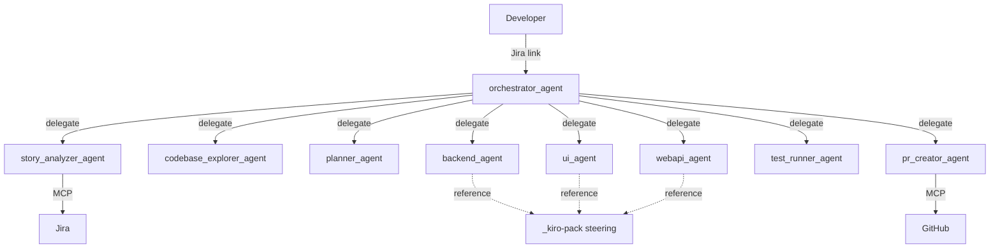
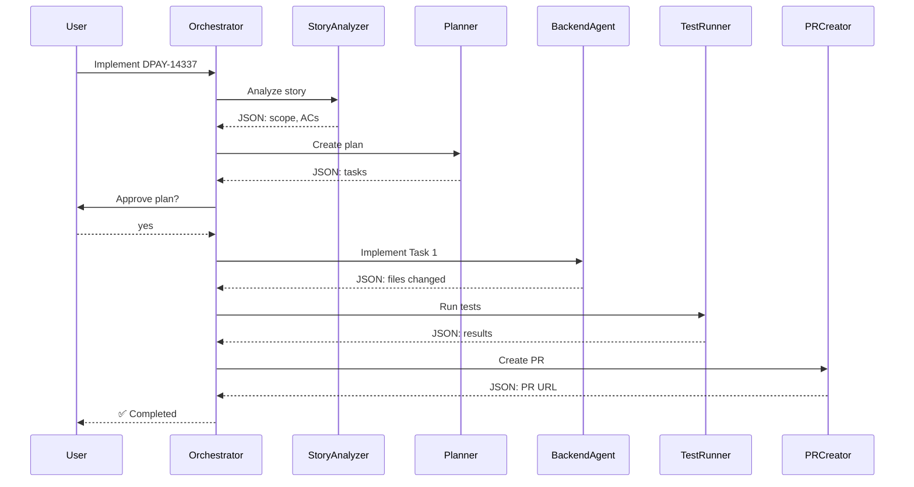
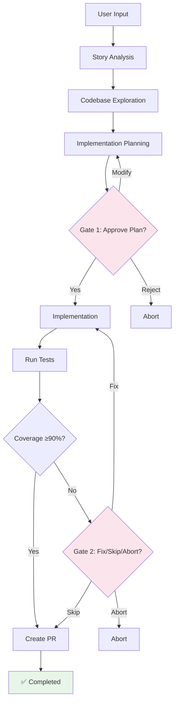

# steer-runtime Architecture & Design

**Kiro-Native SDLC Orchestration**  
**Version:** 1.0  
**Last Updated:** 2026-03-02

---

## Overview

**steer-runtime** is a Kiro-native orchestration system that transforms Jira story links into production-ready GitHub PRs through intelligent agent delegation and approval gates.

### Key Features

- **Single Input**: Jira link → Automated PR
- **9 Specialized Agents**: Story analysis, planning, implementation, testing, PR creation
- **Approval Gates**: Human approval at critical checkpoints
- **Golden Rules**: Automated quality validation
- **MCP Integration**: Real Jira/GitHub operations
- **No Scripts**: Pure Kiro agent conversation

---

## Quick Start

```bash
# Navigate to your project
cd ~/my-project

# Start orchestrator
kiro-cli chat --agent ~/steer-runtime/.kiro/agents/orchestrator_agent.json

# Provide Jira link
> Implement https://jira.disney.com/browse/DPAY-14337

# Approve plan when asked
> yes

# Done! PR created automatically
```

---

## Architecture

### Agent Hierarchy

```
orchestrator_agent (coordinator)
    ├─→ story_analyzer_agent (Jira via MCP)
    ├─→ codebase_explorer_agent (code analysis)
    ├─→ planner_agent (task breakdown)
    ├─→ backend_agent (Java/Spring)
    ├─→ ui_agent (Angular/TypeScript)
    ├─→ webapi_agent (Node/Express)
    ├─→ test_runner_agent (test execution)
    └─→ pr_creator_agent (GitHub via MCP)
```

### Workflow States

```
INPUT_RECEIVED
    ↓
STORY_ANALYZED
    ↓
CODEBASE_EXPLORED
    ↓
PLAN_CREATED
    ↓
GATE_1_PENDING (User approval)
    ↓
IMPLEMENTATION_IN_PROGRESS
    ↓
TESTS_RUNNING
    ↓
GATE_2_PENDING (If tests fail)
    ↓
PR_CREATING
    ↓
COMPLETED
```

### Approval Gates

**Gate 1: Plan Approval**
- Trigger: After implementation plan created
- Decision: Approve / Modify / Reject
- Context: Story scope, tasks, test strategy

**Gate 2: Test Results** (Conditional)
- Trigger: If tests fail or coverage <90%
- Decision: Fix / Skip / Abort
- Context: Test failures, coverage percentage

---

## Agent Details

### orchestrator_agent
**Role**: Main coordinator  
**Tools**: use_subagent, fs_read, fs_write  
**Responsibilities**:
- Delegate to specialized agents
- Manage approval gates
- Track progress
- Report status

### story_analyzer_agent
**Role**: Jira story fetching  
**Tools**: MCP (Jira)  
**Output**: JSON with scope, ACs, type, priority, components

### codebase_explorer_agent
**Role**: Code exploration  
**Tools**: code, grep, fs_read, glob  
**Output**: JSON with files, patterns, dependencies

### planner_agent
**Role**: Implementation planning  
**Tools**: fs_read  
**Output**: JSON with tasks, test strategy, golden rules

### backend_agent
**Role**: Java/Spring implementation  
**Tools**: code, fs_read, fs_write, grep, execute_bash  
**Output**: JSON with files changed, tests added

### ui_agent
**Role**: Angular/TypeScript implementation  
**Tools**: code, fs_read, fs_write, grep, execute_bash  
**Output**: JSON with files changed, components added

### webapi_agent
**Role**: Node/Express implementation  
**Tools**: code, fs_read, fs_write, grep, execute_bash  
**Output**: JSON with files changed, endpoints added

### test_runner_agent
**Role**: Test execution & coverage  
**Tools**: execute_bash, fs_read, grep  
**Output**: JSON with test results, coverage percentage

### pr_creator_agent
**Role**: GitHub PR creation  
**Tools**: MCP (GitHub), execute_bash, fs_read, fs_write  
**Output**: JSON with PR URL, PR number

---

## Golden Rules

Enforced by implementation agents:

1. **Backward Compatibility** - Only additive changes
2. **Test Coverage ≥90%** - All new code tested
3. **No Secrets** - No hardcoded credentials
4. **Structured Logging** - Context-aware logs
5. **Minimal Diff** - Only necessary changes
6. **Input Validation** - Validate all inputs
7. **Error Handling** - Graceful error responses
8. **Accessibility** - WCAG 2.1 Level AA
9. **Performance** - No regressions
10. **Documentation** - Public APIs documented

---

## Integration with _kiro-pack

### Coexistence Model

**steer-runtime** (Orchestration):
- Workflow coordination
- Agent delegation
- Approval gates
- PR creation

**_kiro-pack** (Steering):
- Coding standards
- Architecture patterns
- Component-specific rules
- Team conventions

### Usage Patterns

**With Orchestration** (Automated):
```bash
cd ~/my-project
kiro-cli chat --agent ~/steer-runtime/.kiro/agents/orchestrator_agent.json
> Implement https://jira.disney.com/browse/DPAY-14337
```

**Without Orchestration** (Manual):
```bash
cd ~/my-project
kiro-cli chat  # Uses _kiro-pack steering
> Implement the export progress feature
```

### Steering Inheritance

Implementation agents reference `_kiro-pack` steering:

```markdown
# In backend_agent prompt
Follow patterns from:
- _kiro-pack/backend/.kiro/steering/coding-standards.md
- _kiro-pack/backend/.kiro/steering/architecture-patterns.md
```

---

## Architecture Diagrams

### System Overview



### Workflow Sequence



### Approval Gates



---

## State Management

**Kiro-Native Approach**:
- Conversation history serves as audit trail
- Agent responses contain structured JSON
- No external state files needed
- Resume capability through conversation context

---

## Benefits

✅ **No Python Scripts** - Pure Kiro agents  
✅ **Natural Conversation** - Just talk to orchestrator  
✅ **Kiro Manages State** - No custom state management  
✅ **Approval Gates** - Built into conversation  
✅ **Subagent Delegation** - Kiro's native capability  
✅ **MCP Integration** - Real Jira/GitHub operations  
✅ **Portable** - Works in any project directory  
✅ **Extensible** - Add new agents easily  

---

## Directory Structure

```
steer-runtime/
├── .kiro/
│   ├── agents/          (9 agent definitions)
│   ├── prompts/         (9 agent prompts)
│   └── context/         (golden_rules.md)
│
├── _kiro-pack/          (production steering - preserved)
│
├── README.md            (quick start)
└── DESIGN.md            (this file)
```

---

## Success Metrics

- **Velocity**: 80% reduction in manual coordination
- **Quality**: 100% golden rule compliance
- **Consistency**: Standardized patterns across teams
- **Auditability**: Complete conversation history
- **Scalability**: Supports multiple teams and repos

---

**Status**: Production Ready  
**Approach**: Pure Kiro Agent Orchestration
