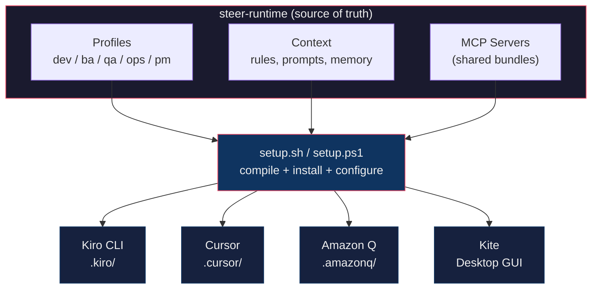

# steer-runtime

Portable, IDE-agnostic AI agent platform for software teams — 41 specialized agents across 5 SDLC profiles, deployable to any AI-powered IDE or CLI.

Define agents, standards, and integrations once. Run them everywhere — Kiro CLI, Cursor, Amazon Q, Kite, or the next tool your team adopts.

```bash
./setup.sh install dev ba qa ops pm   # Install all profiles
./setup.sh mcp-install                # Configure shared MCP servers
```

> 🆕 **Getting started?** See [Getting Started](docs/GETTING_STARTED.md) · 👥 **Joining a team?** Run `./setup.sh workspace apply <team>` · 🪟 **Windows?** See [Windows Setup](docs/WINDOWS_SETUP.md)

**Prerequisites:** Node.js, Git, and [Kiro CLI](docs/GETTING_STARTED.md). Optional: [GitHub CLI](https://cli.github.com/) (`gh auth login --hostname github.disney.com`).
---

## What's New

| Date | Change | Details |
|------|--------|---------|
| Mar 20, 2026 | **Team Workspaces** | One-command team setup — `./setup.sh workspace apply <team>` · [Guide](docs/TEAM_WORKSPACES.md) |
| Mar 20, 2026 | **Context7 MCP** | Real-time library docs for coding agents — no token needed · [context7.com](https://context7.com) |
| Mar 20, 2026 | **AI-DLC framing** | steer-runtime positioned as AI Development Lifecycle platform |
| Mar 20, 2026 | **Fork Strategy** | Cross-team governance guide for fork-based workflows · [Guide](docs/FORK_STRATEGY.md) |
| Mar 20, 2026 | **Dev profile split** | `dev` → `dev-core` + `dev-web` + `dev-mobile` composable sub-profiles |

## Why steer-runtime?

AI coding assistants are powerful, but without shared standards they produce inconsistent output across developers, projects, and IDEs. steer-runtime solves this by implementing an **AI-DLC (AI Development Lifecycle)** approach — AI assistance across every phase of the SDLC, not just code generation. With profiles for dev, BA, QA, ops, and PM, the entire team works with purpose-built agents from requirements through delivery.

- **Consistent output** — Every agent enforces the same coding standards, review criteria, and documentation patterns regardless of who runs it or which IDE they use
- **Role-based profiles** — Developers, BAs, QA, Ops, and PMs each get purpose-built agents tuned to their workflow
- **IDE-portable** — Agent knowledge (prompts, context, rules) is authored once and compiled to each IDE's native format
- **Project-portable** — Memory banks and project mappings let the same agents work across any codebase, team, or tech stack
- **Extensible** — Add new profiles, new IDE targets, or new MCP integrations without changing existing agents

---

## Supported IDEs

| IDE | How agents run | Setup | Status |
|-----|---------------|-------|--------|
| **Kiro CLI** | Native agent JSON + prompt markdown | `./setup.sh install <profiles>` | ✅ Primary |
| **Cursor** | `.mdc` rule files + shared MCP config | `./setup.sh cursor install <dir>` | ✅ Supported |
| **Amazon Q** | Plain `.md` rule files | `./setup.sh amazonq install <dir>` | ✅ Supported |
| **Kite** | Desktop GUI wrapping Kiro CLI | [Kite repo](https://github.disney.com/SANCR225/Kite) | ✅ Companion |

All four share the same source-of-truth for coding standards. Kiro CLI and Cursor also share MCP server bundles (Jira, Confluence, GitHub, Mermaid). Adding a new IDE target means writing one adapter — the agent definitions, context files, and integrations stay the same.

---

## Quick Start

```bash
git clone <repo-url> ~/steer-runtime
cd ~/steer-runtime

./setup.sh list                 # See available profiles
./setup.sh install dev          # Install all dev agents (or: dev-core dev-web)
./setup.sh mcp-install          # Setup MCP servers + tokens
./setup.sh enable-tools         # Enable thinking, todo, knowledge (optional)
```

Then use agents:
```bash
# Kiro CLI
kiro-cli chat --agent orchestrator              # Dev orchestrator
kiro-cli chat --agent ba_orchestrator_agent      # BA orchestrator
kiro-cli chat --agent qa_orchestrator_agent      # QA orchestrator
kiro-cli chat --agent ops_orchestrator_agent     # Ops orchestrator
kiro-cli chat --agent pm_orchestrator_agent      # PM/Scrum Master orchestrator

# Cursor — agents activate automatically via glob patterns and manual rules
./setup.sh cursor install ~/my-project

# Amazon Q — rules loaded automatically from .amazonq/rules/
./setup.sh amazonq install ~/my-project

# Kite — visual interface over Kiro CLI agents
# See https://github.disney.com/SANCR225/Kite
```

---

## Profiles

| Profile | Agents | Focus | Docs |
|---------|:------:|-------|------|
| **dev** | 20 | Alias → dev-core + dev-web + dev-mobile | [Prompt Guide](docs/PROMPT_GUIDE.md) |
| dev-core | 13 | Orchestrator, planning, quality, security, workflow, docs | |
| dev-web | 4 | Java backend, Node.js API, Angular UI, UX/a11y | |
| dev-mobile | 3 | Flutter, Android native, iOS native | |
| **ba** | 4 | Requirements, scope, user stories, acceptance criteria | [BA Guide](docs/BA_PROMPT_GUIDE.md) |
| **qa** | 6 | Test planning, automation, defect analysis, API/perf testing | [QA Guide](docs/QA_PROMPT_GUIDE.md) |
| **ops** | 5 | AI metrics, infrastructure, deployments, code quality | [Ops Guide](docs/OPS_PROMPT_GUIDE.md) |
| **pm** | 6 | Sprint management, standups, retros, risk tracking, delivery reports | [PM Guide](docs/PM_PROMPT_GUIDE.md) |

Full agent reference: [AGENTS.md](AGENTS.md)

Profiles are additive — install only what your role needs, or install all five for full SDLC coverage.

---

## Using Across Projects and Teams

steer-runtime scales from individual developers to multi-team organizations through three layers:

### Team Workspaces — one-command team setup

New team member? A single command installs everything — profiles, rules, context, memory banks, and tools:

```bash
./setup.sh workspace list                    # See available team configs
./setup.sh workspace apply payments-core     # Full team setup in one command
./setup.sh mcp-install                       # Configure personal tokens
```

Each workspace is a `workspace.json` manifest that defines what a team needs. Teams create their own in `workspaces/<team>/` with custom rules, context files, and project mappings. See [Team Workspaces](docs/TEAM_WORKSPACES.md) for the full guide.

### Memory Banks — project-specific context

Agents are generic by design. Memory banks give them project-specific knowledge — tech stack, repo structure, conventions:

```bash
./setup.sh init-memory ~/my-project              # Kiro CLI
./setup.sh cursor init-memory ~/my-project       # Cursor
```

The same `backend` agent works on a Java Spring Boot service, a Node.js API, or a Go microservice — the memory bank tells it which one it's looking at. Pre-built memory banks ship for 9 Disney Payments projects.

### Fork Strategy — cross-team governance

For organizations with multiple teams, each team forks the repo and maintains team-specific customizations while syncing shared improvements from upstream. See [Fork Strategy](docs/FORK_STRATEGY.md) for the governance model.

---

## Architecture



The key insight: agent knowledge (what to do, how to review code, what standards to enforce) is authored once in profile directories. `setup.sh` compiles that knowledge into each IDE's native format. When you improve an agent prompt, every IDE gets the update on next sync.

---

## Commands

```bash
# Core
./setup.sh                      # Show help
./setup.sh list                 # List available profiles
./setup.sh install <profiles>   # Install one or more profiles
./setup.sh sync                 # Update installed profiles
./setup.sh remove <profiles>    # Remove specific profiles
./setup.sh check                # Verify installation + validate agents
./setup.sh clean                # Remove all installed profiles

# MCP & Tools
./setup.sh mcp-install          # Setup MCP servers + configure tokens
./setup.sh configure            # Reconfigure MCP tokens only
./setup.sh enable-tools         # Enable thinking, todo, knowledge

# Team Workspaces
./setup.sh workspace list              # List available workspaces
./setup.sh workspace apply payments-core # Apply team config
./setup.sh workspace create my-team    # Scaffold new workspace

# Content
./setup.sh rules list           # List available coding rules
./setup.sh rules install --all  # Install rules to project
./setup.sh prompts list         # List available prompts
./setup.sh init-memory <dir>    # Initialize project memory bank

# Cursor IDE
./setup.sh cursor install <dir>  # Install Cursor rules + MCP config
./setup.sh cursor sync <dir>     # Update Cursor rules from templates
./setup.sh cursor remove <dir>   # Remove .cursor/ directory
./setup.sh cursor init-memory <dir> # Generate project context rule

# Amazon Q Developer
./setup.sh amazonq install <dir>  # Install .amazonq/rules/
./setup.sh amazonq sync <dir>     # Update rules from templates
./setup.sh amazonq remove <dir>   # Remove .amazonq/ directory

# Kiro UI (project-specific install)
./setup.sh install dev --project ~/my-project
```

---

## MCP Servers

MCP servers are pre-built and bundled — no `npm install` required. Shared across all IDEs.

```bash
./setup.sh mcp-install          # Verify bundles + configure tokens
./setup.sh configure            # Reconfigure tokens only
```

| Server | Purpose | Token URL |
|--------|---------|-----------|
| jira-mcp | Jira issue management | [Generate token](https://myjira.disney.com/secure/ViewProfile.jspa?selectedTab=com.atlassian.pats.pats-plugin:jira-user-personal-access-tokens) |
| confluence-mcp | Confluence wiki | [Generate token](https://confluence.disney.com/plugins/personalaccesstokens/usertokens.action) |
| mywiki-mcp | MyWiki instance | [Generate token](https://mywiki.disney.com/plugins/personalaccesstokens/usertokens.action) |
| github-mcp | GitHub Enterprise | [Generate token](https://github.disney.com/settings/tokens) |
| mermaid-diagram-mcp | Diagram generation | No token needed |
| context7-mcp | Up-to-date library/framework docs | No token needed ([context7.com](https://context7.com)) |

---

## Project Structure

```
steer-runtime/
├── .kiro-dev-core/           # Dev core profile (13 agents)
├── .kiro-dev-web/            # Dev web profile (4 agents)
├── .kiro-dev-mobile/         # Dev mobile profile (3 agents)
├── .kiro-ba/                 # BA profile (4 agents)
├── .kiro-qa/                 # QA profile (6 agents)
├── .kiro-ops/                # Ops profile (5 agents)
├── .kiro-pm/                 # PM/Scrum Master profile (6 agents)
├── .kiro/context/            # Shared context files (golden rules, guidelines)
├── .kiro/hooks/              # Reusable agent hook scripts
├── .kiro/tools/mcp-servers/  # Pre-built MCP bundles (shared across IDEs)
├── .cursor-templates/        # Cursor IDE rule templates (19 .mdc files)
├── .amazonq-templates/       # Amazon Q Developer rule templates (19 .md files)
├── workspaces/               # Team workspace configs
├── common/                   # Shared rules, prompts, memory templates
├── docs/                     # All documentation
├── setup.sh                  # macOS/Linux setup
└── setup.ps1                 # Windows setup
```

---

## Extending steer-runtime

### Add a new profile

1. Create `.kiro-<name>/agents/` and `.kiro-<name>/prompts/`
2. Add agent JSON configs and prompt markdown files
3. Run `./setup.sh install <name>` — auto-discovered

### Add a new IDE target

1. Create a templates directory (e.g., `.windsurf-templates/`)
2. Add a compile command to `setup.sh` that transforms agent prompts into the IDE's format
3. The agent definitions, context, and MCP servers stay the same

### Add a new MCP server

1. Bundle the server into `.kiro/tools/mcp-servers/<name>/`
2. Reference it in agent configs (`mcpServers` key)
3. Add token configuration to `setup.sh mcp-install`

### Reuse across a new project

```bash
./setup.sh init-memory ~/new-project           # Kiro CLI — project memory bank
./setup.sh cursor init-memory ~/new-project    # Cursor — project context rule
./setup.sh amazonq install ~/new-project       # Amazon Q — coding standards
```

---

## Documentation

| Audience | Guides |
|----------|--------|
| **Everyone** | [Project Overview](docs/PROJECT_OVERVIEW.md) · [Agent Reference](AGENTS.md) · [Getting Started](docs/GETTING_STARTED.md) · [Team Workspaces](docs/TEAM_WORKSPACES.md) · [Fork Strategy](docs/FORK_STRATEGY.md) · [Troubleshooting](docs/TROUBLESHOOTING.md) |
| **Developers** | [Prompt Guide](docs/PROMPT_GUIDE.md) · [Mobile Setup](docs/MOBILE_AGENTS_SETUP.md) · [Architecture](docs/DESIGN.md) · [MCP Config](docs/MCP_SETUP.md) |
| **BA / PO** | [BA Guide](docs/BA_PROMPT_GUIDE.md) · [Workflows](docs/BA_WORKFLOWS.md) · [Quick Ref](docs/BA_QUICK_REFERENCE.md) |
| **QA** | [QA Guide](docs/QA_PROMPT_GUIDE.md) · [Workflows](docs/QA_WORKFLOWS.md) · [Quick Ref](docs/QA_QUICK_REFERENCE.md) · [Overview](docs/QA_PROFILE_OVERVIEW.md) |
| **Ops** | [Ops Guide](docs/OPS_PROMPT_GUIDE.md) · [Workflows](docs/OPS_WORKFLOWS.md) · [Quick Ref](docs/OPS_QUICK_REFERENCE.md) |
| **PM / Scrum** | [PM Guide](docs/PM_PROMPT_GUIDE.md) |
| **Cursor users** | [Cursor Setup](docs/CURSOR_SETUP.md) |
| **Amazon Q users** | [Amazon Q templates README](.amazonq-templates/README.md) |
| **Windows** | [Windows Setup](docs/WINDOWS_SETUP.md) |

---

## Features

✅ 41 specialized agents across 5 SDLC profiles  
✅ IDE-agnostic — same agents run on Kiro CLI, Cursor, Amazon Q, and Kite  
✅ Project-portable — memory banks adapt agents to any codebase or tech stack  
✅ Pre-built MCP bundles — Jira, Confluence, GitHub, Mermaid, shared across IDEs  
✅ Cross-platform — macOS/Linux (`setup.sh`) + Windows (`setup.ps1`)  
✅ Extensible — add profiles, IDE targets, or MCP servers without changing existing agents  
✅ Agent hooks — write guards, git context injection, destructive command warnings  
✅ Advanced tools — thinking, todo, delegate, knowledge (opt-in)  
✅ Auto-discovery of `.kiro-*` profile directories  
✅ Team Workspaces — one-command setup for new team members  
✅ Common rules and standalone prompts reusable across teams  

---

**Version:** 3.5.0 · **Agents:** 41 (dev-core 13, dev-web 4, dev-mobile 3, ba 4, qa 6, ops 5, pm 6) · **Updated:** March 20, 2026

## Resources

### 🪁 Kite — Desktop GUI

[Kite](https://github.disney.com/SANCR225/Kite) is a native desktop companion app (Tauri + React) that wraps Kiro CLI with a visual interface — streaming chat, agent/profile switching, prompt scoring, session management, and plugins for steering files, GitHub, and MCP servers. See the [Kite repository](https://github.disney.com/SANCR225/Kite) for installation and binary releases.

### Recordings & Sessions

| Date | Description | Link |
|------|-------------|------|
| March 10, 2026 | Working Session with CAP Team | [Recording](https://drive.google.com/file/d/19DzFCKPKcAAvNitrWYLDfNxntlvqpkH4/view?usp=sharing) |

---

Internal Disney tool — not for external distribution.
