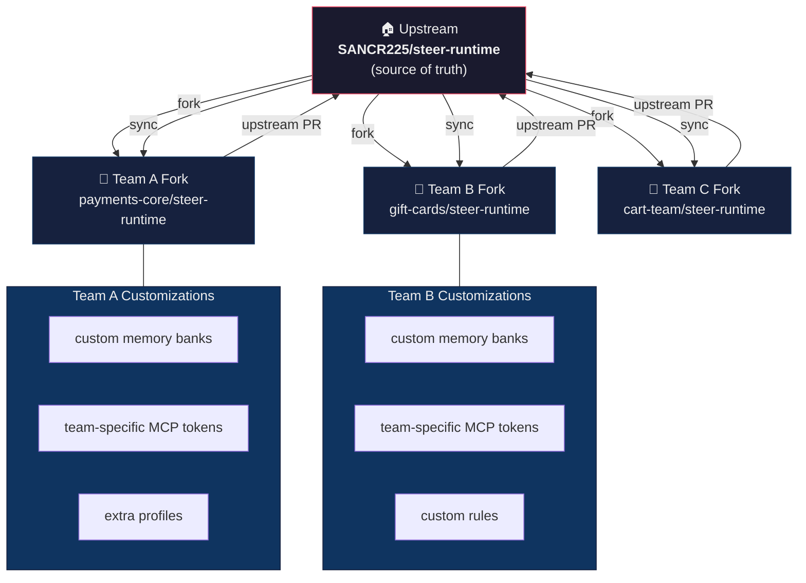
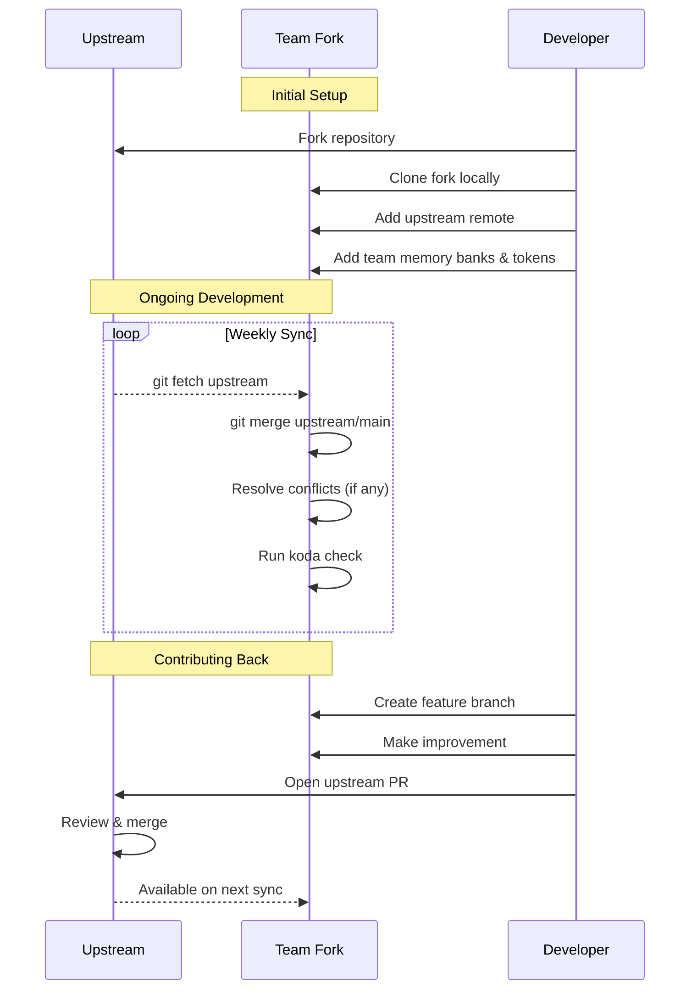
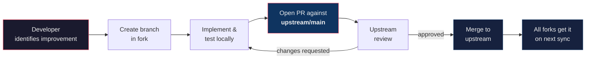

# Fork Strategy & Cross-Team Governance

How to maintain steer-runtime across multiple teams using a fork-based model.

---

## Overview

steer-runtime follows an **upstream-fork** model. One central repository (upstream) owns the shared platform — agents, profiles, MCP servers, setup scripts, and golden rules. Each team forks the repo to add team-specific customizations while staying in sync with upstream improvements.



---

## What to Customize vs. What to Keep in Sync

| Layer | Customize in fork? | Sync from upstream? | Notes |
|-------|:------------------:|:-------------------:|-------|
| **Agent JSON configs** | ⚠️ Rarely | ✅ Yes | Only customize if adding team-specific MCP servers |
| **Agent prompts** (`.md`) | ⚠️ Rarely | ✅ Yes | Upstream prompts are generic by design |
| **Golden rules** | ❌ No | ✅ Yes | Org-wide standards — changes go upstream |
| **Profile structure** | ❌ No | ✅ Yes | Profile definitions are shared |
| **Setup scripts** | ❌ No | ✅ Yes | `setup.sh` / `setup.ps1` are shared (Koda is primary) |
| **MCP server bundles** | ❌ No | ✅ Yes | Shared infrastructure |
| **MCP tokens** (`.env`) | ✅ Yes | ❌ No | Per-user, gitignored |
| **Memory banks** | ✅ Yes | ❌ No | Project-specific context |
| **`workspaces/` directory** | ✅ Yes | ❌ No | Team workspace configs & project memory templates |
| **Custom profiles** | ✅ Yes | ❌ No | Team-specific `.kiro-<name>/` directories |
| **Team workspaces** | ✅ Yes | ❌ No | `workspaces/<team>/` — one-command team setup |
| **Custom rules** | ✅ Yes | ⚠️ Merge | Team rules in `common/rules/` |
| **Context files** | ⚠️ Additive | ✅ Yes | Add new files, don't modify upstream ones |

**Rule of thumb**: If a change benefits all teams, it goes upstream. If it's team-specific, it stays in the fork.

---

## Fork Lifecycle



---

## Setup for Teams

### 1. Fork the Repository

Each team forks `SANCR225/steer-runtime` on GitHub Enterprise. One fork per team, not per developer.

### 2. Clone and Configure Remotes

```bash
# Clone your team's fork
git clone git@github.disney.com:<team>/steer-runtime.git
cd steer-runtime

# Add upstream remote
git remote add upstream git@github.disney.com:SANCR225/steer-runtime.git
git remote -v
# origin    git@github.disney.com:<team>/steer-runtime.git (fetch)
# upstream  git@github.disney.com:SANCR225/steer-runtime.git (fetch)
```

### 3. Add Team Customizations

```bash
# Add project memory banks
koda init-memory ~/your-project

# Configure MCP tokens
koda mcp-install

# Add team-specific rules (optional)
cp your-team-rule.md common/rules/

# Commit customizations to fork
git add -A && git commit -m "chore: add team customizations"
git push origin main
```

---

## Syncing with Upstream

### Weekly Sync (Recommended)

```bash
git fetch upstream
git checkout main
git merge upstream/main

# If conflicts arise, they'll be in your customization files
# Resolve, then:
git add -A && git commit
git push origin main

# Verify everything still works
koda check
```

### Automated Sync (Optional)

Teams can set up a GitHub Action or scheduled job:

```yaml
# .github/workflows/upstream-sync.yml
name: Sync with upstream
on:
  schedule:
    - cron: '0 9 * * 1'  # Every Monday at 9am
  workflow_dispatch:

jobs:
  sync:
    runs-on: ubuntu-latest
    steps:
      - uses: actions/checkout@v4
        with:
          fetch-depth: 0
      - run: |
          git remote add upstream https://github.disney.com/SANCR225/steer-runtime.git
          git fetch upstream
          git merge upstream/main --no-edit
          git push origin main
```

---

## Contributing Back to Upstream

When a team builds something that benefits everyone — a new agent, a better prompt, a bug fix — contribute it back.

### Contribution Flow



### What to Contribute

- ✅ Agent prompt improvements (better instructions, fewer hallucinations)
- ✅ New agents that serve multiple teams
- ✅ Bug fixes in setup scripts
- ✅ New MCP server integrations
- ✅ Documentation improvements
- ✅ New common rules applicable org-wide
- ❌ Team-specific memory banks or project mappings
- ❌ Team-specific MCP tokens or credentials
- ❌ Specific project architecture decisions or patterns
- ❌ Specific project directory structures or conventions
- ❌ Custom project code-styles or formatting preferences
- ❌ One-off customizations

### How to Submit

```bash
# In your fork
git checkout -b feat/improve-backend-prompt
# Make changes...
git commit -m "feat: improve backend agent Spring Boot guidance"
git push origin feat/improve-backend-prompt

# Open PR on GitHub targeting upstream
# Base: SANCR225/steer-runtime main
# Head: <team>/steer-runtime feat/improve-backend-prompt
```

---

## Conflict Prevention

Most merge conflicts come from editing the same upstream files. Follow these practices to minimize them:

### 1. Extend, Don't Modify

```bash
# ❌ Don't edit upstream context files
vim .kiro/context/golden_rules.md

# ✅ Add your own context files
vim .kiro/context/team_standards.md
```

### 2. Use the Workspaces Directory

Team-specific memory templates belong in workspace `projects/` directories:

```
workspaces/default/projects/
├── your-service-a/          # Team-specific
│   └── .kiro/rules/memory-bank/
├── your-service-b/          # Team-specific
└── ...
```

### 3. Custom Profiles in Separate Directories

```bash
# ❌ Don't modify existing profiles
vim .kiro-dev-web/agents/backend.json

# ✅ Create team-specific profiles
mkdir -p .kiro-team-x/agents .kiro-team-x/prompts
# koda auto-discovers .kiro-* directories
```

### 4. Gitignore Tokens

Ensure `.env` files with tokens are never committed:

```gitignore
# Already in upstream .gitignore
.kiro/tools/mcp-servers/**/.env
.kiro/tools/mcp-servers/**/.env.*
!.kiro/tools/mcp-servers/**/.env.example
```

---

## Versioning & Release Cadence

Upstream uses semantic versioning with tags:

| Tag | Meaning | Fork action |
|-----|---------|-------------|
| `v3.4.0` | New feature (agents, MCP, profiles) | Sync recommended |
| `v3.4.1` | Bug fix or doc update | Sync at convenience |
| `v4.0.0` | Breaking change (agent config format, koda/setup.sh API) | Sync required, read changelog |

### Subscribing to Releases

Watch the upstream repo for releases on GitHub Enterprise. When a new tag is published:

```bash
git fetch upstream --tags
git log upstream/main --oneline -5   # See what changed
git merge upstream/main              # Sync
```

---

## Governance Roles

| Role | Responsibility | Who |
|------|---------------|-----|
| **Upstream maintainer** | Reviews upstream PRs, tags releases, sets standards | Platform team (SANCR225) |
| **Fork owner** | Manages team fork, runs weekly syncs, resolves conflicts | One person per team |
| **Contributor** | Submits improvements back to upstream | Any developer |

---

## Checklist for New Teams

- [ ] Fork `SANCR225/steer-runtime` to your team's GitHub org
- [ ] Clone and add `upstream` remote
- [ ] Run `koda workspace apply <team>` (or `koda install dev` for manual setup)
- [ ] Run `koda mcp-install` to configure tokens
- [ ] Add project memory banks via `koda init-memory`
- [ ] Set up weekly upstream sync (manual or automated)
- [ ] Designate a fork owner
- [ ] Read [Golden Rules](../.kiro/context/golden_rules.md)

---

Back to [README](../README.md)
