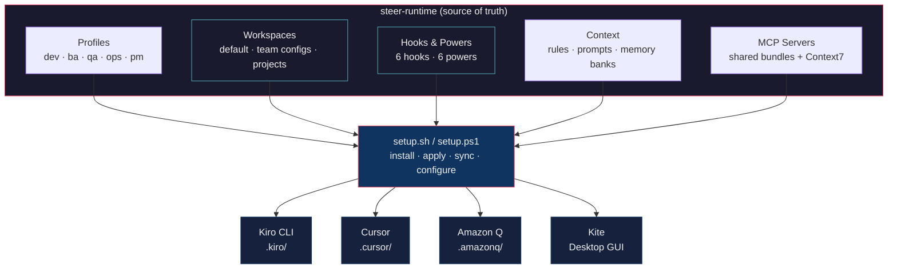

# steer-runtime Reference

Full reference for commands, MCP servers, architecture, project structure, and extensibility.

For quick setup, see the [README](../README.md).

---

## Project Manifest (`project.yaml`)

Drop a `project.yaml` in your project root to give agents structured config. No fork needed — any team, any project.

### Field Reference

| Field | Type | Required | Description |
|-------|------|----------|-------------|
| `name` | string | yes | Project name |
| `stack` | string | yes | Primary tech stack (`java`, `node`, `angular`, `go`, `flutter`, `csharp`, `python`) |
| `baseBranch` | string | yes | Default branch for PRs and diffs (default: `main`) |
| `commands.build` | string | no | Build command (e.g., `mvn clean package`) |
| `commands.test` | string | no | Test command (e.g., `npm test`) |
| `commands.lint` | string | no | Lint command (e.g., `npm run lint`) |
| `commands.format` | string | no | Format command (e.g., `mvn spotless:apply`) |
| `integrations.jira.projectKey` | string | no | Jira project prefix (e.g., `DPAY`) |
| `integrations.jira.statuses.inProgress` | string | no | Jira status name for "in progress" |
| `integrations.jira.statuses.review` | string | no | Jira status name for "in review" |
| `integrations.jira.statuses.done` | string | no | Jira status name for "done" |
| `integrations.github.org` | string | no | GitHub org (e.g., `SANCR225`) |
| `integrations.github.repo` | string | no | GitHub repo name |
| `workspace.specsDir` | string | no | Where spec documents live (default: `docs/specs/`) |
| `workspace.useSpecs` | boolean | no | Whether agents should reference specs |
| `workspace.memoryBank` | string | no | Memory bank name from workspaces |

### How Agents Use It

Agents check for `project.yaml` at the start of every workflow (Step 0):
1. `project.yaml` found → use it
2. Not found → fall back to memory bank or `.kiro/context/`
3. Neither exists → ask the user

### Examples

See `common/templates/examples/` for complete examples:
- [Java/Spring Boot](../common/templates/examples/project-java-spring.yaml)
- [Node.js/Express](../common/templates/examples/project-node-express.yaml)

Template: [`common/templates/project.yaml`](../common/templates/project.yaml)

---

## Commands

```bash
# Core
./setup.sh                      # Show help
./setup.sh list                 # List available profiles
./setup.sh install <profiles>   # Install one or more profiles
./setup.sh sync                 # Update installed profiles
./setup.sh remove <profiles>    # Remove specific profiles
./setup.sh check                # Verify installation + validate agents
./setup.sh clean                # Remove all installed profiles

# MCP & Tools
./setup.sh mcp-install          # Setup MCP servers + configure tokens
./setup.sh configure            # Reconfigure MCP tokens only
./setup.sh enable-tools         # Enable thinking, todo, knowledge

# Team Workspaces
./setup.sh workspace list              # List available workspaces
./setup.sh workspace apply payments-core # Apply team config
./setup.sh workspace create my-team    # Scaffold new workspace

# Content
./setup.sh rules list           # List available coding rules
./setup.sh rules install --all  # Install rules to project
./setup.sh prompts list         # List available prompts
./setup.sh init-memory <dir>    # Initialize project memory bank

# Cursor IDE
./setup.sh cursor install <dir>  # Install Cursor rules + MCP config
./setup.sh cursor sync <dir>     # Update Cursor rules from templates
./setup.sh cursor remove <dir>   # Remove .cursor/ directory
./setup.sh cursor init-memory <dir> # Generate project context rule

# Amazon Q Developer
./setup.sh amazonq install <dir>  # Install .amazonq/rules/
./setup.sh amazonq sync <dir>     # Update rules from templates
./setup.sh amazonq remove <dir>   # Remove .amazonq/ directory

# Kiro UI (project-specific install)
./setup.sh install dev --project ~/my-project
```

---

## MCP Servers

MCP servers are pre-built and bundled — no `npm install` required. Shared across all IDEs.

```bash
./setup.sh mcp-install          # Verify bundles + configure tokens
./setup.sh configure            # Reconfigure tokens only
```

| Server | Purpose | Token URL |
|--------|---------|-----------|
| jira-mcp | Jira issue management | [Generate token](https://myjira.disney.com/secure/ViewProfile.jspa?selectedTab=com.atlassian.pats.pats-plugin:jira-user-personal-access-tokens) |
| confluence-mcp | Confluence wiki | [Generate token](https://confluence.disney.com/plugins/personalaccesstokens/usertokens.action) |
| mywiki-mcp | MyWiki instance | [Generate token](https://mywiki.disney.com/plugins/personalaccesstokens/usertokens.action) |
| github-mcp | GitHub Enterprise | [Generate token](https://github.disney.com/settings/tokens) |
| mermaid-diagram-mcp | Diagram generation | No token needed |
| context7-mcp | Up-to-date library/framework docs | No token needed ([context7.com](https://context7.com)) |

For per-agent MCP coverage, see [AGENTS.md](../AGENTS.md#mcp-server-coverage).

---

## Supported IDEs

| IDE | How agents run | Setup | Status |
|-----|---------------|-------|--------|
| **Kiro CLI** | Native agent JSON + prompt markdown | `./setup.sh install <profiles>` | ✅ Primary |
| **Cursor** | `.mdc` rule files + shared MCP config | `./setup.sh cursor install <dir>` | ✅ Supported |
| **Amazon Q** | Plain `.md` rule files | `./setup.sh amazonq install <dir>` | ✅ Supported |
| **Kite** | Desktop GUI wrapping Kiro CLI | [Kite repo](https://github.disney.com/SANCR225/Kite) | ✅ Companion |

All four share the same source-of-truth for coding standards. Kiro CLI and Cursor also share MCP server bundles (Jira, Confluence, GitHub, Mermaid). Adding a new IDE target means writing one adapter — the agent definitions, context files, and integrations stay the same.

---

## Using Across Projects and Teams

steer-runtime scales from individual developers to multi-team organizations through three layers:

### Team Workspaces — one-command team setup

New team member? A single command installs everything — profiles, rules, context, memory banks, and tools:

```bash
./setup.sh workspace list                    # See available team configs
./setup.sh workspace apply payments-core     # Full team setup in one command
./setup.sh workspace sync payments-core      # Pull all workspace repos
./setup.sh mcp-install                       # Configure personal tokens
```

Each workspace is a `workspace.json` manifest that defines what a team needs. Teams create their own in `workspaces/<team>/` with custom rules, context files, and project mappings. See [Team Workspaces](TEAM_WORKSPACES.md) for the full guide.

### Memory Banks — project-specific context

Agents are generic by design. Memory banks give them project-specific knowledge — tech stack, repo structure, conventions:

```bash
./setup.sh init-memory ~/my-project              # Kiro CLI
./setup.sh cursor init-memory ~/my-project       # Cursor
```

The same `backend` agent works on a Java Spring Boot service, a Node.js API, or a Go microservice — the memory bank tells it which one it's looking at. Pre-built memory banks ship for 9 Disney Payments projects.

### Fork Strategy — cross-team governance

For organizations with multiple teams, each team forks the repo and maintains team-specific customizations while syncing shared improvements from upstream. See [Fork Strategy](FORK_STRATEGY.md) for the governance model.

---

## Architecture



The key insight: agent knowledge (what to do, how to review code, what standards to enforce) is authored once in profile directories. `setup.sh` compiles that knowledge into each IDE's native format. When you improve an agent prompt, every IDE gets the update on next sync.

---

## Why steer-runtime?

AI coding assistants are powerful, but without shared standards they produce inconsistent output across developers, projects, and IDEs. steer-runtime solves this by implementing an **AI-DLC (AI Development Lifecycle)** approach — AI assistance across every phase of the SDLC, not just code generation.

- **Consistent output** — Every agent enforces the same coding standards, review criteria, and documentation patterns regardless of who runs it or which IDE they use
- **Role-based profiles** — Developers, BAs, QA, Ops, and PMs each get purpose-built agents tuned to their workflow
- **IDE-portable** — Agent knowledge is authored once and compiled to each IDE's native format
- **Project-portable** — Memory banks and project mappings let the same agents work across any codebase, team, or tech stack
- **Extensible** — Add new profiles, new IDE targets, or new MCP integrations without changing existing agents

---

## Project Structure

```
steer-runtime/
├── .kiro-dev-core/           # Dev core profile (13 agents)
├── .kiro-dev-web/            # Dev web profile (4 agents)
├── .kiro-dev-mobile/         # Dev mobile profile (3 agents)
├── .kiro-ba/                 # BA profile (4 agents)
├── .kiro-qa/                 # QA profile (6 agents)
├── .kiro-ops/                # Ops profile (5 agents)
├── .kiro-pm/                 # PM/Scrum Master profile (6 agents)
├── .kiro/context/            # Shared context files (golden rules, guidelines)
├── .kiro/hooks/              # Reusable agent hook scripts (6 hooks)
├── .kiro/tools/mcp-servers/  # Pre-built MCP bundles (shared across IDEs)
├── .cursor-templates/        # Cursor IDE rule templates (19 .mdc files)
├── .amazonq-templates/       # Amazon Q Developer rule templates (19 .md files)
├── workspaces/default/       # Org-wide baseline (9 projects, all profiles)
├── workspaces/<team>/        # Team-specific workspace configs
├── common/                   # Shared rules, prompts, memory templates
├── docs/                     # All documentation
├── setup.sh                  # macOS/Linux setup
└── setup.ps1                 # Windows setup
```

---

## Extending steer-runtime

### Add a new profile

1. Create `.kiro-<name>/agents/` and `.kiro-<name>/prompts/`
2. Add agent JSON configs and prompt markdown files
3. Run `./setup.sh install <name>` — auto-discovered

### Add a new IDE target

1. Create a templates directory (e.g., `.windsurf-templates/`)
2. Add a compile command to `setup.sh` that transforms agent prompts into the IDE's format
3. The agent definitions, context, and MCP servers stay the same

### Add a new MCP server

1. Bundle the server into `.kiro/tools/mcp-servers/<name>/`
2. Reference it in agent configs (`mcpServers` key)
3. Add token configuration to `setup.sh mcp-install`

### Reuse across a new project

```bash
./setup.sh init-memory ~/new-project           # Kiro CLI — project memory bank
./setup.sh cursor init-memory ~/new-project    # Cursor — project context rule
./setup.sh amazonq install ~/new-project       # Amazon Q — coding standards
```

---

## Features

✅ 41 specialized agents across 5 SDLC profiles
✅ IDE-agnostic — same agents run on Kiro CLI, Cursor, Amazon Q, and Kite
✅ Project-portable — memory banks adapt agents to any codebase or tech stack
✅ Pre-built MCP bundles — Jira, Confluence, GitHub, Mermaid, shared across IDEs
✅ Cross-platform — macOS/Linux (`setup.sh`) + Windows (`setup.ps1`)
✅ Extensible — add profiles, IDE targets, or MCP servers without changing existing agents
✅ Agent hooks — write guards, git context injection, destructive command warnings
✅ Advanced tools — thinking, todo, delegate, knowledge (opt-in)
✅ Auto-discovery of `.kiro-*` profile directories
✅ Team Workspaces — one-command setup for new team members
✅ Common rules and standalone prompts reusable across teams

---

## All Documentation

| Audience | Guides |
|----------|--------|
| **Everyone** | [Project Overview](PROJECT_OVERVIEW.md) · [Agent Reference](../AGENTS.md) · [Getting Started](GETTING_STARTED.md) · [Team Workspaces](TEAM_WORKSPACES.md) · [Fork Strategy](FORK_STRATEGY.md) · [Troubleshooting](TROUBLESHOOTING.md) |
| **Developers** | [Hooks & Powers](HOOKS_AND_POWERS.md) · [Prompt Guide](PROMPT_GUIDE.md) · [Mobile Setup](MOBILE_AGENTS_SETUP.md) · [Architecture](DESIGN.md) · [MCP Config](MCP_SETUP.md) |
| **BA / PO** | [BA Guide](BA_PROMPT_GUIDE.md) · [Workflows](BA_WORKFLOWS.md) · [Quick Ref](BA_QUICK_REFERENCE.md) |
| **QA** | [QA Guide](QA_PROMPT_GUIDE.md) · [Workflows](QA_WORKFLOWS.md) · [Quick Ref](QA_QUICK_REFERENCE.md) · [Overview](QA_PROFILE_OVERVIEW.md) |
| **Ops** | [Ops Guide](OPS_PROMPT_GUIDE.md) · [Workflows](OPS_WORKFLOWS.md) · [Quick Ref](OPS_QUICK_REFERENCE.md) |
| **PM / Scrum** | [PM Guide](PM_PROMPT_GUIDE.md) |
| **Cursor users** | [Cursor Setup](CURSOR_SETUP.md) |
| **Amazon Q users** | [Amazon Q templates README](../.amazonq-templates/README.md) |
| **Windows** | [Windows Setup](WINDOWS_SETUP.md) |

---

**Version:** 3.5.0 · **Agents:** 41 · **Updated:** March 26, 2026
