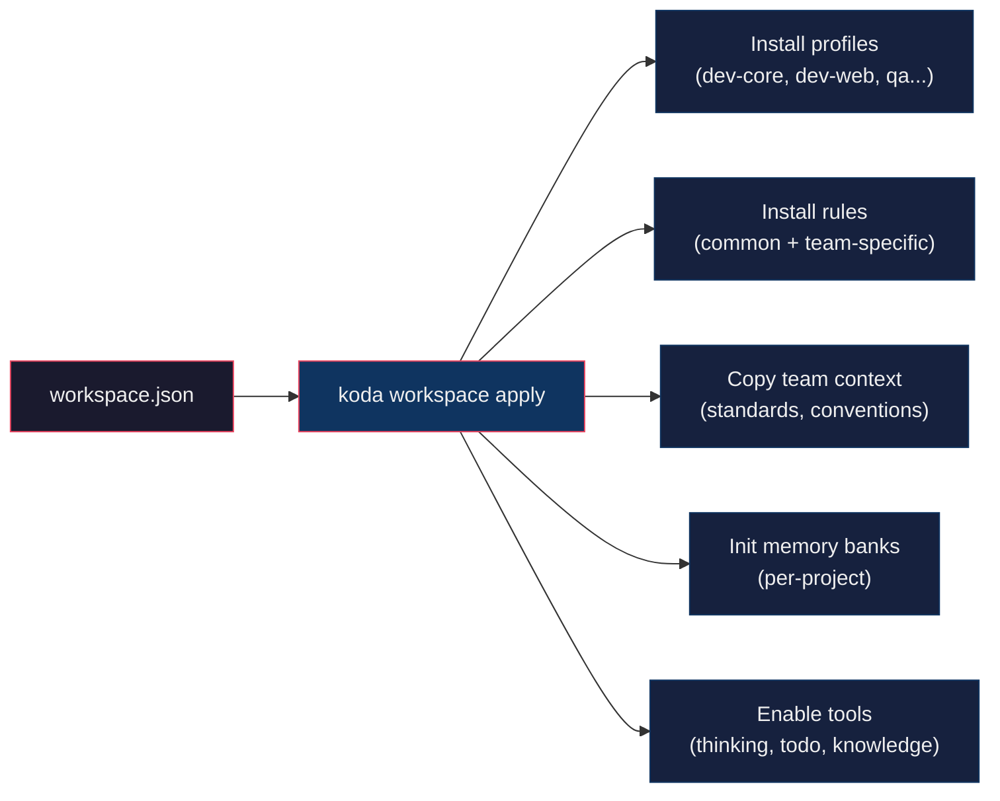

# Team Workspaces

A Team Workspace is a self-contained configuration bundle that lets new team members get fully set up with a single command. It defines which profiles to install, which rules to apply, which projects to initialize, and any team-specific context or conventions.

---

## Quick Start

```bash
# See what's available
koda workspace list

# Apply a team workspace (installs everything)
koda workspace apply payments-core

# Configure MCP tokens
koda mcp-install
```

That's it — profiles, rules, context, memory banks, and tools are all installed.

---

## How It Works



---

## Workspace Structure

```
workspaces/
└── payments-core/
    ├── workspace.json              # Configuration manifest
    ├── rules/                      # Team-specific coding rules
    │   └── payment-api-conventions.md
    ├── context/                    # Team-specific context files
    │   └── team_standards.md
    └── memory-banks/               # Custom memory bank templates (optional)
```

---

## workspace.json Schema

```json
{
  "name": "payments-core",
  "description": "Config Studio & Payment Services — fullstack web development",
  "team": "Disney Payments Core",
  "profiles": ["dev-core", "dev-web", "qa", "ops"],
  "default_agent": "orchestrator",
  "projects": [
    {
      "name": "wdpr-config-services",
      "path": "../wdpr-config-services",
      "memory_bank": "wdpr-config-services"
    }
  ],
  "rules": ["conventional_commit", "general-java-development"],
  "enable_tools": true,
  "jira_prefix": "DPAY-"
}
```

| Field | Type | Description |
|-------|------|-------------|
| `name` | string | Workspace identifier (matches directory name) |
| `description` | string | Human-readable description |
| `team` | string | Team name |
| `profiles` | string[] | Profiles to install (dev-core, dev-web, ba, qa, ops, pm) |
| `default_agent` | string | Suggested starting agent |
| `projects` | object[] | Repos to initialize with memory banks |
| `projects[].name` | string | Project display name |
| `projects[].path` | string | Relative path to the repo |
| `projects[].memory_bank` | string | Known project name in `workspaces/default/projects/` for memory bank source |
| `rules` | string[] | Common rules to install from `common/rules/` |
| `enable_tools` | boolean | Whether to enable thinking, todo, knowledge |
| `jira_prefix` | string | Team's Jira project prefix |

---

## Commands

### List workspaces

```bash
koda workspace list
```

Shows all available workspaces with descriptions and profiles.

### Show workspace details

```bash
koda workspace show payments-core
```

Displays full configuration: profiles, projects, rules, context files.

### Apply a workspace

```bash
koda workspace apply payments-core
koda workspace sync payments-core          # Pull all workspace repos
```

Runs the full setup sequence:
1. Installs specified profiles
2. Installs common rules (from `common/rules/`)
3. Copies workspace-specific rules (from `workspaces/<name>/rules/`)
4. Copies workspace-specific context (from `workspaces/<name>/context/`)
5. Initializes memory banks for listed projects
6. Enables advanced tools (if configured)

After applying, run `koda mcp-install` to configure tokens.

### Create a new workspace

```bash
koda workspace create my-team
```

Scaffolds a new workspace directory with a template `workspace.json` and empty `rules/`, `context/`, and `memory-banks/` directories.

---

## Creating a Workspace for Your Team

### 1. Scaffold

```bash
koda workspace create my-team
```

### 2. Edit workspace.json

Set your team's profiles, projects, and rules:

```json
{
  "name": "my-team",
  "description": "My team's description",
  "team": "Team Name",
  "profiles": ["dev-core", "dev-web", "qa"],
  "default_agent": "orchestrator",
  "projects": [
    {
      "name": "my-service",
      "path": "../my-service",
      "memory_bank": "my-service"
    }
  ],
  "rules": ["conventional_commit", "general-java-development"],
  "enable_tools": true,
  "jira_prefix": "MYTEAM-"
}
```

### 3. Add team rules (optional)

Drop markdown files into `workspaces/my-team/rules/`:

```markdown
# My Team API Conventions
- All endpoints must use `/api/v2/` prefix
- Response format: { data, meta }
```

### 4. Add team context (optional)

Drop markdown files into `workspaces/my-team/context/`:

```markdown
# My Team Standards
- PRs require 1 approval
- Branch naming: feat/MYTEAM-{ticket}-{description}
```

### 5. Test it

```bash
koda workspace show my-team    # Verify config
koda workspace apply my-team   # Apply and test
```

### 6. Commit to your fork

```bash
git add workspaces/my-team/
git commit -m "feat: add my-team workspace"
git push
```

New team members just clone and run `koda workspace apply my-team`.

---

## Windows

All commands work identically with `setup.ps1`:

```powershell
.\setup.ps1 workspace list
.\setup.ps1 workspace show payments-core
.\setup.ps1 workspace apply payments-core
.\setup.ps1 workspace create my-team
```

---


## Syncing Repos

Pull or push all repositories in a workspace with one command:

```bash
koda workspace sync payments-core          # fetch + pull all repos
koda workspace sync payments-core --push   # push all repos
koda workspace sync default                # sync all 9 org repos
```

Resolves `projects[].path` from `workspace.json`, skips missing directories gracefully.

## Best Practices

- **One workspace per team** — not per developer or per project
- **Keep workspace.json in version control** — it's the team's setup contract
- **Don't put tokens in workspace files** — tokens go in `.env` files via `mcp-install`
- **Use `rules/` for team conventions** — things like API patterns, naming standards
- **Use `context/` for team knowledge** — deployment processes, review SLAs, team contacts
- **Reference existing memory banks** — use `memory_bank` field to point to `workspaces/default/projects/` templates
- **Test before sharing** — run `workspace apply` on a clean setup to verify it works

---

## Workspaces vs. Forks

Workspaces and forks serve different purposes:

| | Workspace | Fork |
|---|-----------|------|
| **Scope** | Team-level config within a repo | Full repo copy for a team |
| **What it customizes** | Profiles, rules, context, memory banks | Everything |
| **Where it lives** | `workspaces/<name>/` in any fork | Separate GitHub repo |
| **Who maintains it** | Team lead or fork owner | Fork owner |
| **Shared upstream?** | No — team-specific, stays in fork | Syncs with upstream |

A typical setup: each team has a fork of steer-runtime, and within that fork they have a workspace that configures their specific setup.

---

Back to [README](../README.md)
