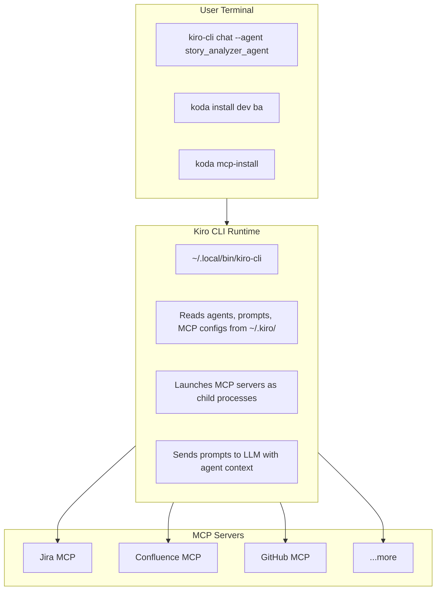
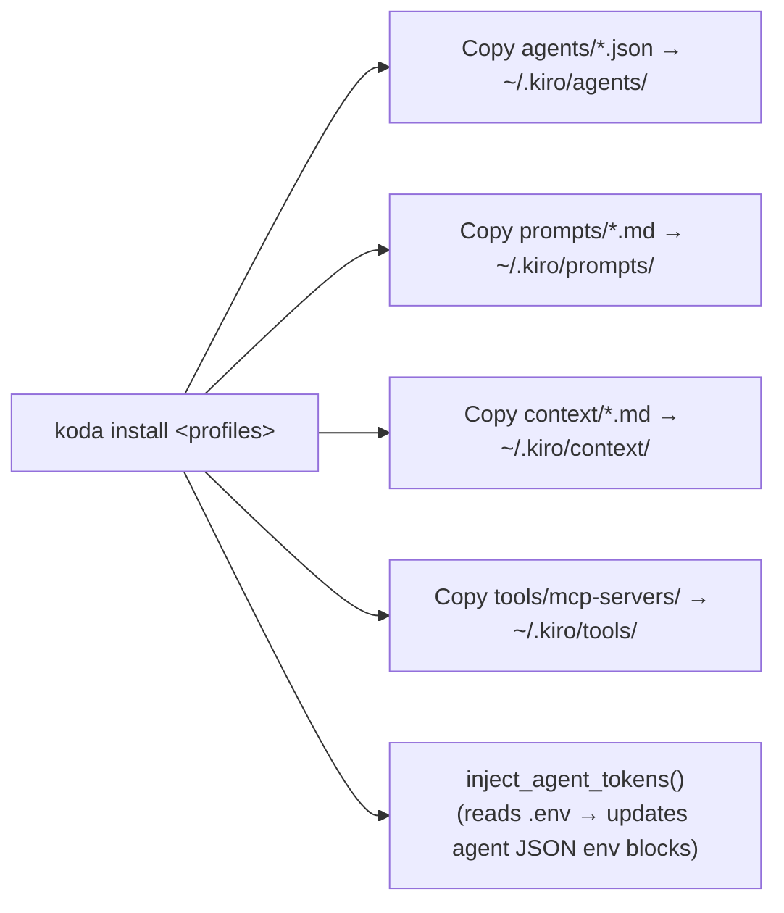
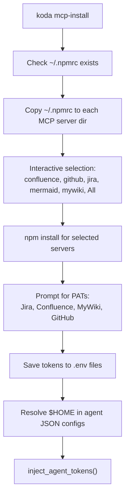
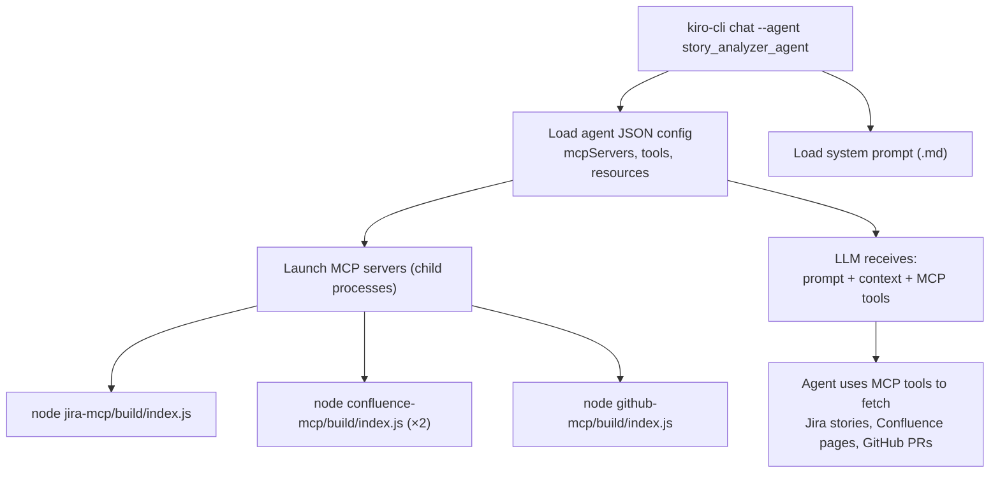

# Steer-Runtime Architecture

## Overview

Steer-runtime is a unified multi-profile agent system for Disney Payments that provides AI-assisted development, business analysis, quality assurance, and operations workflows through Kiro CLI.



---

## Repository Structure

```
steer-runtime/
│
├── setup.sh                        # ⚠️ Deprecated — use Koda instead
│
├── .kiro-dev/                      # ── Dev Profile (18 agents) ──
│   ├── agents/                     #   Agent JSON configs (MCP, tools, resources)
│   ├── prompts/                    #   Agent prompt files (markdown)
│   ├── context/                    #   Profile-specific context
│   │   ├── golden_rules.md         #     Coding standards & conventions
│   │   └── project_mappings.md     #     Jira project ↔ repo mappings
│   ├── steering/                   #   Steering files (product, repo, quality)
│   │   ├── 00-foundation.md
│   │   ├── 10-product-config-studio.md
│   │   ├── 20-repo-*.md            #     Per-repo conventions (Java, Angular, Node, Flutter)
│   │   ├── 30-quality-and-tests.md
│   │   ├── 40-security-and-secrets.md
│   │   ├── 50-kiro-powers.md
│   │   └── 60-mobile-coordination.md
│   ├── skills/                     #   Reusable skill definitions (16 skills)
│   └── powers/                     #   Power definitions (code-analysis, file-ops, git-ops, test-runner)
│
├── .kiro-ba/                       # ── BA Profile (4 agents) ──
│   ├── agents/
│   ├── prompts/
│   └── context/
│       ├── ba_guidelines.md
│       └── story_templates.md
│
├── .kiro-qa/                       # ── QA Profile (6 agents) ──
│   ├── agents/
│   ├── prompts/
│   └── context/
│       ├── qa_guidelines.md
│       ├── automation_patterns.md
│       └── test_templates.md
│
├── .kiro-ops/                      # ── Ops Profile (5 agents) ──
│   ├── agents/
│   ├── prompts/
│   └── context/
│       └── ops_guidelines.md
│
├── .kiro/                          # ── Shared Resources ──
│   ├── context/                    #   Shared context (copied to ~/.kiro during install)
│   │   ├── golden_rules.md
│   │   ├── project_mappings.md
│   │   ├── ba_guidelines.md
│   │   ├── qa_guidelines.md
│   │   ├── ops_guidelines.md
│   │   ├── automation_patterns.md
│   │   ├── story_templates.md
│   │   └── test_templates.md
│   ├── tools/
│   │   └── mcp-servers/            #   MCP server source code
│   │       ├── jira-mcp/           #     Jira integration (Node.js/TypeScript)
│   │       ├── confluence-mcp/     #     Confluence integration
│   │       ├── confluence-mcp/     #     Confluence (also used for mywiki via env)
│   │       ├── github-mcp/         #     GitHub Enterprise integration
│   │       ├── mermaid-diagram-mcp/#     Diagram generation
│   └── memory-bank/                #   steer-runtime's own memory bank
│       ├── project-brief.md
│       ├── tech-context.md
│       ├── system-patterns.md
│       ├── active-context.md
│       └── progress.md
│
├── common/                         # ── Shared Installable Resources ──
│   ├── rules/                      #   Coding rules (5 rules)
│   │   ├── conventional_commit.md
│   │   ├── general-java-development.md
│   │   ├── general-node-development.md
│   │   ├── general-angular-development.md
│   │   └── general-go-development.md
│   ├── prompts/                    #   Standalone prompts (2 prompts)
│   │   ├── generate-ai-metrics-report.md
│   │   └── check-ecs-tasks.md
│   └── memory-bank-templates/      #   Memory bank templates (4 templates)
│       ├── guidelines.md.template
│       ├── product.md.template
│       ├── structure.md.template
│       └── tech.md.template
│
│   ├── default/projects/            # ── Known Project Memory Banks (9 projects) ──
│   ├── wdpr-payment-svc/
│   ├── cart-service-java8/
│   ├── wdpr-config-services/
│   ├── wdpr-payment-controls-api/
│   ├── wdpr-payment-controls-client/
│   ├── wdpr-gcp-admin-api/
│   ├── wdpr-cap-rev-rec-svc/
│   ├── spr-router/
│   └── spr-ai-adapter/
│
├── docs/                           # ── Documentation ──
│   ├── ARCHITECTURE.md             #   This file
│   ├── PROMPT_GUIDE.md
│   ├── BA_*.md                     #   BA profile docs
│   ├── QA_*.md                     #   QA profile docs
│   ├── OPS_*.md                    #   Ops profile docs
│   └── ...
│
├── README.md
└── AGENTS.md                       # Agent catalog with MCP coverage
```

---

## Data Flow

### 1. Installation Flow



### 2. MCP Install Flow



### 3. Agent Execution Flow



---

## Agent Configuration Anatomy

Each agent consists of two files:

**1. JSON Config** (`.kiro-<profile>/agents/<name>.json`)
```json
{
  "name": "story_analyzer_agent",
  "description": "Fetches and analyzes Jira stories, Confluence pages, and GitHub repos",
  "prompt": "story_analyzer_agent.md",
  "tools": ["@jira/*", "@confluence/*", "@mywiki/*", "@github/*", "fs_read", "grep"],
  "mcpServers": {
    "jira": {
      "command": "node",
      "args": ["$HOME/.kiro/tools/mcp-servers/jira-mcp/build/index.js"],
      "cwd": "$HOME/.kiro/tools/mcp-servers/jira-mcp",
      "env": { "JIRA_PAT": "YOUR_TOKEN" }
    }
  },
  "allowedTools": ["@jira/*", "@confluence/*", "@mywiki/*", "@github/*"],
  "resources": ["file://.kiro/context/project_mappings.md"]
}
```

**2. Prompt** (`.kiro-<profile>/prompts/<name>.md`)
- Identity and role definition
- Available tools and workflows
- Input/output format
- Rules and constraints

---

## MCP Server Architecture

```
~/.kiro/tools/mcp-servers/
│
├── jira-mcp/              Node.js/TypeScript
│   ├── src/               Source code
│   ├── build/index.js     Compiled entry point
│   ├── .env               JIRA_PAT=<token>
│   └── .npmrc             Disney Nexus registry (copied from ~/.npmrc)
│
├── confluence-mcp/        Node.js/TypeScript
│   ├── build/index.js
│   ├── .env               CONFLUENCE_URL + CONFLUENCE_PAT
│   └── .env.mywiki        MyWiki instance tokens
│
├── mywiki-mcp/            Removed — mywiki uses confluence-mcp binary with CONFLUENCE_URL=https://mywiki.disney.com
│   └── .env.example
│
├── github-mcp/            Node.js/TypeScript
│   ├── build/index.js
│   └── .env               GITHUB_TOKEN_disney + GITHUB_HOST_disney
│
└── mermaid-diagram-mcp/   Diagram generation

```

Token resolution priority: **Agent JSON `env` block** > **MCP server `.env` file** (dotenv doesn't override existing env vars)

---

## Profile × MCP Matrix

| Profile | Agents | Jira | Confluence | MyWiki | GitHub | Bruno | Other              |
|---------|--------|:----:|:----------:|:------:|:------:|:-----:|--------------------|
| **dev** | 20     |  4   |     3      |   3    |   4    |   6   | —                  |
| **ba**  | 4      |  4   |     4      |   4    |   4    |   —   | —                  |
| **qa**  | 6      |  3   |     3      |   3    |   3    |   2   | —                  |
| **ops** | 5      |  2   |     2      |   2    |   2    |   —   | SonarQube, Harness |

---

## CLI Commands (Koda)

> `setup.sh` is deprecated. All commands below are available via `koda`.

| Command                 | Purpose                                           |
|-------------------------|---------------------------------------------------|
| `install <profiles>`    | Copy profile agents/prompts/context to `~/.kiro`  |
| `sync`                  | Update already-installed profiles                 |
| `remove <profiles>`     | Remove specific profiles                          |
| `clean`                 | Remove all installed agents                       |
| `list`                  | Show available profiles                           |
| `check`                 | Verify installation                               |
| `mcp-install`           | Install MCP deps, configure tokens, resolve paths |
| `rules list\|install`   | Manage common coding rules                        |
| `prompts list\|install` | Manage standalone prompts                         |
| `init-memory <dir>`     | Initialize per-project memory bank                |
| `configure`             | Interactive MCP token configuration               |

---

## Key Design Decisions

1. **Profiles are additive** — Installing multiple profiles merges agents into `~/.kiro/agents/`. No conflicts because agent names are unique across profiles.

2. **`$HOME` in source, absolute paths when installed** — Source repo uses `$HOME` for portability. `koda install` / `setup.sh install` expands to absolute paths because Kiro CLI doesn't resolve shell variables in JSON.

3. **Token injection via `env` blocks** — Agent JSON `env` blocks override `.env` files (dotenv doesn't overwrite existing env vars). This makes tokens work even if `.env` loading fails.

4. **MyWiki reuses confluence-mcp** — Same binary, different `env` block with `CONFLUENCE_URL=https://mywiki.disney.com`. No code duplication.

5. **MCP install is resilient** — Failed `npm install` (e.g., 403 from Nexus) skips and continues. Users select which servers to install.

6. **Shared context is centralized** — `.kiro/context/` holds all shared context files. Agents reference them via `resources` in their JSON config.

---

## Version

**v3.1.0** — 33 agents across 4 profiles, 5 MCP servers, 5 common rules, 9 known projects.

---

## See also

- [System Layers & Responsibilities](SYSTEM_LAYERS.md) — layer-by-layer breakdown of the full ecosystem (LLM, IDE runtime, Koda, steer-runtime, workspaces, profiles, agents, MCP servers, hooks, powers)
