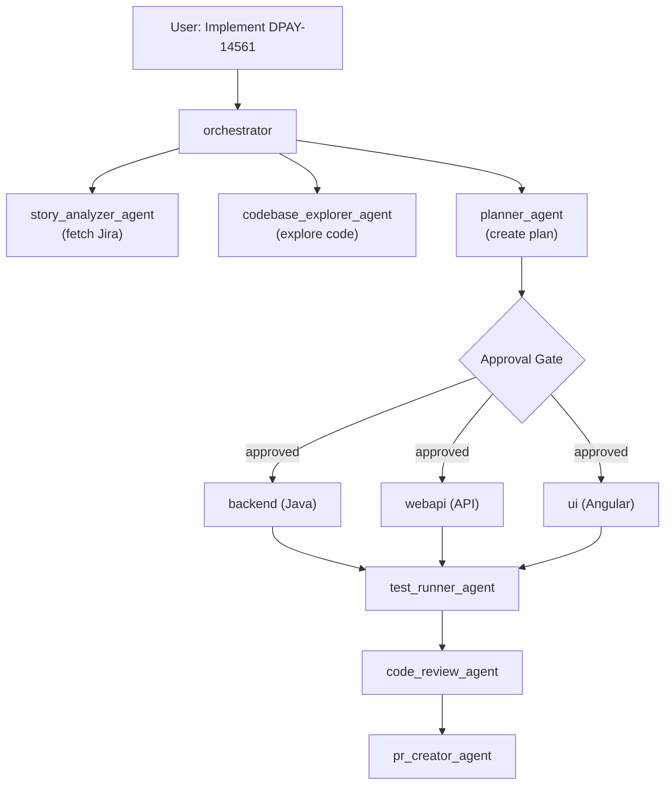
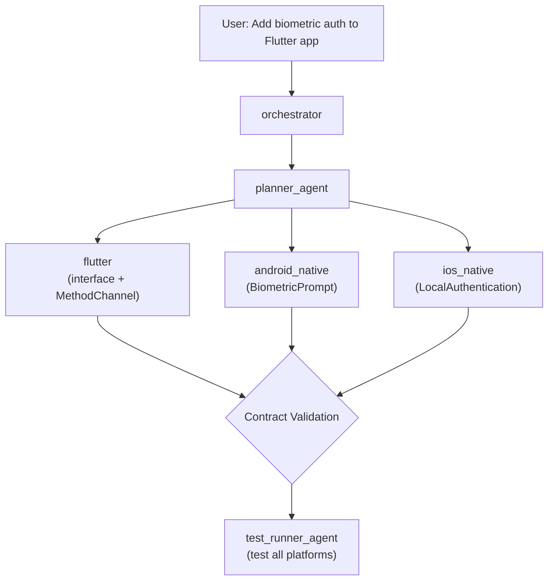
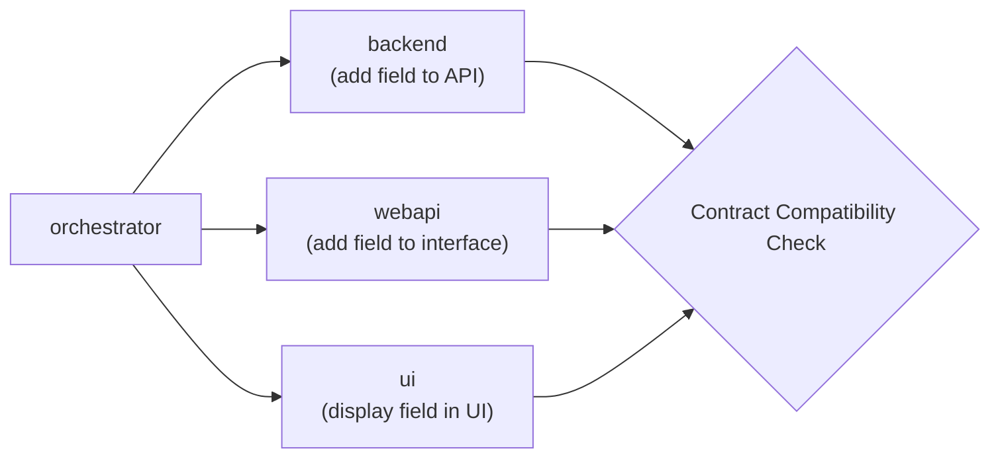

# steer-runtime Architecture & Design

**Multi-Agent Development System for Config Studio**

**Version:** 2.0  
**Last Updated:** March 12, 2026

---

## Overview

**steer-runtime** is a comprehensive multi-agent development system built on Kiro, providing specialized agents for orchestrating development across backend (Java), webapi (Node.js), UI (Angular), and mobile (Flutter/Android/iOS) repositories.

### Key Capabilities

- **23 Specialized Agents** - Orchestration, implementation, quality, security, mobile
- **Multi-Repo Coordination** - Seamless work across Config Studio repositories
- **Mobile Development** - Flutter, Android, iOS platform channels
- **Development Powers** - Git ops, code analysis, file ops, testing
- **Quality Gates** - Code review, security, performance, compliance
- **Unified Configuration** - Single `.kiro/` directory structure

---

## Architecture

### System Components

```
steer-runtime/
├── .kiro/                      # Configuration hub
│   ├── agents/                # 23 agent configurations
│   ├── prompts/               # Agent instructions
│   ├── skills/                # Specialized capabilities
│   ├── steering/              # Project guidance
│   ├── powers/                # Development tools
│   ├── context/               # Project context
│   └── tools/                 # Utilities
├── docs/                       # Documentation
└── setup.sh                    # Bash fallback (Koda is primary)
```

### Agent Architecture

```
Orchestrator Layer
├── orchestrator               # Config Studio coordinator
├── orchestrator_agent         # Generic orchestration
└── orchestrator_multiagent    # Advanced patterns

Implementation Layer
├── backend                    # Java services
├── webapi                     # Node.js API
├── ui                         # Angular frontend
├── flutter                    # Dart/Flutter
├── android_native             # Kotlin/Java
└── ios_native                 # Swift/Obj-C

Planning & Analysis Layer
├── planner_agent              # Task planning
├── story_analyzer_agent       # Jira analysis
├── architecture_agent         # Architecture review
└── codebase_explorer_agent    # Code exploration

Quality & Security Layer
├── code_review_agent          # Code review
├── security_scanner_agent     # Security analysis
├── compliance_agent           # Compliance validation
├── test_runner_agent          # Test execution
└── performance_agent          # Performance optimization

Workflow Layer
├── pr_creator_agent           # PR creation
└── discussion_agent           # Technical discussions
```

---

## Agent Coordination Patterns

### Pattern 1: Config Studio Feature



### Pattern 2: Mobile Feature



### Pattern 3: Cross-Platform Validation



---

## Configuration Structure

### Agent Configuration

Each agent has:
- **JSON config** - Tools, paths, resources
- **Prompt** - Instructions and behavior
- **Skills** - Specialized capabilities (optional)
- **Steering** - Project-specific guidance

Example: `backend.json`
```json
{
  "name": "backend",
  "description": "Java services specialist",
  "prompt": "file://.kiro/prompts/backend.md",
  "tools": ["read", "write", "shell"],
  "toolsSettings": {
    "write": {
      "allowedPaths": ["src/**", "pom.xml"]
    }
  },
  "resources": [
    "file://.kiro/steering/**/*.md",
    "file://AGENTS.md"
  ]
}
```

### Steering Documents

Project-wide guidance in `.kiro/steering/`:
- `00-foundation.md` - Core principles
- `10-product-config-studio.md` - Product context
- `20-repo-*.md` - Repository-specific guidance
- `30-quality-and-tests.md` - Quality standards
- `40-security-and-secrets.md` - Security practices
- `50-kiro-powers.md` - Powers integration
- `60-mobile-coordination.md` - Mobile patterns

### Skills

Specialized capabilities in `.kiro/skills/`:
- `backend-endpoint-implementation.md`
- `ui-feature-implementation.md`
- `flutter-provider-pattern.md`
- `android-platform-channels.md`
- And more...

---

## Development Powers

Custom tools extending agent capabilities:

### git-ops
```javascript
git_status()      // Current branch, changes
git_diff({file})  // Show differences
git_log({limit})  // Recent commits
```

### code-analysis
```javascript
find_files({pattern, path})     // Find files
search_code({query, path})      // Search code
count_lines({path})             // Count LOC
```

### file-ops
```javascript
backup_file({file})                    // Create backup
compare_files({file1, file2})          // Compare files
find_duplicates({path, pattern})       // Find duplicates
```

### test-runner
```javascript
run_tests({command, path})      // Execute tests
find_tests({path, framework})   // Locate tests
test_coverage({command})        // Coverage analysis
```

See [profiles/dev-core/powers/GUIDE.md](https://github.disney.com/SANCR225/steer-runtime/blob/main/profiles/dev-core/powers/GUIDE.md) for creating custom powers.

---

## Workflow Examples

### Feature Implementation Workflow

1. **Story Analysis**
   - Fetch Jira story
   - Extract acceptance criteria
   - Identify dependencies

2. **Code Exploration**
   - Locate relevant components
   - Understand existing patterns
   - Map integration points

3. **Planning**
   - Break down into tasks
   - Identify affected repos
   - Plan testing approach

4. **Implementation**
   - Backend: API changes
   - WebAPI: Interface updates
   - UI: Component changes
   - Atomic commits per task

5. **Quality Checks**
   - Run tests (≥90% coverage)
   - Code review
   - Security scan
   - Performance check
   - Compliance validation

6. **PR Creation**
   - Generate PR description
   - Link to Jira story
   - Include test results

### Mobile Development Workflow

1. **Interface Definition** (Flutter)
   - Define abstract interface
   - Create MethodChannel
   - Implement Provider

2. **Android Implementation**
   - Implement platform channel
   - Use native Android APIs
   - Handle permissions

3. **iOS Implementation**
   - Implement platform channel
   - Use native iOS APIs
   - Configure Info.plist

4. **Contract Validation**
   - Verify method names match
   - Check parameter types
   - Validate error handling

5. **Testing**
   - Test Flutter interface
   - Test Android implementation
   - Test iOS implementation

---

## Quality Gates

### Code Review Gate
- Security vulnerabilities
- Code quality issues
- Performance concerns
- Best practices violations

### Security Gate
- Vulnerability scanning
- Secret detection
- Dependency audit
- Access control review

### Performance Gate
- API response times
- Database query performance
- Bundle size analysis
- Memory usage

### Compliance Gate
- PII handling
- Accessibility (WCAG 2.1)
- GDPR compliance
- Logging standards

---

## Integration Patterns

### With Existing Kiro Setup

steer-runtime coexists with existing `.kiro/` configurations:

**CLI Mode:**
- Installs to `~/.kiro/`
- Merges with existing agents
- Preserves existing configuration

**UI Mode:**
- Installs to project `.kiro/`
- Self-contained per project
- No global impact

### With MCP Servers

Optional integration for:
- **Jira MCP** - Story fetching
- **GitHub MCP** - PR creation
- **Confluence MCP** - Documentation
- **Custom MCPs** - Project-specific

### With CI/CD

Agents can be invoked in pipelines:
```bash
# Run tests
kiro-cli chat --agent test_runner_agent < test-prompt.txt

# Security scan
kiro-cli chat --agent security_scanner_agent < scan-prompt.txt
```

---

## State Management

### Agent State

Each agent maintains:
- **Context** - Current task, files, decisions
- **History** - Previous interactions
- **Resources** - Loaded steering docs, skills

### Orchestrator State

Tracks workflow progress:
- Current phase
- Completed tasks
- Pending approvals
- Quality check results

### Persistence

State persists across:
- Conversation continuity
- Session resumption
- Multi-step workflows

---

## Extensibility

### Adding New Agents

1. Create agent config in `.kiro/agents/`
2. Write prompt in `.kiro/prompts/`
3. Add skills in `.kiro/skills/` (optional)
4. Update `AGENTS.md`
5. Test with `koda cli --sync`

### Adding New Powers

1. Create directory in `.kiro/powers/`
2. Define tools in `power.json`
3. Implement in `index.js`
4. Document in `README.md`
5. Test with `node .kiro/tools/test-powers.js`

### Adding New Skills

1. Create markdown in `.kiro/skills/`
2. Document patterns and examples
3. Reference in agent configs
4. Update steering docs if needed

---

## Design Principles

### 1. Separation of Concerns
- Each agent has clear responsibility
- Orchestrator coordinates, doesn't implement
- Specialized agents focus on their domain

### 2. Explicit Coordination
- Orchestrator explicitly delegates
- Clear handoffs between agents
- Validation at integration points

### 3. Configuration Over Code
- Agents defined in JSON
- Behavior in markdown prompts
- Skills as documentation

### 4. Composability
- Agents work independently
- Powers extend capabilities
- Skills add specialization

### 5. Transparency
- Clear workflow steps
- Approval gates for control
- Audit trail of decisions

---

## Performance Considerations

### Agent Selection
- Use specific agents (not generic)
- Minimize agent switching
- Cache context when possible

### Resource Loading
- Lazy load steering docs
- Load skills on demand
- Minimize prompt size

### Parallel Execution
- Independent tasks can run parallel
- Use orchestrator_multiagent for complex workflows
- Coordinate at integration points

---

## Security Considerations

### Agent Permissions
- Write access restricted by paths
- Shell commands monitored
- Secrets never in prompts

### Code Safety
- No automatic commits without review
- Test before merge
- Security scanning required

### Data Privacy
- No PII in logs
- Secrets in environment only
- Audit trail for compliance

---

## Success Metrics

### Efficiency
- Time from story to PR
- Number of manual interventions
- Test coverage maintained

### Quality
- Code review pass rate
- Security scan results
- Performance benchmarks

### Adoption
- Number of features implemented
- Agent usage patterns
- Developer satisfaction

---

## Future Enhancements

### Phase 3 (Planned)
- Verification loop with auto-fix
- Wave execution (parallel tasks)
- Multi-repo atomic commits
- Advanced error recovery

### Potential Additions
- Database migration agent
- Infrastructure agent (Terraform)
- Documentation agent
- Deployment agent

---

## References

- **[README.md](../index.md)** - Quick start
- **[AGENTS.md](https://github.disney.com/SANCR225/steer-runtime/blob/main/AGENTS.md)** - Agent reference
- **[PROMPT_GUIDE.md](../profiles/dev/PROMPT_GUIDE.md)** - Usage examples

---

**Version:** 2.0  
**Agents:** 23  
**Powers:** 4  
**Last Updated:** March 12, 2026
