# Orchestrator Delegation Review

## Current Workflow Analysis

### Complete Workflow (11 Steps + 5 Gates)

```mermaid
graph TD
    input["User Input:<br/>Implement DPAY-14337"] --> step1

    step1["Step 1: Story Analysis<br/><i>→ story_analyzer_agent</i><br/>Output: JSON (title, ACs, type, priority)"]
    step1 --> step2

    step2["Step 2: Codebase Exploration<br/><i>→ codebase_explorer_agent</i><br/>Output: files, patterns, dependencies"]
    step2 --> step3

    step3["Step 3: Discussion (optional)<br/><i>→ discussion_agent</i><br/>Output: CONTEXT.md with preferences"]
    step3 --> step3b

    step3b["Step 3.5: Architecture Review (optional)<br/><i>→ architecture_agent</i><br/>Output: pattern recommendations"]
    step3b --> step4

    step4["Step 4: Implementation Planning<br/><i>→ planner_agent</i><br/>Output: tasks, dependencies, estimates"]
    step4 --> gate1

    gate1{"GATE 1: Plan Approval<br/>yes / no / modify"}
    gate1 -->|"approved"| step6
    gate1 -->|"rejected"| step4

    step6["Step 5: Implementation (per task)<br/><i>→ backend / ui / webapi agent</i><br/>Output: files changed"]
    step6 --> step6b

    step6b["Step 6: Testing<br/><i>→ test_runner_agent</i><br/>Output: test results, coverage %"]
    step6b --> gate2

    gate2{"GATE 2: Test Results<br/>fix / skip / abort"}
    gate2 -->|"passed"| step7
    gate2 -->|"failed"| step6

    step7["Step 7: Code Review<br/><i>→ code_review_agent</i><br/>Output: status, issues, auto-fix"]
    step7 --> gate3

    gate3{"GATE 3: Code Review<br/>apply fixes / manual / abort"}
    gate3 -->|"passed"| step8
    gate3 -->|"issues"| step6

    step8["Step 8: Security Scan<br/><i>→ security_scanner_agent</i><br/>Output: vulnerabilities, fixes"]
    step8 --> gate4

    gate4{"GATE 4: Security<br/>apply fixes / manual / abort"}
    gate4 -->|"passed"| step9
    gate4 -->|"vulnerabilities"| step6

    step9["Step 9: Quality Report<br/><i>Orchestrator consolidates all checks</i>"]
    step9 --> gate5

    gate5{"GATE 5: Final Approval<br/>yes / no"}
    gate5 -->|"approved"| step10
    gate5 -->|"rejected"| step6

    step10["Step 10: PR Creation<br/><i>→ pr_creator_agent</i><br/>Output: PR URL, PR number"]
    step10 --> step11

    step11["Step 11: Completion<br/>PR link, duration, stats, quality checks"]
```



## Agent Delegation Matrix

| Step | Agent                   | Input               | Output                | Required |
|------|-------------------------|---------------------|-----------------------|----------|
| 1    | story_analyzer_agent    | Jira URL            | Story JSON            | Yes      |
| 2    | codebase_explorer_agent | Components          | Files, patterns       | Yes      |
| 3    | discussion_agent        | Story details       | User preferences      | Optional |
| 3.5  | architecture_agent      | Story + exploration | Architecture guidance | Optional |
| 4    | planner_agent           | All context         | Plan with XML tasks   | Yes      |
| 6    | backend_agent           | Task XML            | Files changed         | Per task |
| 6    | ui_agent                | Task XML            | Files changed         | Per task |
| 6    | webapi_agent            | Task XML            | Files changed         | Per task |
| 6    | test_runner_agent       | Changed files       | Test results          | Yes      |
| 7    | code_review_agent       | Changed files       | Review status         | Yes      |
| 8    | security_scanner_agent  | Changed files       | Vulnerabilities       | Yes      |
| 10   | pr_creator_agent        | Story + changes     | PR URL                | Yes      |

## Delegation Patterns

### Pattern 1: Sequential Delegation
```
story_analyzer → codebase_explorer → planner → implementation
```
Each agent waits for previous agent's output.

### Pattern 2: Conditional Delegation
```
if (story has ambiguities) → discussion_agent
if (complex design) → architecture_agent
if (tests fail) → re-invoke implementation agents
```

### Pattern 3: Loop Delegation
```
for each task in plan:
    invoke appropriate agent (backend/ui/webapi)
    wait for completion
    track progress
```

### Pattern 4: Gate-Based Delegation
```
invoke agent → check result → if issues → ask user → retry or continue
```

## Orchestrator Responsibilities

### ✅ What Orchestrator DOES
1. **Invoke subagents** using `use_subagent` tool
2. **Pass context** between agents (story → exploration → planning)
3. **Manage approval gates** (wait for user input)
4. **Track state** (current step, files changed, results)
5. **Handle errors** (retry, skip, abort)
6. **Consolidate results** (quality report)
7. **Show progress** (emojis, formatted output)

### ❌ What Orchestrator DOES NOT DO
1. Fetch Jira stories (delegates to story_analyzer)
2. Explore codebase (delegates to codebase_explorer)
3. Write code (delegates to implementation agents)
4. Run tests (delegates to test_runner)
5. Review code (delegates to code_review)
6. Scan for vulnerabilities (delegates to security_scanner)
7. Create PRs (delegates to pr_creator)

## Current Issues & Recommendations

### Issue 1: Orchestrator Not Auto-Delegating
**Problem**: Orchestrator doesn't automatically invoke story_analyzer when seeing Jira URL

**Current Behavior**:
```
User: "Implement https://jira.../DPAY-14337"
Orchestrator: "I don't have access to Jira..."
```

**Expected Behavior**:
```
User: "Implement https://jira.../DPAY-14337"
Orchestrator: "🔍 Analyzing story DPAY-14337..."
[Invokes story_analyzer_agent]
```

**Root Cause**: LLM not following prompt instructions to use tools

**Workaround**: User explicitly says "using story_analyzer_agent, analyze..."

**Potential Fixes**:
1. ✅ Add welcome message (done)
2. ✅ Add explicit examples (done)
3. ✅ Make Jira check FIRST action (done)
4. 🔄 Try different model (if available)
5. 🔄 Simplify prompt further
6. 🔄 Add system-level tool-use enforcement

### Issue 2: Delegation to Wrong Agent
**Problem**: Orchestrator invokes `kiro_default` instead of `story_analyzer_agent`

**Fix Applied**: ✅ Explicit warnings "NOT kiro_default" in multiple places

### Issue 3: Missing Tools
**Problem**: Orchestrator couldn't run git, grep commands

**Fix Applied**: ✅ Added `execute_bash`, `grep`, `code` tools

## Strengths of Current Design

✅ **Clear separation of concerns** - Each agent has specific role
✅ **Approval gates** - User control at key decision points
✅ **Quality checks** - Automated review, security, testing
✅ **Error handling** - Retry/skip/abort options
✅ **State tracking** - Orchestrator maintains workflow state
✅ **Extensible** - Easy to add new agents (architecture_agent added)
✅ **Context passing** - Information flows between agents

## Recommendations

### Short Term
1. **Test full workflow** with explicit delegation command
2. **Document workaround** for auto-delegation issue
3. **Add logging** to track which agents are invoked
4. **Create examples** of successful workflows

### Medium Term
1. **Simplify orchestrator prompt** - Focus on tool-use patterns
2. **Add agent health checks** - Verify agents are available
3. **Improve error messages** - Show which agent failed and why
4. **Add workflow visualization** - Show current step in UI

### Long Term
1. **Parallel delegation** - Invoke independent agents simultaneously
2. **Agent caching** - Reuse results from previous runs
3. **Workflow templates** - Pre-defined workflows for common tasks
4. **Agent learning** - Improve delegation based on success/failure

## Summary

**Current State**: Orchestrator has well-designed delegation workflow with 12 specialized agents, 5 approval gates, and comprehensive quality checks.

**Main Issue**: LLM not automatically following tool-use instructions for initial delegation.

**Workaround**: User explicitly specifies agent to use.

**Next Steps**: Test full workflow, document patterns, consider model alternatives.

---

## Mobile Development Delegation Patterns

### Pattern 1: Flutter-Only Feature

```
User: "Add payment form with validation"
    ↓
orchestrator
    ├─→ Analyze: Flutter-only feature
    ├─→ Delegate to: flutter agent
    │   ├─→ Create form widget
    │   ├─→ Add validation logic
    │   ├─→ Implement Provider
    │   └─→ Add tests
    └─→ Review: Code quality
```

### Pattern 2: Cross-Platform Native Feature

```
User: "Add biometric authentication"
    ↓
orchestrator
    ├─→ Analyze: Requires platform channels
    ├─→ Phase 1: Interface Definition
    │   └─→ flutter agent
    │       ├─→ Create BiometricAuth interface
    │       └─→ Define MethodChannel
    ├─→ Phase 2: Android Implementation
    │   └─→ android_native agent
    │       ├─→ Implement BiometricPrompt
    │       └─→ Handle permissions
    ├─→ Phase 3: iOS Implementation
    │   └─→ ios_native agent
    │       ├─→ Implement LocalAuthentication
    │       └─→ Configure Info.plist
    └─→ Phase 4: Contract Validation
        ├─→ Verify method names match
        ├─→ Check parameter types
        └─→ Validate error handling
```

### Pattern 3: Platform-Specific Feature

```
User: "Add Android widget"
    ↓
orchestrator
    ├─→ Analyze: Android-only
    └─→ Delegate to: android_native agent
        ├─→ Implement widget
        ├─→ Configure manifest
        └─→ Document usage
```

---

## Mobile Agent Coordination Rules

### Contract Validation

When coordinating platform channels:

1. **Method Names**
   - Flutter: `authenticate()`
   - Android: `"authenticate"`
   - iOS: `"authenticate"`
   - Must match exactly

2. **Parameter Types**
   - Flutter: `Map<String, dynamic>`
   - Android: `Map<String, Any>`
   - iOS: `[String: Any]`
   - Must be compatible

3. **Return Types**
   - Document expected type
   - Handle null/optional properly
   - Error codes consistent

4. **Error Handling**
   - Same error codes across platforms
   - Same error message format
   - Proper PlatformException usage

### Delegation Decision Tree

```
Is feature mobile-related?
├─→ No: Use backend/webapi/ui agents
└─→ Yes:
    ├─→ Pure Flutter (UI/logic)?
    │   └─→ Delegate to: flutter agent
    ├─→ Needs native APIs?
    │   └─→ Coordinate: flutter + android_native + ios_native
    └─→ Platform-specific?
        ├─→ Android only: android_native agent
        └─→ iOS only: ios_native agent
```

---

## Mobile Quality Gates

### Gate 1: Platform Channel Contract
- Method signatures match
- Parameter types compatible
- Return types consistent
- Error handling aligned

### Gate 2: Platform Testing
- Tested on Android device/emulator
- Tested on iOS device/simulator
- Platform-specific features verified
- Permissions working correctly

### Gate 3: Flutter Integration
- Widget tests passing
- Provider state management working
- Platform channel communication verified
- Error handling tested

---

**Updated:** March 12, 2026  
**Mobile Agents:** flutter, android_native, ios_native
