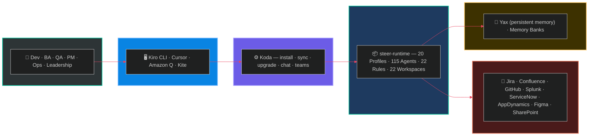

# Steer Platform — High-Level Architecture Diagram

## Full Architecture

```mermaid
%%{init: {'theme': 'dark', 'themeVariables': {'primaryColor': '#1a1a2e', 'primaryTextColor': '#eee', 'lineColor': '#74b9ff', 'fontSize': '14px'}}}%%
graph LR
    %% === User Layer ===
    subgraph users["👤 Users"]
        direction TB
        dev["Developer"]
        ba["BA / PO"]
        qa["QA Engineer"]
        pm["PM / Scrum Master"]
        ops["Ops / SRE"]
        lead["Leadership"]
    end

    %% === IDE Runtime Layer ===
    subgraph ides["🖥️ IDE Runtimes"]
        direction TB
        kiro["Kiro CLI"]
        cursor["Cursor IDE"]
        amazonq["Amazon Q"]
        kite["Kite Desktop"]
    end

    %% === Management Layer ===
    subgraph mgmt["⚙️ Koda"]
        direction TB
        install["install / sync"]
        upgrade["upgrade"]
        workspaces["workspaces"]
        doctor["doctor"]
        chat["chat"]
        teams["teams"]
    end

    %% === steer-runtime Core ===
    subgraph steer["📦 steer-runtime"]
        direction TB
        subgraph profiles["20 Profiles"]
            direction TB
            devcore["dev-core (20)"]
            qaprof["qa (16)"]
            baprof["ba (8)"]
            pmprof["pm (6)"]
            opsprof["ops (9)"]
            more["+ 15 more"]
        end

        subgraph agents["115 Agents"]
            direction TB
            orch["orchestrator"]
            planner["planner"]
            backend["backend"]
            reviewer["code_review"]
            moreag["...111 more"]
        end

        subgraph shared["Shared"]
            direction TB
            rules["22 Rules"]
            hooks["Hooks"]
            context["Context"]
        end

        subgraph ws["22 Workspaces"]
            wsjson["workspace.json"]
        end
    end

    %% === MCP + External ===
    subgraph mcp["🔌 13 MCP Servers"]
        direction TB
        jira["jira"]
        confluence["confluence"]
        github["github"]
        splunk["splunk"]
        snow["servicenow"]
        appd["appdynamics"]
        figma["figma"]
        sharepoint["sharepoint"]
        qtest["qtest"]
        chrome["chrome"]
        bruno["bruno"]
        memorymcp["memory"]
        mermaidmcp["mermaid"]
    end

    subgraph external["🌐 External"]
        direction TB
        jiraext["Jira"]
        confext["Confluence"]
        ghext["GitHub"]
        splunkext["Splunk"]
        snowext["ServiceNow"]
        appdext["AppDynamics"]
    end

    %% === Memory + Distribution (below) ===
    subgraph mem["🧠 Memory"]
        direction TB
        yax["Yax (graph)"]
        membank["Memory Banks"]
    end

    subgraph dist["📤 Distribution"]
        direction TB
        ghpub["GitHub Releases"]
        autoupd["Auto-update"]
        tarball["Encrypted Tarballs"]
    end

    %% === Connections ===
    users --> ides
    ides --> mgmt
    mgmt --> steer
    agents --> mcp
    mcp --> external
    agents --> mem
    mgmt --> dist

    %% === Styling ===
    style users fill:#2d3436,stroke:#00b894,color:#fff,stroke-width:2px
    style ides fill:#0984e3,stroke:#74b9ff,color:#fff,stroke-width:2px
    style mgmt fill:#6c5ce7,stroke:#a29bfe,color:#fff,stroke-width:2px
    style steer fill:#1e3a5f,stroke:#00b894,color:#fff,stroke-width:2px
    style profiles fill:#1a472a,stroke:#00b894,color:#fff
    style agents fill:#1a472a,stroke:#00b894,color:#fff
    style shared fill:#1a472a,stroke:#00b894,color:#fff
    style ws fill:#1a472a,stroke:#00b894,color:#fff
    style mcp fill:#4a1a1a,stroke:#e17055,color:#fff,stroke-width:2px
    style external fill:#2d3436,stroke:#636e72,color:#dfe6e9,stroke-width:2px
    style mem fill:#3d3100,stroke:#fdcb6e,color:#ffeaa7,stroke-width:2px
    style dist fill:#3d1010,stroke:#d63031,color:#ff7675,stroke-width:2px
```

## Simplified Version (for slides)

```mermaid
%%{init: {'theme': 'dark', 'themeVariables': {'primaryColor': '#1a1a2e', 'primaryTextColor': '#eee', 'lineColor': '#e94560'}}}%%
graph LR
    subgraph Users[" "]
        U["👤 Dev · BA · QA · PM · Ops · Leadership"]
    end

    subgraph Runtime[" "]
        R["🖥️ Kiro CLI · Cursor · Amazon Q · Kite"]
    end

    subgraph Koda[" "]
        K["⚙️ Koda — install · sync · upgrade · chat · teams"]
    end

    subgraph Platform[" "]
        P["📦 steer-runtime — 20 Profiles · 115 Agents · 22 Rules · 22 Workspaces"]
    end

    subgraph MCP[" "]
        M["🔌 Jira · Confluence · GitHub · Splunk · ServiceNow · AppDynamics · Figma · SharePoint"]
    end

    subgraph Memory[" "]
        Y["🧠 Yax (persistent memory) · Memory Banks"]
    end

    U --> R --> K --> P --> MCP
    P --> Y

    style Users fill:#2d3436,stroke:#00b894,color:#fff,stroke-width:2px
    style Runtime fill:#0984e3,stroke:#74b9ff,color:#fff,stroke-width:2px
    style Koda fill:#6c5ce7,stroke:#a29bfe,color:#fff,stroke-width:2px
    style Platform fill:#1e3a5f,stroke:#00b894,color:#fff,stroke-width:2px
    style MCP fill:#4a1a1a,stroke:#e17055,color:#fff,stroke-width:2px
    style Memory fill:#3d3100,stroke:#fdcb6e,color:#ffeaa7,stroke-width:2px
```
