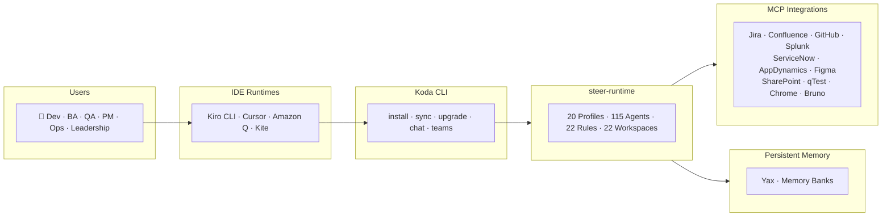

# Steer Platform — High-Level Architecture Diagram

## Mermaid Diagram (paste into any Mermaid renderer)

```mermaid
graph TB
    %% === User Layer ===
    subgraph users["👤 Users"]
        dev["Developer"]
        ba["BA / PO"]
        qa["QA Engineer"]
        pm["PM / Scrum Master"]
        ops["Ops / SRE"]
        lead["Leadership"]
    end

    %% === IDE Runtime Layer ===
    subgraph ides["🖥️ IDE Runtimes"]
        kiro["Kiro CLI<br/>(primary runtime)"]
        cursor["Cursor IDE<br/>(.mdc rules)"]
        amazonq["Amazon Q<br/>(.md rules)"]
        kite["Kite Desktop<br/>(Tauri + React)"]
    end

    %% === Management Layer ===
    subgraph mgmt["⚙️ Koda (Go CLI + TUI)"]
        install["install / sync"]
        upgrade["upgrade / auto-update"]
        workspaces["workspace apply"]
        doctor["doctor / check"]
        chat["chat / delegate"]
        teams["agent teams"]
    end

    %% === steer-runtime Core ===
    subgraph steer["📦 steer-runtime"]
        subgraph profiles["Profiles (20)"]
            devcore["dev-core (20)"]
            qaprof["qa (16)"]
            baprof["ba (8)"]
            pmprof["pm (6)"]
            opsprof["ops (9)"]
            more["+ 15 more..."]
        end

        subgraph agents["Agents (115 unique)"]
            orch["orchestrator"]
            planner["planner"]
            backend["backend"]
            reviewer["code_review"]
            security["security_scanner"]
            moreag["...110 more"]
        end

        subgraph shared["Shared Resources"]
            rules["22 Coding Rules<br/>(Java, Node, Go, Angular...)"]
            context["Context Files<br/>(golden_rules, mappings)"]
            hooks["Hooks<br/>(guard-writes, warn-destructive)"]
            steering["Steering Rules<br/>(numbered behavioral rules)"]
        end

        subgraph ws["Workspaces (22 teams)"]
            wsjson["workspace.json<br/>(profiles, rules, repos)"]
        end
    end

    %% === MCP Integration Layer ===
    subgraph mcp["🔌 MCP Servers (13)"]
        jira["jira-mcp"]
        confluence["confluence-mcp"]
        github["github-mcp"]
        splunk["splunk-mcp"]
        snow["servicenow-mcp"]
        appd["appdynamics-mcp"]
        figma["figma-mcp"]
        sharepoint["sharepoint-mcp"]
        qtest["qtest-mcp"]
        chrome["chrome-mcp"]
        bruno["bruno-mcp"]
        memorymcp["memory-mcp"]
        mermaidmcp["mermaid-mcp"]
    end

    %% === External Systems ===
    subgraph external["🌐 External Systems"]
        jiraext["Jira<br/>(jira.disney.com)"]
        confext["Confluence<br/>(confluence.disney.com)"]
        ghext["GitHub<br/>(github.disney.com)"]
        splunkext["Splunk"]
        snowext["ServiceNow"]
        appdext["AppDynamics"]
        figmaext["Figma"]
        spext["SharePoint"]
    end

    %% === Memory Layer ===
    subgraph mem["🧠 Persistent Memory"]
        yax["Yax<br/>(observations, sessions, graph)"]
        membank["Memory Banks<br/>(per-project knowledge)"]
    end

    %% === Distribution ===
    subgraph dist["📤 Distribution"]
        ghpub["GitHub Releases<br/>(github.com/rsanchez-disney)"]
        autoupd["Auto-update<br/>(daily at 9 AM)"]
        tarball["Encrypted Tarballs<br/>(steer-runtime)"]
    end

    %% === Connections ===
    users --> ides
    ides --> mgmt
    mgmt --> steer
    steer --> agents
    profiles --> agents
    ws --> profiles

    agents --> mcp
    mcp --> external

    agents --> mem
    mgmt --> dist
    dist --> mgmt

    %% Styling
    style users fill:#2d3436,stroke:#00b894,color:#fff
    style ides fill:#0984e3,stroke:#74b9ff,color:#fff
    style mgmt fill:#6c5ce7,stroke:#a29bfe,color:#fff
    style steer fill:#00b894,stroke:#55efc4,color:#fff
    style profiles fill:#00b894,stroke:#55efc4,color:#fff
    style agents fill:#00b894,stroke:#55efc4,color:#fff
    style shared fill:#00b894,stroke:#55efc4,color:#fff
    style ws fill:#00b894,stroke:#55efc4,color:#fff
    style mcp fill:#e17055,stroke:#fab1a0,color:#fff
    style external fill:#636e72,stroke:#b2bec3,color:#fff
    style mem fill:#fdcb6e,stroke:#ffeaa7,color:#333
    style dist fill:#d63031,stroke:#ff7675,color:#fff
```



## Simplified Version (for slides — less detail, more impact)



## ASCII Version (for terminals / plain text)

```
╔══════════════════════════════════════════════════════════════════════════╗
║                           STEER PLATFORM                                ║
╠══════════════════════════════════════════════════════════════════════════╣
║                                                                          ║
║  ┌─────────────────────────────────────────────────────────────────┐    ║
║  │  USERS: Developer · BA · QA · PM · Ops · Leadership             │    ║
║  └────────────────────────────┬────────────────────────────────────┘    ║
║                               │                                          ║
║                               ▼                                          ║
║  ┌─────────────────────────────────────────────────────────────────┐    ║
║  │  IDE RUNTIMES: Kiro CLI · Cursor · Amazon Q · Kite (Desktop)    │    ║
║  └────────────────────────────┬────────────────────────────────────┘    ║
║                               │                                          ║
║                               ▼                                          ║
║  ┌─────────────────────────────────────────────────────────────────┐    ║
║  │  KODA (Go CLI + TUI)                                            │    ║
║  │  install · sync · upgrade · workspaces · doctor · chat · teams  │    ║
║  └────────────────────────────┬────────────────────────────────────┘    ║
║                               │                                          ║
║                               ▼                                          ║
║  ┌─────────────────────────────────────────────────────────────────┐    ║
║  │  STEER-RUNTIME                                                   │    ║
║  │                                                                   │    ║
║  │  ┌────────────┐ ┌────────────┐ ┌────────────┐ ┌─────────────┐  │    ║
║  │  │ 20 Profiles│ │115 Agents  │ │ 22 Rules   │ │22 Workspaces│  │    ║
║  │  │            │ │            │ │            │ │             │  │    ║
║  │  │ dev-core   │ │orchestrator│ │ Java       │ │ app-team    │  │    ║
║  │  │ qa         │ │planner     │ │ Node       │ │ bolt-team   │  │    ║
║  │  │ ba         │ │backend     │ │ Angular    │ │ dpe-team    │  │    ║
║  │  │ pm         │ │code_review │ │ Go         │ │ ge-team     │  │    ║
║  │  │ ops        │ │security    │ │ Python     │ │ payments    │  │    ║
║  │  │ leadership │ │...         │ │ ...        │ │ ...         │  │    ║
║  │  └────────────┘ └────────────┘ └────────────┘ └─────────────┘  │    ║
║  └────────────────────────────┬────────────────────────────────────┘    ║
║                               │                                          ║
║              ┌────────────────┼────────────────┐                        ║
║              ▼                ▼                 ▼                        ║
║  ┌───────────────┐  ┌──────────────┐  ┌──────────────────┐             ║
║  │ MCP SERVERS   │  │   MEMORY     │  │  DISTRIBUTION    │             ║
║  │ (13 servers)  │  │              │  │                  │             ║
║  │               │  │ Yax (graph)  │  │ GitHub Releases  │             ║
║  │ Jira          │  │ Memory Banks │  │ Auto-update      │             ║
║  │ Confluence    │  │              │  │ Encrypted tarball│             ║
║  │ GitHub        │  └──────────────┘  └──────────────────┘             ║
║  │ Splunk        │                                                      ║
║  │ ServiceNow    │         ┌──────────────────────────────┐             ║
║  │ AppDynamics   │────────▶│  EXTERNAL SYSTEMS            │             ║
║  │ Figma         │         │  Jira · Confluence · GitHub  │             ║
║  │ SharePoint    │         │  Splunk · ServiceNow · AppD  │             ║
║  │ qTest         │         │  Figma · SharePoint · qTest  │             ║
║  │ Chrome        │         └──────────────────────────────┘             ║
║  │ Bruno         │                                                      ║
║  │ Memory        │                                                      ║
║  │ Mermaid       │                                                      ║
║  └───────────────┘                                                      ║
║                                                                          ║
╚══════════════════════════════════════════════════════════════════════════╝
```
