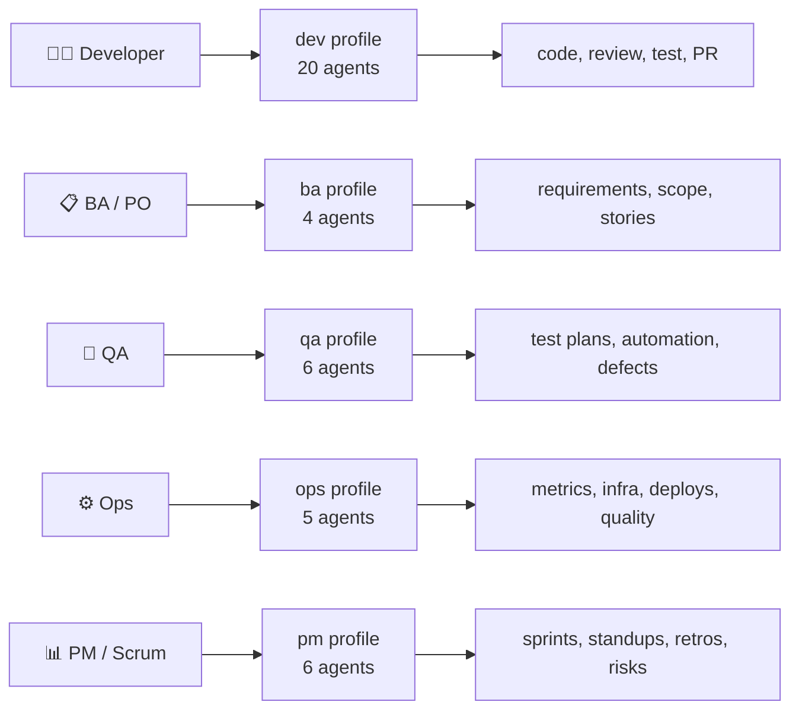
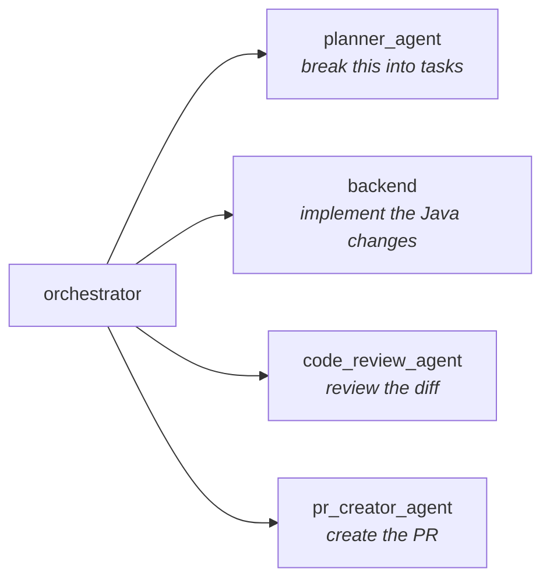
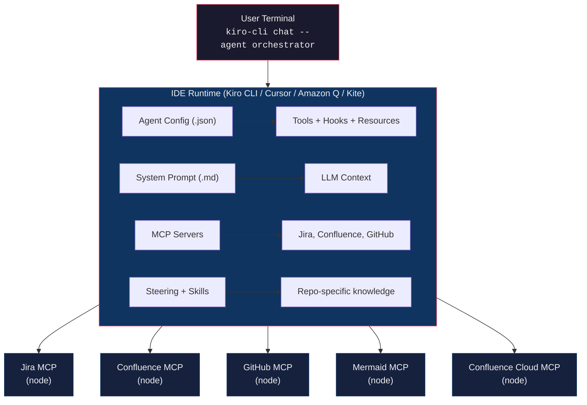
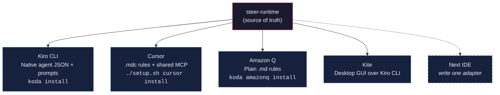

# steer-runtime — Project Overview

A unified LLMOps platform that packages AI-assisted workflows for the entire software delivery lifecycle at Disney Payments.

---

## What is steer-runtime?

steer-runtime is a curated collection of 41 specialized AI agents organized into 5 role-based profiles (dev, BA, QA, ops, PM) deployable to any AI-powered IDE or CLI. Each agent is purpose-built for a specific SDLC task — from writing code to planning sprints — and comes pre-wired with the tools, context, and integrations it needs. Currently supported: [Kiro CLI](https://kiro.dev), [Cursor](https://cursor.com), [Amazon Q Developer](https://aws.amazon.com/q/developer/), and [Kite](https://github.disney.com/SANCR225/Kite).

Instead of one general-purpose AI assistant, steer-runtime gives every team role a set of agents that already understand Disney Payments' repositories, coding standards, Jira workflows, and organizational conventions.



---

## Why steer-runtime?

### The Problem

General-purpose AI assistants lack organizational context. Every conversation starts from zero — the AI doesn't know your repos, your Jira project keys, your coding standards, your sprint cadence, or your deployment pipeline. Teams end up repeating the same context in every prompt, getting inconsistent results, and building no institutional memory.

### The Solution

steer-runtime solves this by encoding organizational knowledge into agent configurations:

- **Context files** inject coding standards, project mappings, and guidelines into every agent session automatically
- **MCP servers** give agents direct access to Jira, Confluence, GitHub, SonarQube, and Harness — no copy-pasting
- **Hooks** enforce guardrails (block writes to protected paths, warn on destructive commands) without relying on the LLM to self-police
- **Steering rules** and **skills** teach agents repository-specific patterns (e.g., "this is a Flutter monorepo with this package structure")
- **Memory banks** persist project knowledge across sessions so agents improve over time

### Key Advantages

| Advantage                        | How                                                                                                  |
|----------------------------------|------------------------------------------------------------------------------------------------------|
| **Zero-setup onboarding**        | `koda install dev` — one command, 19 agents ready                                                    |
| **Role-appropriate tooling**     | A BA agent can't accidentally run `rm -rf`; a dev agent can't skip code review                       |
| **Consistent quality**           | Golden rules, compliance checks, and write guards are enforced by hooks, not hope                    |
| **Institutional memory**         | Context files, steering rules, and knowledge tool persist what the team has learned                  |
| **Multi-repo coordination**      | Orchestrator agents understand which repos map to which Jira prefixes and coordinate across them     |
| **No vendor lock-in on context** | All config is plain JSON + Markdown — portable, version-controlled, reviewable                       |
| **Pre-built integrations**       | MCP servers are bundled as single-file Node.js bundles — no npm install, no Nexus credentials needed |
| **Cross-platform**               | Koda (Go binary, all platforms) + `setup.sh` / `setup.ps1` fallback                                  |
| **Multi-IDE**                    | Kiro CLI (agents) + Cursor IDE (rules) + Kite (desktop GUI) — same source, different runtimes        |

---

## LLMOps Principles

steer-runtime is built on LLMOps practices that treat AI agent configurations as first-class engineering artifacts.

### 1. Agents as Code

Every agent is a versioned JSON config + Markdown prompt stored in Git. Changes go through PRs, code review, and conventional commits — the same workflow as application code.

```
.kiro-dev/agents/backend.json     ← config (tools, hooks, resources, MCP)
.kiro-dev/prompts/backend.md      ← system prompt (personality, constraints)
```

This means agent behavior is auditable, diffable, and rollback-able.

### 2. Separation of Concerns

Each agent has a single responsibility. The orchestrator delegates; specialists execute. This mirrors microservice architecture:



No single agent tries to do everything. This reduces hallucination surface and makes each agent's prompt focused and testable.

### 3. Context Engineering over Prompt Engineering

Rather than crafting elaborate prompts, steer-runtime invests in structured context:

- **`resources`** — files loaded into every session (golden rules, project mappings)
- **`steering`** — numbered rules that shape behavior (00-foundation, 20-repo-backend-java, etc.)
- **`skills`** — reusable knowledge chunks (flutter-provider-pattern, api-contract-compatibility-check)
- **`context`** — profile-specific guidelines (qa_guidelines, pm_guidelines)

The prompt stays simple; the context does the heavy lifting.

### 4. Guardrails as Infrastructure

Safety isn't a suggestion in the prompt — it's enforced by hooks:

| Hook                  | What it prevents                                  |
|-----------------------|---------------------------------------------------|
| `guard-writes.sh`     | Writing to `node_modules/`, `dist/`, `.git/`      |
| `warn-destructive.sh` | Silent `rm -rf`, `DROP TABLE`, `--force`          |
| `git-context.sh`      | Agent starting without knowing the current branch |

Hooks run as shell scripts with exit codes — `exit 2` blocks the action, `exit 0` allows it. The LLM can't override them.

### 5. Progressive Disclosure

Not every team member needs every agent. Profiles are installed independently:

```bash
koda install dev          # Developer gets 19 agents
koda install pm           # Scrum master gets 6 agents
koda install dev ba qa    # Full-stack team gets 29 agents
```

Advanced tools (`thinking`, `todo`, `knowledge`) are opt-in via `koda enable-tools`. Agents degrade gracefully when features aren't enabled.

### 6. Pre-built, Not Just Configured

MCP servers are bundled as single `.cjs` files using esbuild — no `npm install`, no Nexus credentials, no build step. This eliminates the #1 onboarding friction point in enterprise environments where package registries are restricted.

### 7. Observability

- `koda check` validates installation and runs `kiro-cli agent validate` on every config
- `/hooks` command in chat shows active hooks for the current agent
- `kiro-cli mcp list` shows MCP server status per agent
- Memory banks and todo lists persist across sessions for auditability

---

## Architecture at a Glance



### Profile Layout

Each profile is a self-contained directory:

```
.kiro-<profile>/
├── agents/          # Agent JSON configs
├── prompts/         # System prompt markdown files
└── context/         # Profile-specific guidelines
```

Shared resources live in `.kiro/`:

```
.kiro/
├── context/         # Cross-profile context (golden_rules, project_mappings)
├── hooks/           # Reusable hook scripts
├── steering/        # Numbered behavioral rules
├── skills/          # Reusable knowledge chunks
├── memory-bank/     # Project-level persistent memory
└── tools/mcp-servers/  # Pre-built MCP bundles
```

---

## By the Numbers

| Metric                      | Value                                         |
|-----------------------------|-----------------------------------------------|
| Total agents                | 41                                            |
| Profiles                    | 5 (dev, ba, qa, ops, pm)                      |
| MCP servers                 | 5 (jira, confluence, cloud-wiki, github, mermaid) |
| Agents with MCP integration | 22                                            |
| Agents with hooks           | 11                                            |
| Agents with advanced tools  | 11                                            |
| Context files               | 12                                            |
| Cursor rule templates       | 19                                            |
| Steering rules              | 10                                            |
| Skills                      | 16                                            |
| Hook scripts                | 3                                             |
| Supported projects          | 9 (with pre-built memory banks)               |
| Setup commands              | 14 (+ 7 IDE subcommands)                      |

---

## Getting Started

```bash
git clone <repo-url> ~/steer-runtime && cd ~/steer-runtime

koda install dev ba qa ops pm   # Install all profiles
koda mcp-install                # Configure MCP tokens
koda enable-tools               # Enable advanced tools

kiro-cli chat --agent orchestrator    # Start working
```

For detailed setup: [Getting Started](../getting-started/GETTING_STARTED.md)  
For agent reference: [AGENTS.md](https://github.disney.com/SANCR225/steer-runtime/blob/main/AGENTS.md)
For troubleshooting: [Troubleshooting](../reference/TROUBLESHOOTING.md)

---

## Multi-IDE Strategy

steer-runtime is runtime-agnostic. The same organizational knowledge powers both Kiro CLI and Cursor IDE today, with each runtime consuming the source material in its native format.

```
steer-runtime (source of truth)
│
├── Kiro CLI    → 40 agents (JSON + Markdown prompts)
│                 Multi-agent orchestration, hooks, delegation
│
├── Kite        → Desktop GUI for Kiro CLI (Tauri + React)
│                 Visual chat, agent switching, prompt scoring
│
└── Cursor IDE  → 19 rules (.mdc files with glob activation)
                  Single-agent with same standards + MCP tools
```

### How It Works

The `.cursor-templates/` directory contains 19 `.mdc` rule files derived from the same source material as Kiro agents — golden rules, coding standards, project mappings, role guidelines, and guardrails. Each rule uses Cursor's native activation model:

| Range | Category                                                | Activation         |
|-------|---------------------------------------------------------|--------------------|
| 00-09 | Foundation (golden rules, mappings, commits)            | Always on          |
| 10-19 | Language specialists (Java, Node, Angular, Go, Flutter) | File glob patterns |
| 20-29 | Quality (testing, security, architecture)               | Glob or always on  |
| 30-39 | Role guides (BA, QA, Ops, PM)                           | Manual `@` mention |
| 40-49 | Guardrails (write protection, destructive warnings)     | Always on          |
| 50-59 | Workflow (SDLC steps, PR templates, story analysis)     | Manual `@` mention |

MCP servers are shared — both Kiro and Cursor point to the same pre-built bundles in `~/.kiro/tools/mcp-servers/`.

```bash
./setup.sh cursor install ~/my-project   # Install rules + MCP config
./setup.sh cursor sync ~/my-project      # Update from latest templates
```

### Kiro vs Cursor — Complementary Strengths

| Capability                           | Kiro CLI                            | Cursor           |
|--------------------------------------|-------------------------------------|------------------|
| Multi-agent orchestration            | ✅ 40 agents, 5 profiles             | —                |
| Automated SDLC pipeline              | ✅ story → plan → code → review → PR | —                |
| Programmatic hooks                   | ✅ guard-writes, git-context         | —                |
| Persistent memory (knowledge)        | ✅                                   | —                |
| Inline code suggestions              | —                                   | ✅ Tab completion |
| Multi-file Composer                  | —                                   | ✅                |
| Codebase indexing                    | —                                   | ✅ @codebase      |
| Coding standards                     | ✅ via agent prompts                 | ✅ via .mdc rules |
| MCP tools (Jira, Confluence, GitHub) | ✅                                   | ✅                |

The recommendation: use Kiro for complex orchestrated workflows (implement a Jira story end-to-end), Cursor for day-to-day coding with the same standards and MCP access.

See [Cursor Setup](../getting-started/CURSOR_SETUP.md) for detailed installation and usage.



Adding a new IDE target means writing one adapter — the agent definitions, context files, and MCP integrations stay the same. This reinforces the "agents as code" principle: behavior is defined once, version-controlled, and deployed to multiple runtimes without duplication.

---

**Version:** 3.4.0 · **Last Updated:** March 20, 2026  
Internal Disney tool — not for external distribution.
