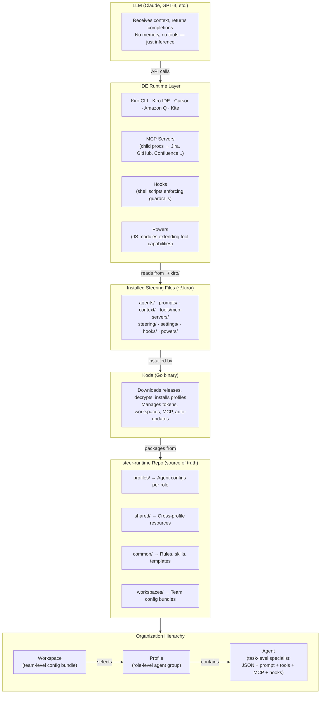
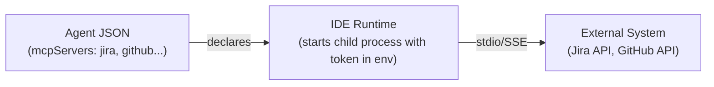

# System Layers & Responsibilities

How the pieces of the steer-runtime ecosystem fit together — from the LLM at the top to the individual agent at the bottom.

---

## Layer Diagram



---

## Layer-by-Layer

### 1. LLM

The large language model that performs inference. This is the actual model — Claude Sonnet, Claude Opus, GPT-4, or whichever model the IDE provider routes to.

| Aspect       | Detail                                                                        |
|--------------|-------------------------------------------------------------------------------|
| Owns         | Inference — turning context + prompt into a completion                        |
| Does not own | Memory, tool execution, file access, secrets, guardrails                      |
| Relationship | Receives everything from the IDE runtime; returns text and tool-call requests |

The LLM is stateless. It has no awareness of steer-runtime, profiles, or agents. Every bit of specialization it exhibits comes from the context the IDE runtime injects before each request.

The specific model is an implementation detail controlled by the IDE provider, not by steer-runtime. Amazon Q routes to models on Bedrock (currently Anthropic Claude), Cursor uses its own model selection, and other IDEs make their own choices. steer-runtime is model-agnostic — the same agent configs, prompts, context, and hooks work identically regardless of which model sits behind the API. If the provider swaps Claude Sonnet for Opus (or a future model entirely), nothing in the layers below needs to change.

---

### 2. IDE Runtime (Kiro CLI, Kiro IDE, Cursor, Amazon Q Developer, Kite)

The application that sits between the developer and the LLM.

| Aspect       | Detail                                                                                                                                           |
|--------------|--------------------------------------------------------------------------------------------------------------------------------------------------|
| Owns         | Agent loading, prompt assembly, tool routing, MCP server lifecycle, hook enforcement, conversation state                                         |
| Does not own | Agent definitions, prompt content, organizational knowledge (those come from installed steering files)                                           |
| Relationship | Reads installed files from `~/.kiro/` (CLI) or `.kiro/` (IDE/project). Sends assembled context to the LLM. Executes tool calls the LLM requests. |

Each IDE consumes the same source material in its native format:

| IDE      | Agent format                           | Rules format          | MCP config                 |
|----------|----------------------------------------|-----------------------|----------------------------|
| Kiro CLI | `agents/*.json` + `prompts/*.md`       | `steering/*.md`       | `mcpServers` in agent JSON |
| Kiro IDE | `.kiro/agents/*.json`                  | `.kiro/steering/*.md` | `.kiro/settings/mcp.json`  |
| Cursor   | `.cursor/agents/*.md`                  | `.cursor/rules/*.mdc` | `.cursor/mcp.json`         |
| Amazon Q | `.amazonq/agents/*.json`               | `.amazonq/rules/*.md` | `~/.aws/amazonq/mcp.json`  |
| Kite     | Same as Kiro CLI (desktop GUI wrapper) | Same as Kiro CLI      | Same as Kiro CLI           |

The runtime is responsible for enforcing hooks (write guards, secret scanning, branch protection). Hooks run as shell scripts with exit codes — the LLM cannot override them.

---

### 3. Installed Steering Files

The compiled, IDE-ready artifacts that the runtime reads at execution time.

| Aspect      | Detail                                                                                                                                                       |
|-------------|--------------------------------------------------------------------------------------------------------------------------------------------------------------|
| Owns        | Nothing — these are output artifacts                                                                                                                         |
| Produced by | Koda (or `setup.sh` as fallback)                                                                                                                             |
| Location    | `~/.kiro/` for CLI-based runtimes, `.kiro/` for project-scoped IDE setups                                                                                    |
| Contents    | Agent JSON configs (with resolved `$HOME` paths and injected tokens), prompt markdown files, context files, MCP server bundles, hook scripts, steering rules |

This layer exists because IDEs need concrete file paths and resolved tokens — they can't read from the steer-runtime source repo directly. Koda compiles the source into this installable form.

Key directories:

```
~/.kiro/
├── agents/          # Agent JSON configs (all installed profiles merged)
├── prompts/         # Agent prompt files
├── context/         # Shared context (golden rules, guidelines)
├── tools/
│   └── mcp-servers/ # Pre-built MCP bundles (Jira, Confluence, GitHub, etc.)
├── hooks/           # Guardrail scripts
├── steering/        # Behavioral rules (numbered, profile-scoped)
├── skills/          # Reusable workflow knowledge
└── settings/        # MCP config, tokens
```

---

### 4. Koda

The distribution and lifecycle management tool. A standalone Go binary.

| Aspect       | Detail                                                                                          |
|--------------|-------------------------------------------------------------------------------------------------|
| Owns         | Installation, updates, token management, workspace application, MCP server setup, health checks |
| Does not own | Agent behavior, prompt content, runtime execution                                               |
| Relationship | Reads from steer-runtime (source or encrypted release). Writes to `~/.kiro/` (installed files). |

Koda's responsibilities:

| Command                       | What it does                                                                                         |
|-------------------------------|------------------------------------------------------------------------------------------------------|
| `koda install <profiles>`     | Copies agents, prompts, context, hooks, MCP bundles to `~/.kiro/`. Resolves `$HOME`, injects tokens. |
| `koda sync`                   | Re-installs from local source or downloads latest encrypted release from github.com                  |
| `koda mcp-install`            | Installs MCP server dependencies, configures tokens interactively                                    |
| `koda workspace apply <team>` | Resolves workspace inheritance, installs merged profiles + rules + context                           |
| `koda doctor`                 | Validates installation, checks agent configs, verifies MCP connectivity                              |
| `koda upgrade`                | Updates the Koda binary itself                                                                       |
| `koda enable-tools`           | Enables advanced tools (thinking, todo, knowledge) in global settings                                |

Koda is the only layer that understands the steer-runtime repo structure. The IDE runtime never reads from steer-runtime directly — it only reads what Koda has installed.

---

### 5. steer-runtime Repository

The source of truth for all agent definitions, organizational knowledge, and tooling.

| Aspect       | Detail                                                                                                                                                       |
|--------------|--------------------------------------------------------------------------------------------------------------------------------------------------------------|
| Owns         | Agent definitions, prompts, context files, steering rules, skills, hook scripts, MCP server source code, workspace configs, IDE templates, release packaging |
| Does not own | Runtime execution, token storage, user-specific configuration                                                                                                |
| Relationship | Consumed by Koda for installation. Released as encrypted tarballs to public github.com. Forked by teams for customization.                                   |

Repository structure:

```
steer-runtime/
├── profiles/           # Agent configs + prompts, organized by role
│   ├── dev-core/       #   18 agents — orchestrator, architecture, review, etc.
│   ├── dev-web/        #   5 agents — backend, webapi, ui, ux, astro
│   ├── dev-mobile/     #   3 agents — flutter, android, ios
│   ├── dev-dotnet/     #   3 agents — senior, self-host-api, serverless
│   ├── dev-php/        #   1 agent
│   ├── dev-python/     #   1 agent
│   ├── dev-infra/      #   1 agent — terraform
│   ├── ba/             #   7 agents — scope, features, PRD, backlog, estimation
│   ├── qa/             #   11 agents — test planning, automation, defects, coverage
│   ├── ops/            #   8 agents — metrics, infra, deploy, releases
│   ├── pm/             #   6 agents — sprints, standups, retros, delivery
│   ├── leadership/     #   5 agents — portfolio, quarterly, cross-team, briefings
│   ├── sustainment/    #   5 agents — incident response, monitoring
│   └── steer-master/   #   5 agents — steer-runtime development
├── shared/             # Cross-profile resources
│   ├── context/        #   Golden rules, guidelines per profile
│   ├── hooks/          #   Write guard, secret scan, branch guard, lint-on-write
│   ├── tools/          #   MCP server source (Jira, Confluence, GitHub, etc.)
│   └── settings/       #   Default MCP config templates
├── common/             # Reusable content (not profile-specific)
│   ├── rules/          #   16 tech stack rules (Java, Node, Go, C#, K8s, AWS, etc.)
│   ├── skills/         #   7 workflow skills (implement-ticket, ship-it, etc.)
│   ├── templates/      #   project.yaml, spec templates
│   ├── schemas/        #   JSON schemas for validation
│   └── agents/         #   Shared agents (quality_gate_agent)
├── workspaces/         # Team configuration bundles
├── .cursor-templates/  # Cursor IDE rule templates
├── .amazonq-templates/ # Amazon Q rule templates
└── Makefile            # Release packaging (encrypt + publish)
```

The release flow:

```
steer-runtime repo (GHE)
    │
    │  make release TAG=v3.7.0
    ▼
Encrypted tarball → github.com (public)
    │
    │  koda sync --update
    ▼
~/.kiro/ (installed files)
    │
    │  IDE reads at runtime
    ▼
Agent behavior in conversation
```

---

### 6. Workspace

A team-level configuration bundle within steer-runtime.

| Aspect       | Detail                                                                                                     |
|--------------|------------------------------------------------------------------------------------------------------------|
| Owns         | Which profiles a team uses, team-specific rules, team-specific context, project repo mappings, Jira prefix |
| Does not own | Profile definitions, agent behavior, MCP server code                                                       |
| Relationship | Lives in `workspaces/<team>/` inside steer-runtime. Applied by Koda via `koda workspace apply`.            |

Workspaces support hierarchical inheritance — a parent workspace defines the shared foundation, child workspaces extend it:

```
opsheet-team (parent)              → profiles: [dev-core, qa, ba]
  ├─ opsheet-vas-team              → inherits + [dev-web, ops]
  └─ opsheet-flutter-team          → inherits + [dev-mobile]
```

A `workspace.json` declares:
- `profiles` — which role profiles to install
- `rules` — which common rules to apply
- `projects` — repos to clone and initialize with memory banks
- `extends` — parent workspace for inheritance
- `jira_prefix` — team's Jira project key

Workspaces are the answer to "how does a new team member get set up?" — one command installs everything the team needs.

---

### 7. Profile

A role-scoped group of agents that share a common purpose.

| Aspect       | Detail                                                                                                 |
|--------------|--------------------------------------------------------------------------------------------------------|
| Owns         | A set of agents, their prompts, profile-specific context, and steering rules                           |
| Does not own | Cross-profile resources, MCP server code, workspace config                                             |
| Relationship | Lives in `profiles/<name>/` in steer-runtime. Installed to `~/.kiro/` by Koda. Selected by workspaces. |

Each profile is a self-contained directory:

```
profiles/<name>/
├── agents/      # Agent JSON configs
├── prompts/     # Agent system prompts (markdown)
├── context/     # Profile-specific context files
├── steering/    # Profile-specific behavioral rules
├── powers/      # Custom tools (dev-core only)
└── tools/       # Utility scripts
```

Profiles are additive — installing multiple profiles merges their agents into `~/.kiro/agents/`. Agent names are unique across profiles, so there are no conflicts.

Available profiles:

| Profile      | Agents | Audience                                                       |
|--------------|:------:|----------------------------------------------------------------|
| dev-core     |   18   | All developers (orchestrator, review, test, security, PRs)     |
| dev-web      |   5    | Web developers (Java backend, Node API, Angular UI, Astro, UX) |
| dev-mobile   |   3    | Mobile developers (Flutter, Android, iOS)                      |
| dev-dotnet   |   3    | .NET developers                                                |
| dev-php      |   1    | PHP developers                                                 |
| dev-python   |   1    | Python developers                                              |
| dev-infra    |   1    | Infrastructure (Terraform)                                     |
| ba           |   7    | Business Analysts / Product Owners                             |
| qa           |   11   | QA Engineers                                                   |
| ops          |   8    | Operations / SRE                                               |
| pm           |   6    | Project Managers / Scrum Masters                               |
| leadership   |   5    | Tech Directors / Delivery Managers                             |
| sustainment  |   5    | L3 Support / Incident Response                                 |
| steer-master |   5    | steer-runtime contributors                                     |

The `dev` alias installs `dev-core` + `dev-web` + `dev-mobile` together.

---

### 8. Agent

The atomic unit of the system. A single-purpose AI persona with defined tools, context, and constraints.

| Aspect       | Detail                                                                                                                                           |
|--------------|--------------------------------------------------------------------------------------------------------------------------------------------------|
| Owns         | One specific SDLC task (e.g., code review, test planning, PR creation)                                                                           |
| Does not own | Orchestration across tasks (that's the orchestrator agent's job), runtime execution                                                              |
| Relationship | Defined by a JSON config + markdown prompt in a profile. Loaded by the IDE runtime. Receives context and tools; returns completions via the LLM. |

An agent consists of two files:

**JSON config** (`profiles/<profile>/agents/<name>.json`):
```json
{
  "name": "code_review_agent",
  "description": "Reviews code changes for quality, security, and standards",
  "prompt": "code_review_agent.md",
  "tools": ["@jira/*", "@github/*", "fs_read", "grep", "code"],
  "mcpServers": { "jira": { ... }, "github": { ... } },
  "resources": ["file://.kiro/context/golden_rules.md"],
  "hooks": { ... }
}
```

**Markdown prompt** (`profiles/<profile>/prompts/<name>.md`):
- Identity and role definition
- Available tools and when to use them
- Workflow steps
- Output format expectations
- Rules and constraints

The JSON config determines what the agent *can* do (tools, MCP access, file permissions). The prompt determines what the agent *should* do (behavior, workflow, quality standards). Hooks determine what the agent *must not* do (write guards, secret scanning).

---

### 9. MCP Servers

The integration bridge between agents and external systems.

| Aspect       | Detail                                                                                                                                                                                                                                       |
|--------------|----------------------------------------------------------------------------------------------------------------------------------------------------------------------------------------------------------------------------------------------|
| Owns         | Protocol translation — exposing Jira, Confluence, GitHub, SonarQube, Harness, Compass, etc. as tool calls the LLM can invoke                                                                                                                 |
| Does not own | Business logic, agent behavior, token storage (tokens come from Koda/env)                                                                                                                                                                    |
| Relationship | Source code lives in `shared/tools/mcp-servers/` in steer-runtime. Bundled as single `.cjs` files via esbuild. Installed to `~/.kiro/tools/mcp-servers/` by Koda. Started as child processes by the IDE runtime when an agent declares them. |

MCP servers have their own build pipeline (`make mcp-build`), their own source code (TypeScript/Node.js), and their own token management. They're not just "part of the agent" — an agent *declares* which MCP servers it needs, and the runtime *manages* their lifecycle.

Available servers:

| Server              | External system                      | Token                   |
|---------------------|--------------------------------------|-------------------------|
| jira-mcp            | Jira (multi-instance)                | `JIRA_PAT_{name}`       |
| confluence-mcp      | Confluence / Confluence Cloud (multi-instance) | `CONFLUENCE_PAT_{name}` |
| github-mcp          | GitHub Enterprise (multi-instance)   | `GITHUB_TOKEN_{name}`   |
| bruno-mcp           | API testing via Bruno collections    | None                    |
| mermaid-diagram-mcp | Diagram generation                   | None                    |
| figma-mcp           | Figma design files                   | Figma API token         |
| compass-mcp         | Service catalog (SSE)                | Compass token           |

Key design decisions:
- Bundled as single `.cjs` files — no `npm install` needed at the consumer side, eliminating enterprise registry friction
- Confluence Cloud reuses the confluence-mcp binary with a different `CONFLUENCE_URL` env var — no code duplication
- Multi-instance support — the same server type can run multiple times with different tokens (e.g., disneyexperiences.atlassian.net and jira.disney.com)
- Token priority: agent JSON `env` block > MCP server `.env` file (dotenv doesn't override existing env vars)



---

### 10. Hooks

The enforcement layer that constrains agent actions independently of the LLM.

| Aspect       | Detail                                                                                                                                                                                           |
|--------------|--------------------------------------------------------------------------------------------------------------------------------------------------------------------------------------------------|
| Owns         | Guardrails — blocking, warning, or allowing tool executions based on rules the LLM cannot override                                                                                               |
| Does not own | Agent behavior, tool implementation, prompt content                                                                                                                                              |
| Relationship | Authored in `shared/hooks/` in steer-runtime. Installed to `~/.kiro/hooks/` by Koda. Wired to agents via the `hooks` key in agent JSON configs. Executed by the IDE runtime at lifecycle events. |

Hooks are shell scripts (`.sh` + `.ps1` for cross-platform) that run at specific agent lifecycle events. They receive context as JSON on stdin and communicate via exit codes:

| Exit code | Behavior                                          |
|:---------:|---------------------------------------------------|
|    `0`    | Allow — action proceeds                           |
|    `2`    | Block — action is rejected, stderr shown to agent |
|   Other   | Allow — hook output shown as warning              |

The LLM cannot override a hook. If `guard-writes.sh` returns exit code 2, the file write is blocked regardless of what the agent wants to do. This makes hooks the only layer in the system that provides hard guarantees about agent behavior.

Available hooks:

| Hook                        | Event                      | Purpose                                            | Used by               |
|-----------------------------|----------------------------|----------------------------------------------------|-----------------------|
| `git-context.sh`            | agentSpawn                 | Injects branch + dirty file count on start         | 5 orchestrators       |
| `guard-writes.sh`           | preToolUse (fs_write)      | Blocks writes to `node_modules/`, `dist/`, `.git/` | 6 write agents        |
| `secret-scan.sh`            | preToolUse (fs_write)      | Scans for hardcoded secrets before writing         | 6 write agents        |
| `branch-guard.sh`           | preToolUse (execute_bash)  | Blocks direct commits/pushes to `main`/`master`    | 5 orchestrators       |
| `warn-destructive.sh`       | postToolUse (execute_bash) | Warns on `rm -rf`, `DROP TABLE`, `--force`         | dev-core orchestrator |
| `lint-on-write.sh`          | postToolUse (fs_write)     | Auto-runs linter/formatter after file writes       | 6 write agents        |
| `check-cross-references.sh` | postToolUse (fs_write)     | Validates cross-file references                    | Write agents          |
| `validate-agent-json.sh`    | postToolUse (fs_write)     | Validates agent JSON schema on write               | Write agents          |
| `agent-registry.sh`         | postToolUse (fs_write)     | Updates agent registry after config changes        | Write agents          |

Hooks are wired in agent JSON configs:

```json
{
  "hooks": {
    "preToolUse": [
      { "matcher": "fs_write", "command": "$HOME/.kiro/hooks/guard-writes.sh" }
    ],
    "postToolUse": [
      { "matcher": "fs_write", "command": "$HOME/.kiro/hooks/lint-on-write.sh" }
    ],
    "agentSpawn": [
      { "command": "$HOME/.kiro/hooks/git-context.sh" }
    ]
  }
}
```

---

### 11. Powers

Custom tool extensions that give agents capabilities beyond the built-in tool set.

| Aspect       | Detail                                                                                                                                                                                                                                              |
|--------------|-----------------------------------------------------------------------------------------------------------------------------------------------------------------------------------------------------------------------------------------------------|
| Owns         | Domain-specific tooling — git operations, code analysis, file operations, test execution, dependency checking, API doc extraction                                                                                                                   |
| Does not own | Agent behavior, prompt content, guardrails                                                                                                                                                                                                          |
| Relationship | Authored in `profiles/dev-core/powers/` in steer-runtime. Each power is a directory with `power.json` (tool definitions) + `index.js` (implementation). Loaded by a `loader.js` module. Wired to agents via the `powers` key in agent JSON configs. |

Powers are different from MCP servers — they're lightweight JavaScript modules that run in-process rather than as separate child processes. They don't need tokens or network access (though they can shell out to git, npm, etc.). They're also different from hooks — powers *add* capabilities, hooks *constrain* them.

Available powers:

| Power            | Tools                                             | Purpose                                     |
|------------------|---------------------------------------------------|---------------------------------------------|
| git-ops          | `git_status`, `git_diff`, `git_log`               | Git operations for development workflows    |
| code-analysis    | `find_files`, `search_code`, `count_lines`        | Code search and analysis                    |
| file-ops         | `backup_file`, `compare_files`, `find_duplicates` | Advanced file operations                    |
| test-runner      | `run_tests`, `find_tests`, `test_coverage`        | Test execution and discovery                |
| dependency-check | `check_outdated`, `check_vulnerabilities`         | Dependency health analysis                  |
| api-docs         | `extract_openapi`, `validate_contract`            | API documentation extraction and validation |

Power structure:

```
profiles/dev-core/powers/
├── loader.js              # Discovers and loads all powers
├── git-ops/
│   ├── power.json         # Tool definitions (name, description, parameters)
│   └── index.js           # Async function implementations
├── code-analysis/
│   ├── power.json
│   └── index.js
├── file-ops/
│   ├── power.json
│   └── index.js
└── ...
```

Wired to agents via JSON config:

```json
{
  "powers": ["git-ops", "code-analysis", "test-runner"]
}
```

---

## How the Layers Interact

A typical interaction flows through every layer:

```
Developer types: "Implement DPAY-14561"
         │
         ▼
    IDE Runtime (Kiro CLI)
         │  1. Loads ~/.kiro/agents/orchestrator.json
         │  2. Reads prompt from ~/.kiro/prompts/orchestrator.md
         │  3. Loads context from ~/.kiro/context/golden_rules.md
         │  4. Starts MCP servers (Jira, GitHub) as child processes
         │  5. Loads powers (git-ops, code-analysis) via loader.js
         │  6. Assembles full prompt: system prompt + context + user message
         │
         ▼
    LLM (e.g., Claude Sonnet via Amazon Bedrock)
         │  7. Returns: "I'll fetch the Jira story first"
         │     + tool call: @jira/get_issue { key: "DPAY-14561" }
         │
         ▼
    IDE Runtime
         │  8. Routes tool call to Jira MCP server (child process)
         │
         ▼
    MCP Server (jira-mcp)
         │  9. Translates to Jira REST API call, returns issue data
         │
         ▼
    IDE Runtime → LLM
         │  10. LLM analyzes story, plans implementation
         │  11. Returns: tool call: fs_write { path: "src/..." }
         │
         ▼
    Hooks (preToolUse)
         │  12. guard-writes.sh → checks path is not in node_modules/dist/.git → exit 0 (allow)
         │  13. secret-scan.sh → checks content for hardcoded secrets → exit 0 (allow)
         │
         ▼
    IDE Runtime
         │  14. Writes file to disk
         │
         ▼
    Hooks (postToolUse)
         │  15. lint-on-write.sh → auto-formats the written file
         │
         ▼
    IDE Runtime → LLM
         │  16. Returns result, LLM continues workflow
         │  17. LLM calls git_status (power) to check working tree
         │
         ▼
    Powers (git-ops)
         │  18. Runs git status, returns branch + changed files
         │
         ▼
    ... (continues until workflow completes)
```

The key insight: the LLM never touches the filesystem, Jira, or GitHub directly. Every action goes through the IDE runtime, which enforces hooks and manages tool execution. The agent's behavior is shaped by the prompt and context that Koda installed from steer-runtime.

---

## Ownership Summary

| Layer           | What it owns                                                                      | What it doesn't own                               |
|-----------------|-----------------------------------------------------------------------------------|---------------------------------------------------|
| LLM             | Inference (text generation)                                                       | Memory, tools, files, secrets, guardrails         |
| IDE Runtime     | Agent loading, tool routing, hook enforcement, MCP lifecycle, power loading       | Agent definitions, organizational knowledge       |
| MCP Servers     | Protocol translation to external systems (Jira, GitHub, Confluence, etc.)         | Business logic, agent behavior, token storage     |
| Hooks           | Guardrails — blocking/warning/allowing tool executions via exit codes             | Agent behavior, tool implementation               |
| Powers          | Domain-specific tool extensions (git, code analysis, testing, file ops)           | Agent behavior, guardrails, external integrations |
| Installed Files | Nothing (output artifacts)                                                        | —                                                 |
| Koda            | Installation, updates, tokens, workspace resolution                               | Agent behavior, runtime execution                 |
| steer-runtime   | All source definitions (agents, prompts, context, hooks, MCP, powers, workspaces) | Runtime execution, user tokens                    |
| Workspace       | Team-level profile selection, team context, project mappings                      | Profile definitions, agent behavior               |
| Profile         | Role-scoped agent group, profile context, steering rules                          | Cross-profile resources, MCP code                 |
| Agent           | One SDLC task, its tools, its constraints                                         | Orchestration, other agents' tasks                |

---

## See also

- [Architecture](ARCHITECTURE.md) — repository structure, data flows, agent configuration anatomy, MCP server architecture, and key design decisions
