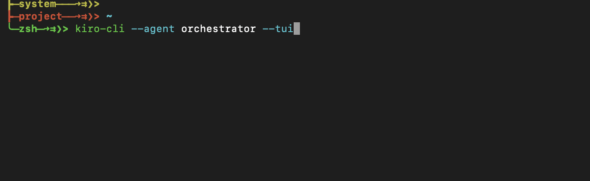
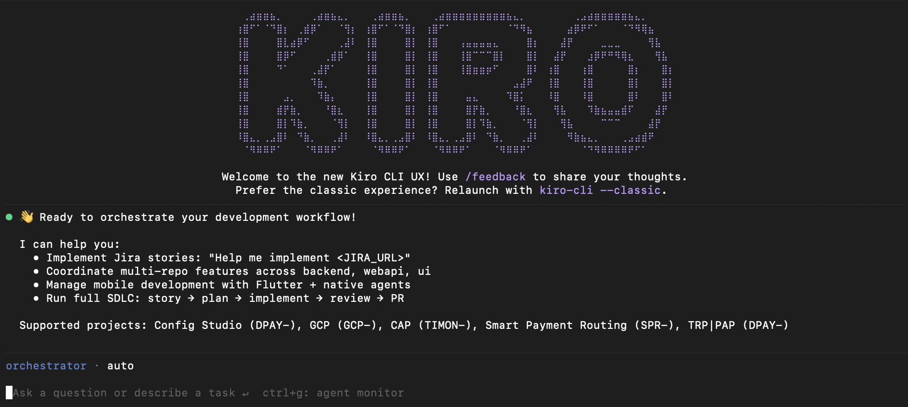
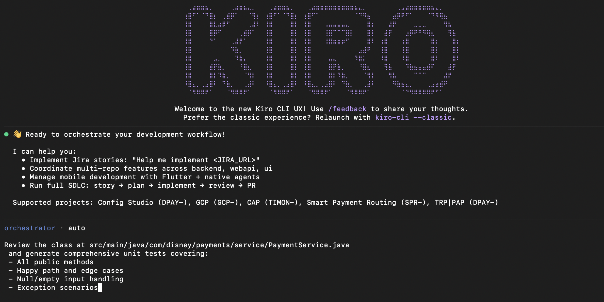

# Developer Quick Start Guide

Practical prompts for everyday dev tasks using the orchestrator agent. Copy, adapt, and use.

---

## Prerequisites

```bash
koda install dev          # Install dev agents
koda mcp-install          # Setup MCP servers + tokens
```

### Step 1 — Launch Kiro

Open Kiro IDE or invoke it from the command line:



### Step 2 — Wait for the agent to be ready

Kiro will load the orchestrator agent and show a welcome message:



### Step 3 — Send your prompt

Type or paste any of the prompts below and hit Enter:



You can also use the CLI directly:
```bash
kiro-cli chat --agent orchestrator
```

---

## 0. Project Initialization

Before diving into any task, orient the orchestrator to your project. This is the first prompt you should send in any new session — it gives the agent the context it needs to make accurate decisions.

### Initialize a project you'll be working on

```
Let's start working on wdpr-config-services located at ~/Workspace/Disney/wdpr-config-services.
Review the existing implementation — tech stack, project structure, key patterns, and dependencies.
Summarize what you find so we have a shared understanding before making changes.
```

### Initialize with a specific focus area

```
Let's start working on wdpr-payment-controls-api at ~/Workspace/Disney/wdpr-payment-controls-api.
I'll be working on the cart endpoints today. Review:
- The existing cart controller and service layer
- Current test coverage for cart operations
- Any related middleware or validation logic

Summarize the current state so I know where to start.
```

### Initialize from a Jira ticket

```
Let's start working on DPAY-1234.
Fetch the ticket details, identify which repo and files are affected,
then review the current implementation in those areas.
Give me a summary of what exists and what needs to change.
```

> **Why this matters:** The orchestrator delegates to specialized agents (backend, webapi, ui). When you establish the project context upfront, every subsequent prompt — tests, reviews, PRs — targets the right codebase without you repeating paths and tech stack details.

---

## 1. Unit Test Generation

### Generate tests for an existing class

```
Review the class at src/main/java/com/disney/payments/service/PaymentService.java
and generate comprehensive unit tests covering:
- All public methods
- Happy path and edge cases
- Null/empty input handling
- Exception scenarios

Use JUnit 5 + Mockito. Follow the existing test patterns in src/test/.
Mock all external dependencies (repositories, clients, mappers).
```

### Generate tests for a specific method

```
Write unit tests for the `processRefund` method in RefundService.java.
Cover:
- Successful refund (full and partial)
- Refund exceeding original amount
- Refund on already-refunded transaction
- External payment gateway timeout
- Concurrent refund attempts

Include @DisplayName annotations describing each scenario.
```

### Increase coverage for a module

```
Analyze test coverage gaps in the payments-core module.
Compare src/main/java and src/test/java to find untested classes.
Generate tests for the top 5 classes with lowest coverage,
prioritizing business logic over DTOs/mappers.
```

---

## 2. Code Review + PR Creation

### Review changes before committing

```
Review all uncommitted changes in this repository.
For each modified file, check:
- Correctness: logic errors, off-by-one, null safety
- Security: injection, auth bypass, sensitive data exposure
- Performance: N+1 queries, unnecessary allocations, missing indexes
- Style: naming conventions, dead code, TODO comments

Summarize findings as a table: file | severity | issue | suggestion.
```

### Review and create a PR

```
Review the changes on the current branch compared to main.
Then create a pull request with:
- Title following conventional commits (feat/fix/refactor)
- Description summarizing what changed and why
- Testing notes for reviewers
- Link to the Jira ticket if found in branch name or commits

Flag any issues that should be fixed before merge.
```

### Review a PR by URL

```
Review this PR: https://github.disney.com/SANCR225/payment-service/pull/42

Focus on:
- Breaking changes to existing APIs
- Missing error handling
- Test coverage for new code
- Database migration safety

Summarize your findings and post review comments on the PR.
```

---

## 3. Implementation Planning from Jira

### Create an implementation plan from a Jira ticket

```
Review Jira ticket OPS-2847 and create a detailed implementation plan.
Include:
- Summary of requirements and acceptance criteria
- Affected components and repositories
- Step-by-step implementation tasks with estimated complexity
- Dependencies between tasks
- Risk areas and edge cases to watch for
- Testing strategy (unit, integration, e2e)
- Suggested PR breakdown (one PR per component vs single PR)
```

### Analyze a Jira epic and break it into stories

```
Analyze Jira epic OPS-2500 and its child stories.
For each story:
- Assess technical feasibility
- Identify cross-team dependencies
- Flag stories that need design decisions before implementation
- Suggest implementation order based on dependencies

Create a summary table: story | complexity | dependencies | suggested sprint
```

---

## 4. Code Explanation + JavaDoc Generation

### Explain a complex class

```
Explain the architecture and flow of PaymentOrchestrator.java.
Cover:
- What problem it solves
- Key design patterns used
- How it interacts with other services
- The state machine / workflow it implements
- Any non-obvious design decisions

Write it as if onboarding a new team member.
```

### Generate JavaDoc for a package

```
Generate JavaDoc comments for all public classes and methods in
the com.disney.payments.gateway package. Include:
- Class-level: purpose, usage example, thread safety notes
- Method-level: @param, @return, @throws with meaningful descriptions
- Link related classes with {@link}

Follow the existing JavaDoc style in the codebase.
Don't modify any logic — only add documentation.
```

### Explain and document a complex method

```
The method `reconcileTransactions` in SettlementService.java is
undocumented and hard to follow. Please:
1. Explain what it does step by step
2. Add inline comments for non-obvious logic
3. Add a JavaDoc comment with @param, @return, @throws
4. Suggest any refactoring to improve readability (but don't apply yet)
```

---

## 5. Bonus: Combined Workflows

### Full feature implementation

```
I need to implement JIRA story OPS-1234: "Add retry logic to payment gateway calls."

1. Analyze the current gateway integration code
2. Propose an implementation plan (retry strategy, backoff, circuit breaker)
3. Implement the changes
4. Generate unit tests for the new retry logic
5. Update JavaDoc for modified classes
6. Create a PR with all changes
```

### Bug investigation + fix

```
We're seeing intermittent NullPointerException in PaymentCallback.handleResponse().
Stack trace: [paste stack trace]

1. Trace the code path that leads to this NPE
2. Identify the root cause
3. Propose a fix
4. Write a regression test that reproduces the bug
5. Apply the fix and create a PR
```

---

## Tips

### Execution modes

The orchestrator supports two modes for task execution:

```
Implement DPAY-1234 in review mode      # pause after each specialist — review diff, approve/revert
Implement DPAY-1234 in autopilot mode   # run all tasks, only stop at plan + quality gates
Implement DPAY-1234                      # defaults to review mode
```

Switch mid-session: `Switch to autopilot` or `Switch to review mode`

- **Be specific about file paths** — the orchestrator delegates to specialized agents who need exact locations
- **Mention the tech stack** — "JUnit 5 + Mockito" or "Jest + supertest" helps agents pick the right patterns
- **Reference existing patterns** — "follow the style in src/test/" avoids style mismatches
- **One task per prompt works best** — "generate tests" then "create PR" rather than everything at once
- **Use `@agent` mentions** in kiro-cli chat to target specific agents: `@backend`, `@webapi`, `@ui`

---

Back to [Getting Started](GETTING_STARTED.md) · [PROMPT_GUIDE.md](../profiles/dev/PROMPT_GUIDE.md) · [README](../index.md)
