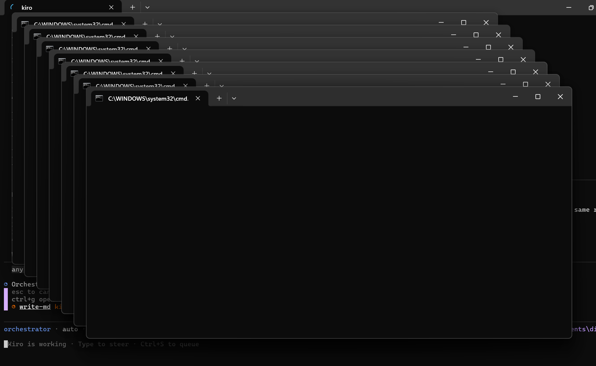

# Windows: kiro-cli 2.9.0 — Multiple Console Windows Issue

## Problem

When using kiro-cli **v2.9.0** on Windows, multiple `C:\windows\system32\cmd.exe` windows open every time an agent uses tools or delegates to other agents. This makes the experience unusable.



## Root Cause

kiro-cli v2.9.0 spawns MCP server child processes without the `CREATE_NO_WINDOW` flag on Windows. Each tool call launches a Node.js process that allocates a visible console window.

## Affected Versions

- **kiro-cli 2.9.0** — broken
- **kiro-cli 2.8.0** — works correctly

## Workaround

### Step 1: Uninstall kiro-cli 2.9.0

1. Open **Windows Settings** → **Apps** → **Add or Remove Programs**
2. Search for "Kiro CLI"
3. Click **Uninstall**

### Step 2: Update Koda

```bash
koda upgrade
```

### Step 3: Install kiro-cli 2.8.0

```bash
koda kiro-cli install 2.8.0
```

### Step 4: Verify

```bash
koda doctor
```

You should see:

```text
✓ kiro-cli         kiro-cli 2.8.0 (C:\Users\<user>\AppData\Local\Kiro-Cli\kiro-cli.exe)
```

## Status

- **Reported to kiro-cli team** — pending fix in a future release
- **Koda-side mitigation** — `windowsHide: true` field added to `mcp.json` (requires kiro-cli to respect it)
- **Recommended** — stay on v2.8.0 until a patched 2.9.x is released

## Prevention

Do not upgrade kiro-cli to 2.9.0 on Windows until this issue is resolved. If `koda upgrade` installs 2.9.0, downgrade immediately:

```bash
koda kiro-cli install 2.8.0
```
