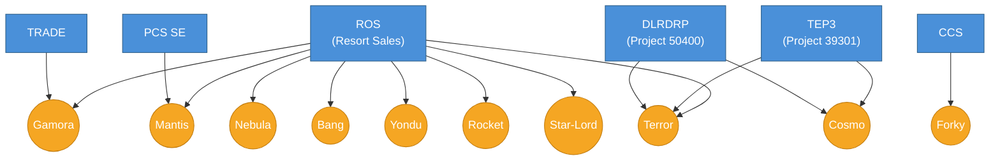

# Lodging Sales Distribution — Project/Studio Map

**Legend:** Blue = Jira Project prefix, Orange = Studio

## Studios & Boards

| Studio | Jira Prefix | Board ID | Board Name |
|--------|-------------|----------|------------|
| Gamora | ROS | 6349 | ROS - Gamora \| Ruth |
| Gamora | TRADE | 6349 | ROS - Gamora \| Ruth |
| Nebula | ROS | 7787 | ROS - Nebula \| Ruth |
| Cosmo | TEP3 | 10729 | YMP \| Cosmo |
| Cosmo | DLRDRP | 10729 | YMP \| Cosmo |
| Mantis | ROS | 8568 | ROS - Mantis \| Ruth |
| Mantis | PCSSE | 8568 | ROS - Mantis \| Ruth |
| Terror | ROS | 12044 | LSWM \| ROS \| Terror \| Projects |
| Terror | TEP3 | 12371 | YMP \| Terror |
| Terror | DLRDRP | 12371 | YMP \| Terror |
| Bang | ROS | 10706 | ROS \| Bang - LSWM |
| Yondu | ROS | 12887 | YMP \| Yondu |
| Rocket | ROS | 10320 | Studio Rocket - Sprints |
| Star-Lord | ROS | 10955 | Studio Star Lord - Vegetables Sprints |
| Forky | CCS | 12334 | CCS Delivery |

## Multi-Project Studios

| Studio | Projects | Boards |
|--------|----------|--------|
| Terror | ROS, TEP3, DLRDRP | 12044, 12371 |
| Cosmo | TEP3, DLRDRP | 10729 |
| Gamora | ROS, TRADE | 6349 |
| Mantis | ROS, PCSSE | 8568 |

## Notes

- Terror spans three Jira projects; DLRDRP shares board 12371 with TEP3
- Cosmo spans TEP3 and DLRDRP sharing board 10729; uses Team field (not Studio)
- Mantis spans ROS and PCS SE, both use same Studio field value
- Gamora spans ROS and TRADE with different Studio prefixes per project
- Bang and Star-Lord boards filter by LSWM label
