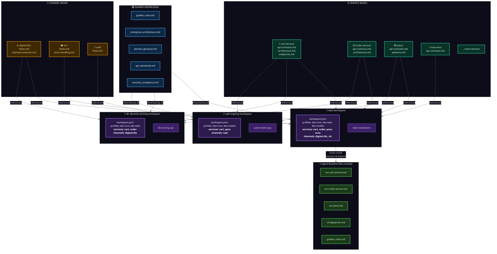
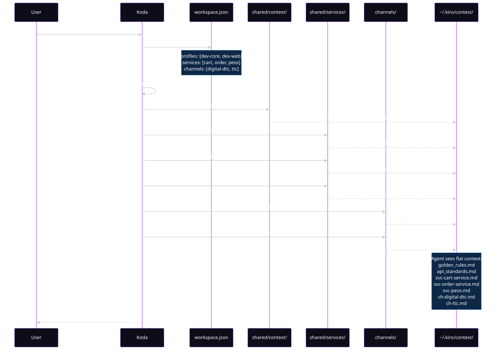

# Enterprise Memory Bank — Before & After

## Before: Current Architecture

Each workspace is self-contained. Projects duplicate service knowledge in their own memory banks. No shared service or channel context.

```mermaid
%%{init: {'theme': 'base', 'themeVariables': {'primaryColor': '#2d1b4e', 'primaryTextColor': '#e0d0ff', 'primaryBorderColor': '#7c5caa', 'lineColor': '#7c5caa', 'secondaryColor': '#1a1030', 'tertiaryColor': '#0d0d1a', 'fontFamily': 'Segoe UI, Arial', 'fontSize': '14px'}}}%%

graph TD
    classDef shared fill:#0d2847,stroke:#4ea8de,color:#fff,stroke-width:2px
    classDef workspace fill:#2d1b4e,stroke:#b56eff,color:#fff,stroke-width:2px
    classDef project fill:#3b2069,stroke:#b56eff,color:#e0d0ff,stroke-width:1px
    classDef memory fill:#1a1030,stroke:#7c5caa,color:#c0b0e0,stroke-width:1px,stroke-dasharray:4
    classDef problem fill:#3d0000,stroke:#ff4444,color:#ff6b6b,stroke-width:2px,stroke-dasharray:4

    SHARED["📚 shared/context/<br/>golden_rules.md<br/>project_mappings.md"]:::shared

    subgraph WS_PC["🏢 payments-core workspace"]
        direction TB
        PC_CFG["workspace.json<br/>profiles: dev-core, dev-web, qa, ops"]:::workspace
        subgraph PC_PROJECTS["Projects"]
            direction LR
            P1["wdpr-config-services"]:::project
            P2["wdpr-payment-controls-api"]:::project
            P3["wdpr-payment-controls-client"]:::project
        end
        P1_MB["memory-bank/<br/>tech.md, product.md<br/>guidelines.md, structure.md"]:::memory
        P2_MB["memory-bank/<br/>tech.md, product.md<br/>guidelines.md, structure.md"]:::memory
        P3_MB["memory-bank/<br/>tech.md, product.md<br/>guidelines.md, structure.md"]:::memory
    end

    subgraph WS_DTA["🏢 dta-team workspace"]
        direction TB
        DTA_CFG["workspace.json<br/>profiles: dev-core, dev-web"]:::workspace
        DTA_P1["cart-service-java8"]:::project
        DTA_MB["memory-bank/<br/>tech.md, product.md"]:::memory
    end

    subgraph WS_UAD["🏢 uad-ongoing workspace"]
        direction TB
        UAD_CFG["workspace.json<br/>profiles: dev-core, dev-web"]:::workspace
        UAD_P1["uad-project"]:::project
        UAD_MB["memory-bank/<br/>tech.md, product.md"]:::memory
    end

    SHARED -->|"inherited by all"| WS_PC
    SHARED -->|"inherited by all"| WS_DTA
    SHARED -->|"inherited by all"| WS_UAD

    P1 --- P1_MB
    P2 --- P2_MB
    P3 --- P3_MB
    DTA_P1 --- DTA_MB
    UAD_P1 --- UAD_MB

    DUP1["⚠️ Cart Service API docs<br/>duplicated in each project<br/>that uses it"]:::problem
    DUP2["⚠️ Channel flow docs<br/>duplicated per project"]:::problem
    DUP3["⚠️ No enterprise architecture<br/>glossary, or API standards"]:::problem

    P1_MB -.-> DUP1
    DTA_MB -.-> DUP1
    P2_MB -.-> DUP2
    UAD_MB -.-> DUP2
    SHARED -.-> DUP3
```

### Problems with current model

| # | Problem                                                      | Impact                                                                                  |
|---|--------------------------------------------------------------|-----------------------------------------------------------------------------------------|
| 1 | **Service knowledge duplicated** across project memory banks | Cart Service API docs exist in 3+ places, drift over time                               |
| 2 | **No channel context**                                       | Each project re-documents DTC/TTC/UAD flows independently                               |
| 3 | **Shared knowledge is thin**                                 | Only golden_rules.md and project_mappings.md — no architecture, glossary, API standards |
| 4 | **No cross-project references**                              | Projects can't declare "I depend on Cart Service" — they copy-paste                     |

---

## After: Enterprise Memory Bank

Shared service and channel banks are the single source of truth. Workspaces declare which services and channels they need. `koda install` resolves references and flattens context for agents.

> **Color Legend:**
> 🔵 Blue = Shared Knowledge (read-only foundation) ·
> 🟢 Teal = Service Banks (backend services) ·
> 🟠 Amber = Channel Banks (sales channels) ·
> 🟣 Purple = Workspaces (team-owned) ·
> 🟩 Green = Agent Runtime (flat output)

### What changes

| # | Before                               | After                                                                   |
|---|--------------------------------------|-------------------------------------------------------------------------|
| 1 | Cart Service docs in 3+ memory banks | **One** `shared/services/cart-service/` — all projects reference it     |
| 2 | No channel context                   | `channels/digital-dtc/`, `channels/ttc/` etc. — referenced by workspace |
| 3 | Thin shared knowledge                | Enterprise architecture, glossary, API standards, security docs         |
| 4 | Copy-paste between projects          | `services: [cart-service]` in workspace.json — `koda install` resolves  |
| 5 | Agents see nested dirs               | Agents see **flat** `~/.kiro/context/` with merged files                |

---

## Data Flow: How `koda workspace apply tep3` works

