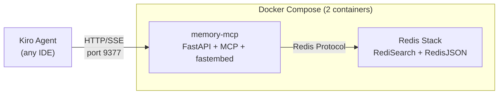

# Memory MCP

Persistent semantic memory for AI agents, powered by Redis vector search.

## What It Is

memory-mcp is an MCP server that gives agents long-term memory across sessions. Unlike file-based memory banks, it uses vector embeddings to enable semantic search — agents can find relevant past observations even when the wording differs.

Key difference from other MCP servers: memory-mcp runs as a **Docker service** (HTTP transport), not as a stdio process. It consists of two containers — a Python FastAPI app and a Redis Stack instance.

## Architecture



- **FastAPI** — serves MCP tools over HTTP/SSE
- **fastembed** — local embedding model (`all-MiniLM-L6-v2`, 384 dimensions), no external API calls
- **Redis Stack** — vector storage via RediSearch + RedisJSON
- All data stays on your machine — nothing leaves localhost

## Requirements

- Container runtime: Docker, nerdctl, or Podman
- ~500MB disk (Docker images + embedding model)
- Port 9377 available

## Setup

### Via Koda (recommended)

```bash
koda memory start     # Pull images + start containers
koda memory status    # Check if running
koda memory stop      # Stop containers
```

Or press `[M]` in the Koda TUI dashboard.

### Via Kite

Settings → Health tab → memory-mcp toggle

### Manual

```bash
cd <steer-runtime>/shared/tools/mcp-servers/memory-mcp
docker compose up -d
```

Verify:
```bash
curl http://localhost:9377/health
```

## Available Tools

| Tool                  | Description                                                         |
|-----------------------|---------------------------------------------------------------------|
| `mem_save`            | Save an observation (decision, pattern, bugfix, etc.)               |
| `mem_search`          | Semantic search across all observations                             |
| `mem_context`         | Get recent observations for a project (chronological, not semantic) |
| `mem_get_observation` | Retrieve a specific observation by ID (`GET /mem_get/{id}`)         |
| `mem_update`          | Update an existing observation                                      |
| `mem_delete`          | Delete an observation (soft-delete by default)                      |
| `mem_session_start`   | Start a new memory session                                          |
| `mem_session_end`     | End the current session                                             |
| `mem_session_summary` | Save a comprehensive end-of-session summary                         |
| `mem_save_prompt`     | Save a user prompt to persistent memory                             |
| `health`              | Check memory-mcp service health                                     |

## Data Model

### Observation

The core unit of memory.

| Field        | Type                        | Description                                                          |
|--------------|-----------------------------|----------------------------------------------------------------------|
| `title`      | string                      | Short summary                                                        |
| `content`    | string                      | Full observation text (embedded for search)                          |
| `type`       | ObservationType             | Category of observation                                              |
| `project`    | string                      | Project identifier                                                   |
| `scope`      | `"project"` \| `"personal"` | Scope of the observation                                             |
| `topic_key`  | string                      | Dedup key — same topic_key + project overwrites via exact Tag filter |
| `session_id` | string                      | Links observation to a session                                       |
| `created_at` | string (ISO 8601)           | Timestamp, auto-set                                                  |
| `updated_at` | string (ISO 8601)           | Timestamp, auto-set on save/update                                   |
| `deleted`    | boolean                     | Soft-delete flag (default: false)                                    |

### ObservationType

```
manual | decision | architecture | bugfix | pattern |
config | discovery | learning | session | prompt | summary
```

### Session

Tracks a conversation/task lifecycle. Stored in Redis JSON (not in-memory). Observations created during a session are linked via `session_id`.

| Field        | Type                     | Description            |
|--------------|--------------------------|------------------------|
| `id`         | string                   | Session identifier     |
| `project`    | string                   | Project identifier     |
| `directory`  | string                   | Working directory      |
| `status`     | `"active"` \| `"closed"` | Session state          |
| `summary`    | string                   | End-of-session summary |
| `started_at` | string (ISO 8601)        | Start timestamp        |
| `ended_at`   | string (ISO 8601)        | End timestamp          |

## How Agents Use It

### Save decisions and patterns

```
Agent discovers that the team uses conventional commits →
  mem_save(title="Commit convention", content="Team uses conventional commits...",
           type="pattern", project="payment-service", topic_key="commit-style")
```

### Search across sessions

```
Agent needs to understand auth patterns →
  mem_search(query="authentication flow", project="payment-service")
  → Returns semantically similar observations, ranked by relevance
```

### Get recent context

```
Agent starts a new session →
  mem_context(project="payment-service", limit=10)
  → Returns the 10 most recent observations (chronological, sorted by created_at DESC)
```

### Session lifecycle

```
mem_session_start(id="session-123", project="payment-service")
  → Agent works, saves observations along the way
mem_session_end(id="session-123", summary="Implemented auth flow")
  → Session closed, stored in Redis JSON
```

## Pros and Cons

### Pros

- Persistent memory across sessions — survives restarts, IDE switches
- Semantic search — finds relevant context even with different wording
- Local embeddings — no data leaves your machine (fastembed, not OpenAI)
- Dedup via `topic_key` — same topic overwrites instead of duplicating
- Session tracking — observations grouped by conversation
- Works with any agent — standard MCP tools, no agent-specific code

### Cons

- Requires a container runtime (~500MB for images + model)
- Redis must be running — if containers stop, memory tools fail
- Adds latency vs in-memory — network hop to Docker containers
- Vector search quality depends on the embedding model (MiniLM is good, not perfect)
- No built-in backup/export yet — data lives in Redis volume

## Configuration

| Variable            | Default                  | Description                      |
|---------------------|--------------------------|----------------------------------|
| `CONTAINER_RUNTIME` | auto-detected            | `docker`, `nerdctl`, or `podman` |
| `REDIS_URL`         | `redis://localhost:6379` | Redis connection string          |
| Port                | `9377`                   | memory-mcp HTTP port             |

The `CONTAINER_RUNTIME` env var is read by Koda/Kite to determine which CLI to use for `compose up/down`. If unset, it auto-detects in order: docker → nerdctl → podman.

### mcp.json entry

```json
"memory": {
  "url": "http://localhost:9377/mcp",
  "type": "sse"
}
```

## Troubleshooting

| Issue                                    | Fix                                                                                        |
|------------------------------------------|--------------------------------------------------------------------------------------------|
| `connection refused` on port 9377        | Container not running — `koda memory start` or `docker compose up -d`                      |
| Docker not found                         | Install Docker Desktop, Podman, or nerdctl. Set `CONTAINER_RUNTIME` if needed              |
| Port 9377 already in use                 | Another service on that port — stop it or change the port in `docker-compose.yml`          |
| Redis connection error in logs           | Redis container may have crashed — `docker compose logs redis` to check                    |
| Slow first query                         | Expected — fastembed downloads the model on first use (~80MB). Subsequent queries are fast |
| `mem_search` returns no results          | Observations may be in a different project/scope. Try broader search without filters       |
| Containers start but tools not available | Check `mcp.json` has the memory entry. Run `koda mcp-install` to regenerate                |

---

Back to [MCP Setup](../reference/MCP_SETUP.md) · [README](../README.md)
