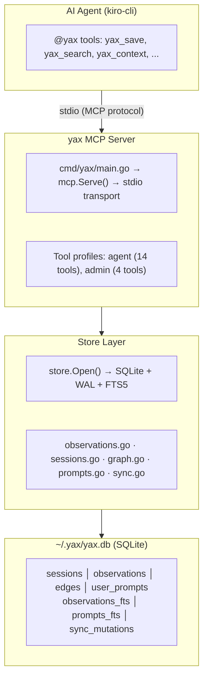

# yax — Architecture & Feature Reference

> Persistent memory for AI coding agents. Single Go binary. SQLite + FTS5. Knowledge graph. Zero Docker.

## Overview

yax provides long-term memory for AI agents across coding sessions. Agents save observations (decisions, patterns, bugfixes, discoveries) during workflows, and retrieve them in future sessions to avoid repeating mistakes and build institutional knowledge.

Named after Yax the yak from Zootopia — remembers everything in detail.

## Architecture



## Components

### 1. Entry Point (`cmd/yax/main.go`)

Routes to either MCP server mode or CLI mode:
- `yax mcp --tools=agent` → starts stdio MCP server with tool profile filtering
- `yax <command>` → dispatches to CLI handler

### 2. MCP Server (`internal/mcp/`)

Implements the Model Context Protocol over stdio using `mark3labs/mcp-go`.

**Tool Profiles:**

| Profile | Tools    | Purpose                                              |
|---------|----------|------------------------------------------------------|
| `agent` | 14 tools | Day-to-day agent use — save, search, sessions, graph |
| `admin` | 4 tools  | Maintenance — stats, export, import, merge projects  |
| `all`   | 18 tools | Everything                                           |

**Agent Profile Tools:**

| Tool                  | Description                                                       |
|-----------------------|-------------------------------------------------------------------|
| `yax_save`            | Save observation with type, project, scope, topic_key for upserts |
| `yax_search`          | Full-text search across memories (FTS5 + BM25 ranking)            |
| `yax_context`         | Get recent observations for a project                             |
| `yax_get`             | Get single observation by ID                                      |
| `yax_update`          | Update existing observation fields                                |
| `yax_delete`          | Soft or hard delete                                               |
| `yax_timeline`        | Chronological context around an observation                       |
| `yax_link`            | Create typed edge between observations                            |
| `yax_unlink`          | Remove edge                                                       |
| `yax_related`         | Graph traversal — find connected observations (recursive CTE)     |
| `yax_session_start`   | Register start of coding session                                  |
| `yax_session_end`     | Mark session completed with optional summary                      |
| `yax_session_summary` | Save end-of-session summary as observation                        |
| `yax_save_prompt`     | Save user's original request to prompt history                    |

**Admin Profile Tools:**

| Tool                 | Description              |
|----------------------|--------------------------|
| `yax_stats`          | Memory system statistics |
| `yax_export`         | Export sync chunks       |
| `yax_import`         | Import sync chunks       |
| `yax_merge_projects` | Merge project namespaces |

### 3. Store (`internal/store/`)

SQLite database with WAL mode, FTS5 full-text search, and knowledge graph.

**Schema (7 tables):**

| Table              | Purpose                                                                                  |
|--------------------|------------------------------------------------------------------------------------------|
| `sessions`         | Coding sessions (id, project, directory, started_at, ended_at, summary)                  |
| `observations`     | Memories with dedup fields (topic_key, normalized_hash, revision_count, duplicate_count) |
| `observations_fts` | FTS5 virtual table — indexes title, content, tool_name, type, project                    |
| `edges`            | Knowledge graph edges (source_id, target_id, relationship, metadata)                     |
| `user_prompts`     | Raw user prompts per session                                                             |
| `prompts_fts`      | FTS5 for prompt search                                                                   |
| `sync_mutations`   | Mutation log for team sync (Phase 2)                                                     |
| `sync_chunks`      | Tracks imported sync chunks                                                              |

**Observation Types:** `manual`, `decision`, `architecture`, `bugfix`, `pattern`, `config`, `discovery`, `learning`, `session`, `prompt`, `summary`

**Scopes:** `project` (shared via sync), `personal` (local only)

### 4. Deduplication (`internal/dedup/`)

Two-layer dedup prevents duplicate observations:

1. **Topic key upsert** — same `topic_key` + `project` + `scope` → updates existing observation, increments `revision_count`
2. **Content hash** — SHA-256 of normalized content (lowercase, trimmed, stripped markdown). Same hash → increments `duplicate_count`, updates `last_seen_at`

### 5. Knowledge Graph (`internal/store/graph.go`)

Typed edges between observations with recursive CTE traversal:

- **Edge types:** `related_to`, `fixes`, `caused_by`, `supersedes` (user-defined)
- **Traversal:** configurable depth (default 3), bidirectional
- **Constraint:** unique `(source_id, target_id, relationship)`

### 6. Sync (`internal/store/sync.go`)

Git-based team sync (Phase 2):

- All mutations logged to `sync_mutations` table
- `yax sync` exports pending mutations as compressed JSON chunks to `.yax/` directory
- `yax sync --import` imports chunks from teammates
- Chunks tracked in `sync_chunks` to prevent re-import
- Designed for `git add .yax/` workflow

### 7. CLI (`internal/cli/`)

Direct terminal interface mirroring MCP tools:

| Command                      | Description           |
|------------------------------|-----------------------|
| `yax search <query>`         | Full-text search      |
| `yax save <title> <content>` | Save observation      |
| `yax context [project]`      | Recent memories       |
| `yax timeline <id>`          | Chronological context |
| `yax related <id>`           | Graph traversal       |
| `yax link <src> <tgt> <rel>` | Create edge           |
| `yax stats`                  | Statistics            |
| `yax sync`                   | Export mutations      |
| `yax setup`                  | Register in mcp.json  |
| `yax upgrade`                | Self-update           |

## Dependencies

| Package                       | Purpose                                                   |
|-------------------------------|-----------------------------------------------------------|
| `modernc.org/sqlite`          | Pure Go SQLite (no CGO) — enables easy cross-compilation  |
| `github.com/mark3labs/mcp-go` | MCP stdio protocol implementation                         |
| Go stdlib                     | crypto/sha256, compress/gzip, database/sql, encoding/json |

## Integration with Koda

| Component            | How                                                                      |
|----------------------|--------------------------------------------------------------------------|
| **Install**          | `koda upgrade` downloads yax binary from Koda releases                   |
| **MCP registration** | `GenerateMcpJson()` registers yax as stdio server when binary is on PATH |
| **Agent config**     | `@yax` in agent tools array enables yax MCP tools                        |
| **Orchestrator**     | Prompt instructions for when/what to save (PR #213)                      |

**MCP entry in mcp.json:**
```json
{
  "yax": {
    "command": "yax",
    "args": ["mcp", "--tools=agent"]
  }
}
```

## Data Flow

```
Agent workflow start
  → yax_session_start(id, project)
  → yax_search(query) + yax_context(project)     ← retrieve prior knowledge
  → [agent does work]
  → yax_save(title, content, type, topic_key)     ← save decisions/patterns
  → yax_link(src, tgt, relationship)              ← connect related observations
  → yax_session_summary(content, project)          ← end-of-session summary
  → yax_session_end(id)
```

## Storage

- **Location:** `~/.yax/yax.db` (override with `YAX_DATA_DIR`)
- **Size:** ~9MB binary, database grows with usage
- **Performance:** WAL mode, busy timeout 5s, foreign keys enabled
- **Portability:** single file, copy to move between machines

## Fork Notes (SANCR225/yax)

Forked from `QUINJ327/yax`. Changes:
- Added `cmd/yax/main.go` entry point (was missing — build failed)
- Fixed `.gitignore` (`yax` pattern was ignoring `cmd/yax/` directory)
- Fixed `upgrade.go` `fmt.Errorf` bug (missing error arg)
- Cross-compiled binaries shipped with Koda releases
