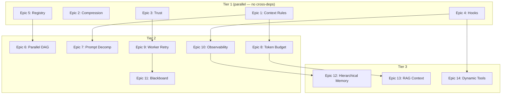

# Implementation plan: orchestration, harnesses, and context compression

**Date**: 2026-05-02
**Scope**: steer-runtime, Koda, steer-autopilot
**Estimated effort**: 14 epics, 57 stories, ~171 story points
**Timeline**: 8 sprints (16 weeks)

---

## Overview

This plan addresses three research areas mapped to concrete improvements across the platform:

1. **Context compression** — reduce waste, add conditional loading, token budgeting, structured compression
2. **Agent harnesses** — trust enforcement, extended lifecycle hooks, observability, resource limits
3. **Orchestration** — autopilot dynamic registry, parallel DAG execution, orchestrator prompt decomposition, worker retry, Koda-autopilot integration

### Repo responsibilities

| Repo             | Language | Role                                          |
|------------------|----------|-----------------------------------------------|
| steer-runtime    | Markdown/JSON/Shell | Declarative configs, prompts, hooks, context |
| Koda             | Go 1.25  | CLI management, ACP client, team orchestration |
| steer-autopilot  | Go 1.25  | Pipeline engine, DAG executor, gate system     |

### Dependency order



---

## Epic 1: Conditional context loading

**Repo**: steer-runtime + Koda
**Priority**: P0
**Points**: 13
**Goal**: Stop loading irrelevant context files. The two estimation files alone (67KB) load for every task.

### Current state

Agent JSON `resources` is a flat array of `file://` URIs with glob support. All resources load unconditionally at session start. No filtering mechanism exists.

```json
"resources": [
  "file://AGENTS.md",
  "file://.kiro/context/golden_rules.md",
  "file://.kiro/context/ccv-estimation.md"
]
```

### Target state

Resources support a `when` condition that kiro-cli evaluates before loading:

```json
"resources": [
  "file://.kiro/context/golden_rules.md",
  { "path": "file://.kiro/context/ccv-estimation.md", "when": "task_contains:estimate|story points|sizing" },
  { "path": "file://.kiro/context/splunk_indexes.md", "when": "agent_is:splunk_*|log_*" }
]
```

### Story 1.1: Define the conditional resource schema

**Points**: 3
**Repo**: steer-runtime

Acceptance criteria:

- `resources` array accepts both string (backward-compatible) and object entries
- Object entry schema: `{ "path": string, "when": string, "priority": string }`
- `when` operators: `always` (default), `task_contains:<pattern>`, `agent_is:<glob>`, `profile_is:<name>`
- `priority` values: `critical`, `high`, `normal` (default), `low`
- Schema documented in `shared/memory-bank/steer-master/schema-inventory.md`
- `profiles/steer-master/context/agent_schema.md` updated

Files to change:

| File                                                        | Change                                    |
|-------------------------------------------------------------|-------------------------------------------|
| `shared/memory-bank/steer-master/schema-inventory.md`       | Add `resources` object variant to schema  |
| `profiles/steer-master/context/agent_schema.md`             | Document new resource object format       |
| `common/schemas/agent.schema.json`                          | New file — formal JSON Schema for agents  |

### Story 1.2: Apply conditional rules to shared context files

**Points**: 5
**Repo**: steer-runtime

Acceptance criteria:

- All 22 files in `shared/context/` are classified with appropriate `when` conditions
- `golden_rules.md`, `project_mappings.md`, `mcp_priority.md` remain `always`
- `ccv-estimation.md` (34KB) → `task_contains:estimate|estimation|story points|sizing|ccv`
- `drift-estimation.md` (33KB) → `task_contains:drift|token cost|token budget`
- `splunk_indexes.md` → `agent_is:splunk_*|log_*`
- `servicenow_reference.md` → `agent_is:log_*|ops_*`
- `qa_guidelines.md`, `test_templates.md`, `api_test_patterns.md`, `defect_templates.md` → `profile_is:qa`
- `ba_guidelines.md`, `story_templates.md` → `profile_is:ba`
- `pm_guidelines.md` → `profile_is:pm`
- `ops_guidelines.md` → `profile_is:ops`
- Remaining files (`api_standards.md`, `performance_patterns.md`, `automation_patterns.md`, `vista_web_components.md`, `domain_glossary.md`, `enterprise_architecture.md`, `email_guidelines.md`) → `always`
- Every agent JSON that references shared context is updated to use the new format
- Net context reduction: ~67KB for non-estimation tasks, ~35KB for non-QA tasks

Files to change:

| File                                                  | Change                                                |
|-------------------------------------------------------|-------------------------------------------------------|
| `profiles/dev-core/agents/orchestrator.json`          | Convert `resources` array to mixed string/object      |
| `profiles/dev-core/agents/planner_agent.json`         | Same                                                  |
| `profiles/dev-core/agents/architecture_agent.json`    | Same                                                  |
| All agents referencing estimation context              | Add `when` conditions                                 |
| All agents referencing QA/BA/PM/Ops context           | Add `when` conditions                                 |

### Story 1.3: Koda install handles new resource format

**Points**: 3
**Repo**: Koda

Acceptance criteria:

- `ops.InstallProfile` correctly copies agent JSONs with object-format resources
- `model.Agent.Resources` type changes from `[]string` to `[]ResourceEntry`
- `ResourceEntry` supports both string (backward-compat) and struct unmarshaling
- `koda doctor` validates resource paths in both formats
- Existing string-only resources continue to work unchanged

Files to change:

| File                          | Change                                                          |
|-------------------------------|-----------------------------------------------------------------|
| `internal/model/agent.go`    | Add `ResourceEntry` type with custom `UnmarshalJSON`            |
| `internal/ops/install.go`    | Update resource path validation for new format                  |
| `internal/ops/doctor.go`     | Validate both resource formats                                  |

### Story 1.4: Validate conditional loading end-to-end

**Points**: 2
**Repo**: steer-runtime

Acceptance criteria:

- `schema_validator_agent` updated to validate new resource format
- `profiles/steer-master/prompts/schema_validator_agent.md` documents new rules
- Manual test: orchestrator session without estimation keywords loads <50KB context
- Manual test: orchestrator session with "estimate this story" loads estimation files

Files to change:

| File                                                          | Change                              |
|---------------------------------------------------------------|-------------------------------------|
| `profiles/steer-master/agents/schema_validator_agent.json`    | Add validation for resource objects |
| `profiles/steer-master/prompts/schema_validator_agent.md`     | Document new validation rules       |


---

## Epic 2: Structured context compression

**Repo**: steer-runtime
**Priority**: P0
**Points**: 8
**Goal**: Compress verbose context files 2-5x without losing information.

### Current state

`agent-registry.sh` outputs ~3KB of formatted markdown listing every installed profile, every agent with description, every MCP server, workspace details, and system resources. This is injected into every orchestrator session. Most of it is only needed during delegation decisions.

### Target state

Two-tier output: a compact summary (~500 bytes) always injected, plus a full registry available on demand via a resource file.

### Story 2.1: Compress agent-registry.sh output

**Points**: 3
**Repo**: steer-runtime

Acceptance criteria:

- `agent-registry.sh` outputs a compact summary by default
- Compact format: `Profiles: dev-core(20), dev-web(5), qa(13) ...` on one line
- Compact format: agent list as `name1, name2, name3` without descriptions
- Full detailed output written to `~/.kiro/context/_dynamic/agent-registry-full.md`
- Orchestrator resources include the full file as a `low` priority conditional resource
- Net reduction: ~2.5KB per session for non-delegation tasks

Files to change:

| File                                | Change                                              |
|-------------------------------------|-----------------------------------------------------|
| `shared/hooks/agent-registry.sh`    | Split output into compact (stdout) + full (file)    |
| `shared/hooks/agent-registry.ps1`   | Same changes for Windows parity                     |

### Story 2.2: Compress shared context files

**Points**: 3
**Repo**: steer-runtime

Acceptance criteria:

- `email_guidelines.md` (1.1KB) → compressed to ~400 bytes using bullet points
- `ops_guidelines.md` (1KB) → compressed to ~400 bytes
- `domain_glossary.md` (674B) → converted to compact table format
- `enterprise_architecture.md` (436B) → converted to compact table format
- `api_standards.md` (792B) → compressed to ~400 bytes
- Total savings: ~1.5KB across always-loaded files
- No information loss — same content, denser format

Files to change:

| File                                          | Change                          |
|-----------------------------------------------|---------------------------------|
| `shared/context/email_guidelines.md`          | Rewrite in compact bullet form  |
| `shared/context/ops_guidelines.md`            | Rewrite in compact bullet form  |
| `shared/context/domain_glossary.md`           | Convert to compact table        |
| `shared/context/enterprise_architecture.md`   | Convert to compact table        |
| `shared/context/api_standards.md`             | Rewrite in compact bullet form  |

### Story 2.3: Add context size tracking to koda doctor

**Points**: 2
**Repo**: Koda

Acceptance criteria:

- `koda doctor` reports total context size per agent (sum of all resource files)
- Warns if any agent's static context exceeds 50KB
- Warns if any single resource file exceeds 30KB
- Output includes breakdown: `orchestrator: 12.3KB (5 files) ✓`

Files to change:

| File                        | Change                                          |
|-----------------------------|-------------------------------------------------|
| `internal/ops/doctor.go`   | Add context size audit step                     |


---

## Epic 3: Trust level enforcement

**Repo**: Koda
**Priority**: P0
**Points**: 13
**Goal**: Wire up the existing but unused trust level system in the ACP client.

### Current state

`Worker` struct has `Trust TrustLevel` and `PermissionCh chan PermissionRequest` fields. Three trust levels are defined: `autonomous`, `supervised`, `strict`. But `handleServerRequest` in `acp/client.go` unconditionally calls `respondPermission(id, "allow_always")` for all `session/request_permission` requests.

### Target state

The ACP client respects trust levels. `autonomous` auto-approves. `supervised` routes to a permission channel for human decision. `strict` blocks destructive operations and allows reads.

### Story 3.1: Add trust-aware permission handling to ACP client

**Points**: 5
**Repo**: Koda

Acceptance criteria:

- `Client` struct gains a `TrustLevel` field (default: `autonomous` for backward compat)
- New `SpawnWithTrust(agent string, trust TrustLevel) (*Client, error)` constructor
- `handleServerRequest` branches on `c.TrustLevel`:
  - `autonomous` → `respondPermission(id, "allow_always")`
  - `supervised` → emit `Event{Type: "Permission", ...}` on `c.Events`, block until response
  - `strict` → parse the permission params, allow read-only tools, deny writes/shell
- `Client` gains `RespondPermission(id interface{}, decision string)` public method
- Existing `Spawn()` and `SpawnWithCwd()` default to `autonomous` (no breaking change)

Files to change:

| File                        | Change                                                    |
|-----------------------------|-----------------------------------------------------------|
| `internal/acp/client.go`   | Add `TrustLevel` field, `SpawnWithTrust`, update `handleServerRequest` |

### Story 3.2: Wire trust levels into team workers

**Points**: 3
**Repo**: Koda

Acceptance criteria:

- `Worker.Start()` passes `w.Trust` to `acp.SpawnWithTrust()`
- `Worker.streamEvents()` handles `Permission` events:
  - Forwards to `w.PermissionCh`
  - Waits for response on `PermissionRequest.ResponseCh`
  - Calls `w.Client.RespondPermission()` with the decision
- `Worker.SetTrust()` propagates to the ACP client if session is active
- Team TUI shows permission requests inline with worker status

Files to change:

| File                          | Change                                              |
|-------------------------------|-----------------------------------------------------|
| `internal/team/worker.go`    | Wire trust to ACP spawn, handle Permission events   |
| `internal/team/orchestrator.go` | Pass trust from WorkerSpec to Worker              |

### Story 3.3: Add trust level to TeamSpec planner prompt

**Points**: 2
**Repo**: Koda

Acceptance criteria:

- `GeneratePlan` prompt instructs the LLM to assign trust levels based on task type:
  - Read-only tasks (analysis, review) → `autonomous`
  - Code-writing tasks → `supervised`
  - Infrastructure/deployment tasks → `strict`
- `ValidateDeps` validates trust level values
- Default trust level if omitted: `supervised`

Files to change:

| File                            | Change                                        |
|---------------------------------|-----------------------------------------------|
| `internal/team/planner.go`     | Update plan prompt with trust level guidance  |
| `internal/team/teamspec.go`    | Add trust validation to `ValidateDeps`        |

### Story 3.4: Trust level in KiteStream sessions

**Points**: 3
**Repo**: Koda

Acceptance criteria:

- `POST /api/sessions` accepts optional `trust` parameter
- KiteStream bridge passes trust to ACP client
- Permission events forwarded over WebSocket to the web UI
- Web UI shows approve/deny buttons for supervised sessions
- Default trust for KiteStream: `supervised`

Files to change:

| File                                | Change                                          |
|-------------------------------------|-------------------------------------------------|
| `internal/kitestream/bridge.go`    | Pass trust to ACP spawn                         |
| `internal/kitestream/handlers.go`  | Accept trust param, forward permission events   |


---

## Epic 4: Extended hook lifecycle

**Repo**: steer-runtime + Koda
**Priority**: P1
**Points**: 10
**Goal**: Add `agentComplete`, `agentFailed`, `agentTimeout` lifecycle events to close the feedback loop.

### Current state

Three hook events: `agentSpawn`, `preToolUse`, `postToolUse`. Hooks inject context and enforce guardrails but never update state based on outcomes. No cleanup, no metrics emission, no memory bank updates on session end.

### Target state

Six hook events. New events enable cleanup, telemetry, and automatic memory updates.

### Story 4.1: Define new hook events in schema

**Points**: 2
**Repo**: steer-runtime

Acceptance criteria:

- Agent JSON schema supports `agentComplete`, `agentFailed`, `agentTimeout` in `hooks`
- Each receives a JSON payload on stdin with session metadata:
  - `agentComplete`: `{ "agent", "sessionId", "duration_ms", "tool_calls", "context_usage_pct" }`
  - `agentFailed`: `{ "agent", "sessionId", "error", "duration_ms", "last_tool" }`
  - `agentTimeout`: `{ "agent", "sessionId", "duration_ms", "timeout_ms" }`
- Schema inventory updated
- Backward compatible — existing agents without new hooks are unaffected

Files to change:

| File                                                    | Change                              |
|---------------------------------------------------------|-------------------------------------|
| `shared/memory-bank/steer-master/schema-inventory.md`  | Add 3 new hook events to table      |
| `profiles/steer-master/context/agent_schema.md`        | Document new hook events            |

### Story 4.2: Create session-summary hook

**Points**: 3
**Repo**: steer-runtime

Acceptance criteria:

- New hook: `shared/hooks/session-summary.sh` (+ `.ps1`)
- Fires on `agentComplete`
- Reads session metadata from stdin
- Appends a one-line entry to `~/.kiro/logs/session-history.jsonl`:
  ```json
  {"ts":"2026-05-02T12:00:00Z","agent":"backend","duration_ms":45000,"tools":12,"ctx_pct":34}
  ```
- Creates `~/.kiro/logs/` directory if missing
- Rotates log file at 1MB

Files to change:

| File                                    | Change        |
|-----------------------------------------|---------------|
| `shared/hooks/session-summary.sh`       | New file      |
| `shared/hooks/session-summary.ps1`      | New file      |

### Story 4.3: Create memory-bank-update hook

**Points**: 3
**Repo**: steer-runtime

Acceptance criteria:

- New hook: `shared/hooks/memory-bank-update.sh` (+ `.ps1`)
- Fires on `agentComplete`
- Updates `shared/memory-bank/active-context.md` with last session timestamp and agent name
- Only updates if the session lasted >60 seconds (skip trivial interactions)
- Idempotent — multiple runs don't duplicate entries

Files to change:

| File                                        | Change        |
|---------------------------------------------|---------------|
| `shared/hooks/memory-bank-update.sh`        | New file      |
| `shared/hooks/memory-bank-update.ps1`       | New file      |

### Story 4.4: Update Koda model for new hook events

**Points**: 2
**Repo**: Koda

Acceptance criteria:

- `model.AgentHooks` struct gains `AgentComplete`, `AgentFailed`, `AgentTimeout` fields
- `koda doctor` validates new hook event references
- `koda install` copies hook scripts for new events

Files to change:

| File                          | Change                                          |
|-------------------------------|-------------------------------------------------|
| `internal/model/agent.go`   | Add 3 new fields to `AgentHooks` struct         |
| `internal/ops/doctor.go`    | Validate new hook event references              |
| `internal/ops/install.go`   | Handle new hook events during install           |


---

## Epic 5: Dynamic agent registry for steer-autopilot

**Repo**: steer-autopilot
**Priority**: P0
**Points**: 8
**Goal**: Replace the 21 hardcoded agents in `registry.go` with dynamic scanning of installed profiles.

### Current state

`LoadDefaults()` in `internal/broker/registry.go` registers 21 agents with hardcoded names, profiles, and one-line descriptions. Adding a new agent requires a code change and recompile. The comment says `"Phase 2+: scan installed profiles"`.

### Target state

Registry scans `~/.kiro/agents/*.json` at startup, reads `name`, `description`, and infers profile from the file's origin. Falls back to hardcoded defaults if no agents are installed.

### Story 5.1: Implement profile-scanning registry

**Points**: 5
**Repo**: steer-autopilot

Acceptance criteria:

- New method `Registry.LoadFromDir(agentsDir string) error`
- Scans `agentsDir/*.json`, reads each file, extracts `name` and `description`
- Profile inferred from `~/.kiro/settings/profiles.json` (maps agent → profile)
- If `profiles.json` is missing, falls back to `LoadDefaults()`
- If `agentsDir` is empty or missing, falls back to `LoadDefaults()`
- Thread-safe — can be called while pipeline is running (for hot-reload)
- Logs count of discovered agents: `"loaded 47 agents from ~/.kiro/agents/"`

Files to change:

| File                                  | Change                                          |
|---------------------------------------|-------------------------------------------------|
| `internal/broker/registry.go`        | Add `LoadFromDir`, keep `LoadDefaults` as fallback |

### Story 5.2: Wire registry scanning into engine startup

**Points**: 2
**Repo**: steer-autopilot

Acceptance criteria:

- `cmd/autopilot/main.go` calls `registry.LoadFromDir(kiroAgentsDir)` before `LoadDefaults()`
- `kiroAgentsDir` resolved from `~/.kiro/agents/` (same path Koda installs to)
- `autopilot doctor` subcommand reports registry source (scanned vs hardcoded) and agent count
- Pipeline validation checks that all stage agents exist in the registry before execution

Files to change:

| File                          | Change                                              |
|-------------------------------|-----------------------------------------------------|
| `cmd/autopilot/main.go`     | Call `LoadFromDir` during initialization            |
| `internal/engine/engine.go`  | Add pre-flight agent validation in `Run()`          |

### Story 5.3: Registry API endpoint

**Points**: 1
**Repo**: steer-autopilot

Acceptance criteria:

- `GET /api/agents` returns the full registry as JSON array
- Each entry: `{ "name", "profile", "description" }`
- Dashboard agent selector uses this endpoint instead of hardcoded list

Files to change:

| File                          | Change                              |
|-------------------------------|-------------------------------------|
| `internal/api/handlers.go`  | Add `/api/agents` GET handler       |


---

## Epic 6: Parallel DAG execution

**Repo**: steer-autopilot
**Priority**: P1
**Points**: 13
**Depends on**: Epic 5

**Goal**: Execute independent DAG stages concurrently instead of sequentially.

### Current state

`executeDAG` iterates `dag.Order` (topological sort) and runs each stage sequentially. Stages with no dependency relationship (e.g., `test` and `review` if both depend only on `implement`) run one after the other even though they could run in parallel.

### Target state

Stages whose dependencies are all satisfied run concurrently, bounded by a configurable concurrency limit.

### Story 6.1: Identify parallel execution waves

**Points**: 3
**Repo**: steer-autopilot

Acceptance criteria:

- New function `BuildWaves(dag *DAG) [][]string` groups stages into waves
- Wave 0: stages with no dependencies
- Wave N: stages whose dependencies are all in waves 0..N-1
- Unit test: `feature-delivery.yaml` produces correct waves:
  - Wave 0: `[scope]`
  - Wave 1: `[design]`
  - Wave 2: `[plan]`
  - Wave 3: `[implement]`
  - Wave 4: `[test]`
  - Wave 5: `[review]`
  - Wave 6: `[release]`
- Unit test: a pipeline with `a→c, b→c` produces `wave0=[a,b], wave1=[c]`

Files to change:

| File                          | Change                              |
|-------------------------------|-------------------------------------|
| `internal/engine/dag.go`    | Add `BuildWaves` function           |
| `internal/engine/dag_test.go` | New file — wave computation tests |

### Story 6.2: Concurrent stage executor

**Points**: 5
**Repo**: steer-autopilot

Acceptance criteria:

- `executeDAG` replaced with `executeDAGParallel`
- Iterates waves; within each wave, launches stages concurrently via `errgroup`
- Concurrency bounded by `engine.maxConcurrency` (default: 3, configurable)
- If any stage in a wave fails, remaining stages in that wave are cancelled
- Gate processing remains sequential (gates block the wave)
- Events published for each stage start/complete/fail as before

Files to change:

| File                          | Change                                              |
|-------------------------------|-----------------------------------------------------|
| `internal/engine/engine.go`  | Replace `executeDAG` with wave-based parallel executor |

### Story 6.3: Concurrency configuration

**Points**: 2
**Repo**: steer-autopilot

Acceptance criteria:

- Pipeline YAML supports top-level `concurrency: N` field
- CLI flag `--concurrency N` overrides YAML value
- Default: 3
- `PipelineDef` struct gains `Concurrency int` field
- Dashboard shows concurrent stage indicators

Files to change:

| File                            | Change                                    |
|---------------------------------|-------------------------------------------|
| `internal/engine/parser.go`   | Add `Concurrency` to `PipelineDef`        |
| `cmd/autopilot/main.go`       | Add `--concurrency` flag                  |

### Story 6.4: Token tracking from kiro-cli output

**Points**: 3
**Repo**: steer-autopilot

Acceptance criteria:

- `broker.Dispatch` parses kiro-cli stdout for token usage metadata
- Looks for `_kiro.dev/metadata` JSON lines with `contextUsagePercentage`
- Estimates token count from context usage percentage × model context window
- `DispatchResult.TokenUsage` populated with actual values (currently always 0)
- Stage metrics in dashboard show real token counts

Files to change:

| File                            | Change                                          |
|---------------------------------|-------------------------------------------------|
| `internal/broker/broker.go`    | Parse stdout for metadata lines during dispatch |


---

## Epic 7: Orchestrator prompt decomposition (all 9 orchestrators)

**Repo**: steer-runtime
**Priority**: P1
**Points**: 20
**Depends on**: Epic 1

**Goal**: Decompose all 9 orchestrator prompts into composable parts. Eliminate the sync problem between inline routing tables and the actual agent registry.

### Current state

9 orchestrators across profiles, all with inline routing tables that go stale when agents change:

| Orchestrator                  | Profile      | Lines | Has SDLC workflow |
|-------------------------------|--------------|:-----:|:-----------------:|
| `orchestrator`                | dev-core     |  513  |        ✅         |
| `steer_orchestrator_agent`    | steer-master |  404  |        ✅         |
| `ops_orchestrator_agent`      | ops          |  202  |        ❌         |
| `qa_orchestrator_agent`       | qa           |  193  |        ✅         |
| `ba_orchestrator_agent`       | ba           |  176  |        ❌         |
| `sustainment_orchestrator`    | sustainment  |  161  |        ❌         |
| `pm_orchestrator_agent`       | pm           |  142  |        ❌         |
| `inspector_orchestrator`      | inspector    |  112  |        ❌         |
| `leadership_orchestrator`     | leadership   |   94  |        ❌         |

All 9 have inline delegation/routing tables. 3 have inline SDLC workflows.

### Target state

Each orchestrator prompt shrinks to identity + core behavior (~100-150 lines). Shared components extracted to reusable context files. Routing tables auto-generated per profile scope.

### Story 7.1: Profile-scoped delegation map hook

**Points**: 5
**Repo**: steer-runtime

Acceptance criteria:

- New hook: `shared/hooks/delegation-map.sh` (+ `.ps1`)
- Fires on `agentSpawn` for any orchestrator agent
- Reads `~/.kiro/agents/*.json`, groups agents by profile
- Generates `~/.kiro/context/_dynamic/delegation-map.md` with:
  - Per-profile agent table (name, description, typical tasks)
  - Cross-profile agent table (agents outside the orchestrator's own profile)
- Hook is profile-aware: reads the spawning agent's profile from its JSON config
- All 9 orchestrators register this hook in their `agentSpawn` hooks
- If hook fails, orchestrators fall back to description-based matching

Files to change:

| File                                | Change    |
|-------------------------------------|-----------|
| `shared/hooks/delegation-map.sh`    | New file  |
| `shared/hooks/delegation-map.ps1`   | New file  |

### Story 7.2: Shared orchestrator rules context file

**Points**: 5
**Repo**: steer-runtime

Based on the rule overlap audit across all 9 orchestrators, this file contains 4 sections of rules that are duplicated in 7-9 of the prompts (~40-50 lines each, ~350 lines total savings).

Acceptance criteria:

- New file: `shared/context/orchestrator_rules.md` with 4 sections:
  1. **Delegation mandate** (~15 lines) — always delegate via `subagent`, never do specialist work, tool is `subagent` NOT `use_subagent` or `delegate`, flag sub-agent errors, present consolidated results
  2. **Yax persistent memory** (~45 lines) — full block: retrieve context first, session lifecycle (start → save → summary), auto-save triggers (task done, decision, bug, pattern, preference, config), do NOT save secrets/PII/routine lookups, save decisions not raw conversation, keep concise, include project
  3. **Protected files** (~10 lines) — any modification requires explicit user approval with isolated diff review
  4. **Instance routing** (~10 lines) — Confluence vs MyWiki routing (`confluence.disney.com → @confluence/*`, `mywiki.disney.com → @mywiki/*`), email confirmation rule
- Each of the 8 standard orchestrators removes its inline copy of these rules (inspector keeps its own simpler yax variant but references sections 1, 3, 4)
- File loaded as `priority: critical` resource on all 9 orchestrators
- Domain-specific rules (dev-core intent classification, QA qTest rules, ops ServiceNow routing, etc.) stay in each prompt

Files to change:

| File                                    | Change    |
|-----------------------------------------|-----------|
| `shared/context/orchestrator_rules.md`  | New file  |

### Story 7.3: Extract SDLC workflow to shared context

**Points**: 3
**Repo**: steer-runtime

Acceptance criteria:

- New file: `shared/context/sdlc-workflow.md`
- Contains the 5-phase SDLC workflow (Analyze → Plan → Gate → Implement → Quality → Gate → Ship)
- Includes gate definitions, phase-to-agent mappings, resource-aware strategy tiers
- Referenced by the 3 orchestrators that use SDLC workflows: dev-core, steer-master, qa
- Other 6 orchestrators do NOT load this file (conditional: `agent_is:orchestrator|steer_orchestrator*|qa_orchestrator*`)
- Consistent with steer-autopilot's `feature-delivery.yaml` pipeline

Files to change:

| File                                  | Change    |
|---------------------------------------|-----------|
| `shared/context/sdlc-workflow.md`     | New file  |

### Story 7.4: Decompose dev-core orchestrator prompt

**Points**: 2
**Repo**: steer-runtime

Acceptance criteria:

- `profiles/dev-core/prompts/orchestrator.md` reduced from 513 to ≤150 lines
- Retains: identity, intent classification logic, delegation behavior, yax memory instructions
- Removed: inline routing tables, inline rules, inline SDLC workflow
- References: `orchestrator_rules.md`, `sdlc-workflow.md`, auto-generated delegation map
- `profiles/dev-core/agents/orchestrator.json` updated with new hooks and resources

Files to change:

| File                                              | Change                              |
|---------------------------------------------------|-------------------------------------|
| `profiles/dev-core/prompts/orchestrator.md`       | Decompose, remove inline content    |
| `profiles/dev-core/agents/orchestrator.json`      | Add hooks + resource references     |

### Story 7.5: Decompose SDLC orchestrators (wave 2: steer-master + qa)

**Points**: 3
**Repo**: steer-runtime

These two orchestrators share the SDLC workflow with dev-core and have the most overlap.

Acceptance criteria:

- steer-master: 404 → ≤200 lines. Remove: inline yax block (~45 lines), delegation boilerplate (~15 lines), protected files (~10 lines), instance routing (~10 lines). Keep: breaking change rules, fork classification, agent creation workflow, commit conventions.
- qa: 193 → ≤120 lines. Remove: same shared blocks. Keep: qTest module rules, qTest naming format, quality gate review, web scraping/time machine workflows.
- Both reference `sdlc-workflow.md` instead of inline SDLC definitions
- Both register delegation-map hook and shared rules resource
- Validated: 3 representative tasks each before proceeding to wave 3

Files to change:

| File                                                          | Change                  |
|---------------------------------------------------------------|-------------------------|
| `profiles/steer-master/prompts/steer_orchestrator_agent.md`  | Decompose               |
| `profiles/steer-master/agents/steer_orchestrator_agent.json` | Add hooks + resources   |
| `profiles/qa/prompts/qa_orchestrator_agent.md`                | Decompose               |
| `profiles/qa/agents/qa_orchestrator_agent.json`               | Add hooks + resources   |

### Story 7.6: Decompose non-SDLC orchestrators (wave 3: ops, sust, pm, ba, lead, inspector)

**Points**: 3
**Repo**: steer-runtime

These 6 orchestrators are simpler — no SDLC workflow, mostly delegation + domain rules.

Acceptance criteria:

- ops: 202 → ≤120 lines. Keep: ServiceNow prefix routing (9 prefixes), Compass MCP direct access, release workflow.
- sustainment: 161 → ≤100 lines. Keep: severity classification, P1/P2 escalation, incident response workflow, CTASK workflow.
- pm: 142 → ≤90 lines. Keep: sprint/standup/retro delegation specifics.
- ba: 176 → ≤100 lines. Keep: estimation modes (CCV vs DRIFT), translation validation.
- leadership: 94 → ≤70 lines. Keep: workspace teams first, cross-team side-by-side, actionable recommendations.
- inspector: 112 → ≤80 lines. Keep: FindingSet schema, deduplication, scoring system, report writing, max 3 concurrent. Note: inspector references shared rules sections 1/3/4 but keeps its own yax variant.
- All 6 register delegation-map hook and shared rules resource

Files to change:

| File                                                                  | Change                  |
|-----------------------------------------------------------------------|-------------------------|
| `profiles/ops/prompts/ops_orchestrator_agent.md`                      | Decompose               |
| `profiles/ops/agents/ops_orchestrator_agent.json`                     | Add hooks + resources   |
| `profiles/sustainment/prompts/sustainment_orchestrator_agent.md`      | Decompose               |
| `profiles/sustainment/agents/sustainment_orchestrator_agent.json`     | Add hooks + resources   |
| `profiles/pm/prompts/pm_orchestrator_agent.md`                        | Decompose               |
| `profiles/pm/agents/pm_orchestrator_agent.json`                       | Add hooks + resources   |
| `profiles/ba/prompts/ba_orchestrator_agent.md`                        | Decompose               |
| `profiles/ba/agents/ba_orchestrator_agent.json`                       | Add hooks + resources   |
| `profiles/leadership/prompts/leadership_orchestrator_agent.md`        | Decompose               |
| `profiles/leadership/agents/leadership_orchestrator_agent.json`       | Add hooks + resources   |
| `profiles/inspector/prompts/inspector_orchestrator.md`                | Decompose               |
| `profiles/inspector/agents/inspector_orchestrator.json`               | Add hooks + resources   |

### Story 7.7: Validate all decomposed orchestrators

**Points**: 2
**Repo**: steer-runtime

Acceptance criteria:

- Manual test: each of the 9 orchestrators correctly routes 3 representative tasks
- Manual test: dev-core orchestrator follows SDLC workflow for a Jira story
- Manual test: qa orchestrator delegates to QA specialists correctly
- Manual test: inspector orchestrator fans out to specialists correctly
- No regression in delegation accuracy for any orchestrator
- Total prompt line count across all 9: ≤950 (down from ~1,997)


## Epic 8: Token budgeting per context category

**Repo**: steer-runtime
**Priority**: P2
**Points**: 10
**Depends on**: Epic 1

**Goal**: Give steer-runtime control over what kiro-cli preserves during context compaction.

### Story 8.1: Define context budget schema in agent JSON

**Points**: 3
**Repo**: steer-runtime

Acceptance criteria:

- Agent JSON supports optional `contextBudget` object
- Schema: `{ "system_prompt": 0.15, "resources": 0.25, "hooks": 0.10, "conversation": 0.40, "tools": 0.10 }`
- Values are fractions of total context window (must sum to ≤1.0)
- Schema inventory and agent schema docs updated
- If omitted, kiro-cli uses its default compaction strategy

Files to change:

| File                                                    | Change                          |
|---------------------------------------------------------|---------------------------------|
| `shared/memory-bank/steer-master/schema-inventory.md`  | Add `contextBudget` field       |
| `profiles/steer-master/context/agent_schema.md`        | Document budget schema          |

### Story 8.2: Apply budgets to key agents

**Points**: 3
**Repo**: steer-runtime

Acceptance criteria:

- Orchestrator: `system_prompt: 0.20, resources: 0.20, hooks: 0.10, conversation: 0.40, tools: 0.10`
- Backend/UI/WebAPI: `system_prompt: 0.10, resources: 0.15, hooks: 0.05, conversation: 0.60, tools: 0.10`
- Story analyzer: `system_prompt: 0.10, resources: 0.10, hooks: 0.05, conversation: 0.65, tools: 0.10`
- Budgets tuned so implementation agents get more conversation space

Files to change:

| File                                                  | Change              |
|-------------------------------------------------------|---------------------|
| `profiles/dev-core/agents/orchestrator.json`          | Add `contextBudget` |
| `profiles/dev-web/agents/backend.json`                | Add `contextBudget` |
| `profiles/dev-web/agents/ui.json`                     | Add `contextBudget` |
| `profiles/dev-web/agents/webapi.json`                 | Add `contextBudget` |
| `profiles/dev-core/agents/story_analyzer_agent.json`  | Add `contextBudget` |

### Story 8.3: Koda model and validation for context budgets

**Points**: 2
**Repo**: Koda

Acceptance criteria:

- `model.Agent` gains `ContextBudget map[string]float64` field
- `koda doctor` validates budget values sum to ≤1.0
- `koda doctor` warns if any category is <0.05

Files to change:

| File                        | Change                                  |
|-----------------------------|-----------------------------------------|
| `internal/model/agent.go`  | Add `ContextBudget` field               |
| `internal/ops/doctor.go`   | Add budget validation                   |

### Story 8.4: Pass budgets through ACP session creation

**Points**: 2
**Repo**: Koda

Acceptance criteria:

- `Client.CreateSession` includes `contextBudget` in `session/new` params if present
- Budget read from agent JSON at session creation time
- No change if agent has no budget defined

Files to change:

| File                        | Change                                      |
|-----------------------------|---------------------------------------------|
| `internal/acp/client.go`  | Include budget in `session/new` params      |

---

## Epic 9: Worker retry and recovery

**Repo**: Koda
**Priority**: P2
**Points**: 10
**Depends on**: Epic 3

**Goal**: Add retry logic and failure strategies to team workers.

### Story 9.1: Add retry fields to WorkerSpec

**Points**: 2
**Repo**: Koda

Acceptance criteria:

- `WorkerSpec` gains: `MaxRetries int`, `RetryDelay string`, `OnFailure string`
- `OnFailure` values: `skip`, `abort` (default), `replan`
- `ValidateDeps` validates these fields
- Planner prompt updated to generate retry config for risky tasks

Files to change:

| File                            | Change                                  |
|---------------------------------|-----------------------------------------|
| `internal/team/teamspec.go`   | Add retry fields to `WorkerSpec`        |
| `internal/team/planner.go`    | Update prompt with retry guidance       |

### Story 9.2: Implement retry loop in worker execution

**Points**: 5
**Repo**: Koda

Acceptance criteria:

- `Team.Run()` wraps worker execution in retry loop
- On worker failure: check `MaxRetries`, wait `RetryDelay`, re-spawn ACP client
- Retry handoff includes failure context: `"Previous attempt failed: {error}. Retry {n}/{max}."`
- `OnFailure: skip` → mark worker as skipped, continue with dependents
- `OnFailure: abort` → stop entire team
- `OnFailure: replan` → call `GeneratePlan()` with failure context (Story 9.3)
- Worker events include retry count

Files to change:

| File                              | Change                                  |
|-----------------------------------|-----------------------------------------|
| `internal/team/orchestrator.go`  | Add retry loop around worker execution  |
| `internal/team/worker.go`        | Add `Retry()` method, reset state       |

### Story 9.3: Implement replan-on-failure

**Points**: 3
**Repo**: Koda

Acceptance criteria:

- New function `Team.Replan(failedWorkerID string, error string) (*TeamSpec, error)`
- Calls `GeneratePlan()` with augmented goal including failure context and completed results
- Replaces remaining (non-completed) workers with new plan's workers
- Replan limited to 1 attempt per team run (no infinite replan loops)
- Team events include `Replan` event type

Files to change:

| File                              | Change                          |
|-----------------------------------|---------------------------------|
| `internal/team/orchestrator.go`  | Add `Replan` method             |
| `internal/team/planner.go`      | Support augmented goal input    |

---

## Epic 10: Structured observability

**Repo**: steer-autopilot + steer-runtime
**Priority**: P2
**Points**: 13
**Depends on**: Epic 4

**Goal**: Add structured telemetry across agent sessions, pipeline stages, and team workers.

### Story 10.1: Session telemetry hook

**Points**: 3
**Repo**: steer-runtime

Acceptance criteria:

- New hook: `shared/hooks/telemetry-emit.sh` (+ `.ps1`)
- Fires on `agentComplete` and `agentFailed`
- Writes JSONL to `~/.kiro/logs/telemetry.jsonl`
- Fields: `ts`, `event`, `agent`, `session_id`, `duration_ms`, `tool_calls`, `context_usage_pct`, `outcome`
- File rotated at 5MB

Files to change:

| File                                    | Change    |
|-----------------------------------------|-----------|
| `shared/hooks/telemetry-emit.sh`       | New file  |
| `shared/hooks/telemetry-emit.ps1`      | New file  |

### Story 10.2: Pipeline metrics enrichment

**Points**: 3
**Repo**: steer-autopilot

Acceptance criteria:

- `Collector.PipelineMetrics` includes: p50/p95 cycle time, token cost per stage, gate wait time
- `Collector.StageMetrics` includes: retry count, artifact sizes
- New `Collector.GateMetrics`: approval rate, avg wait time, rejection reasons
- Dashboard metrics page shows all new metrics

Files to change:

| File                                    | Change                              |
|-----------------------------------------|-------------------------------------|
| `internal/metrics/collector.go`        | Add enriched metric calculations    |

### Story 10.3: Koda stats command enhancement

**Points**: 3
**Repo**: Koda

Acceptance criteria:

- `koda stats` reads `~/.kiro/logs/telemetry.jsonl`
- Shows: sessions today, total tokens, top 5 agents by usage, avg session duration
- `koda stats --week` shows weekly trends
- `koda stats --agent backend` filters to specific agent

Files to change:

| File                        | Change                              |
|-----------------------------|-------------------------------------|
| `internal/cli/stats.go`   | Parse telemetry JSONL, render stats |

### Story 10.4: Audit trail for autopilot pipelines

**Points**: 2
**Repo**: steer-autopilot

Acceptance criteria:

- Every gate decision (approve/reject) logged to audit store with timestamp, user, reason
- Every stage retry logged with attempt number and error
- `GET /api/pipelines/{id}/audit` returns full audit trail
- Audit entries are HMAC-signed (existing `internal/audit/` package)

Files to change:

| File                          | Change                                  |
|-------------------------------|-----------------------------------------|
| `internal/engine/engine.go`  | Emit audit events for gates and retries |
| `internal/api/handlers.go`  | Add audit trail endpoint                |

### Story 10.5: Register telemetry hooks on key agents

**Points**: 2
**Repo**: steer-runtime

Acceptance criteria:

- Orchestrator, backend, ui, webapi, story_analyzer agents register `telemetry-emit.sh` on `agentComplete`
- Code review and security scanner agents register on both `agentComplete` and `agentFailed`
- Hook registration added to agent JSON `hooks` sections

Files to change:

| File                                                    | Change                      |
|---------------------------------------------------------|-----------------------------|
| `profiles/dev-core/agents/orchestrator.json`            | Add `agentComplete` hook    |
| `profiles/dev-web/agents/backend.json`                  | Add `agentComplete` hook    |
| `profiles/dev-web/agents/ui.json`                       | Add `agentComplete` hook    |
| `profiles/dev-web/agents/webapi.json`                   | Add `agentComplete` hook    |
| `profiles/dev-core/agents/code_review_agent.json`       | Add complete + failed hooks |
| `profiles/dev-core/agents/security_scanner_agent.json`  | Add complete + failed hooks |

---

## Epic 11: Blackboard for multi-agent coordination

**Repo**: Koda
**Priority**: P2
**Points**: 10
**Depends on**: Epic 9

**Goal**: Give team workers a shared knowledge store for mid-execution coordination.

### Story 11.1: Blackboard file management

**Points**: 3
**Repo**: Koda

Acceptance criteria:

- `Team` creates `.koda/team/{teamId}/blackboard.md` at team start
- Blackboard initialized with: team goal, worker roster, dependency graph
- Workers' worktree paths include a symlink to the blackboard
- Blackboard cleaned up by `CleanupAfterMerge`

Files to change:

| File                              | Change                                  |
|-----------------------------------|-----------------------------------------|
| `internal/team/orchestrator.go`  | Create and manage blackboard file       |
| `internal/team/merge.go`         | Clean up blackboard on merge            |

### Story 11.2: Blackboard context in worker handoff

**Points**: 3
**Repo**: Koda

Acceptance criteria:

- `BuildHandoff` reads current blackboard content and includes it in the handoff prompt
- New section in handoff: `## Shared Blackboard\n{content}`
- Workers instructed to write findings to blackboard via a designated output marker
- `[KODA_BLACKBOARD]` marker in worker output triggers blackboard append

Files to change:

| File                            | Change                                      |
|---------------------------------|---------------------------------------------|
| `internal/team/teamspec.go`   | Read blackboard in `BuildHandoff`           |
| `internal/team/worker.go`     | Parse `[KODA_BLACKBOARD]` from output       |

### Story 11.3: Conflict detection via blackboard

**Points**: 2
**Repo**: Koda

Acceptance criteria:

- Before launching a new wave, `Team.Run()` reads the blackboard for conflict markers
- Workers can write `[KODA_CONFLICT] file: src/Main.java` to flag potential overlaps
- Orchestrator logs warnings for flagged conflicts
- Does not block execution — advisory only

Files to change:

| File                              | Change                              |
|-----------------------------------|------------------------------------|
| `internal/team/orchestrator.go`  | Read blackboard between waves      |

### Story 11.4: Blackboard in team TUI

**Points**: 2
**Repo**: Koda

Acceptance criteria:

- Team TUI shows blackboard panel (read-only)
- Updates in real-time as workers append entries
- Keyboard shortcut `b` toggles blackboard view

Files to change:

| File                        | Change                          |
|-----------------------------|---------------------------------|
| `internal/tui/team.go`    | Add blackboard panel            |

---

## Epic 12: Hierarchical memory with auto-summarization

**Repo**: steer-runtime + Koda
**Priority**: P3
**Points**: 15
**Depends on**: Epic 10

**Goal**: Automate memory bank updates with tiered summarization.

### Story 12.1: Define memory tiers

**Points**: 2 — steer-runtime

- Document 4 tiers in `shared/memory-bank/system-patterns.md`: working (current turn), session (per session), project (memory bank), persistent (Yax)
- Define update triggers and compression strategy per tier

### Story 12.2: Auto-summarize session to memory bank

**Points**: 5 — steer-runtime

- New hook `shared/hooks/session-to-memory.sh` on `agentComplete`
- If session >60s and >5 tool calls: summarize key decisions into `active-context.md`
- Uses a lightweight template to extract: what changed, what was decided, what's pending
- Appends timestamped entry, trims entries older than 7 days

### Story 12.3: Memory bank staleness detection

**Points**: 3 — Koda

- `koda doctor` checks `active-context.md` last-modified date
- Warns if >7 days stale
- `koda memory refresh` triggers a summarization pass over recent telemetry

### Story 12.4: Cross-session context injection

**Points**: 5 — Koda

- On `session/new`, Koda reads last 3 session summaries from telemetry log
- Injects as `## Recent Session Context` in the ACP prompt
- Bounded to 2KB max
- Configurable via `koda configure --session-context on|off`

---

## Epic 13: RAG-based context retrieval

**Repo**: Koda
**Priority**: P3
**Points**: 15
**Depends on**: Epic 8

**Goal**: Replace unconditional context loading with on-demand retrieval for large knowledge bases.

### Story 13.1: Build context index at install time

**Points**: 5 — Koda

- `koda install` indexes all `~/.kiro/context/*.md` files
- Index stored in `~/.kiro/context/_index.json` (TF-IDF based, no external deps)
- Each file split into chunks (~500 tokens), each chunk scored independently
- Index rebuilt on `koda sync`

### Story 13.2: Query-time context retrieval hook

**Points**: 5 — steer-runtime

- New hook `shared/hooks/context-retrieval.sh` on `agentSpawn`
- Reads user's first message from stdin (passed by kiro-cli)
- Queries the index, returns top-K chunks (K=5, max 4KB total)
- Injects as `## Retrieved Context` section
- Falls back to full file loading if index missing

### Story 13.3: Retrieval quality validation

**Points**: 3 — Koda

- `koda eval context-retrieval` runs test queries against the index
- 10 predefined queries with expected file matches
- Reports precision/recall per query
- Fails if avg precision <0.7

### Story 13.4: Hybrid loading strategy

**Points**: 2 — steer-runtime

- `critical` priority resources always load fully (golden rules, project mappings)
- `high` priority resources load fully if <5KB, otherwise retrieved
- `normal` and `low` priority resources always retrieved
- Controlled by the `priority` field from Epic 1

---

## Epic 14: Dynamic tool injection by phase

**Repo**: steer-runtime + Koda
**Priority**: P3
**Points**: 13
**Depends on**: Epic 4

**Goal**: Implement least-privilege per task phase — agents get only the tools they need for each phase.

### Story 14.1: Define phase schema in agent JSON

**Points**: 3 — steer-runtime

- Agent JSON supports optional `phases` object
- Schema: `{ "analyze": { "tools": [...], "allowedTools": [...] }, "implement": { ... } }`
- Phase activation via a `[PHASE:implement]` marker in the orchestrator's delegation prompt
- If no phases defined, all tools available (backward compat)
- Schema inventory updated

### Story 14.2: Phase-aware tool filtering in Koda

**Points**: 5 — Koda

- `Client.CreateSession` accepts optional `phase` parameter
- If phase specified and agent has `phases` config, only phase-specific tools are registered
- `Client.SwitchPhase(phase string)` sends a tool reconfiguration message
- Falls back to full tool set if phase not found in config

### Story 14.3: Orchestrator phase delegation

**Points**: 3 — steer-runtime

- Orchestrator prompt updated to include phase markers in delegation
- SDLC workflow phases map to tool phases: analyze→read-only, implement→read-write, verify→shell-only
- Phase included in `subagent` prompt template

### Story 14.4: Phase transitions in autopilot

**Points**: 2 — steer-autopilot

- Pipeline stages can specify `phase` in YAML
- Broker passes phase to kiro-cli via env var `AUTOPILOT_PHASE`
- Agent hooks can read phase from env to adjust behavior

---

---

## Backward compatibility

All changes are additive. No existing schema fields are removed or retyped. No existing file paths change. Workspaces, channels, services, memory banks, and project mappings are untouched.

### Per-epic compatibility guarantees

| Epic | Structures affected                  | Backward compatible | Notes                                                                 |
|:----:|--------------------------------------|:-------------------:|-----------------------------------------------------------------------|
|  1   | Agent JSON `resources` array         |         ✅          | String entries unchanged. Object variant is additive.                 |
|  2   | Shared context file content          |         ✅          | Same files, same paths, denser content. No schema change.             |
|  3   | Koda ACP client internals            |         ✅          | Default `autonomous` = current behavior. No agent JSON change.        |
|  4   | Agent JSON `hooks` object            |         ✅          | New optional keys. Existing agents without them are unaffected.       |
|  5   | steer-autopilot registry internals   |         ✅          | Falls back to hardcoded defaults if `~/.kiro/agents/` missing.       |
|  6   | Pipeline YAML `concurrency` field    |         ✅          | Optional field, default 3. Existing pipelines unchanged.              |
|  7   | Orchestrator prompt content          |     ⚠️ Careful      | Same behavior, different structure. See below.                        |
|  8   | Agent JSON `contextBudget` field     |         ✅          | New optional field. kiro-cli ignores unknown fields.                  |
|  9   | Koda `WorkerSpec` fields             |         ✅          | New optional fields with safe defaults (`MaxRetries: 0`).            |
|  10  | New hook scripts + metrics           |         ✅          | Additive. No existing structure modified.                             |
|  11  | New `.koda/team/` files              |         ✅          | New directory. Doesn't touch existing structures.                     |
|  12  | `active-context.md` content          |     ⚠️ Careful      | Automated appends must preserve existing markdown format.             |
|  13  | New `_index.json` + retrieval hook   |         ✅          | Falls back to full loading if index missing.                          |
|  14  | Agent JSON `phases` field            |         ✅          | New optional field. If absent, all tools available.                   |

### Untouched structures

These are explicitly NOT modified by any epic:

- Workspace JSON schema (`name`, `description`, `team`, `profiles`, `default_agent`, `extends`, `projects`, `rules`, `services`, `channels`)
- Memory bank file structure (`project-brief.md`, `tech-context.md`, `system-patterns.md`, `progress.md`, `active-context.md`)
- Project manifest schema (`project.schema.json`)
- MCP server configuration (`mcp.json` format)
- Token/credential storage (`tokens.env`, `env.vars`)
- Profile directory structure (`agents/`, `prompts/`, `context/`, `hooks/`, `tools/`)
- Hook exit code convention (0 = allow, 2 = block)

### Epic 7 orchestrator prompt changes — detail

E7 changes prompt *content* but not prompt *behavior*. The same intent classification, routing logic, rules, and workflows are preserved — they move from inline text to referenced resource files.

Risk mitigation:

1. Dev-core orchestrator decomposed first as a pilot (Story 7.4)
2. Validated with 3 representative tasks before proceeding to remaining 8 (Story 7.6)
3. Each orchestrator retains its unique identity and domain-specific rules
4. Only shared/generic rules are extracted to `orchestrator_rules.md`
5. Delegation map is auto-generated from the actual agent registry — eliminates stale tables
6. If the delegation-map hook fails, orchestrators fall back to description-based matching

### Epic 12 memory bank writes — detail

Automated writes to `active-context.md` are append-only with these safeguards:

1. Only triggers on sessions >60 seconds with >5 tool calls
2. Appends a timestamped markdown section — never overwrites existing content
3. Trims entries older than 7 days to prevent unbounded growth
4. Hook validates existing file format before writing

## Sprint plan

| Sprint   | Epics                                    | Points | Theme                    |
|----------|------------------------------------------|:------:|--------------------------|
| Sprint 1 | Epic 1 (context rules)                   |   13   | Context foundations       |
| Sprint 2 | Epic 2 (compression) + Epic 3 (trust)    |   21   | Quick wins                |
| Sprint 3 | Epic 4 (hooks) + Epic 5 (registry)       |   18   | Lifecycle + registry      |
| Sprint 4 | Epic 6 (parallel DAG)                    |   13   | Autopilot performance     |
| Sprint 5 | Epic 7 (prompt decomp) + Epic 8 (budget) |   30   | Context intelligence      |
| Sprint 6 | Epic 9 (retry) + Epic 10 (observability) |   23   | Reliability + visibility  |
| Sprint 7 | Epic 11 (blackboard) + Epic 12 (memory)  |   25   | Coordination + memory     |
| Sprint 8 | Epic 13 (RAG) + Epic 14 (dynamic tools)  |   28   | Advanced context + tools  |

### Risk register

| Risk                                              | Mitigation                                                    |
|---------------------------------------------------|---------------------------------------------------------------|
| kiro-cli doesn't support `when` conditions        | Implement as a Koda pre-filter that resolves resources before passing to kiro-cli |
| kiro-cli doesn't support `contextBudget`          | Use as advisory metadata; implement enforcement in hooks      |
| New hook events require kiro-cli changes           | Coordinate with kiro-cli team; hooks can be simulated via `postToolUse` on session-end markers |
| Parallel DAG execution causes resource exhaustion  | Bounded by `concurrency` config; default conservative (3)     |
| RAG index quality insufficient                     | Hybrid strategy ensures critical context always loads fully    |
| Orchestrator prompt decomposition causes regressions | Validate all 9 orchestrators with 3 tasks each before merging. Decompose dev-core first as pilot, then batch the rest. |

### Definition of done per story

- Code changes pass existing tests
- New code has ≥90% test coverage
- Schema changes documented in schema inventory
- Hook changes have both `.sh` and `.ps1` variants
- Breaking changes logged in `shared/memory-bank/steer-master/breaking-change-log.md`
- PR follows minimal diff rule (one story = one PR)
