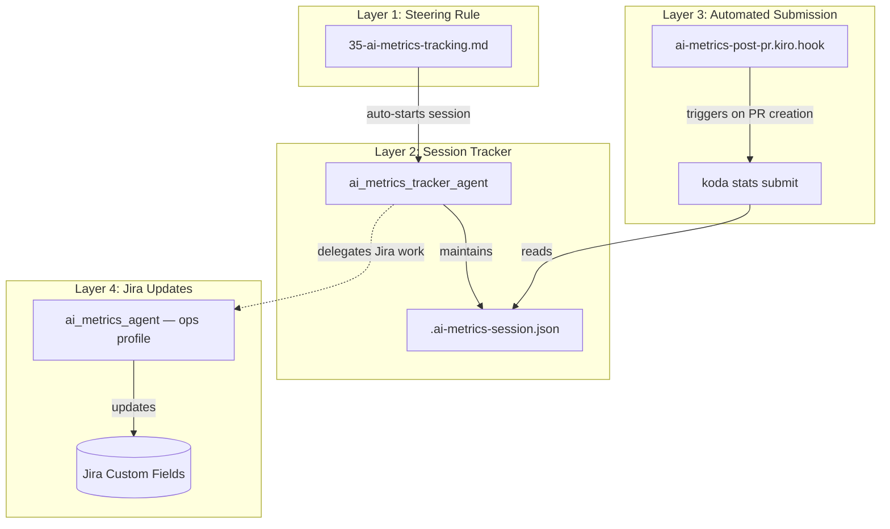
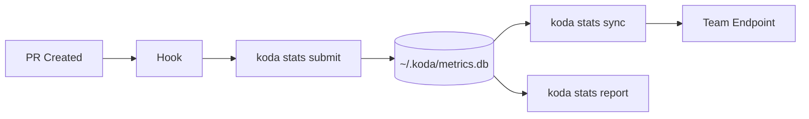

# AI Metrics Tracking

Track AI-assisted development work automatically and generate productivity reports. The system captures what AI did during a feature branch lifecycle and submits metrics at PR creation time.

---

## Architecture Overview



The mechanism has 4 layers that work together:

| Layer | Component | Profile | Trigger |
|-------|-----------|---------|---------|
| 1 | Steering rule `35-ai-metrics-tracking.md` | dev-core | Feature branch detected |
| 2 | `ai_metrics_tracker_agent` | dev-core | Steering rule or manual invocation |
| 3 | `ai-metrics-post-pr.kiro.hook` | shared (all profiles) | PR creation (postToolUse) |
| 4 | `ai_metrics_agent` | ops | Manual delegation from tracker |

---

## How It Works Automatically

### 1. Session starts on feature branches

When you begin working on a feature branch (anything other than `main`, `master`, or `develop`), the steering rule detects there's no active session and prompts:

> "I can track this work for your AI metrics — want me to start a session?"

If you say yes, the `ai_metrics_tracker_agent` creates `.ai-metrics-session.json` in your project root.

### 2. Work is logged silently during development

The steering rule appends to the work log at the end of each user turn. It batches significant actions into categories:

| Category | Logged when... |
|----------|---------------|
| `coding` | Files created or modified |
| `analysis` | External sources read (PRs, repos, Jira, docs) |
| `unit_testing` | Test suites executed |
| `code_review` | Lint/review/style enforcement |
| `documentation` | PR descriptions, summaries, doc comments |

### 3. Metrics submitted automatically on PR creation

The `ai-metrics-post-pr.kiro.hook` fires after any PR creation tool call (`create_pr`, `pr_create`). It:

1. Extracts the Jira ticket ID from the PR title or branch name (pattern: `[A-Z]+-\d+`)
2. Extracts the PR URL from the tool result
3. Runs `koda stats submit --ticket <TICKET_ID> --pr <PR_URL>`
4. Reports: "✓ Metrics recorded for \<TICKET_ID\>"

No user interaction required.

---

## Session File Format

Location: `.ai-metrics-session.json` in the project root (auto-added to `.gitignore`).

```json
{
  "session_id": "feature/CL-1234-add-auth_2026-05-20",
  "branch": "feature/CL-1234-add-auth",
  "started_at": "2026-05-20T09:00:00-04:00",
  "tickets": ["CL-1234"],
  "pr_url": null,
  "ai_tool": "Amazon Q (Claude Sonnet 4)",
  "work_log": [
    { "ts": "2026-05-20T09:15:00-04:00", "type": "analysis", "summary": "Read API docs for auth service" },
    { "ts": "2026-05-20T09:45:00-04:00", "type": "coding", "summary": "Implemented OAuth2 middleware" },
    { "ts": "2026-05-20T10:30:00-04:00", "type": "unit_testing", "summary": "Generated 12 test cases for middleware" }
  ],
  "status": "active"
}
```

This file persists across context compactions, multi-day sessions, and interfaces (CLI/IDE).

---

## Manual Usage

### Start a session

```
Start an AI metrics tracking session
```

Or: `Track AI metrics for this branch`

### Check session status

```
Show AI metrics session status
```

### Close a session (Google Form output)

```
Close the AI metrics session
```

The close workflow asks 3 required questions before generating output:

1. "How many days would this have taken without AI?"
2. "How many days did it actually take with AI?"
3. "Did we do any unit/integration testing?"

Then it generates a pre-filled Google Form output with variation percentages inferred from the work log.

### Submit metrics manually

```bash
koda stats submit --ticket OPS-123
koda stats submit --ticket OPS-123 --type coding --duration 45
koda stats submit --ticket OPS-123 --pr https://github.disney.com/.../pull/42
```

---

## Jira Field Updates (Optional)

The `ai_metrics_agent` (ops profile) can update Jira custom fields after a session closes:

| Jira Field | Custom Field ID | Type |
|------------|-----------------|------|
| AI Assisted Effort | `customfield_27200` | Number |
| AI Usage Level | `customfield_27201` | Select (Low/Medium/High) |
| AI Tools Used | `customfield_27202` | Text |

### AI Usage Levels

- **Low** — Primarily human effort; AI used for specific tasks (research, boilerplate)
- **Medium** — Balanced collaboration between human judgment and AI assistance
- **High** — AI-driven approach with human oversight and refinement

### How to trigger Jira updates

After closing a session, the tracker offers to delegate Jira updates. Accept, then invoke:

```
kiro-cli chat --agent ai_metrics_agent
```

Provide the ticket IDs and computed values. The ops agent updates the fields and adds an "AI-Peer-Reviewed" label.

---

## Google Form Output

The tracker generates output compatible with the team's [Google Form](https://docs.google.com/forms/d/e/1FAIpQLSeqlnsHZjIwxGxtVXmaKXBz584Nv4U7plbeY0UYOkxVp_bYBw/viewform):

```
AI Metrics Tracking

Jira Ticket / SNOW RQ, CTASK or INC: CL-1234
Did you use AI? Yes
Type: New development
Primary AI tool: Amazon Q (Claude Sonnet 4)
Original estimate: 5 days
Final variation: -40%

Development Cycle:
1. Analysis: -30%
2. Coding: -50%
3. Unit Testing: -60%
4. Integration Testing: 0%
5. Code Review: -20%
6. Documentation: -40%

Qualitative: AI generated the OAuth2 middleware scaffolding, all unit tests,
and PR description. Human effort focused on integration design decisions
and edge case handling.
```

### Variation calculation

```
variation = (actual_days - manual_estimate_days) / manual_estimate_days × 100
```

- Negative values = time saved with AI
- Positive values = more time spent with AI
- Zero = no perceived impact

---

## Ticket Type Classification

| Type | Applies to |
|------|-----------|
| New development | New features |
| Bug Fixing | Incidents, defects |
| Minor enhancement | Sustainment small changes |
| Modernization | Uplift, refactoring |
| Platform, Reliability and Ops | Automation testing, PE testing, performance, infra |

---

## AI Tool Options

The form supports these tool identifiers:

- Amazon Q (Claude Sonnet 4)
- Amazon Q (Claude Sonnet 4.5)
- Amazon Q (Claude Sonnet 4.6)
- Amazon Q (Claude Opus 4.5)
- Amazon Q (Claude Opus 4.6)
- Amazon Q (Claude Haiku 4.5)
- Amazon Q (Claude Sonnet 3.5)
- Amazon Q (Claude Sonnet -Autopilot-)
- Github Copilot (GPT-4.o)
- Github Copilot (GPT-4.1)
- Cursor
- ChatGPT
- CODA

Kiro CLI and Kiro IDE auto-detect to the matching "Amazon Q (Claude \<model\>)" option.

---

## Component Reference

### Files

| File | Location | Purpose |
|------|----------|---------|
| `ai_metrics_tracker_agent.json` | `profiles/dev-core/agents/` | Agent config (fs_read, fs_write, execute_bash) |
| `ai_metrics_tracker_agent.md` | `profiles/dev-core/prompts/` | Full agent prompt with workflows |
| `35-ai-metrics-tracking.md` | `profiles/dev-core/steering/` | Auto-start rule + koda stats integration |
| `ai-metrics-post-pr.kiro.hook` | `shared/hooks/` | postToolUse hook for PR creation |
| `ai_metrics_agent.json` | `profiles/ops/agents/` | Jira-capable agent config |
| `ai_metrics_agent.md` | `profiles/ops/prompts/` | Jira field update workflows |
| `generate-ai-metrics-report.md` | `common/prompts/` | Legacy report generation steps |

### Agents

| Agent | Profile | Tools | Purpose |
|-------|---------|-------|---------|
| `ai_metrics_tracker_agent` | dev-core | fs_read, fs_write, execute_bash | Session tracking + form generation |
| `ai_metrics_agent` | ops | @jira/*, @confluence/*, @github/*, execute_bash | Jira field updates + report comments |

---

## Comparison: Tracker vs Ops Agent

| | ai_metrics_tracker_agent (dev-core) | ai_metrics_agent (ops) |
|---|---|---|
| **When** | During development (branch lifecycle) | After PR is done |
| **Input** | Observed work log (automatic) | Developer recall (manual) |
| **Persistence** | `.ai-metrics-session.json` on disk | None (single conversation) |
| **Output** | Google Form text + koda stats | Jira comment + field updates |
| **Setup** | Requires dev-core profile + steering rule | Zero setup, invoke on-demand |
| **Best for** | Multi-day/multi-session work | Quick one-off reports |

Both produce the same Google Form output format.

---

## Future: koda stats Pipeline

A proposed integration (see `docs/specs/ai-metrics-integration.md`) replaces the Google Form with a fully automated pipeline:



Key changes:
- Metrics stored locally in SQLite (`~/.koda/metrics.db`)
- `koda stats sync` batch-POSTs to a team endpoint
- `koda stats report` generates aggregated reports
- Kite knowledge module reads metrics for project insights
- prompt-scorer correlates prompt quality with outcomes

Migration is non-breaking: a `KODA_METRICS_USE_FORM=1` shim preserves the Google Form path during transition.

---

## Troubleshooting

| Problem | Solution |
|---------|----------|
| Session not starting automatically | Verify you're on a feature branch (not main/master/develop) and dev-core profile is active |
| `.ai-metrics-session.json` committed to git | Add it to `.gitignore` — the agent does this automatically but check if it was missed |
| Hook not firing after PR | Verify `ai-metrics-post-pr.kiro.hook` exists in `~/.kiro/hooks/` (run `koda sync` to refresh) |
| `koda stats submit` not found | Update Koda to latest version (`koda upgrade`) |
| Jira fields not updating | Jira updates require the ops profile — invoke `ai_metrics_agent` separately |
| Wrong AI tool detected | Override manually when the tracker asks, or edit the session file directly |
