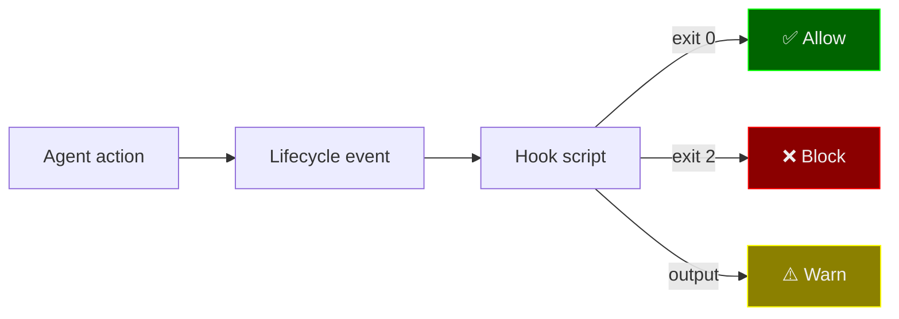

# Hooks & Powers Reference

Hooks enforce guardrails at the agent runtime level. Powers extend agent capabilities with custom tools. Both are reusable across agents and profiles.

---

## Hooks

Hook scripts in `.kiro/hooks/` attach to agent lifecycle events. They run automatically — no LLM cooperation required.

### How Hooks Work



| Exit code | Behavior                                           |
|:---------:|----------------------------------------------------|
|    `0`    | Allow — action proceeds                            |
|    `2`    | Block — action is rejected with the stderr message |
|   Other   | Allow — hook output shown as warning               |

### Available Hooks

#### git-context.sh
- **Event:** `agentSpawn`
- **Purpose:** Injects current branch and dirty file count when an agent starts
- **Used by:** 5 orchestrators
- **Output:** Branch name, short status, uncommitted change count

#### guard-writes.sh
- **Event:** `preToolUse` (fs_write)
- **Purpose:** Blocks writes to protected directories
- **Used by:** backend, webapi, ui, flutter, test_automation, api_tester
- **Blocks:** `node_modules/`, `dist/`, `.git/`

#### warn-destructive.sh
- **Event:** `postToolUse` (execute_bash)
- **Purpose:** Warns when destructive commands are executed
- **Used by:** dev-core orchestrator
- **Detects:** `rm -rf`, `DROP TABLE`, `DELETE FROM`, `--force`

#### branch-guard.sh
- **Event:** `preToolUse` (execute_bash)
- **Purpose:** Blocks direct git commits, pushes, and merges on `main`/`master`
- **Used by:** 5 orchestrators
- **Enforces:** Feature branch workflow

#### secret-scan.sh
- **Event:** `preToolUse` (fs_write)
- **Purpose:** Scans file content for potential secrets before writing
- **Used by:** backend, webapi, ui, flutter, test_automation, api_tester
- **Detects:** `password=`, `secret=`, `api_key=`, `token=`, `private_key=` with values

#### lint-on-write.sh
- **Event:** `postToolUse` (fs_write)
- **Purpose:** Auto-runs linter/formatter after file writes
- **Used by:** backend, webapi, ui, flutter, test_automation, api_tester
- **Supports:** TypeScript/JS (eslint), Java (google-java-format), Python (ruff), Dart (dart format)

### Hook × Agent Matrix

| Hook                  | Orchestrators | Write Agents | Event       |
|-----------------------|:-------------:|:------------:|-------------|
| `git-context.sh`      |      ✅ 5      |              | agentSpawn  |
| `guard-writes.sh`     |               |     ✅ 6      | preToolUse  |
| `secret-scan.sh`      |               |     ✅ 6      | preToolUse  |
| `warn-destructive.sh` |      ✅ 1      |              | postToolUse |
| `branch-guard.sh`     |      ✅ 5      |              | preToolUse  |
| `lint-on-write.sh`    |               |     ✅ 6      | postToolUse |

### Wiring a Hook

Add to an agent's JSON config:

```json
{
  "hooks": {
    "preToolUse": [
      {
        "matcher": "fs_write",
        "command": "$HOME/.kiro/hooks/guard-writes.sh",
        "description": "Block writes to node_modules, dist, .git"
      }
    ],
    "postToolUse": [
      {
        "matcher": "fs_write",
        "command": "$HOME/.kiro/hooks/lint-on-write.sh",
        "description": "Auto-lint after file writes"
      }
    ],
    "agentSpawn": [
      {
        "command": "$HOME/.kiro/hooks/git-context.sh",
        "description": "Inject git context on start"
      }
    ]
  }
}
```

### Creating a Custom Hook

1. Create a script in `.kiro/hooks/`:
   ```bash
   #!/bin/bash
   INPUT=$(cat)  # JSON with tool_input
   # Parse what you need
   FILE=$(echo "$INPUT" | python3 -c "import json,sys; print(json.load(sys.stdin).get('tool_input',{}).get('path',''))")
   # Exit 0 to allow, exit 2 to block
   ```
2. Make it executable: `chmod +x .kiro/hooks/my-hook.sh`
3. Add to agent configs under the appropriate event

---

## Powers

Powers in `.kiro-dev-core/powers/` are custom tool extensions. Each power is a directory with `power.json` (tool definitions) and `index.js` (implementation).

### Available Powers

#### git-ops
Git operations for development workflows.

| Tool         | Description                                             |
|--------------|---------------------------------------------------------|
| `git_status` | Current branch, changes, uncommitted files              |
| `git_diff`   | Show file differences (optional: specific file, staged) |
| `git_log`    | Recent commit history (configurable limit)              |

#### code-analysis
Code search and analysis utilities.

| Tool          | Description                        |
|---------------|------------------------------------|
| `find_files`  | Find files by pattern or extension |
| `search_code` | Search text/regex in code files    |
| `count_lines` | Count lines of code by file type   |

#### file-ops
Advanced file operations.

| Tool              | Description                          |
|-------------------|--------------------------------------|
| `backup_file`     | Create timestamped backup of a file  |
| `compare_files`   | Diff two files and show differences  |
| `find_duplicates` | Find duplicate files by content hash |

#### test-runner
Test execution and discovery.

| Tool            | Description                                      |
|-----------------|--------------------------------------------------|
| `run_tests`     | Execute test commands (npm test, mvn test, etc.) |
| `find_tests`    | Locate test files by framework                   |
| `test_coverage` | Run coverage analysis                            |

#### dependency-check
Dependency vulnerability and freshness analysis.

| Tool                    | Description                             |
|-------------------------|-----------------------------------------|
| `check_outdated`        | List outdated dependencies (npm/maven)  |
| `check_vulnerabilities` | Scan for known security vulnerabilities |

#### api-docs
API documentation extraction and validation.

| Tool                | Description                                    |
|---------------------|------------------------------------------------|
| `extract_openapi`   | Find and extract OpenAPI/Swagger specs         |
| `validate_contract` | Validate spec for completeness and correctness |

### Wiring a Power

Add to an agent's JSON config:

```json
{
  "powers": ["git-ops", "code-analysis", "dependency-check"]
}
```

### Creating a Custom Power

1. Create directory: `.kiro-dev-core/powers/my-power/`
2. Add `power.json`:
   ```json
   {
     "name": "my-power",
     "version": "1.0.0",
     "description": "What it does",
     "tools": [
       {
         "name": "my_tool",
         "description": "Tool description",
         "parameters": {
           "type": "object",
           "properties": {
             "input": { "type": "string", "description": "Input param" }
           },
           "required": ["input"]
         }
       }
     ]
   }
   ```
3. Implement in `index.js`:
   ```javascript
   module.exports = {
     async my_tool({ input }) {
       return { success: true, output: result };
     }
   };
   ```

See [`profiles/dev-core/powers/GUIDE.md`](../../profiles/dev-core/powers/GUIDE.md) for the full creation guide.

---

Back to [README](../README.md)
