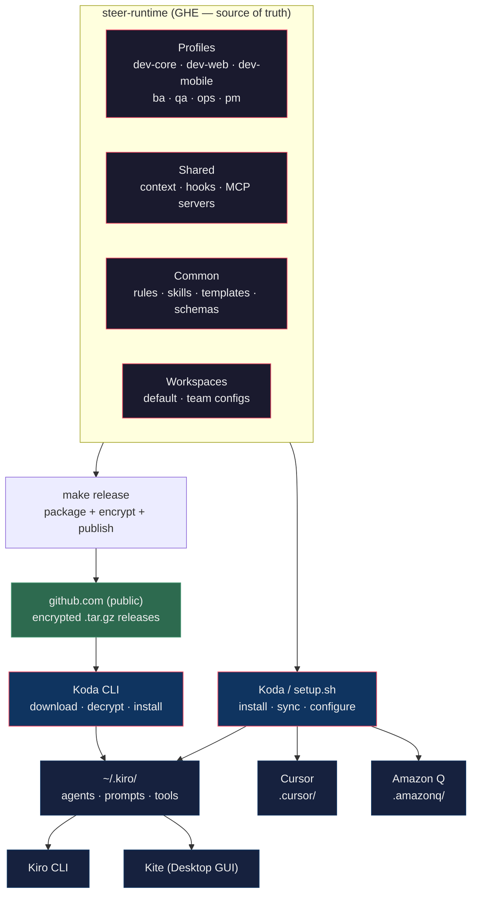

# steer-runtime Reference

Full reference for commands, MCP servers, architecture, project structure, and extensibility.

For quick setup, see the [README][readme].

---

## Project Manifest (`project.yaml`)

Drop a `project.yaml` in your project root to give agents structured config. No fork needed — any team, any project.

### Field Reference

| Field                                   | Type    | Required | Description                                                                                               |
|-----------------------------------------|---------|----------|-----------------------------------------------------------------------------------------------------------|
| `name`                                  | string  | yes      | Project name                                                                                              |
| `stack`                                 | string  | yes      | Primary tech stack (`java`, `node`, `angular`, `astro`, `go`, `flutter`, `csharp`, `python`, `terraform`) |
| `baseBranch`                            | string  | yes      | Default branch for PRs and diffs (default: `main`)                                                        |
| `commands.build`                        | string  | no       | Build command (e.g., `mvn clean package`)                                                                 |
| `commands.test`                         | string  | no       | Test command (e.g., `npm test`)                                                                           |
| `commands.lint`                         | string  | no       | Lint command (e.g., `npm run lint`)                                                                       |
| `commands.format`                       | string  | no       | Format command (e.g., `mvn spotless:apply`)                                                               |
| `integrations.jira.projectKey`          | string  | no       | Jira project prefix (e.g., `DPAY`)                                                                        |
| `integrations.jira.statuses.inProgress` | string  | no       | Jira status name for "in progress"                                                                        |
| `integrations.jira.statuses.review`     | string  | no       | Jira status name for "in review"                                                                          |
| `integrations.jira.statuses.done`       | string  | no       | Jira status name for "done"                                                                               |
| `integrations.github.org`               | string  | no       | GitHub org (e.g., `SANCR225`)                                                                             |
| `integrations.github.repo`              | string  | no       | GitHub repo name                                                                                          |
| `workspace.specsDir`                    | string  | no       | Where spec documents live (default: `docs/specs/`)                                                        |
| `workspace.useSpecs`                    | boolean | no       | Whether agents should reference specs                                                                     |
| `workspace.memoryBank`                  | string  | no       | Memory bank name from workspaces                                                                          |

### How Agents Use It

Agents check for `project.yaml` at the start of every workflow (Step 0):
1. `project.yaml` found → use it
2. Not found → fall back to memory bank or `.kiro/context/`
3. Neither exists → ask the user

### Scaffold a Manifest

```bash
./setup.sh init-manifest ~/my-project    # Detects stack, commands, GitHub org/repo
```

### Examples

See `common/templates/examples/` for complete examples:
- [Java/Spring Boot][example-java]
- [Node.js/Express][example-node]

Template: [`common/templates/project.yaml`][template-project]
Schema: [`common/schemas/project.schema.json`][schema-project]

---

## Commands

### Koda (recommended)

```bash
koda install <profiles>           # Install profiles
koda sync                         # Re-install from local release
koda sync --update                # Download latest release + sync
koda list                         # List available profiles
koda check                        # Verify installation
koda doctor                       # Deep health check
koda status                       # Show agent setup status
koda diff                         # Preview what sync would change
koda mcp-install                  # Setup MCP servers + tokens (interactive on first run)
koda mcp-install --assistant      # Force interactive assistant to reconfigure servers/tokens
koda configure                    # Reconfigure tokens
koda enable-tools                 # Enable thinking, todo, knowledge
koda workspace list               # List workspaces
koda workspace apply <team>       # Apply team config
koda chat --agent <name>          # Chat with an agent
koda stats                        # Token usage and prompt scoring stats
koda auto-update enable           # Daily sync at 9 AM
koda upgrade                      # Update Koda binary
```

### setup.sh (⚠️ deprecated)

> **Deprecated:** Use `koda` instead. See [Koda install instructions][koda-repo].

```bash
# Core
koda list                 # List available profiles
koda install <profiles>   # Install one or more profiles
koda sync                 # Update installed profiles
koda remove <profiles>    # Remove specific profiles
koda check                # Verify installation
koda clean                # Remove all installed profiles

# Project
./setup.sh init-manifest <dir>  # Generate project.yaml from codebase
koda init-memory <dir>    # Initialize project memory bank

# MCP & Tools
koda mcp-install          # Setup MCP servers (interactive on first run, quick reinstall after)
koda mcp-install --assistant  # Force interactive assistant to reconfigure
koda configure            # Reconfigure MCP tokens only
koda enable-tools         # Enable thinking, todo, knowledge

# Team Workspaces
koda workspace list              # List available workspaces
koda workspace apply <team>      # Apply team config
koda workspace show <team>       # View workspace details

# Content
koda rules list           # List available coding rules
koda rules install --all  # Install rules to project
koda prompts list         # List available prompts

# Cursor IDE
./setup.sh cursor install <dir>  # Install Cursor rules + MCP config
./setup.sh cursor sync <dir>     # Update Cursor rules
./setup.sh cursor remove <dir>   # Remove .cursor/ directory

# Amazon Q Developer
koda amazonq install <dir>    # Install .amazonq/rules/ from templates
koda amazonq sync <dir>       # Update rules from latest templates
koda amazonq sync-all [dir]   # Full sync: templates + context + MCP to Amazon Q
koda amazonq sync-mcp         # Sync MCP servers to ~/.aws/amazonq/mcp.json
koda amazonq status [dir]     # Show current Amazon Q sync state
koda amazonq remove <dir>     # Remove .amazonq/ directory
```

---

## MCP Servers

Pre-built and bundled — no `npm install` required. Shared across all IDEs.

| Server              | Purpose                                          | Token                                                          |
|---------------------|--------------------------------------------------|----------------------------------------------------------------|
| jira-mcp            | Jira issue management (multi-instance)           | `JIRA_PAT_{name}` in tokens.env                                |
| confluence-mcp      | Confluence wiki (multi-instance)                 | `CONFLUENCE_PAT_{name}` in tokens.env                          |
| github-mcp          | GitHub Enterprise (multi-instance)               | `GITHUB_TOKEN_{name}` in tokens.env                            |
| bruno-mcp           | API testing via Bruno collections                | No token needed                                                |
| mermaid-diagram-mcp | Diagram generation                               | No token needed                                                |
| figma-mcp           | Figma design files, components, styles, comments | [Generate][figma-tokens]                                       |
| compass-mcp         | Compass service catalog and API discovery (SSE)  | Compass token (contact your team lead)                         |

For per-agent MCP coverage, see [AGENTS.md][agents-mcp].

---

## Supported Tools

| Tool         | What it does                                                        | Setup                                                                     |
|--------------|---------------------------------------------------------------------|---------------------------------------------------------------------------|
| **Koda**     | Interactive terminal companion — install, sync, chat, TUI dashboard | `curl \| bash` from [github.com][koda-repo]                               |
| **Kiro CLI** | Native agent runtime                                                | [Getting Started][getting-started]                                        |
| **Cursor**   | IDE with `.mdc` rules + MCP                                         | `./setup.sh cursor install <dir>`                                         |
| **Amazon Q** | IDE with `.md` rules                                                | `koda amazonq install <dir>`                                              |
| **Kite**     | Desktop GUI wrapping Kiro CLI                                       | [Kite repo][kite-repo]                                                    |

---

## Using Across Projects and Teams

### Team Workspaces — one-command team setup

```bash
koda workspace apply payments-core     # or: koda workspace apply payments-core
```

Each workspace is a `workspace.json` manifest with profiles, rules, context, and Jira/board config. See [Team Workspaces][team-workspaces].

### Memory Banks — project-specific context

```bash
koda init-memory ~/my-project
```

Memory banks give agents project-specific knowledge — tech stack, repo structure, conventions.

### Project Manifest — structured config

```bash
./setup.sh init-manifest ~/my-project
```

`project.yaml` gives agents machine-readable config (stack, commands, Jira prefix) without forking steer-runtime.

### Fork Strategy — cross-team governance

For multi-team organizations. See [Fork Strategy][fork-strategy].

---

## Architecture



**Key insight:** Agent knowledge is authored once in `profiles/` and `common/`. Koda downloads encrypted releases from public github.com — no GHE access needed for end users. Koda (or `setup.sh`) compiles to each IDE's native format.

---

## Project Structure

```
steer-runtime/
├── profiles/                     # Agent profiles (source)
│   ├── dev-core/                 #   16 agents — orchestrator, architecture, code review, etc.
│   ├── dev-web/                  #   4 agents — backend, webapi, ui, ux
│   ├── dev-mobile/               #   3 agents — flutter, android, ios
│   ├── ba/                       #   7 agents — scope, features, PRD, backlog, quality gate
│   ├── qa/                       #   10 agents — test planning, automation, E2E, defects
│   ├── ops/                      #   7 agents — metrics, infra, deploy, quality, releases
│   └── pm/                       #   6 agents — sprints, standups, retros, risks, delivery
├── shared/                       # Shared resources
│   ├── context/                  #   Golden rules, guidelines per profile
│   ├── hooks/                    #   6 hooks — write guard, secret scan, branch guard, etc.
│   └── tools/mcp-servers/        #   7 MCP bundles — Jira, Confluence, GitHub, etc.
├── common/                       # Reusable content
│   ├── rules/                    #   16 tech stack rules (Java, Node, Go, C#, K8s, AWS, etc.)
│   ├── skills/                   #   7 workflow skills (implement-ticket, ship-it, etc.)
│   ├── templates/                #   project.yaml, spec templates, examples
│   ├── schemas/                  #   JSON schemas for validation
│   ├── artifact-templates/       #   PRD, backlog, test plan, ADR templates
│   ├── agents/                   #   Shared agents (quality_gate_agent)
│   └── prompts/                  #   Shared prompts
├── workspaces/                   # Team configurations
│   ├── default/                  #   Org-wide baseline
│   ├── payments-core/            #   Team-specific
│   ├── dta-team/                 #   PM workspace
│   ├── uad-sustainment/          #   PM workspace
│   └── uad-ongoing/              #   PM workspace
├── .cursor-templates/            # Cursor IDE rule templates
├── .amazonq-templates/           # Amazon Q rule templates
├── .github/ISSUE_TEMPLATE/       # Feature request + bug report templates
├── docs/                         # All documentation
├── Makefile                      # Release packaging (encrypt + publish)
├── setup.sh                      # Bash fallback (Koda is primary)
└── setup.ps1                     # Windows setup
```

---

## Extending steer-runtime

### Add a new profile

1. Create `profiles/<name>/agents/` and `profiles/<name>/prompts/`
2. Add agent JSON configs and prompt markdown files
3. Run `koda install <name>` — auto-discovered

### Add a new IDE target

1. Create a templates directory (e.g., `.windsurf-templates/`)
2. Add a compile command to `setup.sh` (Koda auto-discovers)
3. Agent definitions, context, and MCP servers stay the same

### Add a new MCP server

1. Bundle the server into `shared/tools/mcp-servers/<name>/`
2. Reference it in agent configs (`mcpServers` key)
3. Add token configuration to `koda mcp-install` / `setup.sh mcp-install`

### Add a new rule

1. Create `common/rules/general-<stack>.md`
2. Install with `koda rules install <name>` or `koda rules install <name>`

### Add a new skill

1. Create `common/skills/<name>.md` with YAML frontmatter
2. Reference from agent prompts or invoke via `@prompt`

---

## Features

✅ 50 specialized agents across 7 profiles (dev-core, dev-web, dev-mobile, ba, qa, ops, pm)
✅ 7 reusable skills — implement-ticket, ship-it, generate-plan, fix-failing-test, review-changed-code, generate-base-specifications, generate-spec-document
✅ 16 tech stack rules — Java, Node, Angular, Go, Flutter, C#, Python, React, K8s, AWS, SQL, Docker, Terraform, Liquibase, API design, testing strategies, performance
✅ IDE-portable — Kiro CLI, Cursor, Amazon Q, Kite
✅ Encrypted release distribution — Koda downloads from public github.com, decrypts with compiled key
✅ Project manifest (`project.yaml`) — structured config without forking
✅ Spec-driven development — templates + spec-aware agents
✅ Artifact generation — PRD, backlog, test plan, ADR templates with quality gates
✅ Release management — tag comparison, release notes, Confluence documentation
✅ Pre-built MCP bundles — Jira, Confluence, GitHub, Bruno, Mermaid
✅ Agent hooks — write guards, secret scanning, branch protection, lint-on-write
✅ Team workspaces — one-command setup per team
✅ Memory banks — project-specific knowledge across sessions
✅ Advanced tools — thinking, todo, delegate, knowledge (opt-in)
✅ Prompt scoring + token tracking via Koda
✅ Daily auto-update via LaunchAgent/cron

---

## All Documentation

| Audience       | Guides                                                                                                                                                                                                           |
|----------------|------------------------------------------------------------------------------------------------------------------------------------------------------------------------------------------------------------------|
| **Everyone**   | [Project Overview][project-overview] · [Agent Reference][agents] · [Getting Started][getting-started] · [Team Workspaces][team-workspaces] · [Fork Strategy][fork-strategy] · [Troubleshooting][troubleshooting] |
| **Developers** | [Hooks & Powers][hooks-and-powers] · [Prompt Guide][prompt-guide] · [Mobile Setup][mobile-setup] · [Architecture][design] · [MCP Config][mcp-setup]                                                              |
| **BA / PO**    | [BA Guide][ba-guide] · [Workflows][ba-workflows] · [Quick Ref][ba-quick-ref]                                                                                                                                     |
| **QA**         | [QA Guide][qa-guide] · [Workflows][qa-workflows] · [Quick Ref][qa-quick-ref] · [Overview][qa-overview]                                                                                                           |
| **Ops**        | [Ops Guide][ops-guide] · [Workflows][ops-workflows] · [Quick Ref][ops-quick-ref]                                                                                                                                 |
| **PM / Scrum** | [PM Guide][pm-guide] · [PM Workspaces][pm-workspaces]                                                                                                                                                            |
| **Cross-IDE**  | [IDE Concepts Comparison][ide-comparison] · [Cursor Setup][cursor-setup] · [Amazon Q][amazonq-readme] · [Windows][windows-setup]                                                                                 |
| **Roadmap**    | [Roadmap][roadmap] · [Waypoints][waypoints]                                                                                                                                                                      |

---

**Version:** 3.7.0 · **Agents:** 50 · **Updated:** March 30, 2026

<!-- Links -->
[agents]: ../../AGENTS.md
[agents-mcp]: ../../AGENTS.md#mcp-server-coverage
[amazonq-readme]: ../../.amazonq-templates/README.md
[ba-guide]: ../profiles/ba/BA_PROMPT_GUIDE.md
[ba-quick-ref]: ../profiles/ba/BA_QUICK_REFERENCE.md
[ba-workflows]: ../profiles/ba/BA_WORKFLOWS.md
[cursor-setup]: ../getting-started/CURSOR_SETUP.md
[design]: ../architecture/DESIGN.md
[example-java]: ../../common/templates/examples/project-java-spring.yaml
[example-node]: ../../common/templates/examples/project-node-express.yaml
[figma-tokens]: https://www.figma.com/developers/api#access-tokens
[fork-strategy]: FORK_STRATEGY.md
[getting-started]: ../getting-started/GETTING_STARTED.md
[hooks-and-powers]: HOOKS_AND_POWERS.md
[ide-comparison]: ../getting-started/IDE_CONCEPTS_COMPARISON.md
[kite-repo]: https://github.disney.com/SANCR225/Kite
[koda-repo]: https://github.disney.com/SANCR225/Koda
[mcp-setup]: MCP_SETUP.md
[mobile-setup]: ../getting-started/MOBILE_AGENTS_SETUP.md
[ops-guide]: ../profiles/ops/OPS_PROMPT_GUIDE.md
[ops-quick-ref]: ../profiles/ops/OPS_QUICK_REFERENCE.md
[ops-workflows]: ../profiles/ops/OPS_WORKFLOWS.md
[pm-guide]: ../profiles/pm/PM_PROMPT_GUIDE.md
[pm-workspaces]: ../profiles/pm/PM_WORKSPACES_GUIDE.md
[project-overview]: ../architecture/PROJECT_OVERVIEW.md
[prompt-guide]: ../profiles/dev/PROMPT_GUIDE.md
[qa-guide]: ../profiles/qa/QA_PROMPT_GUIDE.md
[qa-overview]: ../profiles/qa/QA_PROFILE_OVERVIEW.md
[qa-quick-ref]: ../profiles/qa/QA_QUICK_REFERENCE.md
[qa-workflows]: ../profiles/qa/QA_WORKFLOWS.md
[readme]: ../README.md
[roadmap]: ../ROADMAP.md
[schema-project]: ../../common/schemas/project.schema.json
[team-workspaces]: TEAM_WORKSPACES.md
[template-project]: ../../common/templates/project.yaml
[troubleshooting]: TROUBLESHOOTING.md
[waypoints]: https://github.disney.com/users/SANCR225/projects/2/views/1
[windows-setup]: ../getting-started/WINDOWS_SETUP.md
