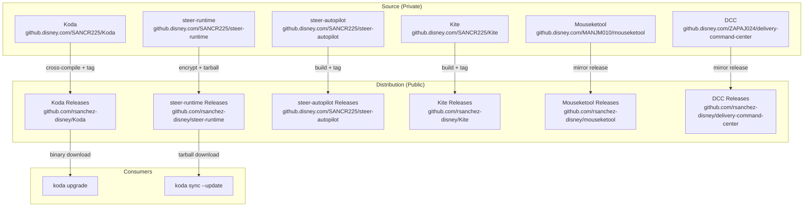
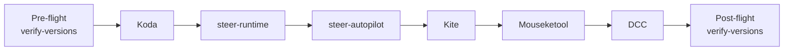
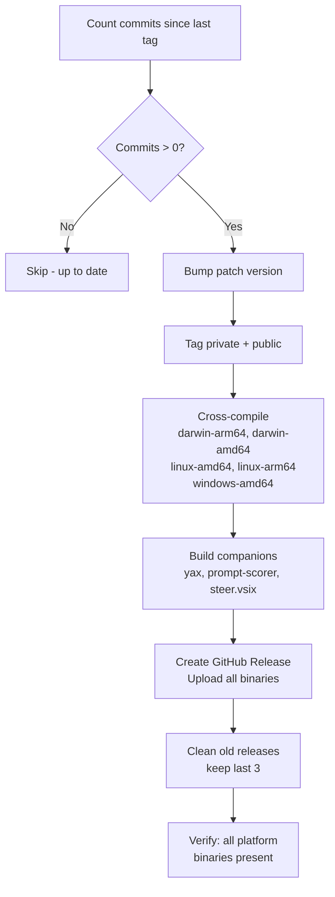
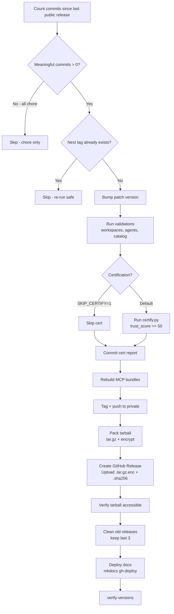
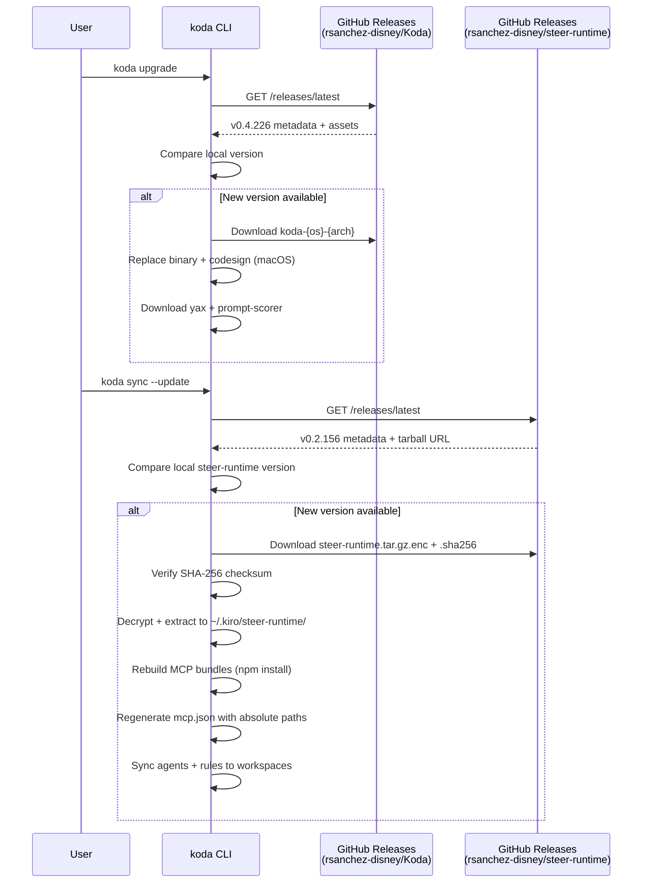

# Release workflow

How steer-runtime, Koda, and companion tools are published and distributed.

## Overview

All releases are orchestrated from the Koda repo via a single command:

```bash
cd ~/Workspace/Disney/SANCR225/Koda
make publish-all SKIP_CERTIFY=1
```

This detects changes across all repos, auto-bumps versions, builds artifacts, publishes to GitHub Releases, and verifies each step.

## Architecture



## Pipeline order

`publish-all` processes repos in a fixed sequence. Each step only runs if there are meaningful commits since the last tag.



## Koda publish flow



**Artifacts published per release:**

| Artifact                  | Platforms            | Purpose                  |
|---------------------------|----------------------|--------------------------|
| `koda-darwin-arm64`       | macOS Apple Silicon  | CLI/TUI binary           |
| `koda-darwin-amd64`       | macOS Intel          | CLI/TUI binary           |
| `koda-linux-amd64`        | Linux x64            | CI/server environments   |
| `koda-linux-arm64`        | Linux ARM            | ARM servers              |
| `koda-windows-amd64.exe`  | Windows              | CLI/TUI binary           |
| `yax-*`                   | All platforms        | Persistent memory        |
| `prompt-scorer-*`         | All platforms        | Prompt quality scoring   |
| `steer.vsix`              | VS Code              | IDE extension            |

## steer-runtime publish flow



**Key details:**

- The tarball excludes `.git`, `node_modules`, MCP server source files (only `dist/` bundles included)
- Encrypted with a release key embedded in Koda at build time
- SHA-256 checksum uploaded alongside for integrity verification
- `koda upgrade` verifies the checksum on download (backward-compatible)

## steer-autopilot, Kite, Mouseketool, DCC

These follow simpler patterns:

| Repo            | Publish pattern                              | Distribution                   |
|-----------------|----------------------------------------------|--------------------------------|
| steer-autopilot | Tag + build via its own Makefile `release`   | Private GHE releases           |
| Kite            | Tag + npm build + upload Electron app        | Public GitHub releases         |
| Mouseketool     | Mirror: copy GHE release to public repo      | Public GitHub releases         |
| DCC             | Mirror: copy GHE release to public repo      | Public GitHub releases         |

## Consumer flow (koda upgrade)



## Version schemes

| Repo            | Scheme   | Example    | Bump trigger              |
|-----------------|----------|------------|---------------------------|
| Koda            | v0.4.x   | v0.4.226   | Any commit on main        |
| steer-runtime   | v0.2.x   | v0.2.156   | Non-chore commits on main |
| steer-autopilot | v1.0.x   | v1.0.3     | Any commit on main        |
| Kite            | v0.1.x   | v0.1.12    | Any commit on main        |

## Verification gates

After each publish step, verification targets run automatically:

| Target                   | What it checks                                             |
|--------------------------|------------------------------------------------------------|
| `verify-release-koda`   | All 5 platform binaries + companions present in release    |
| `verify-release-steer`  | Tarball asset accessible via GitHub API                    |
| `verify-versions`       | Private = Public = Local tag consistency                   |

## Safety mechanisms

| Mechanism                       | What it prevents                                          |
|---------------------------------|-----------------------------------------------------------|
| Chore-commit filtering          | Empty releases from publish's own certification commits   |
| Idempotent re-run guard         | Double-publishing if re-run after partial failure         |
| Pre-flight version check        | Publishing when versions are already inconsistent         |
| Tarball checksum (SHA-256)      | Corrupted downloads reaching users                       |
| Release key encryption          | Unauthorized access to steer-runtime contents            |
| Keep-last-3 cleanup             | Storage bloat from accumulated releases                  |
| Validation gates                | Publishing broken agent configs or workspace definitions  |

## Common failure modes and recovery

| Symptom                              | Cause                          | Fix                                              |
|--------------------------------------|--------------------------------|--------------------------------------------------|
| `Public ≠ Local` version mismatch   | Stale local tag from prior run | `git tag -d vX.Y.Z` (delete stale local tag)    |
| `no .tar.gz asset found`            | Tarball upload failed          | `make pack-steer && gh release upload`           |
| `tag already exists`                 | Re-run after partial publish   | Automatic (re-run safe with guard)               |
| Private ≠ Public version            | Release not created on private | `gh release create` on private repo              |
| `Cannot resolve tag in local repo`  | Missing tag locally            | `git fetch --tags` in steer-runtime              |
| v3+ tags found                       | Internal tags leaked           | `git tag -d` + `git push --delete origin`        |

## Manual operations

### Hotfix re-publish (same version, new tarball)

```bash
cd ~/Workspace/Disney/SANCR225/Koda
make pack-steer STEER_ROOT=../steer-runtime
GH_HOST=github.com gh release upload v0.2.156 bin/steer-runtime.tar.gz.enc \
  --repo rsanchez-disney/steer-runtime --clobber
```

### Force publish specific repo

```bash
# Koda only
make publish TAG=v0.4.227

# steer-runtime only
make publish-steer TAG=v0.2.157 STEER_ROOT=../steer-runtime
```

### Verify everything is healthy

```bash
make verify-versions
make verify-release-koda TAG=v0.4.226
make verify-release-steer TAG=v0.2.156
```
