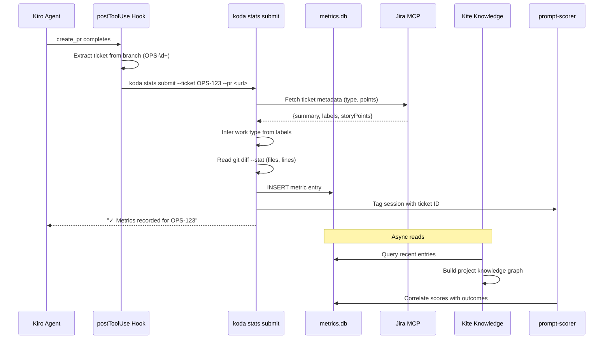
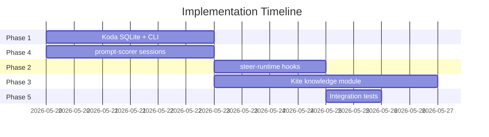

# AI Metrics Integration Spec

**Status:** Proposed  
**Date:** 2026-05-19  
**Author:** Ricardo Sanchez  
**Repos:** koda, steer-runtime, Kite, prompt-scorer

## Overview

Replace the manual Google Form workflow for AI metrics tracking with an automated data pipeline that captures metrics at PR creation time and feeds them into koda stats, prompt-scorer, and Kite's knowledge module.

## Architecture

```mermaid
flowchart TD
    subgraph steer-runtime
        HOOK[ai-metrics-post-pr.kiro.hook]
        STEERING[steering/ai-metrics-tracking.md]
    end

    subgraph koda
        CLI[koda stats submit]
        STORE[(~/.koda/metrics.db)]
        SYNC[koda stats sync]
        REPORT[koda stats report]
    end

    subgraph kite
        READER[metrics-store.ts]
        GRAPH[ticket-graph.ts]
        DASH[MetricsDashboard UI]
    end

    subgraph prompt-scorer
        SESSION[SessionContext]
        CORR[CorrelateQuality]
    end

    subgraph external
        JIRA[Jira API]
        GH[GitHub PR]
        ENDPOINT[Team endpoint / Google Form]
    end

    %% Trigger flow
    GH -->|PR created| HOOK
    HOOK -->|extracts ticket + PR URL| CLI
    STEERING -->|manual: "AI form OPS-123"| CLI

    %% Koda internal
    CLI -->|writes| STORE
    CLI -->|reads git context| GH
    CLI -->|fetches metadata| JIRA
    STORE -->|batch POST| SYNC
    SYNC -->|sends to| ENDPOINT
    STORE -->|aggregates| REPORT

    %% Kite reads
    STORE -->|reads| READER
    READER -->|enriches| GRAPH
    GRAPH -->|displays| DASH
    JIRA -->|ticket metadata| GRAPH

    %% Prompt-scorer
    CLI -->|tags session| SESSION
    SESSION -->|scores + outcomes| CORR
    CORR -->|quality insights| REPORT
```

## Data Flow



## Schema

### MetricEntry (SQLite: `~/.koda/metrics.db`)

| Column         | Type    | Notes                         |
|----------------|---------|-------------------------------|
| id             | TEXT PK | UUID                          |
| timestamp      | TEXT    | RFC3339                       |
| ticket_id      | TEXT    | Indexed                       |
| ticket_project | TEXT    | Indexed (prefix: OPS, DPAY)   |
| work_type      | TEXT    | coding, analysis, testing, docs, review |
| files_changed  | TEXT    | JSON array                    |
| lines_added    | INTEGER |                               |
| lines_removed  | INTEGER |                               |
| session_id     | TEXT    | Indexed                       |
| pr_url         | TEXT    |                               |
| branch         | TEXT    |                               |
| duration_min   | INTEGER |                               |
| ai_tools_used  | TEXT    | JSON array                    |
| outcome        | TEXT    | pending → merged / reverted / reopened |
| prompt_score   | REAL    | From prompt-scorer            |
| metadata       | TEXT    | JSON object (extensible)      |
| synced_at      | TEXT    | NULL until POSTed             |

### Work Type Inference

| Labels / Keywords                        | Work Type                                    |
|------------------------------------------|----------------------------------------------|
| bug, fix, defect, incident               | Bug Fixing                                   |
| refactor, uplift, moderniz               | Modernization                                |
| automation, infra, performance           | Platform & Ops                               |
| enhancement, sustainment, minor          | Minor Enhancement                            |
| (default)                                | New Development                              |

## Phases

### Phase 1: Koda Core (Foundation)

**Files:**

| File                             | Action | Description                    |
|----------------------------------|--------|--------------------------------|
| `internal/ops/metrics_schema.go` | create | MetricEntry struct             |
| `internal/ops/metrics_store.go`  | create | SQLite CRUD operations         |
| `internal/ops/metrics_sync.go`   | create | POST unsynced to endpoint      |
| `internal/cli/stats_submit.go`   | create | `koda stats submit` command    |
| `internal/cli/stats.go`          | modify | Wire submit + report subcommands |
| `go.mod`                         | modify | Add `modernc.org/sqlite`       |

**CLI:**

```bash
# Auto (from hook)
koda stats submit --ticket OPS-123 --pr https://github.disney.com/.../pull/42

# Manual
koda stats submit --ticket OPS-123 --type coding --duration 45

# Report
koda stats report --since 2w
koda stats report --project OPS --format json

# Sync to remote
koda stats sync
```

**Estimated effort:** 2-3 days

---

### Phase 2: steer-runtime Hook

**Files:**

| File                                              | Action | Description                    |
|---------------------------------------------------|--------|--------------------------------|
| `shared/hooks/ai-metrics-post-pr.kiro.hook`       | create | postToolUse trigger            |
| `shared/steering/35-ai-metrics-tracking.md`       | modify | Use koda stats instead of form |

**Hook:**

```json
{
  "name": "AI Metrics Submit",
  "version": "1",
  "enabled": true,
  "when": {
    "type": "postToolUse",
    "toolTypes": [".*create_pr.*", ".*gh_pr_create.*"]
  },
  "then": {
    "type": "askAgent",
    "prompt": "A PR was just created. Run `koda stats submit` with the ticket ID extracted from the branch name and the PR URL from the tool result. Do not ask questions."
  }
}
```

**Estimated effort:** 1-2 days

---

### Phase 3: Kite Knowledge Module

**Files:**

| File                                    | Action | Description                  |
|-----------------------------------------|--------|------------------------------|
| `packages/main/src/knowledge/metrics-store.ts` | create | Read metrics.db via better-sqlite3 |
| `packages/main/src/knowledge/ticket-graph.ts`  | create | Build relationship graph     |
| `packages/main/src/ipc/metrics.ts`             | create | IPC handlers for renderer    |
| `packages/renderer/src/components/MetricsDashboard.tsx` | create | UI visualization |

**Knowledge graph relationships:**

```
Ticket → files_changed → module patterns
Ticket → work_type → time distribution
Ticket → outcome → quality signals
Session → prompt_score → effectiveness
```

**Estimated effort:** 3-4 days

---

### Phase 4: prompt-scorer Session Tagging

**Files:**

| File                                        | Action | Description                |
|---------------------------------------------|--------|----------------------------|
| `go-prompt-scorer/session.go`               | create | SessionContext struct      |
| `go-prompt-scorer/outcomes.go`              | create | Outcome tracking           |
| `go-prompt-scorer/correlation.go`           | create | Score vs outcome analysis  |
| `go-prompt-scorer/session_test.go`          | create | Tests                      |

**Correlation output:**

```
Prompt Score 8+ → 92% merged first try, avg 2h to merge
Prompt Score 5-7 → 74% merged first try, avg 8h to merge
Prompt Score <5 → 45% merged first try, avg 24h to merge
```

**Estimated effort:** 2-3 days

---

### Phase 5: Integration & Sync

**Sync endpoint contract:**

```
POST /api/v1/metrics
Content-Type: application/json

{ "entries": [MetricEntry, ...] }

Response: 200 { "accepted": 5, "rejected": 0 }
```

**E2E test:** Hook trigger → koda stats submit → verify DB → koda stats sync → verify POST payload

**Estimated effort:** 1 day

---

## Dependency Graph



## Migration Path

| Step | Action | Breaking? |
|------|--------|:---------:|
| 1 | Ship Phase 1+2 with `KODA_METRICS_USE_FORM=1` legacy shim | No |
| 2 | Fork users run `koda stats migrate-form` to import history | No |
| 3 | Announce deprecation in CHANGELOG | No |
| 4 | Remove legacy shim after 2 releases | Yes |

## Testing Strategy

| Layer | Approach | Tools |
|-------|----------|-------|
| Koda store | Unit tests with in-memory SQLite | Go `testing` |
| Koda CLI | Table-driven tests with temp DB | Go `testing` |
| steer-runtime | Hook trigger simulation | Shell / bats |
| Kite store | Jest + temp SQLite | Jest, better-sqlite3 |
| prompt-scorer | Go unit tests | Go `testing` |
| E2E | Full pipeline with mock endpoint | Go integration |

## Total Effort

| Phase | Effort | Risk |
|:-----:|:------:|:----:|
| 1 | 2-3 days | Low |
| 2 | 1-2 days | Low |
| 3 | 3-4 days | Medium |
| 4 | 2-3 days | Low |
| 5 | 1 day | Low |
| **Total** | **9-13 days** | Parallelizable to ~6-8 calendar days |
