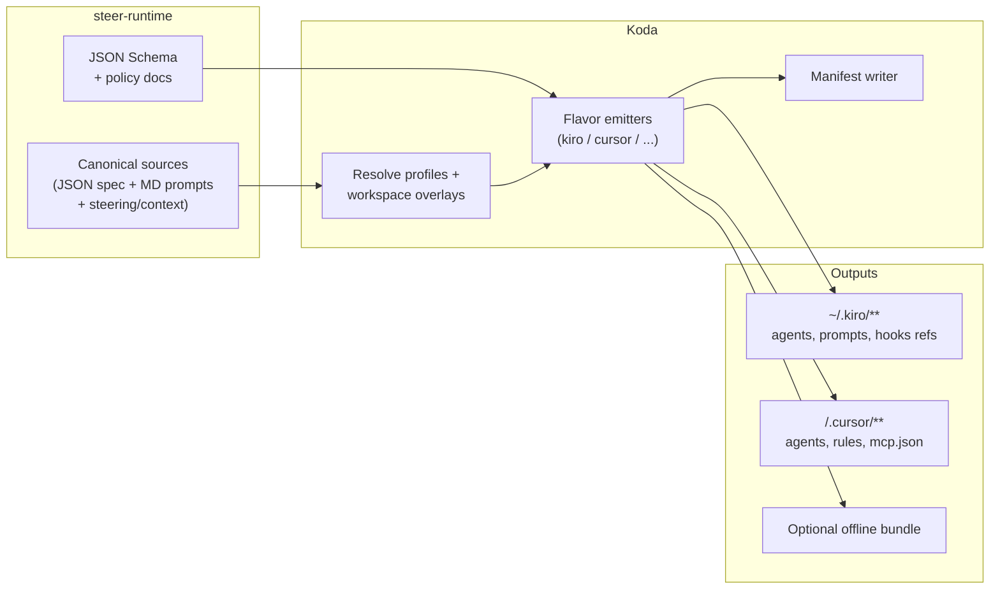

# Spec: Artifact Emit Model, Koda Flavors & Steer-Master-Only Maintenance

**Repos**: steer-runtime (canonical content + schemas) · Koda (materialization / distribution)  
**Status**: Proposed — for steer-master pair review  
**Audience**: `steer_orchestrator_agent`, `steer_reviewer_agent`, `koda_reviewer_agent`, `compatibility_agent`, `steer_release_manager_agent`, platform engineers  
**Date**: 2026-05-12  

---

## Document purpose

This specification consolidates the following decisions into one reviewable artifact:

1. **Agnostic abstraction**: How agent and related artifacts are modeled so they are not tied to a single IDE or CLI runtime.
2. **Flavor emission**: How **Koda** materializes **Kiro** vs **Cursor** (and future) outputs **on demand**, from the same steer-runtime source tree.
3. **Maintenance model**: **steer-master profile agents** are the **experts** responsible for maintaining agent definitions and generated surfaces, with **no routine manual human editing** of those definitions (governance gates excepted).

Steer-master agents should use this document as the **contract** for implementation planning, gap analysis, and pair review.

---

## Goals

| ID | Goal |
|----|------|
| G1 | **Single source of truth** for domain knowledge (prompts, steering, context, delegation semantics) in steer-runtime. |
| G2 | **Runtime-agnostic** modeling: Kiro-specific and Cursor-specific quirks live in **emitters**, not duplicated prose. |
| G3 | **Scalable adoption**: Teams install subsets (profiles, workspaces) via Koda; emission is **deterministic** and **versioned**. |
| G4 | **Agent-maintained**: steer-master agents propose and update specs and configs via PR-like workflow; humans gate merges only where policy requires. |
| G5 | **Honest parity**: Document where Cursor (or other flavors) **cannot** replicate Kiro hooks, sandboxed subagents, or tool policies. |

---

## Non-goals

- Replacing Kiro CLI or Cursor product capabilities.
- Guaranteeing byte-for-byte behavioral parity across flavors (explicitly out of scope except where specified).
- Defining LLM routing, model choice, or Disney-internal inference policies (reference existing governance only).

---

## Terminology

| Term | Definition |
|------|-------------|
| **Canonical source** | steer-runtime paths that define intent: profiles, workspaces, shared context, MCP bundles, hooks (reference), steering. |
| **Logical artifact** | A conceptual bundle (e.g. “agent persona”, “MCP wiring”, “delegation graph”) independent of output format. |
| **Flavor** | A target runtime family: `kiro`, `cursor`, and optionally `amazonq`, `github_copilot`, etc. |
| **Emitter** | Koda (or steer-runtime CI) code that transforms canonical inputs into flavor-specific files. |
| **Materialization** | Writing outputs to a destination (`~/.kiro`, `<project>/.cursor`, zip bundle). |
| **Manifest** | Machine-readable record of inputs (steer SHA, profiles, workspace, emitter version) and output checksums. |
| **Steer-master maintainer** | Automated actors implemented as steer-master profile agents; not role-playing humans for day-to-day edits. |

---

## Stakeholders and repos

| Responsibility | Owner |
|----------------|--------|
| Canonical prompts, steering, profile JSON today | steer-runtime |
| Install paths, MCP merge, workspace resolution, sync | Koda |
| Breaking changes that affect both | steer-runtime + Koda (`compatibility_agent` scope) |
| Release tagging, changelog discipline | `steer_release_manager_agent` + policy |

---

## Current state (baseline)

- steer-runtime stores agents as **`profiles/<id>/agents/*.json`** and prompts as **`profiles/<id>/prompts/*.md`** (plus steering, context, workspaces).
- Koda **`InstallProfile`** copies/transforms into **`~/.kiro/`** for Kiro CLI.
- Cursor today is partially served by **`.cursor-templates/*.mdc`** via **`setup.sh cursor install`**; **full agent markdown packs are not yet emitted** from every profile agent automatically.
- **`IDE_CONCEPTS_COMPARISON.md`** describes a compilation mental model; **implementation is incomplete** relative to that vision.

This spec closes that gap by specifying **what** to build, not assuming it already exists.

---

## Architecture overview



---

## Design principles

1. **Separation of concerns**: Narrative and standards live in **Markdown**; machine contracts live in **schema-validated structured data** optimized for agents.
2. **Emit, don’t fork**: One canonical delegation semantic → multiple rendered forms (`subagent` playbook vs `@agent` handoff tables).
3. **Small blast radius**: Prefer **many small canonical files** over monoliths to reduce merge/regeneration conflicts when bots rewrite content.
4. **Deterministic output**: Same inputs + same emitter version → same bytes (sorted keys, pinned templates).
5. **Explicit degradation**: Each logical artifact declares **`parity`** per flavor: `full` | `degraded` | `unsupported`.

---

## Canonical abstraction model

### 1) Authoring format (steer-master maintained)

**Decision**: Primary structured canonical layer for agent **metadata and relationships** is **JSON** validated by **JSON Schema** checked into steer-runtime.

Rationale (review checklist for steer-master):

- steer-master agents are the editors: **deterministic typing**, straightforward patching, universal tooling, alignment with existing `agents/*.json` consumed by Kiro.
- **YAML** remains acceptable only as **machine-normalized** optional interchange if needed; if used, CI must canonicalize to JSON before merge.
- **Markdown** remains the format for **`prompts/`**, **`steering/`**, and shared **`context/`** prose.

### 2) Relationship to existing `agents/*.json`

**Migration stance**:

- **Phase 0**: Existing per-agent JSON remains the runtime source for Kiro; **no breaking change** to kiro-cli validation.
- **Phase 1**: Introduce **`schema/`** (JSON Schema) describing allowed agent JSON shape **plus optional extension fields** segregated under a reserved key (e.g. `x_emit`) **only if** kiro-cli ignores unknown keys — **requires verification** before adoption. If kiro-cli rejects unknown keys, extension metadata lives in **sidecar files** `agents/<name>.emit.json` merged only at emission time.
- **Phase 2**: Optional consolidation into a single **`AgentSpec`** directory per profile if redundancy becomes painful; not required for MVP.

**Steer-master review question**: Confirm kiro-cli behavior for unknown JSON keys; drives sidecar vs inline extensions.

### 3) Required logical entities (minimum schema concepts)

The canonical model MUST be able to express (by composition of existing files or new sidecars):

| Entity | Description |
|--------|----------------|
| **Agent identity** | Stable `name`, `description`, owning `profile`. |
| **Prompt binding** | Reference to markdown prompt file(s). |
| **Resource binding** | Ordered list of context/steering paths (may be flavor-expanded differently). |
| **Tool intent** | Abstract capability tags (e.g. `bash`, `subagent`, `mcp:jira`, `yax`) mapped per flavor. |
| **Hooks intent** | Which hook scripts apply (Kiro-only unless Cursor hooks equivalent exists). |
| **Delegation graph** | Ordered edges for orchestrators: `(step, delegate_to_agent, gate_type)`. |
| **Emit hints** | Cursor-specific: suggested `@` mentions, manual vs always-on rule routing. |

Exact JSON Schema fields are **Appendix A** (starter); steer-master should evolve schema in-repo under `schema/artifact-emit/`.

---

## Artifact taxonomy and parity matrix

Each **logical artifact** MUST declare parity per flavor.

| Logical artifact | Kiro output (typical) | Cursor output (typical) | Default parity |
|------------------|------------------------|-------------------------|----------------|
| Agent definition | `~/.kiro/agents/<name>.json` | `.cursor/agents/<profile>-<name>.md` | full / degraded |
| Prompt body | `~/.kiro/prompts/<file>.md` | inlined or `@`-linked from agent MD | full |
| Steering | copied under `.kiro/` tree | `.cursor/rules/*.mdc` or linked docs | degraded |
| MCP configuration | via `includeMcpJson` / settings | `.cursor/mcp.json` | full |
| Lifecycle hooks | `hooks` in agent JSON | rules / optional Cursor hooks / docs only | unsupported → degraded |
| Subagent delegation | `subagent` tool | orchestrator MD handoff table + `@` agents | degraded |
| Persistent memory | `knowledge`, yax | external docs / MCP / manual | degraded |

**Steer-master obligation**: When parity is not `full`, emitted artifacts MUST include a short **“Flavor limits”** section so end users are not misled.

---

## Koda: emission API (specified behavior)

### Commands (proposed)

| Command | Purpose |
|---------|---------|
| `koda emit kiro` | Materialize Kiro layout to `targetDir` (default `~/.kiro`), honoring installed profiles + workspace overlays. |
| `koda emit cursor --project <DIR>` | Materialize Cursor layout under `<DIR>/.cursor/`. |
| `koda emit bundle --format zip` | Produce distributable archive for airgap or IT-managed rollout. |
| `koda emit check` | Validate canonical inputs against schema; dry-run emit; fail CI on drift if configured. |

Names are **proposed**; `koda materialize` alias acceptable if UX prefers existing vocabulary.

### Inputs

- **`STEER_ROOT`**: steer-runtime clone path (e.g. `~/.kiro/steer-runtime` or dev workspace).
- **Profile list**: After alias expansion (`ExpandAliases`).
- **Active workspace** (optional): resolved inheritance (`ResolveWorkspace`).
- **Flavor options**: `--agents` filter, `--include-steering`, `--strict-parity`.

### Outputs

- Written files per flavor.
- **`emit-manifest.json`** alongside outputs (or embedded in bundle root):

```json
{
  "schema_version": "2026-05-12",
  "steer_commit": "<sha>",
  "koda_version": "<semver>",
  "flavor": "cursor",
  "profiles": ["dev-core", "qa"],
  "workspace": "opsheet-vas-team",
  "outputs": [
    { "path": ".cursor/agents/dev-core-orchestrator.md", "sha256": "..." }
  ]
}
```

### Idempotency

Emitters MUST be safe to run repeatedly; SHOULD use **full regeneration** of emitted subtrees for bot-maintained directories to avoid patch drift.

---

## Steer-master operational model

### Roles

| steer-master agent | Spec responsibility |
|--------------------|---------------------|
| `steer_orchestrator_agent` | Breaks spec into tasks; coordinates reviewers and compatibility checks. |
| `steer_reviewer_agent` | steer-runtime consistency: schema, profiles, docs, breaking changes. |
| `koda_reviewer_agent` | Koda emitter interfaces, CLI UX, backward compatibility. |
| `compatibility_agent` | Cross-repo contracts (manifest fields, install paths, MCP merge behavior). |
| `steer_release_manager_agent` | Versioning, release notes when spec ships or schemas bump. |

### Workflow (normative)

1. **Change proposal**: Branch from `main` with conventional commit scope (`feat(emit): ...`, `docs(spec): ...`).
2. **Validation gates** (automated):
   - JSON Schema validation for canonical structured files.
   - `koda emit check` (once implemented).
   - Existing repo checks (agent validate, tests) as applicable.
3. **Pair review**: Minimum **two steer-master agents** (or agent + human per policy) MUST comment on:
   - parity classifications,
   - schema churn,
   - Koda API surface,
   - rollback story.
4. **Merge**: Per org policy (may require human approval on protected branches).

### Forbidden practices

- Manual edits to **generated-only** paths without updating canonical sources (if repo adopts generated artifacts in-tree).
- Declaring `full` parity without emitter support and tests.

---

## CI and drift policy

| Gate | Requirement |
|------|-------------|
| Schema | PR fails if canonical JSON/sidecars violate schema. |
| Emitter | Optional: committed snapshots of generated Cursor agents; OR forbid committing generated files and only verify in CI artifact job. |
| Manifest | Release artifacts include manifest for traceability. |

**Steer-master decision**: Choose **committed snapshots** vs **generate-on-install only** per flavor; snapshots aid review burden, generate-only reduces repo noise.

---

## Phased rollout

| Phase | steer-runtime | Koda | Exit criteria |
|-------|---------------|------|----------------|
| **P0** | Land this spec + JSON Schema skeleton under `schema/` | No user-facing change | Spec approved by steer-master pair review |
| **P1** | Define delegation fragments reusable across emitters | Implement `emit cursor` MVP (subset: dev-core orchestrator + 3 leaf agents) | Cursor project receives valid `.cursor/agents/*.md` |
| **P2** | Sidecars or verified inline `x_emit` | Implement `emit check` + manifest | CI green on sample profile |
| **P3** | Expand profile coverage | Refactor `InstallProfile` internals into shared resolver used by `emit kiro` | Single codepath for resolution |
| **P4** | Optional `AgentSpec` consolidation | Bundles + offline zip | Partner team pilot |

---

## Risks and mitigations

| Risk | Mitigation |
|------|------------|
| kiro-cli rejects extended JSON | Use **`*.emit.json` sidecars** until upstream allows extensions. |
| Cursor product changes agent format | Version emitter templates; manifest pins emitter version. |
| Bot-generated PR noise | Regenerate full subtrees; squash merges; CODEOWNERS / policy bots. |
| False parity claims | Parity matrix enforced in schema + reviewer checklist. |
| Secret leakage in emitted files | Emitters MUST NOT embed tokens; only placeholders + references to `tokens.env`. |

---

## Open questions (steer-master must resolve)

1. Does **kiro-cli** tolerate unknown top-level keys in agent JSON? Reference exact version matrix.
2. Are **Cursor agent markdown** filenames namespaced by profile (`dev-core-orchestrator`) or flat (`orchestrator`) with collision rules?
3. **Committed vs generated** Cursor artifacts in steer-runtime repo?
4. Minimum **agent subset** for first Cursor emit milestone?
5. Human **merge approval** requirement vs fully automated merge (org dependent).

---

## Pair review checklist (copy into PR template)

- [ ] Goals / non-goals still accurate.
- [ ] Parity matrix entries for each new logical artifact.
- [ ] Schema version bumped if JSON shape changed.
- [ ] Koda command names and flags documented and aligned with implementation PR.
- [ ] Migration phase assigned; no silent breaking change to `koda install` / `koda sync`.
- [ ] Rollback: previous emitter version + prior steer tag recoverable.
- [ ] Security: no secrets in templates or manifests.

---

## Appendix A — Starter JSON Schema location (normative placeholder)

Place schemas under:

```
schema/
└── artifact-emit/
    ├── README.md
    ├── agent-emit-sidecar.schema.json
    ├── emit-manifest.schema.json
    └── delegation-graph.schema.json
```

Initial sidecar example (illustrative, not binding):

```json
{
  "$schema": "../artifact-emit/agent-emit-sidecar.schema.json",
  "agent": "orchestrator",
  "profile": "dev-core",
  "parity": {
    "cursor": "degraded"
  },
  "cursor": {
    "handoffs": [
      { "step": 1, "agent": "story_analyzer_agent", "invoke": "@story_analyzer_agent" }
    ]
  },
  "delegation_graph_ref": "fragments/dev-core-orchestrator.graph.json"
}
```

---

## Appendix B — References (in-repo)

- [IDE concepts comparison](../getting-started/IDE_CONCEPTS_COMPARISON.md)
- [Cursor setup](../getting-started/CURSOR_SETUP.md)
- [Team workspaces](../reference/TEAM_WORKSPACES.md)
- [Hooks & powers](../reference/HOOKS_AND_POWERS.md)
- [Orchestrator delegation](../architecture/ORCHESTRATOR_DELEGATION_REVIEW.md)
- [Workspace-level MCP](./workspace-level-mcp.md)
- [AGENTS.md](../../AGENTS.md) — steer-master profile entries

---

## Revision history

| Date | Author | Change |
|------|--------|--------|
| 2026-05-12 | Ricardo Sanchez | Initial spec for steer-master pair review |
