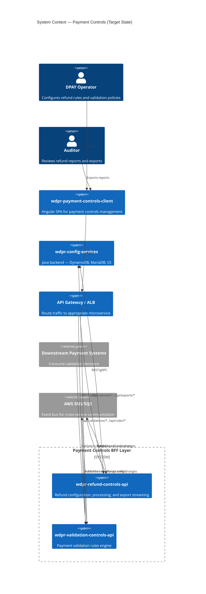
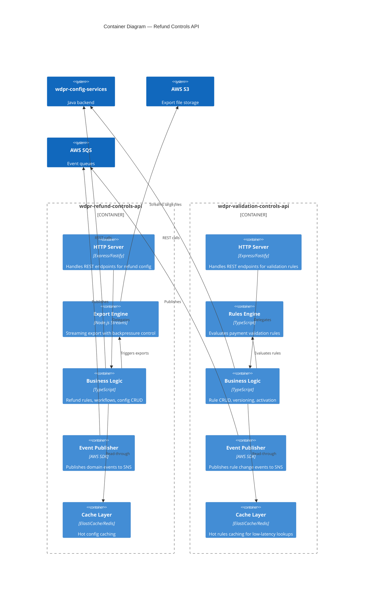
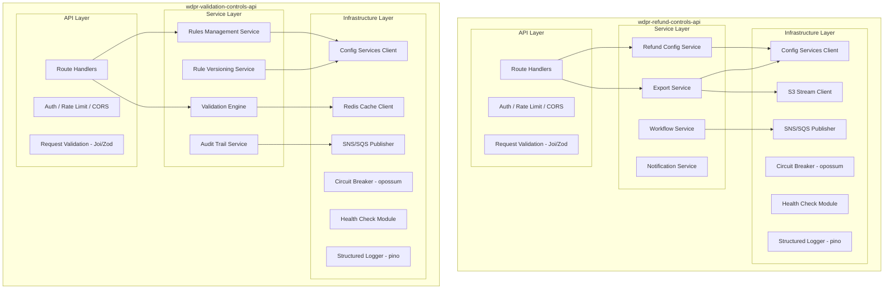
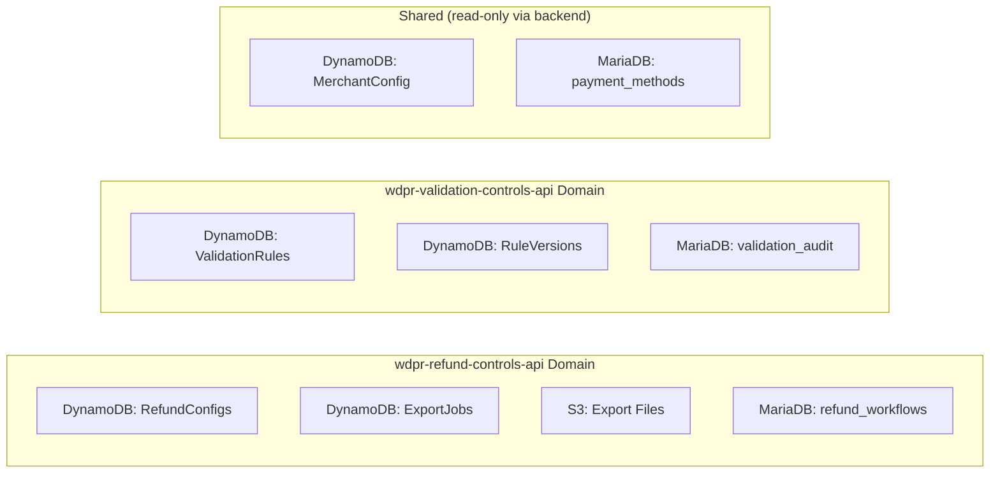
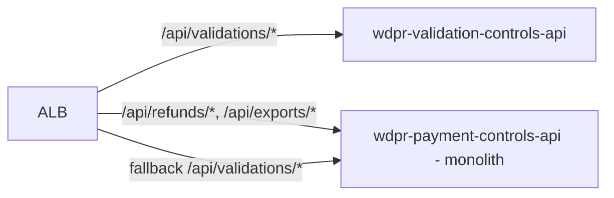
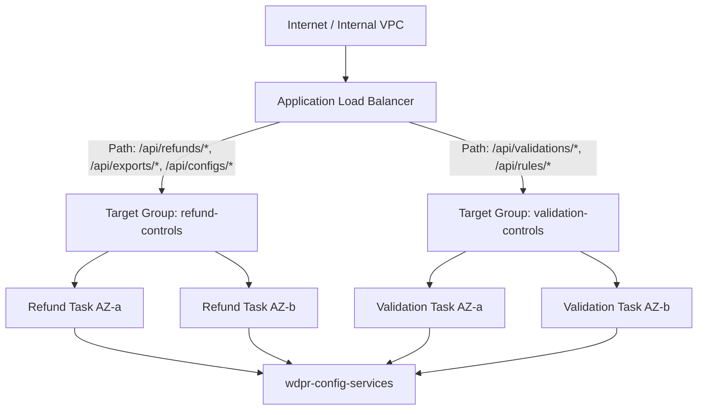

# Architecture specification: wdpr-payment-controls-api microservice split

**Status**: DRAFT
**Date**: 2026-07-23
**Team**: DPAY (Disney Payments)
**Author**: Architecture Spec Agent

---

## Executive summary

This document defines the target architecture for decomposing `wdpr-payment-controls-api` (a monolithic Node.js BFF) into two focused microservices:

- **wdpr-refund-controls-api** — Refund processing, configuration management, and export operations
- **wdpr-validation-controls-api** — Payment validation rules engine and rule management

The primary drivers are:

1. **OOM resolution** — Isolate memory-intensive export streaming (refund reports) from latency-sensitive validation rule lookups
2. **Independent scalability** — Scale each service based on its own resource profile
3. **Team velocity** — Enable parallel development and deployment of refund vs. validation features

---

## 1. C4 context diagram



---

## 2. C4 container diagram



---

## 3. Component diagram



---

## 4. Integration patterns

### 4.1 Synchronous communication

| Pattern              | Use case                                       | Protocol |
|----------------------|------------------------------------------------|----------|
| REST over HTTPS      | UI → BFF service calls                         | HTTP/1.1 |
| REST over HTTPS      | BFF → wdpr-config-services (backend)           | HTTP/1.1 |
| Health checks        | ALB → /health on each service                  | HTTP/1.1 |

### 4.2 Asynchronous communication (event-driven)

| Event                           | Producer                     | Consumer                      | Channel         |
|---------------------------------|------------------------------|-------------------------------|-----------------|
| `refund.config.updated`         | wdpr-refund-controls-api     | wdpr-validation-controls-api  | SNS → SQS       |
| `validation.rule.activated`     | wdpr-validation-controls-api | wdpr-refund-controls-api      | SNS → SQS       |
| `export.completed`              | wdpr-refund-controls-api     | Notification service          | SNS → SQS       |
| `export.failed`                 | wdpr-refund-controls-api     | Alerting / dead-letter        | SNS → SQS → DLQ |

### 4.3 Shared data strategy

- **No shared databases** — Each service accesses only its domain-specific tables/collections in wdpr-config-services
- The Java backend (wdpr-config-services) remains the system of record
- Cross-domain queries are resolved via API calls or event-driven cache hydration
- Export files stored in S3 are owned by the refund service; validation service has no S3 access

### 4.4 API gateway / ALB routing

```text
Path-based routing at ALB level:

/api/refunds/*      → wdpr-refund-controls-api target group
/api/exports/*      → wdpr-refund-controls-api target group
/api/configs/*      → wdpr-refund-controls-api target group (refund configs)
/api/validations/*  → wdpr-validation-controls-api target group
/api/rules/*        → wdpr-validation-controls-api target group
/health             → Both (ALB health check per target group)
```

---

## 5. Data ownership



| Data store                  | Owner service          | Access pattern                   |
|-----------------------------|------------------------|----------------------------------|
| RefundConfigs (DynamoDB)    | Refund Controls API    | CRUD via config-services         |
| ExportJobs (DynamoDB)       | Refund Controls API    | Create/Read/Update status        |
| Export files (S3)           | Refund Controls API    | Write (streaming), read (signed URL) |
| refund_workflows (MariaDB)  | Refund Controls API    | CRUD via config-services         |
| ValidationRules (DynamoDB)  | Validation Controls API| CRUD via config-services         |
| RuleVersions (DynamoDB)     | Validation Controls API| Append-only versioning           |
| validation_audit (MariaDB)  | Validation Controls API| Insert-only audit trail          |
| MerchantConfig (DynamoDB)   | Config Services (shared)| Read-only by both BFFs          |
| payment_methods (MariaDB)   | Config Services (shared)| Read-only by both BFFs          |

---

## 6. Migration strategy

### Approach: Strangler fig pattern (phased)

The strangler fig approach allows incremental migration with zero downtime and full rollback capability.

### Phase 0: Preparation (weeks 1–2)

- Instrument the existing monolith with route-level metrics (request count, latency, memory per endpoint group)
- Identify and document all API endpoints, grouping into refund vs. validation domains
- Create shared libraries package (`@dpay/controls-common`) for auth, logging, circuit breaker, health check
- Set up new Harness pipelines for both target services
- Provision infrastructure (ECS services, ALB target groups, SQS queues)

### Phase 1: Extract validation service (weeks 3–5)

- Deploy `wdpr-validation-controls-api` with all `/api/validations/*` and `/api/rules/*` endpoints
- Route validation traffic via ALB path rules to the new service
- Keep the monolith running unchanged — it still handles refund AND validation (fallback)
- Enable canary routing: 10% → 50% → 100% over 1 week
- Monitor: error rates, latency p99, memory usage



### Phase 2: Extract refund service (weeks 6–8)

- Deploy `wdpr-refund-controls-api` with all `/api/refunds/*`, `/api/exports/*`, `/api/configs/*` endpoints
- **Critical**: The export engine is rebuilt with proper backpressure and memory limits (resolves OOM)
- Route refund traffic to the new service (canary: 10% → 50% → 100%)
- Monitor memory usage closely — this is the OOM-affected domain

### Phase 3: Decommission monolith (weeks 9–10)

- Confirm zero traffic to the monolith for 1 week
- Remove monolith ECS service and task definition
- Archive the old repository or mark deprecated
- Update all documentation and runbooks

### Rollback strategy

- Each phase is independently rollable — ALB routing can revert to the monolith in under 60 seconds
- The monolith remains running (scaled down) until Phase 3 confirmation
- Feature flags control which paths are active in the monolith vs. new services

---

## 7. Deployment topology

### ECS task definitions

| Service                       | CPU  | Memory | Min tasks | Max tasks | Scaling metric          |
|-------------------------------|:----:|:------:|:---------:|:---------:|-------------------------|
| wdpr-refund-controls-api      | 1024 | 2048   |     2     |     8     | CPU > 60%, Memory > 70% |
| wdpr-validation-controls-api  |  512 | 1024   |     2     |    12     | Request count, CPU > 60% |

### Rationale

- **Refund service** gets higher memory (2048 MB) because it handles streaming exports — the primary OOM culprit
- **Validation service** stays lighter but scales wider because validation lookups are high-throughput, low-memory
- Minimum 2 tasks per service for availability across AZs

### Load balancing



### Service mesh considerations

- **Not required initially** — ALB path-based routing is sufficient for two services
- If cross-service direct calls increase, consider AWS App Mesh or service discovery via Cloud Map
- mTLS between services can be added via App Mesh if compliance requires it

### Environment URLs

| Service                       | Latest                                                    | Stage                                                    | Load                                                    | Prod                                              |
|-------------------------------|-----------------------------------------------------------|----------------------------------------------------------|---------------------------------------------------------|---------------------------------------------------|
| wdpr-refund-controls-api      | refund-controls-latest.wdprapps.disney.com                | refund-controls-stage.wdprapps.disney.com                | refund-controls-load.wdprapps.disney.com                | refund-controls.wdprapps.disney.com               |
| wdpr-validation-controls-api  | validation-controls-latest.wdprapps.disney.com            | validation-controls-stage.wdprapps.disney.com            | validation-controls-load.wdprapps.disney.com            | validation-controls.wdprapps.disney.com           |

During migration, `wdpr-payment-controls-api-{env}.wdprapps.disney.com` remains active and routes to the ALB which fans out to both services.

---

## 8. API contract changes

### Principle: Zero breaking changes during migration

The Angular UI (`wdpr-payment-controls-client`) continues to call the **same base URL** and **same endpoint paths**. The ALB handles routing transparently.

### Before (monolith)

```text
UI → https://wdpr-payment-controls-api-{env}.wdprapps.disney.com/api/refunds/...
UI → https://wdpr-payment-controls-api-{env}.wdprapps.disney.com/api/validations/...
```

### During migration (transparent routing)

```text
UI → https://wdpr-payment-controls-api-{env}.wdprapps.disney.com/api/refunds/...
     └─ ALB routes to wdpr-refund-controls-api

UI → https://wdpr-payment-controls-api-{env}.wdprapps.disney.com/api/validations/...
     └─ ALB routes to wdpr-validation-controls-api
```

### After migration (optional DNS update)

```text
UI → https://refund-controls-{env}.wdprapps.disney.com/api/refunds/...
UI → https://validation-controls-{env}.wdprapps.disney.com/api/validations/...
```

The DNS update is optional and can happen post-migration when the UI team is ready to update environment configs.

### New endpoints (additive)

| Endpoint                          | Service           | Purpose                              |
|-----------------------------------|-------------------|--------------------------------------|
| `GET /api/exports/:id/status`     | Refund Controls   | Async export job status polling       |
| `GET /api/exports/:id/download`   | Refund Controls   | S3 pre-signed URL for completed export|
| `POST /api/exports`               | Refund Controls   | Initiate async export (replaces sync) |
| `GET /api/rules/:id/versions`     | Validation Controls| Rule version history                 |
| `POST /api/rules/:id/rollback`    | Validation Controls| Rollback to previous rule version    |

### Deprecated endpoints (removed in Phase 3)

| Endpoint                              | Replacement                        | Deprecation header          |
|---------------------------------------|------------------------------------|-----------------------------|
| `GET /api/exports/download-sync`      | `POST /api/exports` (async)        | `Sunset: <phase3-date>`    |

### Export pattern change (resolves OOM)

**Before**: Synchronous streaming response (entire export in one HTTP response, holds memory)

**After**: Async job pattern

```text
1. POST /api/exports { filters, format }     → 202 Accepted { jobId }
2. GET  /api/exports/:jobId/status           → 200 { status: "processing", progress: 45 }
3. GET  /api/exports/:jobId/download         → 302 Redirect to S3 pre-signed URL
```

This eliminates the memory spike — export processing happens in a background worker with bounded memory, and the file is streamed to S3 directly.

---

## 9. Risks and mitigations

| #  | Risk                                             | Impact | Likelihood | Mitigation                                                                                           |
|:--:|--------------------------------------------------|:------:|:----------:|------------------------------------------------------------------------------------------------------|
| 1  | Data consistency during migration (dual-write)   | High   | Medium     | No dual-write — backend remains single source of truth; BFFs are stateless gateways                  |
| 2  | Increased latency from ALB hop                   | Medium | Low        | ALB adds <1ms; monitor p99; keep services in same VPC/AZ                                             |
| 3  | Export async pattern breaks UI expectations       | High   | Medium     | Ship UI polling component before switching export endpoint; feature-flag the async path               |
| 4  | Shared auth/session management complexity         | Medium | Medium     | Stateless JWT validation in both services; shared auth middleware package                             |
| 5  | Operational overhead (2 services vs 1)            | Medium | High       | Shared Terraform modules, unified logging/dashboards, single Harness pipeline template                |
| 6  | Event ordering issues (SNS/SQS)                   | Low    | Low        | Use FIFO queues for ordered events; idempotent consumers; deduplication IDs                           |
| 7  | Network partition between services                | Medium | Low        | Circuit breakers (opossum); graceful degradation; cached fallback for validation rules                |
| 8  | Team split and knowledge silos                    | Low    | Medium     | Both services owned by same DPAY team initially; shared code review; common library                   |
| 9  | Harness pipeline duplication/drift                | Low    | Medium     | Pipeline-as-code templates; shared stages for build/test/deploy                                       |
| 10 | Monolith zombie (never decommissioned)            | Low    | Medium     | Hard deadline for Phase 3; traffic monitoring alerts if monolith receives requests after cutover      |

---

## 10. Decision records

### ADR-001: Strangler fig over big bang

**Context**: We need to split a monolith while maintaining production availability.

**Decision**: Use the strangler fig pattern with ALB path-based routing to incrementally migrate traffic.

**Rationale**:
- Zero-downtime migration
- Independent rollback per domain
- Risk is contained to one domain at a time
- The monolith can remain as fallback during transition

**Consequences**:
- Longer total migration timeline (10 weeks vs. 2–3 for big bang)
- Temporary operational complexity of running 3 services
- Requires ALB configuration changes per phase

---

### ADR-002: Async export pattern to resolve OOM

**Context**: The current synchronous streaming export holds entire datasets in memory, causing OOM at 1024 MB.

**Decision**: Replace synchronous streaming with an async job pattern: POST to initiate, poll for status, download from S3 via pre-signed URL.

**Rationale**:
- Decouples HTTP connection lifetime from export processing duration
- Export worker can use bounded memory with pagination/streaming to S3
- S3 handles the download streaming (no BFF memory impact)
- Enables progress reporting to the UI

**Consequences**:
- UI must implement polling or WebSocket for status updates
- Slight increase in perceived latency for small exports (now requires multiple round-trips)
- S3 costs for temporary file storage (mitigated with lifecycle rules for auto-deletion)

---

### ADR-003: Extract validation service first

**Context**: We need to decide the migration order for the two domains.

**Decision**: Extract the validation service first (Phase 1), then the refund/export service (Phase 2).

**Rationale**:
- Validation is simpler (stateless lookups, no streaming, no file I/O)
- Lower risk to prove the pattern works before tackling the OOM-affected domain
- Validation has higher request volume but lower memory footprint — proves scaling model
- Lessons learned from Phase 1 improve Phase 2 execution

**Consequences**:
- OOM fix is not delivered until Phase 2 (weeks 6–8)
- Interim mitigation: increase monolith memory to 2048 MB during Phase 1

---

### ADR-004: SNS/SQS for inter-service events (not direct HTTP)

**Context**: The two services need to communicate when configurations change (e.g., a refund config change may affect validation rules).

**Decision**: Use AWS SNS → SQS fan-out for all cross-service domain events.

**Rationale**:
- Temporal decoupling — services don't need to be available simultaneously
- Natural retry/DLQ semantics
- Fan-out enables future consumers without modifying producers
- Aligns with Disney enterprise event-driven patterns

**Consequences**:
- Eventual consistency between services (acceptable — validation rules are not real-time dependent on refund config)
- Additional infrastructure (SNS topics, SQS queues, DLQ queues)
- Need monitoring on queue depth and DLQ

---

### ADR-005: Shared ALB with path-based routing (no API gateway)

**Context**: We need to route traffic from the UI to the correct microservice.

**Decision**: Use the existing ALB with path-based routing rules rather than introducing AWS API Gateway.

**Rationale**:
- The existing deployment already uses ALB — minimal change
- Path-based routing is simple and well-understood
- API Gateway adds cost per request (validation traffic is high-volume)
- API Gateway's features (throttling, API keys, request transformation) are not needed — the BFFs handle their own auth and validation

**Consequences**:
- No built-in request throttling at the gateway level (implement in-service rate limiting)
- If service count grows beyond 5–6, reconsider API Gateway for centralized concerns
- Cross-cutting concerns (auth, CORS) must be implemented in each service (mitigated by shared library)

---

### ADR-006: Shared common library for cross-cutting concerns

**Context**: Both services need identical auth, logging, health check, and circuit breaker implementations.

**Decision**: Create `@dpay/controls-common` as a private npm package containing shared middleware and utilities.

**Rationale**:
- DRY — avoid duplicating auth, logging, health check code
- Consistent behavior across services
- Single place to update security patches for shared concerns

**Consequences**:
- Version coupling — both services must stay compatible with the shared library
- Need a release process for the shared library itself
- Avoid putting business logic in the shared library — only infrastructure concerns

---

## Appendix A: Resource comparison

| Metric                  | Current (monolith)       | Target (refund)         | Target (validation)     |
|-------------------------|:------------------------:|:-----------------------:|:-----------------------:|
| CPU units               |           512            |          1024           |           512           |
| Memory (MB)             |          1024            |          2048           |          1024           |
| Min tasks               |            1             |            2            |            2            |
| Max tasks               |            4             |            8            |           12            |
| Estimated monthly cost  |          ~$85            |         ~$120           |          ~$90           |

Total estimated cost increase: ~$125/month (justified by OOM resolution and independent scaling).

## Appendix B: Timeline summary

| Phase   | Weeks | Key milestone                              |
|---------|:-----:|---------------------------------------------|
| Phase 0 |  1–2  | Infrastructure provisioned, shared lib ready |
| Phase 1 |  3–5  | Validation service live, 100% traffic        |
| Phase 2 |  6–8  | Refund service live, OOM resolved            |
| Phase 3 | 9–10  | Monolith decommissioned                      |

---

## Appendix C: Monitoring and observability

### Dashboards (per service)

- Request rate (RPM) by endpoint
- Error rate (4xx, 5xx) by endpoint
- Latency percentiles (p50, p95, p99)
- Memory utilization (critical for refund service)
- Active export jobs (refund service)
- SQS queue depth and age of oldest message
- Circuit breaker state (open/closed/half-open)

### Alerts

| Alert                               | Threshold                    | Severity |
|-------------------------------------|------------------------------|----------|
| Memory > 80% for 5 min             | 80% of task memory           | P2       |
| Error rate > 5% for 3 min          | 5% of total requests         | P1       |
| Export job stuck > 15 min           | No status change in 15 min   | P2       |
| DLQ message count > 0              | Any message in DLQ           | P2       |
| Health check failures               | 3 consecutive failures       | P1       |
| Circuit breaker open                | Any breaker opens            | P2       |

---

*End of architecture specification.*
