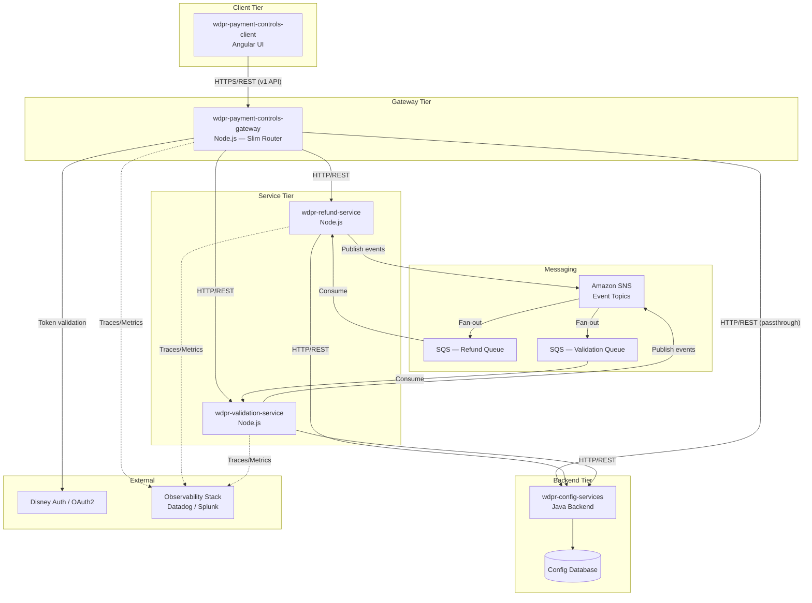
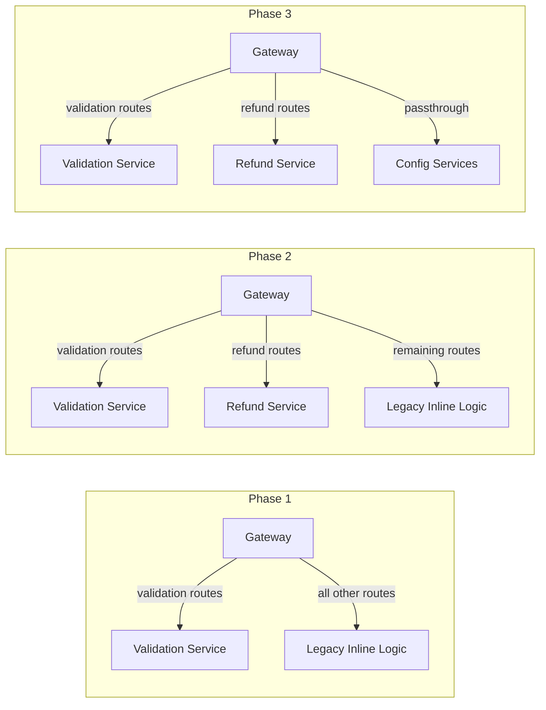
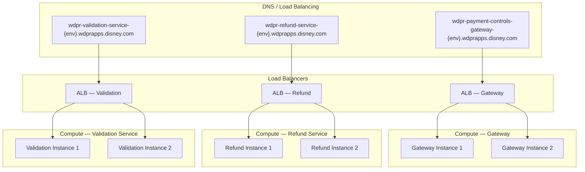
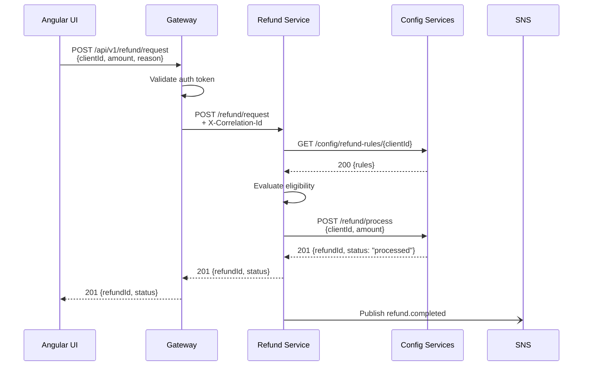
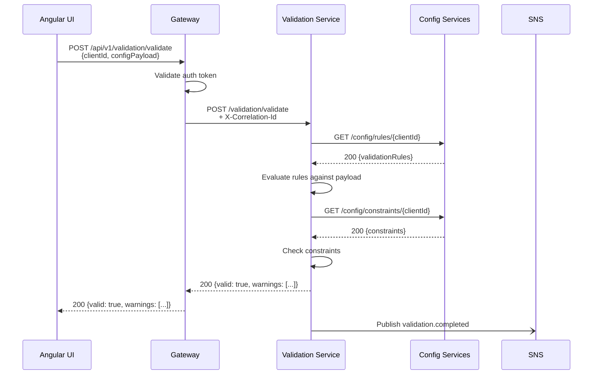
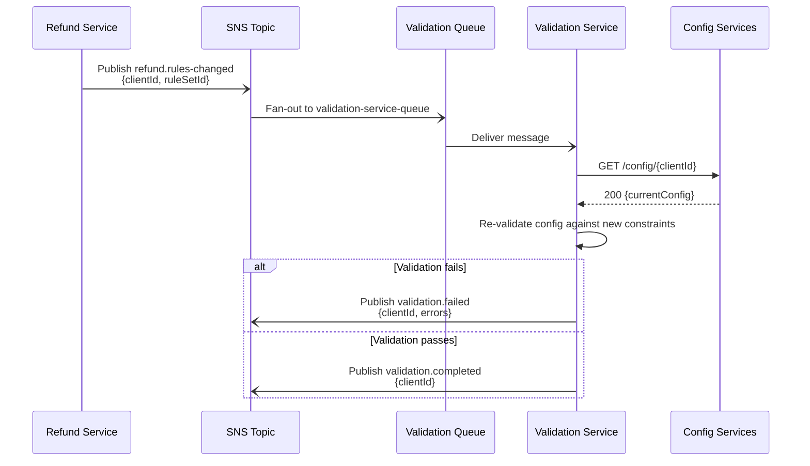
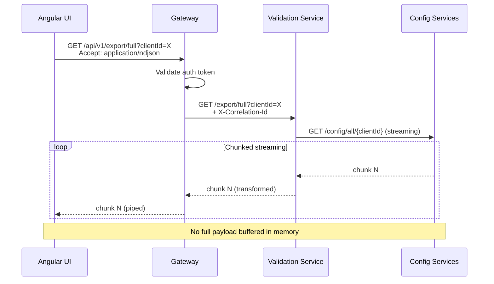

# Architecture Specification: Payment Controls API Decomposition

> **Version:** 1.0  
> **Date:** 2026-06-23  
> **Status:** Proposed  
> **Authors:** Architecture Team

---

## 1. Executive Summary

### Business Drivers

Config Studio's BFF layer (`wdpr-payment-controls-api`) has grown into a monolithic gateway that conflates validation logic, refund processing, orchestration, and response mapping. This coupling creates:

- **Deployment risk** — a refund bug forces redeployment of validation paths
- **Scaling inefficiency** — validation-heavy traffic cannot scale independently of refund workflows
- **Developer velocity drag** — teams step on each other in a single codebase
- **Blast radius** — a failure in one concern cascades to all consumers

### Goals

| Goal | Measure |
|------|---------|
| Independent deployability | Each service ships without coordinating releases |
| Fault isolation | Failure in refund-service does not degrade validation |
| Backward compatibility | Zero breaking changes to Angular UI contract |
| Scalability | Each service scales to its own traffic pattern |
| Observability | End-to-end tracing across all three services |

### Target State

Three services behind a retained slim gateway using the strangler fig pattern over ~22 weeks:

1. **wdpr-payment-controls-gateway** — thin router, auth, backward-compat adapter
2. **wdpr-refund-service** — refund workflows, rules, and state management
3. **wdpr-validation-service** — configuration validation, rule evaluation, constraint checking

---

## 2. Component Diagram



---

## 3. Service Boundaries

### 3.1 Gateway (`wdpr-payment-controls-gateway`)

| Responsibility | Details |
|----------------|---------|
| Route adaptation | Retains all v1 routes; proxies to downstream services |
| Authentication | Validates OAuth2 tokens via Disney Auth |
| Request routing | Inspects path/method to route to refund-service or validation-service |
| Response mapping | Transforms downstream responses to v1 contract where needed |
| Streaming passthrough | Pipes streaming responses from downstream without buffering |
| Rate limiting | Enforces per-client rate limits |
| CORS | Manages cross-origin policy for the Angular client |

**Does NOT own:** Business logic, data transformation rules, workflow state.

### 3.2 Refund Service (`wdpr-refund-service`)

| Responsibility | Details |
|----------------|---------|
| Refund workflows | Orchestrates multi-step refund operations |
| Refund rules engine | Evaluates refund eligibility, limits, and policies |
| Refund state management | Tracks refund request lifecycle (pending → approved → processed) |
| Config CRUD for refunds | Reads/writes refund configurations via config-services |
| Event publishing | Emits `refund.completed`, `refund.failed`, `refund.rules-changed` |
| Event consumption | Listens for `validation.rules-changed` to re-evaluate refund constraints |

### 3.3 Validation Service (`wdpr-validation-service`)

| Responsibility | Details |
|----------------|---------|
| Configuration validation | Validates client configurations against rule sets |
| Rule evaluation | Executes validation rules (type checks, range checks, cross-field) |
| Constraint checking | Enforces business constraints and inter-config dependencies |
| Comparison logic | Powers the "compare clients" feature |
| Export generation | Streams large reports (full / finance / custom) |
| Event publishing | Emits `validation.completed`, `validation.failed`, `validation.rules-changed` |
| Event consumption | Listens for `refund.rules-changed` to invalidate cached validations |

---

## 4. Integration Patterns

### 4.1 Synchronous — HTTP/REST

| Caller | Callee | Use Case | Timeout |
|--------|--------|----------|---------|
| UI | Gateway | All user-initiated requests | 30s |
| Gateway | Refund Service | Refund CRUD, workflow triggers | 10s |
| Gateway | Validation Service | Validate, compare, export | 10s (export: streaming, no timeout) |
| Refund Service | Config Services | Read/write refund configs | 5s |
| Validation Service | Config Services | Read configs, rules | 5s |
| Gateway | Config Services | Passthrough (search, browse) | 10s |

**Conventions:**
- JSON request/response for standard operations
- `Transfer-Encoding: chunked` for streaming exports
- Gateway propagates `Authorization` header downstream
- All internal calls include `X-Correlation-Id` header

### 4.2 Asynchronous — SNS/SQS

#### Topics

| Topic | Publisher | Subscribers | Payload |
|-------|-----------|-------------|---------|
| `refund-events` | Refund Service | Validation Service | `{ event, refundId, clientId, timestamp }` |
| `validation-events` | Validation Service | Refund Service | `{ event, validationId, clientId, timestamp }` |

#### Event Catalog

| Event | Source | Description |
|-------|--------|-------------|
| `refund.completed` | Refund Service | A refund was processed successfully |
| `refund.failed` | Refund Service | A refund processing failed |
| `refund.rules-changed` | Refund Service | Refund eligibility rules were updated |
| `validation.completed` | Validation Service | Configuration validation passed |
| `validation.failed` | Validation Service | Configuration validation failed |
| `validation.rules-changed` | Validation Service | Validation rule definitions changed |

#### Queue Configuration

| Queue | DLQ | Max Retries | Visibility Timeout |
|-------|-----|-------------|-------------------|
| `refund-service-queue` | `refund-service-dlq` | 3 | 30s |
| `validation-service-queue` | `validation-service-dlq` | 3 | 30s |

### 4.3 API Gateway Pattern

The retained gateway acts as a reverse proxy with these behaviors:

1. **Path-based routing** — `/api/v1/refund/*` → refund-service, `/api/v1/validation/*` → validation-service
2. **Auth enforcement** — all requests authenticated before proxying
3. **Contract adaptation** — translates v1 response shapes if downstream schema evolves
4. **Feature flags** — routes can be toggled between legacy (inline) and new (proxy) via config

### 4.4 Strangler Fig Pattern



---

## 5. Deployment Topology



### Environment URLs

| Service | Dev | Stage | Prod |
|---------|-----|-------|------|
| Gateway | `wdpr-payment-controls-gateway-dev.wdprapps.disney.com` | `wdpr-payment-controls-gateway-stage.wdprapps.disney.com` | `wdpr-payment-controls-gateway-prod.wdprapps.disney.com` |
| Refund | `wdpr-refund-service-dev.wdprapps.disney.com` | `wdpr-refund-service-stage.wdprapps.disney.com` | `wdpr-refund-service-prod.wdprapps.disney.com` |
| Validation | `wdpr-validation-service-dev.wdprapps.disney.com` | `wdpr-validation-service-stage.wdprapps.disney.com` | `wdpr-validation-service-prod.wdprapps.disney.com` |

### Health Check Endpoints

Each service exposes:

| Endpoint | Purpose | Response |
|----------|---------|----------|
| `GET /health` | Liveness probe | `200 { "status": "up" }` |
| `GET /health/ready` | Readiness probe (includes dependency checks) | `200 { "status": "ready", "dependencies": {...} }` |

### CI/CD — Per Service

Each service has an independent pipeline:

1. **Build** — lint, unit test, compile
2. **Test** — integration tests against mocked dependencies
3. **Deploy Dev** — auto-deploy on merge to main
4. **Deploy Stage** — auto-deploy after dev verification
5. **Deploy Prod** — manual approval gate, canary then full rollout

---

## 6. Data Flow Diagrams

### 6.1 Refund Request Flow



### 6.2 Validation Request Flow



### 6.3 Cross-Service Event Flow (Refund Triggers Re-Validation)



### 6.4 Streaming Export Flow



---

## 7. Migration Strategy — Strangler Fig Phases

### Phase 1: Extract Validation Service (Weeks 1–8)

| Week | Activity |
|------|----------|
| 1–2 | Scaffold `wdpr-validation-service` repo, CI/CD, health endpoints |
| 3–5 | Migrate validation logic: rule evaluation, constraint checking, comparison |
| 6 | Migrate streaming export logic |
| 7 | Integration testing with gateway routing (feature-flagged) |
| 8 | Canary rollout — 10% → 50% → 100% traffic shift |

**Rollback plan:** Feature flag in gateway reverts routing to inline logic. No DNS changes needed — gateway handles both paths.

### Phase 2: Extract Refund Service (Weeks 9–16)

| Week | Activity |
|------|----------|
| 9–10 | Scaffold `wdpr-refund-service` repo, CI/CD, health endpoints |
| 11–13 | Migrate refund workflows, rules engine, state management |
| 14 | Wire SNS/SQS event integration between refund and validation services |
| 15 | Integration testing with gateway routing (feature-flagged) |
| 16 | Canary rollout — 10% → 50% → 100% traffic shift |

**Rollback plan:** Same feature-flag approach. Gateway falls back to inline refund logic. SQS messages accumulate in DLQ during rollback (reprocessed on re-deploy).

### Phase 3: Gateway Becomes Thin Router (Weeks 17–22)

| Week | Activity |
|------|----------|
| 17–18 | Remove all migrated business logic from gateway |
| 19 | Add v2 routes that map 1:1 to downstream services |
| 20 | UI team begins migrating to v2 endpoints (optional) |
| 21 | Performance/load testing of full architecture |
| 22 | Decommission legacy code paths; gateway is pure proxy |

**Rollback plan:** Gateway retains dead code behind feature flags for 1 release cycle. Can re-enable if critical issues found.

### Migration Risk Matrix

| Risk | Probability | Impact | Mitigation |
|------|-------------|--------|-----------|
| Behavioral drift between old and new | Medium | High | Shadow-mode: run both paths, compare responses |
| Latency increase from extra hop | Low | Medium | Connection pooling, keep-alive, co-located deployment |
| Event ordering issues | Low | Medium | Idempotent consumers, event timestamps |
| Auth token propagation failure | Low | High | Integration tests with real tokens in stage |

---

## 8. Resilience Patterns

### 8.1 Circuit Breakers

Each service-to-service call uses a circuit breaker (e.g., `opossum` for Node.js):

| Circuit | Threshold | Reset Timeout | Fallback |
|---------|-----------|---------------|----------|
| Gateway → Refund Service | 5 failures / 10s | 30s | 503 with retry-after header |
| Gateway → Validation Service | 5 failures / 10s | 30s | 503 with retry-after header |
| Gateway → Config Services | 5 failures / 10s | 30s | Cached response (if available) |
| Refund Service → Config Services | 3 failures / 10s | 15s | Reject refund with retryable error |
| Validation Service → Config Services | 3 failures / 10s | 15s | Return "validation pending" status |

### 8.2 Retry with Backoff

| Scenario | Strategy | Max Retries | Base Delay |
|----------|----------|-------------|-----------|
| HTTP 5xx from downstream | Exponential backoff + jitter | 3 | 200ms |
| HTTP 429 (rate limited) | Respect `Retry-After` header | 2 | — |
| SQS message processing failure | Exponential backoff (SQS native) | 3 | Visibility timeout doubles |
| Network timeout | Immediate retry once, then backoff | 2 | 100ms |

### 8.3 Fallback Strategies

| Failure Mode | Fallback |
|--------------|----------|
| Validation service unavailable | Gateway returns 503 — UI shows "validation temporarily unavailable" |
| Refund service unavailable | Gateway returns 503 — UI queues request for retry |
| Config Services unavailable | Services return cached last-known-good response (stale-while-revalidate) |
| SNS publish failure | Write to local retry queue; background process re-publishes |

### 8.4 Health Checks and Readiness Probes

```
GET /health         → Liveness (is the process alive?)
GET /health/ready   → Readiness (can it serve traffic?)
```

Readiness checks verify:
- Gateway: can reach auth service, can reach at least one downstream
- Refund Service: can reach config-services, SQS queue accessible
- Validation Service: can reach config-services, SQS queue accessible

Load balancer removes instances that fail readiness for 3 consecutive checks (10s interval).

---

## 9. Observability

### 9.1 Distributed Tracing

- **Correlation ID:** `X-Correlation-Id` header generated at gateway, propagated to all downstream calls and events
- **Trace context:** W3C `traceparent` header for compatibility with Datadog/OpenTelemetry
- **Span hierarchy:** Gateway → Service → Config Services (each hop is a child span)
- **Event correlation:** SNS messages include `correlationId` in message attributes

### 9.2 Structured Logging

All services emit JSON logs with:

```json
{
  "timestamp": "2026-06-23T09:00:00.000Z",
  "level": "info",
  "service": "wdpr-refund-service",
  "correlationId": "abc-123",
  "traceId": "def-456",
  "message": "Refund processed",
  "context": { "clientId": "C001", "refundId": "R789" },
  "duration_ms": 142
}
```

### 9.3 Metrics and Alerting

#### Key Metrics (per service)

| Metric | Type | Alert Threshold |
|--------|------|-----------------|
| `http_request_duration_seconds` | Histogram | p99 > 2s |
| `http_requests_total` | Counter | — |
| `http_errors_total` (5xx) | Counter | > 10/min |
| `circuit_breaker_state` | Gauge | State = OPEN for > 60s |
| `sqs_messages_in_flight` | Gauge | > 1000 |
| `sqs_dlq_depth` | Gauge | > 0 (immediate alert) |

#### Dashboards

- **Service health:** Request rate, error rate, latency percentiles per service
- **Migration progress:** Traffic split between legacy and new paths
- **Cross-service events:** Publish rate, consume rate, DLQ depth

---

## 10. Decision Log

| ID | Decision | Rationale | Alternatives Considered |
|----|----------|-----------|------------------------|
| ADR-001 | Split into 3 services (gateway + 2 domain services) | Isolates refund and validation concerns for independent scaling and deployment | 2-service split (gateway + combined), full mesh (no gateway) |
| ADR-002 | Retain slim gateway for backward compatibility | Angular UI cannot change its API target without coordinated release; gateway absorbs this | Direct client-to-service calls with API versioning |
| ADR-003 | Strangler fig migration (not big-bang) | Reduces risk; allows incremental validation; easy rollback per phase | Blue-green full cutover, branch-by-abstraction |
| ADR-004 | SNS+SQS for async events (not direct HTTP callbacks) | Decouples services temporally; provides retry/DLQ; fan-out capability | Direct HTTP webhooks, Kafka, EventBridge |
| ADR-005 | No direct DB ownership for new services | Config-services already owns the data layer; adding another DB creates consistency issues | Dedicated PostgreSQL per service, CQRS read models |
| ADR-006 | Node.js for new services (same as current) | Team expertise, shared tooling, simpler migration of existing logic | Go (performance), Java (match backend) |
| ADR-007 | Feature flags for traffic routing during migration | Enables gradual rollout and instant rollback without redeployment | DNS-based traffic shifting, weighted load balancer rules |
| ADR-008 | Streaming passthrough (no buffering) for exports | Exports can be 100MB+; buffering causes OOM; streaming keeps memory constant | Paginated responses, background job + download link |
| ADR-009 | Circuit breaker per downstream dependency | Prevents cascade failures; provides fast-fail behavior | Global rate limiter, bulkhead isolation only |
| ADR-010 | W3C trace context + custom correlation ID | Industry standard for distributed tracing; correlation ID for business-level tracking | Proprietary trace headers, Zipkin B3 format |

---

## Appendix A: API Route Mapping

| v1 Route (Gateway) | Target Service | Internal Route |
|---------------------|----------------|----------------|
| `POST /api/v1/refund/request` | Refund Service | `POST /refund/request` |
| `GET /api/v1/refund/:id` | Refund Service | `GET /refund/:id` |
| `GET /api/v1/refund/rules/:clientId` | Refund Service | `GET /refund/rules/:clientId` |
| `PUT /api/v1/refund/rules/:clientId` | Refund Service | `PUT /refund/rules/:clientId` |
| `POST /api/v1/validation/validate` | Validation Service | `POST /validation/validate` |
| `POST /api/v1/validation/compare` | Validation Service | `POST /validation/compare` |
| `GET /api/v1/export/:type` | Validation Service | `GET /export/:type` |
| `GET /api/v1/config/*` | Config Services | Passthrough |
| `GET /api/v1/search/*` | Config Services | Passthrough |

---

## Appendix B: Technology Stack

| Layer | Technology |
|-------|-----------|
| Runtime | Node.js 20 LTS |
| Framework | Express.js (gateway), Fastify (new services) |
| Circuit Breaker | opossum |
| HTTP Client | undici (streaming-capable) |
| Message Queue | AWS SNS + SQS |
| Auth | Disney OAuth2 / JWT validation |
| Logging | pino (structured JSON) |
| Tracing | OpenTelemetry SDK → Datadog |
| CI/CD | Disney internal pipeline (Jenkins / GitHub Actions) |
| Container | Docker → Disney container platform |
