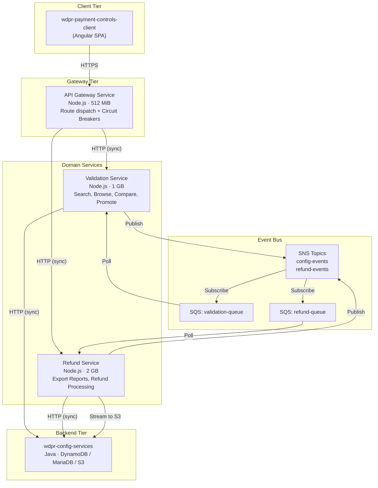
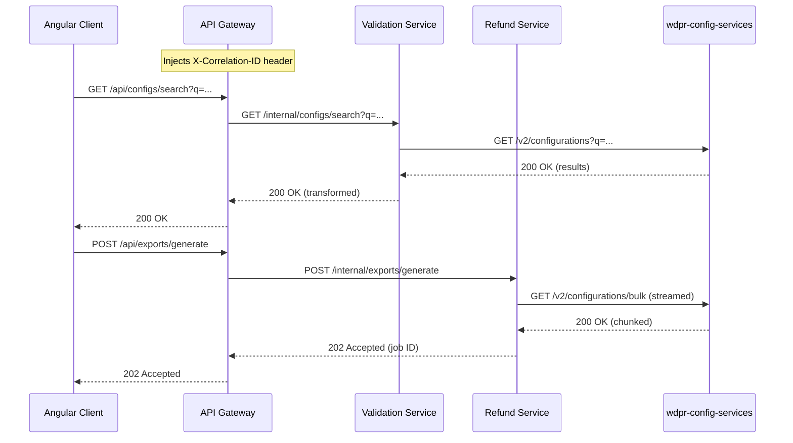
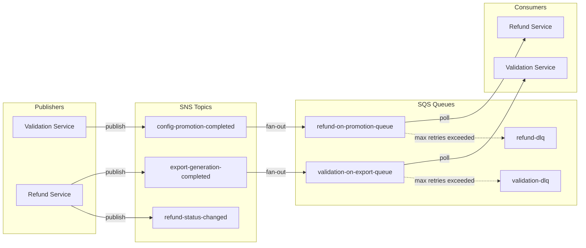
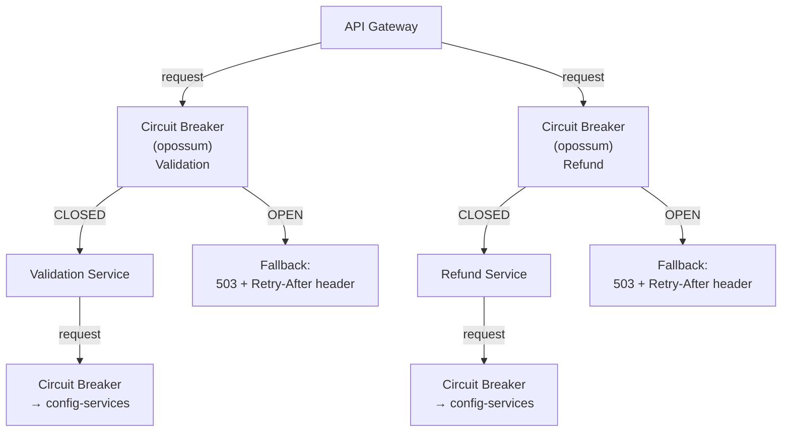
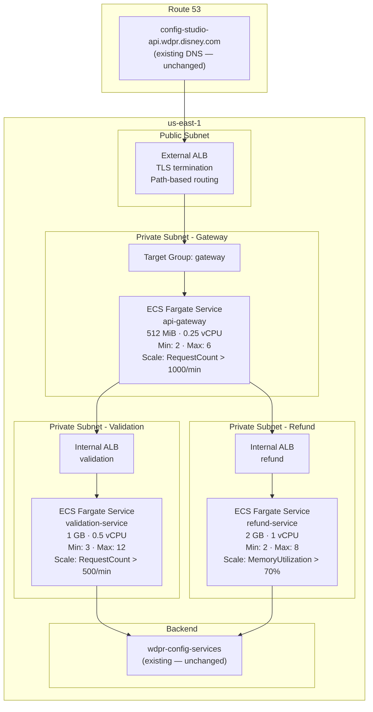
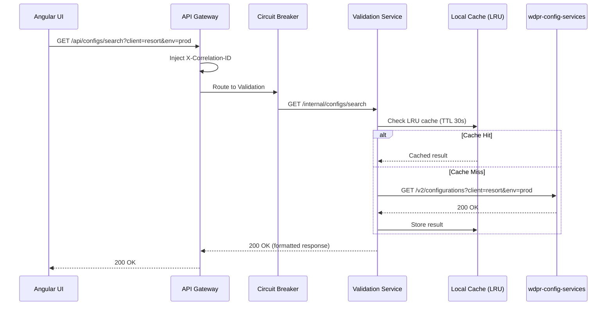
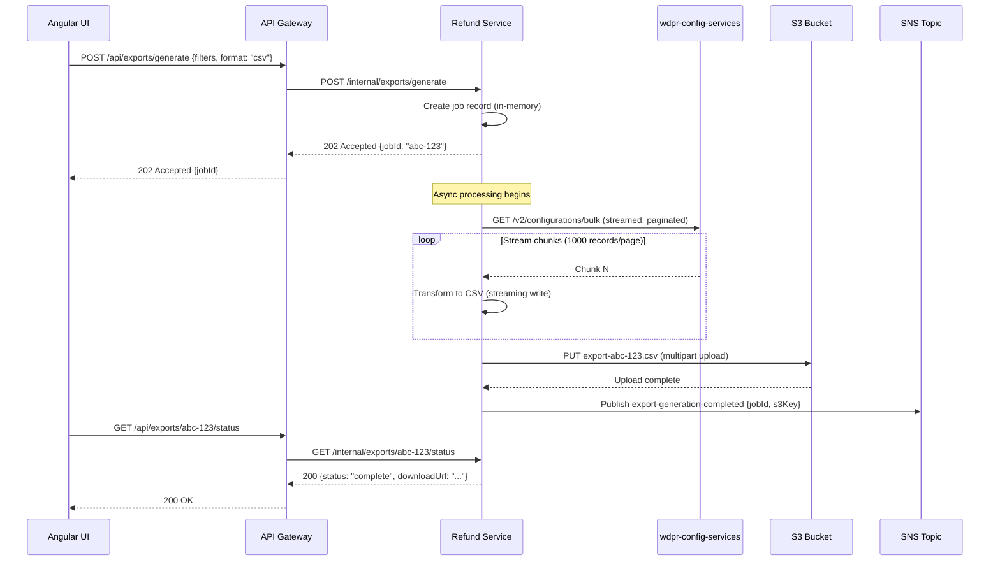
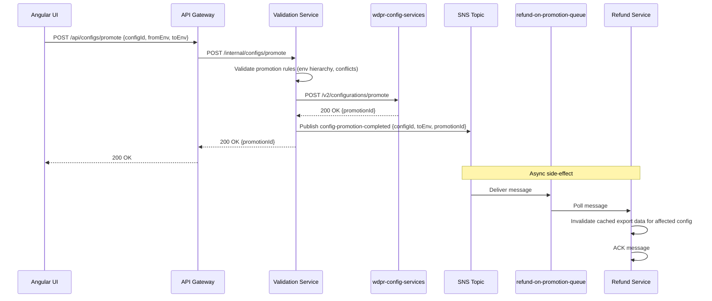
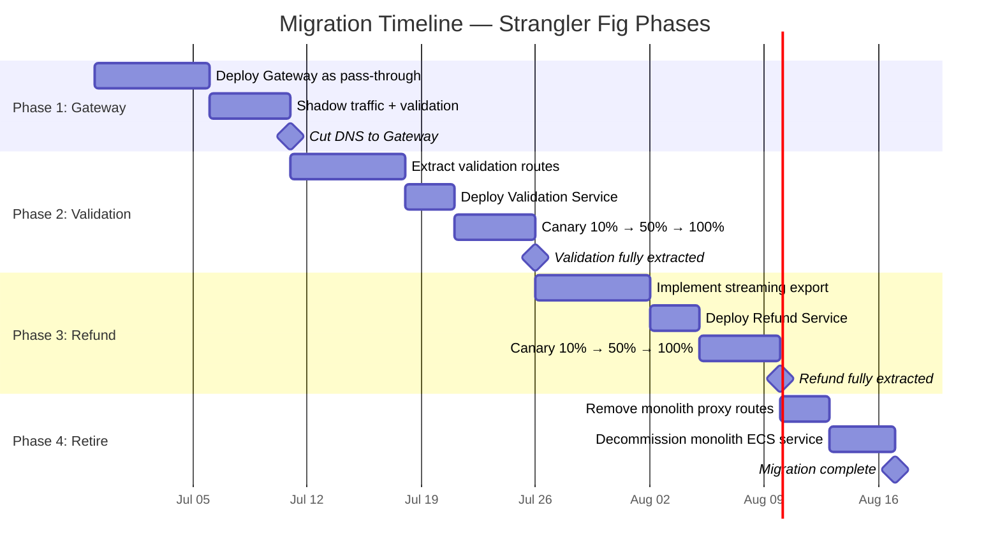

# Architecture Specification: Config Studio BFF Decomposition

**Document Version:** 1.0  
**Date:** 2026-06-22  
**Status:** Proposed  
**Author:** Architecture Team  

---

## 1. Executive Summary

The `wdpr-payment-controls-api` Node.js BFF is being decomposed from a single 512 MiB ECS monolith into three purpose-built microservices to resolve recurring OOMKilled failures caused by unbounded memory buffering during export/refund operations.

**Target State:** A thin API Gateway fronts two domain-specific services—a Validation Service (low-latency, high-throughput) and a Refund Service (memory-intensive, export-oriented). The gateway retains existing DNS and route structure, ensuring zero changes to the Angular UI (`wdpr-payment-controls-client`). Both downstream services remain stateless, delegating persistence to the existing Java backend (`wdpr-config-services`).

**Key Outcomes:**
- Eliminates OOM failures by isolating memory-heavy export operations in a dedicated 2 GB service
- Enables independent scaling: validation scales on request count, refund scales on memory utilization
- Maintains backward compatibility—no UI or API contract changes during migration
- Introduces observability (X-Ray, correlation IDs) and resilience (circuit breakers) patterns
- Delivered incrementally via strangler fig over ~6 sprints with zero-downtime cutover

---

## 2. Component Architecture

### Service Responsibilities

| Service | Responsibility | Memory | Scaling Strategy |
|---------|---------------|--------|-----------------|
| API Gateway | Route dispatch, auth passthrough, circuit breaking, correlation ID injection | 512 MiB | 2–6 tasks, request count |
| Validation Service | Config search, browse, compare, promote orchestration, rule validation | 1 GB | 3–12 tasks, request count |
| Refund Service | Export report generation, refund calculations, bulk CSV/PDF streaming | 2 GB | 2–8 tasks, memory utilization |

---

## 3. Integration Patterns

### 3.1 Synchronous (HTTP) Patterns

**HTTP Conventions:**
- Gateway → Service: Internal ALB, path prefix `/internal/*`, timeout 30s (validation) / 120s (refund)
- Service → Backend: Service discovery via environment config, timeout 10s, retry 2x with exponential backoff
- All requests carry: `X-Correlation-ID`, `X-Request-Start`, `Authorization` (passthrough)

### 3.2 Asynchronous (SNS/SQS) Event Patterns

**Event Contracts:**
- Messages are JSON with envelope: `{ correlationId, timestamp, eventType, version, payload }`
- SQS visibility timeout: 60s, max receive count: 3, then route to DLQ
- DLQ alarm triggers after 1+ message for manual investigation

### 3.3 Error Handling & Circuit Breakers

**Circuit Breaker Configuration (opossum):**

| Parameter | Gateway → Services | Services → Backend |
|-----------|-------------------|-------------------|
| Timeout | 30s / 120s | 10s |
| Error Threshold | 50% | 50% |
| Reset Timeout | 30s | 15s |
| Rolling Window | 10s | 10s |
| Volume Threshold | 5 requests | 5 requests |

**Error Strategy:**
- 4xx errors: pass through without tripping circuit
- 5xx / timeouts: count toward circuit threshold
- Open circuit: return `503 Service Unavailable` with `Retry-After` header
- All errors logged with correlation ID, emitted to X-Ray as fault annotations

---

## 4. Deployment Topology

**Scaling Policies:**

| Service | Metric | Target | Cooldown | Min/Max Tasks |
|---------|--------|--------|----------|---------------|
| API Gateway | ALBRequestCountPerTarget | 1000/min | 120s | 2 / 6 |
| Validation | ALBRequestCountPerTarget | 500/min | 60s | 3 / 12 |
| Refund | ECSServiceAverageMemoryUtilization | 70% | 180s | 2 / 8 |

---

## 5. Data Flow Diagrams

### 5.1 Validation Request Flow (Search/Compare)

### 5.2 Refund/Export Generation Flow

**Key Design:** Streaming pagination + S3 multipart upload eliminates unbounded memory buffering (root cause of OOM).

### 5.3 Configuration Promotion Flow

---

## 6. Migration Strategy (Strangler Fig)

### Phase Overview

| Phase | Sprint | Scope | Risk | Rollback |
|-------|--------|-------|------|----------|
| 1: Gateway Deploy | Sprint 1–2 | Deploy gateway as pass-through proxy to monolith | Low | Remove gateway, DNS points back to monolith |
| 2: Validation Extract | Sprint 2–3 | Extract search/browse/compare/promote to Validation Service | Medium | Gateway routes back to monolith for validation paths |
| 3: Refund Extract | Sprint 4–5 | Extract export/refund to Refund Service with streaming | High | Gateway routes back to monolith for refund paths |
| 4: Monolith Retire | Sprint 6 | Decommission monolith, remove proxy routes | Low | Re-deploy monolith if needed |

### Timeline Diagram

### Cutover Strategy (per phase)

1. **Canary Deployment:** Weighted target group routing (10% → 50% → 100%)
2. **Feature Flags:** LaunchDarkly flags per route group to enable instant rollback
3. **Dual-Write Verification:** During canary, both monolith and new service process requests; responses compared in shadow mode
4. **Rollback Trigger:** p99 latency > 2x baseline OR error rate > 1% → automatic rollback via feature flag

---

## 7. Key Architectural Decisions & Tradeoffs

| # | Decision | Rationale | Tradeoff |
|---|----------|-----------|----------|
| ADR-1 | Thin gateway instead of AWS API Gateway (managed) | Need circuit breaker logic (opossum), custom correlation ID injection, and route-level feature flags. Managed API GW would require Lambda adapters adding latency. | Must maintain a custom service; slightly more ops burden. |
| ADR-2 | No direct database access from new services | `wdpr-config-services` owns data models and consistency rules. Bypassing it would create dual-write problems and schema coupling. | Higher latency (extra hop); backend becomes a bottleneck risk. |
| ADR-3 | Streaming + S3 for exports (not in-memory buffering) | Root cause of OOM. Streaming pagination + multipart S3 upload caps memory at ~50 MB per export regardless of dataset size. | Slightly higher export latency; requires polling/webhook for completion. |
| ADR-4 | SNS/SQS over direct HTTP for cross-domain events | Temporal decoupling: promotion events shouldn't block on refund cache invalidation. DLQ provides durability. | Eventual consistency; slightly more complex debugging. |
| ADR-5 | Opossum circuit breakers at gateway AND service level | Gateway breakers protect against downstream service failures; service breakers protect against backend failures. Defense in depth. | Two layers of timeout config to maintain; potential for confusing cascading opens. |
| ADR-6 | ECS Fargate over EKS | Team already operates ECS. Kubernetes adds operational complexity without proportional benefit for 3 services. | Less scheduling flexibility; no service mesh (Envoy) without App Mesh addon. |
| ADR-7 | Per-service internal ALBs (not service mesh) | Simplicity. 3 services don't justify service mesh complexity. Internal ALBs provide health checks and load balancing. | If service count grows beyond 5–6, revisit for App Mesh or service connect. |

---

## 8. Risks & Mitigations

| Risk | Impact | Likelihood | Mitigation |
|------|--------|------------|------------|
| Backend (`wdpr-config-services`) becomes bottleneck with 2 additional callers | High | Medium | Coordinate with backend team on capacity; implement request coalescing and caching (LRU 30s TTL) in validation service; circuit breakers prevent cascade. |
| Increased latency from extra network hop (gateway → service) | Medium | High | Gateway adds ~2–5ms. Acceptable given current p99 of 800ms. Monitor with X-Ray; set alerting at p99 > 1.5s. |
| Message loss in SNS/SQS during promotion events | Medium | Low | DLQ with CloudWatch alarm; messages are idempotent (cache invalidation is safe to replay). |
| Deployment complexity during canary phases | Medium | Medium | Feature flags as kill switches; automated rollback on error rate threshold; runbook for each phase. |
| Team unfamiliarity with distributed tracing | Low | High | X-Ray SDK is lightweight; add correlation ID middleware in sprint 0; provide team workshop. |
| Export streaming introduces partial-failure scenarios | High | Low | S3 multipart upload with abort-on-failure; job status tracks progress; client can retry failed exports. |
| DNS cutover to gateway causes brief request failures | High | Low | Use weighted routing (Route 53) for gradual cutover; gateway initially proxies 100% to monolith unchanged. |
| Circuit breaker flapping during backend deployments | Medium | Medium | Set volume threshold to 5 requests to avoid opening on low traffic; reset timeout of 15–30s allows quick recovery. |

---

## Appendix A: Service Contract Summary

### API Gateway Routes

| Method | Path | Target Service |
|--------|------|---------------|
| GET | `/api/configs/*` | Validation Service |
| POST | `/api/configs/promote` | Validation Service |
| GET | `/api/compare/*` | Validation Service |
| POST | `/api/exports/*` | Refund Service |
| GET | `/api/exports/*/status` | Refund Service |
| POST | `/api/refunds/*` | Refund Service |

### SNS Topic Catalog

| Topic | Publisher | Subscribers |
|-------|-----------|-------------|
| `config-promotion-completed` | Validation Service | Refund Service (cache invalidation) |
| `export-generation-completed` | Refund Service | Validation Service (audit log) |
| `refund-status-changed` | Refund Service | (future: notification service) |

---

## Appendix B: Observability Stack

- **Tracing:** AWS X-Ray with `aws-xray-sdk` — all HTTP calls instrumented
- **Correlation:** `X-Correlation-ID` header generated at gateway, propagated to all downstream calls and SQS message attributes
- **Metrics:** CloudWatch custom metrics — request count, error rate, circuit breaker state, export job duration
- **Logging:** Structured JSON logs (pino) with correlation ID, shipped to CloudWatch Logs → OpenSearch
- **Alerting:** CloudWatch Alarms on p99 latency, error rate > 1%, OOM events, DLQ message count > 0
