# Config Studio — Target Architecture Design

## Service Decomposition of `wdpr-payment-controls-api`

| Metadata       | Value                                      |
| -------------- | ------------------------------------------ |
| Status         | Draft                                      |
| Author         | Architecture Team                          |
| Date           | 2026-06-21                                 |
| Product        | Config Studio                              |
| Motivation     | OOMKilled events in monolith ECS tasks     |
| Target State   | 3 independent services on ECS Fargate      |
| Migration      | Strangler fig — 4 phases / ~22 weeks       |

---

## 1. System Context (C4 Level 1)

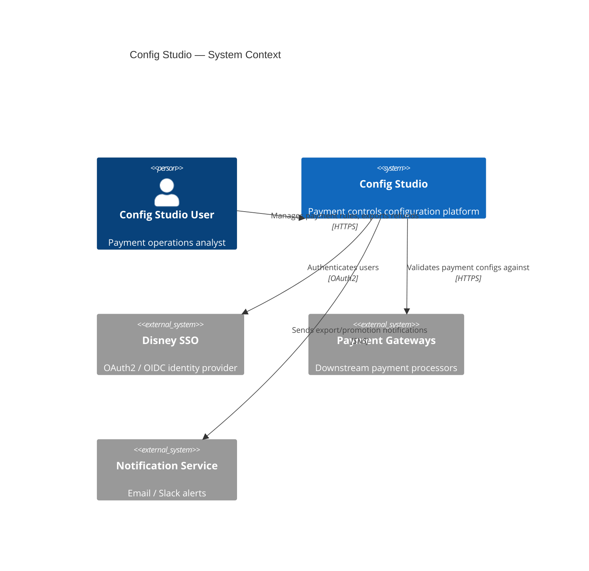

---

## 2. Container / Component Diagram (C4 Level 2)

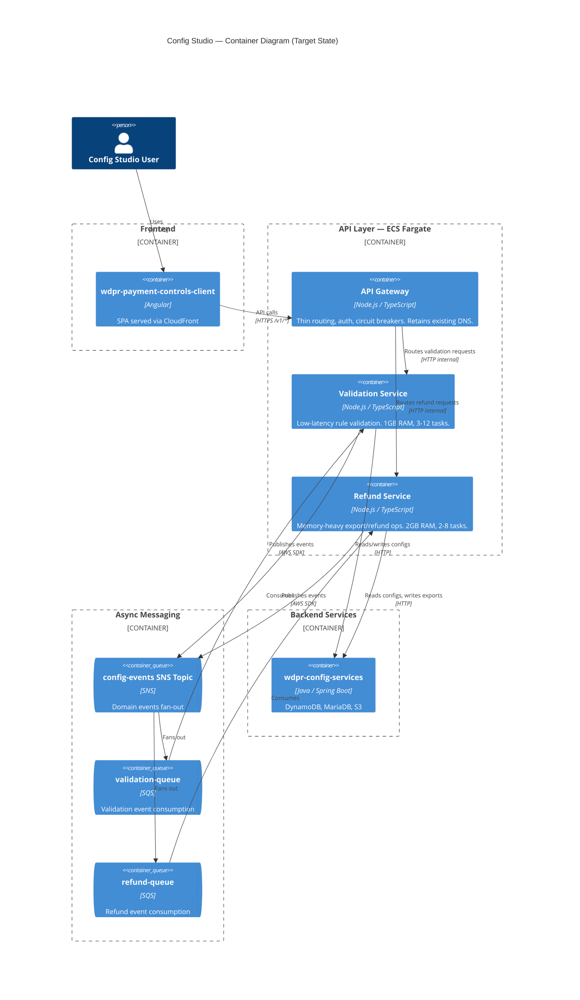

### Component Boundaries

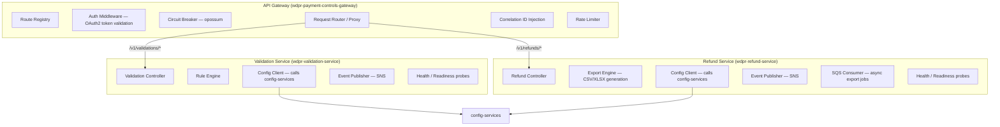

---

## 3. Integration Patterns

### 3.1 Synchronous (HTTP)

All synchronous communication flows through the API Gateway which acts as the single ingress point for the Angular client.

| Route Pattern            | Target Service      | Method | Purpose                        |
| ------------------------ | ------------------- | ------ | ------------------------------ |
| `/v1/validations/*`      | validation-service  | *      | Rule CRUD, validation triggers |
| `/v1/refunds/*`          | refund-service      | *      | Refund config, export triggers |
| `/v1/health`             | gateway (local)     | GET    | Gateway health                 |
| `/v1/configurations/*`   | validation-service  | *      | Config promotion flows         |

#### Sequence — Validation Request (Sync)

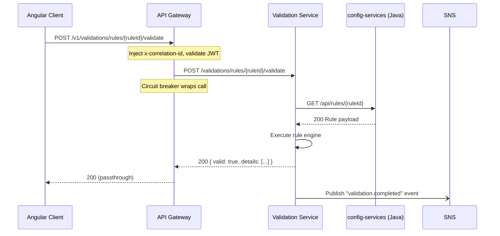

### 3.2 Asynchronous (SNS/SQS)

Events flow through a single SNS topic (`config-studio-events`) with SQS subscriptions filtered by message attributes.

| Event Name                  | Publisher          | Consumers          | Trigger                        |
| --------------------------- | ------------------ | ------------------ | ------------------------------ |
| `validation.completed`      | validation-service | refund-service     | Rule validated successfully    |
| `config.promoted`           | validation-service | refund-service     | Config promoted to environment |
| `refund.export.requested`   | gateway            | refund-service     | User triggers bulk export      |
| `refund.export.completed`   | refund-service     | (notification svc) | Export file ready              |

#### Sequence — Refund Export (Async)

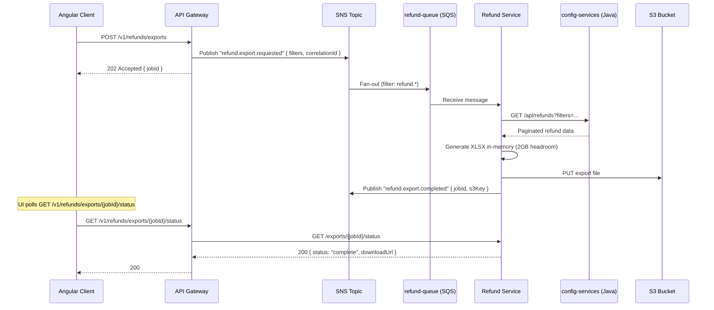

#### Sequence — Configuration Promotion

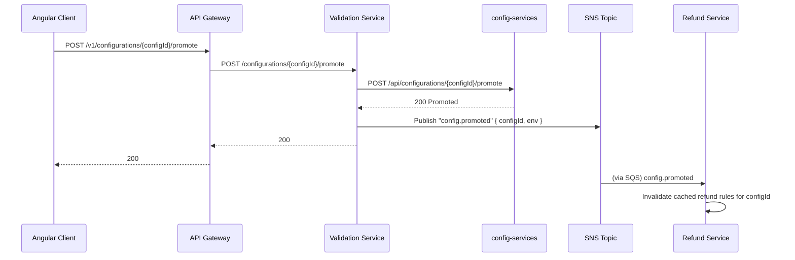

---

## 4. Data Flow Summary

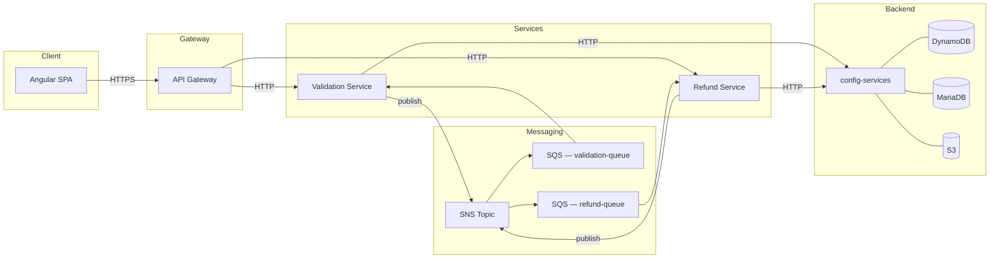

**Key design decisions:**

- Neither validation-service nor refund-service owns a database directly. All persistence flows through `config-services`.
- S3 is used for large export artifacts; the refund-service writes directly via AWS SDK (pre-signed URLs returned to client).
- No service-to-service synchronous calls between validation and refund. All cross-domain coordination is event-driven via SNS/SQS.

---

## 5. Deployment Topology — ECS Fargate

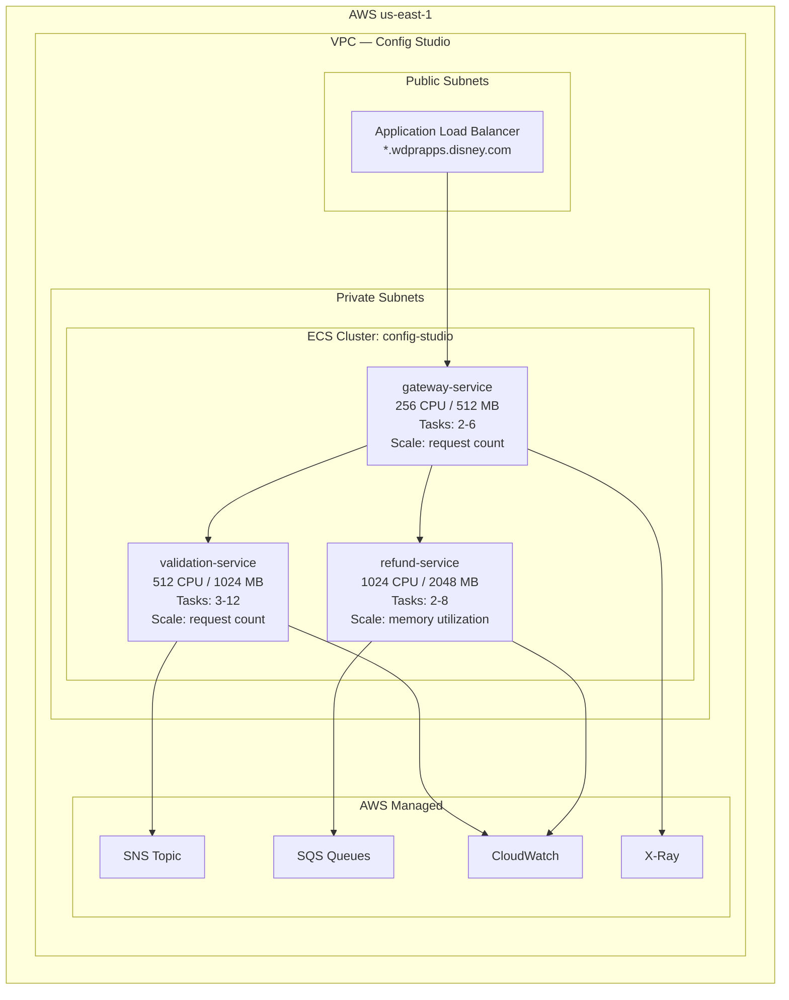

### ECS Service Configuration

| Service              | CPU (units) | Memory (MB) | Min Tasks | Max Tasks | Scaling Metric              | Target Value |
| -------------------- | ----------- | ----------- | --------- | --------- | --------------------------- | ------------ |
| gateway-service      | 256         | 512         | 2         | 6         | ALBRequestCountPerTarget    | 1000/min     |
| validation-service   | 512         | 1024        | 3         | 12        | ALBRequestCountPerTarget    | 500/min      |
| refund-service       | 1024        | 2048        | 2         | 8         | MemoryUtilization           | 70%          |

### DNS Strategy

| Environment | Gateway DNS (existing)                        | Validation DNS (new)                          | Refund DNS (new)                          |
| ----------- | --------------------------------------------- | --------------------------------------------- | ----------------------------------------- |
| dev         | payment-controls-dev.wdprapps.disney.com      | validation-dev.wdprapps.disney.com            | refund-dev.wdprapps.disney.com            |
| stage       | payment-controls-stage.wdprapps.disney.com    | validation-stage.wdprapps.disney.com          | refund-stage.wdprapps.disney.com          |
| prod        | payment-controls-prod.wdprapps.disney.com     | validation-prod.wdprapps.disney.com           | refund-prod.wdprapps.disney.com           |

> The Angular client continues to call the gateway DNS only. Internal service DNS is used exclusively for gateway → service routing via ALB path-based rules or service discovery (Cloud Map).

---

## 6. Resilience Patterns

### 6.1 Circuit Breakers (opossum)

Applied at the gateway for each downstream service:

```typescript
// gateway/src/circuit-breakers.ts
import CircuitBreaker from 'opossum';

const DEFAULTS = {
  timeout: 5000,        // 5s per request
  errorThresholdPercentage: 50,
  resetTimeout: 30000,  // 30s half-open
  volumeThreshold: 10,  // min requests before tripping
};

export const validationBreaker = new CircuitBreaker(callValidationService, {
  ...DEFAULTS,
  name: 'validation-service',
});

export const refundBreaker = new CircuitBreaker(callRefundService, {
  ...DEFAULTS,
  timeout: 10000, // refund calls may be heavier
  name: 'refund-service',
});
```

### 6.2 Retry Policy

| Layer            | Strategy                  | Max Retries | Backoff        |
| ---------------- | ------------------------- | ----------- | -------------- |
| Gateway → Service| opossum (no retry)        | 0           | N/A            |
| Service → config-services | Exponential backoff | 3           | 200ms × 2^n   |
| SQS Consumer     | SQS native retry          | 5           | Visibility timeout doubling |
| SQS DLQ          | After 5 failures          | —           | Manual review  |

### 6.3 Timeout Budget

```mermaid
gantt
    title Request Timeout Budget (validation flow)
    dateFormat X
    axisFormat %L ms

    section Gateway
    Auth + routing       : 0, 100
    Circuit breaker wait : 100, 200

    section Validation Service
    Business logic       : 200, 1500
    config-services call : 1500, 4000

    section Total
    Gateway timeout cap  : 0, 5000
```

### 6.4 Bulkhead Isolation

- Separate ECS services = process-level bulkhead. OOM in refund-service cannot impact validation-service.
- Within gateway: separate circuit breaker instances per downstream prevent cascade.
- SQS queues per consumer prevent noisy-neighbor message processing.

### 6.5 Dead Letter Queues

Each SQS queue has a DLQ configured with `maxReceiveCount: 5`. DLQ messages trigger a CloudWatch alarm for operational review.

---

## 7. Observability Architecture

### 7.1 Distributed Tracing (AWS X-Ray)

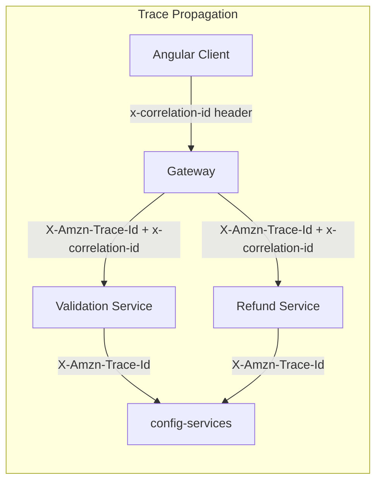

- Gateway generates `x-correlation-id` (UUIDv4) if not present on inbound request.
- All services propagate both `x-correlation-id` and X-Ray trace headers.
- SNS/SQS messages include `correlationId` in message attributes for async trace stitching.

### 7.2 Structured Logging

All services emit JSON logs to CloudWatch Logs with a consistent schema:

```json
{
  "timestamp": "2026-06-21T13:00:00.000Z",
  "level": "info",
  "service": "validation-service",
  "correlationId": "abc-123",
  "traceId": "1-abc-def",
  "message": "Validation completed",
  "duration_ms": 142,
  "ruleId": "rule-456"
}
```

Log groups per service: `/ecs/config-studio/{service-name}/{env}`

### 7.3 Metrics

| Metric                          | Source             | Alarm Threshold         |
| ------------------------------- | ------------------ | ----------------------- |
| Request latency p99             | ALB / X-Ray        | > 3s for 5 min         |
| Circuit breaker open events     | opossum → CW       | > 0 in 1 min           |
| SQS ApproximateAgeOfOldestMsg   | SQS                | > 300s                 |
| DLQ message count               | SQS                | > 0                    |
| ECS MemoryUtilization           | ECS                | > 85% for 5 min        |
| 5xx error rate                  | ALB                | > 1% for 5 min         |
| Export job duration              | Custom CW metric   | > 60s p95              |

### 7.4 Observability Stack

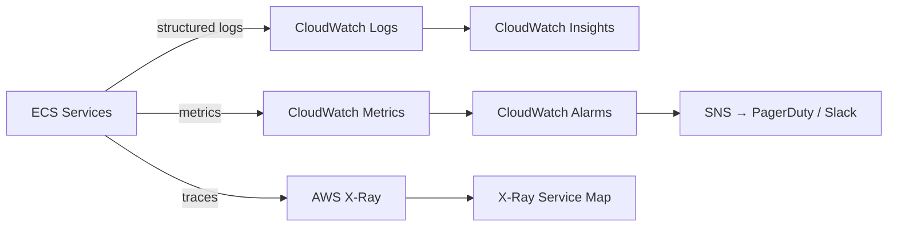

---

## 8. Migration Phases — Strangler Fig

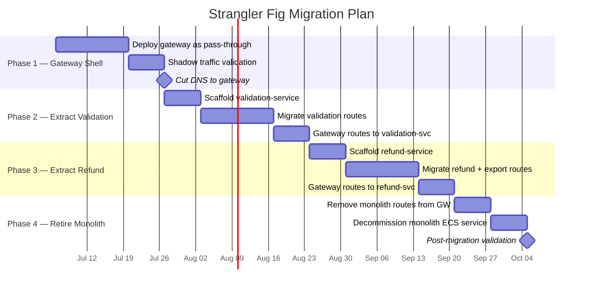

### Phase Details

| Phase | Sprint(s) | Deliverable                                           | Rollback Strategy                          |
| ----- | --------- | ----------------------------------------------------- | ------------------------------------------ |
| 1     | 1-2       | Gateway deployed; 100% pass-through to monolith       | Remove gateway, DNS reverts to monolith    |
| 2     | 2-4       | Validation routes served by new service               | Gateway feature flag routes back to monolith |
| 3     | 4-5       | Refund/export routes served by new service            | Gateway feature flag routes back to monolith |
| 4     | 5-6       | Monolith decommissioned                               | Re-deploy monolith from last known image   |

### Gateway Routing During Migration

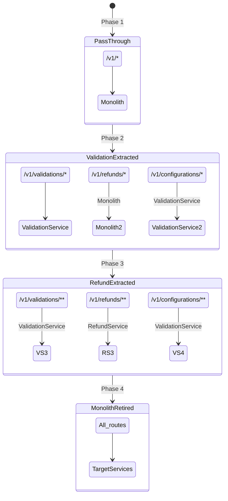

---

## 9. API Versioning & Backward Compatibility

### Strategy: URL Path Versioning with Gateway Adapter

| Principle                        | Implementation                                                    |
| -------------------------------- | ----------------------------------------------------------------- |
| Zero client changes              | Gateway retains `/v1/*` routes; Angular client is unmodified      |
| Internal services are unversioned| Downstream services expose `/validations/*`, `/refunds/*` (no v1) |
| Version translation at gateway   | Gateway maps `/v1/validations/…` → validation-service `/validations/…` |
| Future v2                        | New routes added at gateway when breaking changes needed          |
| Deprecation                      | `Sunset` header + 90-day notice before removing old routes        |

### Gateway Route Mapping

```typescript
// gateway/src/routes.ts
const routeMap = [
  { pattern: '/v1/validations/**', target: 'validation-service', strip: '/v1' },
  { pattern: '/v1/refunds/**',     target: 'refund-service',     strip: '/v1' },
  { pattern: '/v1/configurations/**', target: 'validation-service', strip: '/v1' },
  { pattern: '/v1/health',         target: 'local' },
];
```

### Contract Testing

- Each service publishes an OpenAPI 3.x spec as a build artifact.
- Gateway runs contract tests against downstream specs on every CI build.
- Breaking changes detected in CI prevent merge (consumer-driven contract testing via Pact or schema diff).

### Response Envelope (unchanged from monolith)

```json
{
  "data": { ... },
  "meta": {
    "correlationId": "abc-123",
    "timestamp": "2026-06-21T13:00:00.000Z"
  },
  "errors": []
}
```

---

## Appendix A — Technology Decisions

| Concern             | Choice                        | Rationale                                      |
| ------------------- | ----------------------------- | ---------------------------------------------- |
| Language            | Node.js / TypeScript          | Team expertise, existing codebase              |
| Framework           | Express (gateway), Fastify (services) | Fastify for perf in hot path; Express for proxy compat |
| Circuit Breaker     | opossum                       | Established in team, Node-native               |
| HTTP Client         | undici                        | Built into Node, high performance              |
| Messaging           | AWS SNS + SQS                 | Managed, serverless, native dead-letter        |
| Tracing             | aws-xray-sdk                  | Disney standard, integrates with ECS           |
| Logging             | pino                          | Fast structured JSON logging                   |
| Container Registry  | ECR                           | AWS-native, IAM-integrated                     |
| CI/CD               | Harness                       | Existing organizational standard               |
| IaC                 | Terraform                     | Team standard for ECS / networking             |

---

## Appendix B — Service Repository Structure

```
wdpr-payment-controls-gateway/    # Thin router + auth + circuit breakers
wdpr-validation-service/          # Validation domain logic
wdpr-refund-service/              # Refund + export domain logic
config-studio-infra/              # Terraform for shared infra (SNS, ALB, VPC)
```

Each service repo contains:

```
src/
  controllers/
  services/
  middleware/
  events/         # SNS publishers / SQS consumers
  clients/        # HTTP clients to config-services
  health/
test/
infra/            # Service-specific Terraform (ECS task def, SQS queue)
Dockerfile
harness/          # Harness pipeline YAML
openapi.yaml      # Contract spec
```
