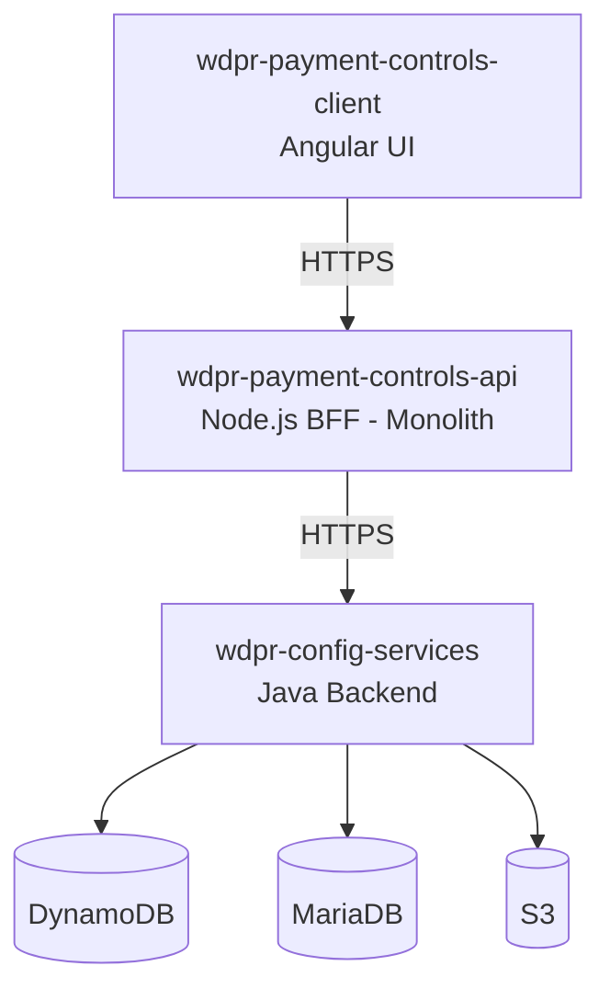
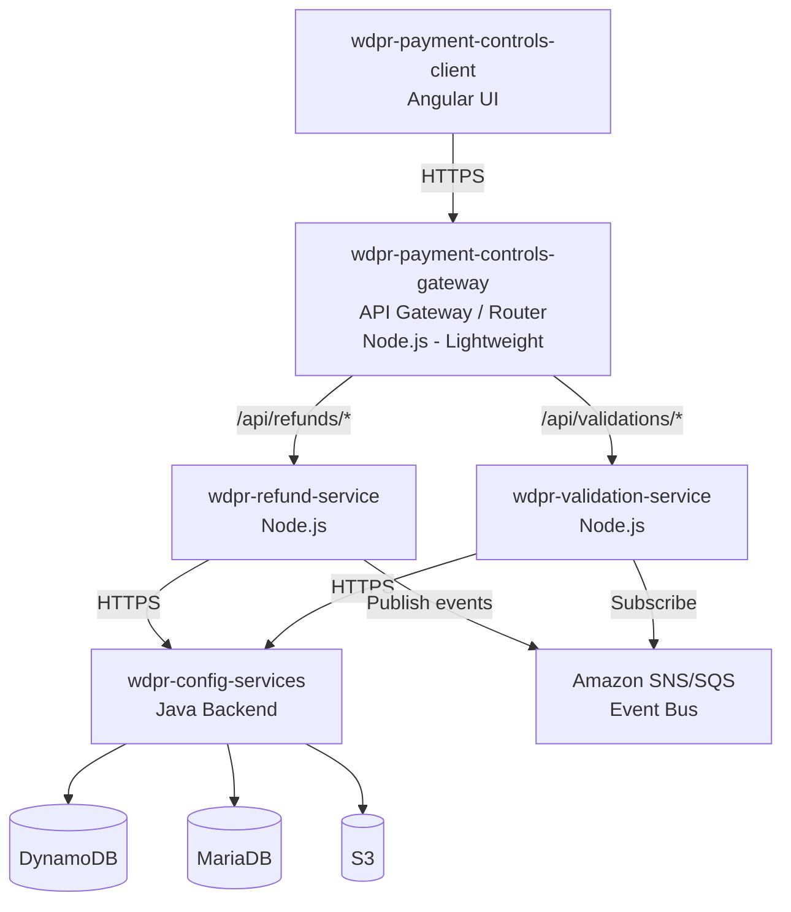
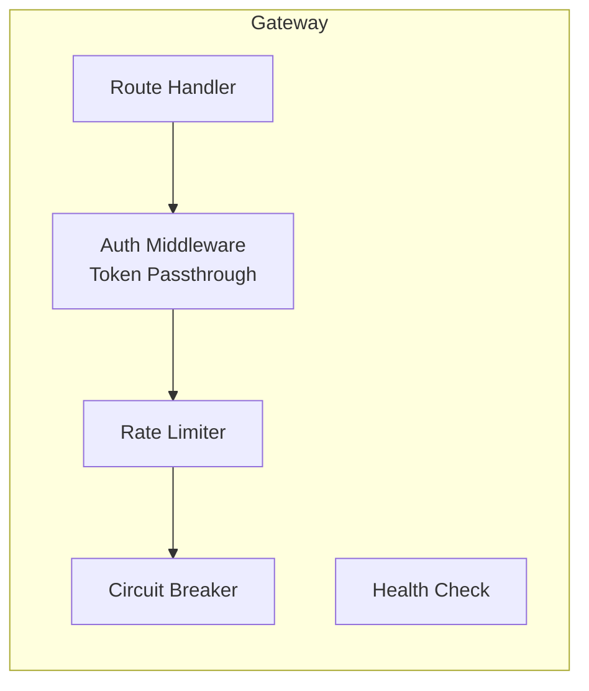
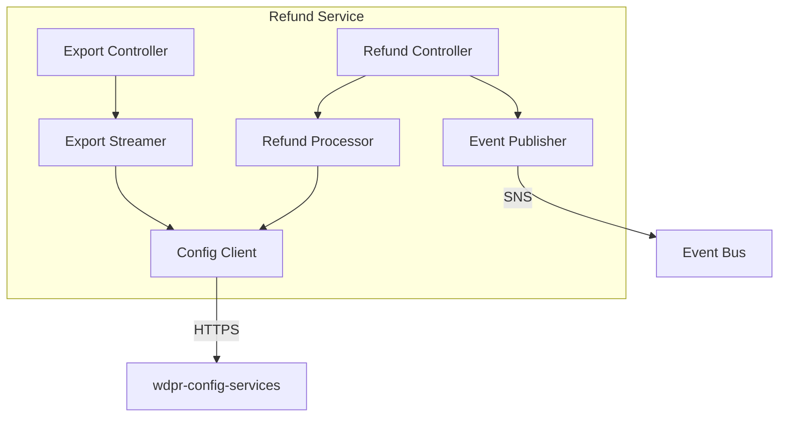
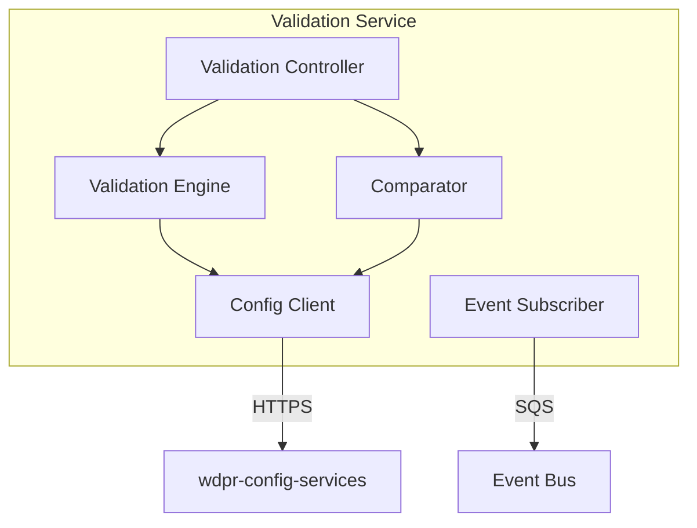
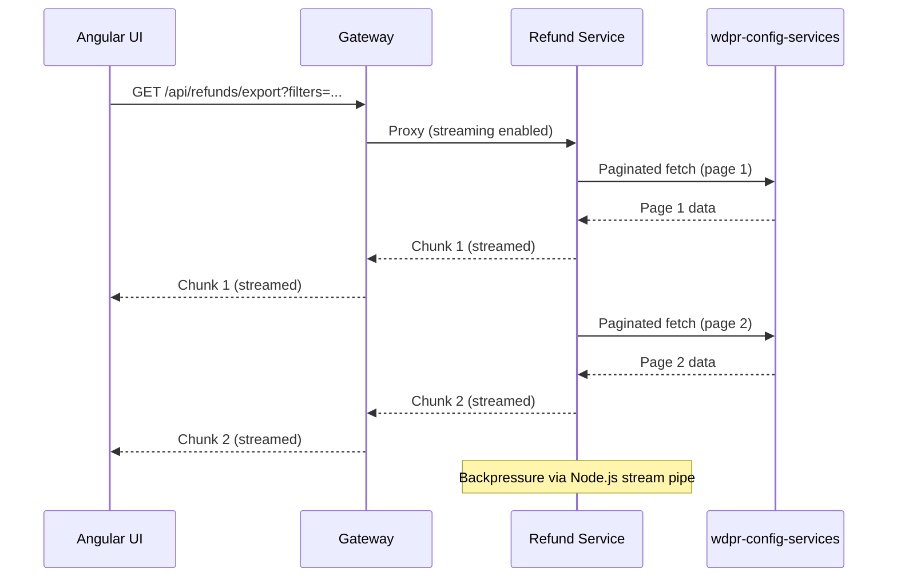
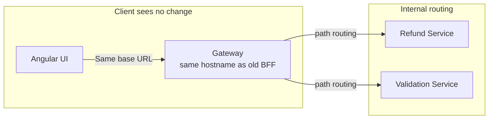
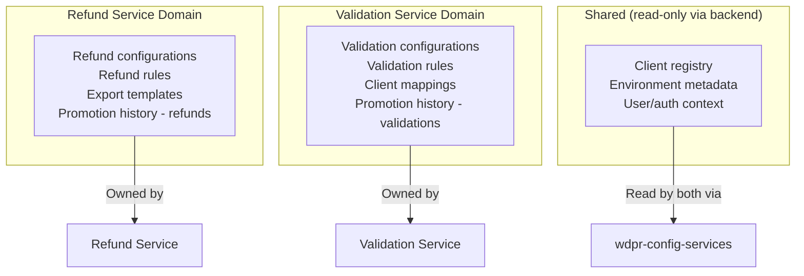
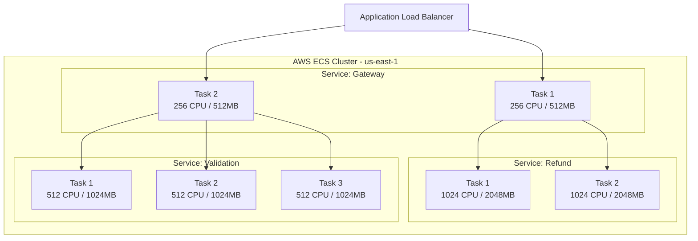
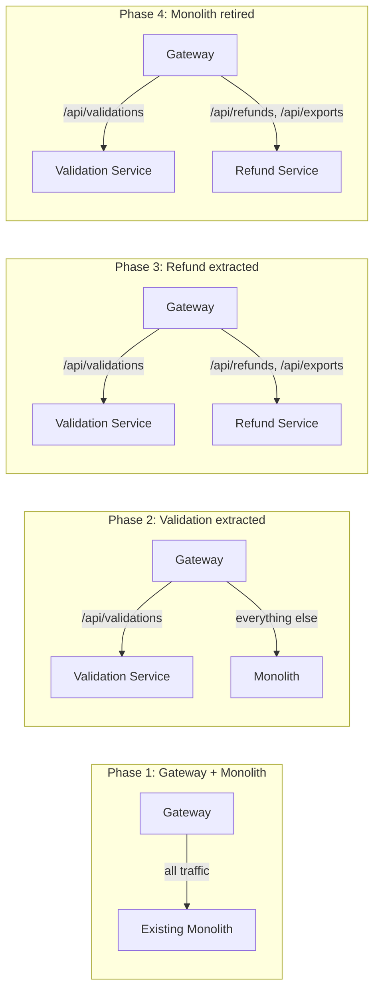

# Target architecture: wdpr-payment-controls-api decomposition

## Document information

| Field | Value |
|-------|-------|
| Status | Draft |
| Date | 2026-06-16 |
| Author | Architecture Spec Agent |
| Stakeholders | Payment Controls Engineering, Platform Engineering, SRE |

---

## 1. Context

### Problem statement

`wdpr-payment-controls-api` is a monolithic Node.js BFF that handles both refund processing and payment validation logic. The service has experienced OOMKilled events in ECS us-east-1 due to memory-intensive export streaming operations co-located with latency-sensitive validation requests. These competing resource profiles make independent scaling impossible in the current architecture.

### Current state



### Drivers for decomposition

| Driver | Impact |
|--------|--------|
| OOMKilled events | Production incidents; refund streaming exhausts memory, starving validation requests |
| Independent scaling | Validation is high-throughput/low-latency; refunds are bursty with large payloads |
| Deployment independence | Refund logic changes should not risk validation availability |
| Team ownership | Enables separate team ownership and release cadences |

---

## 2. Containers

### Target state overview



### Service descriptions

| Service | Responsibility | URL pattern |
|---------|---------------|-------------|
| wdpr-payment-controls-gateway | Route requests, auth passthrough, CORS, rate limiting | `https://wdpr-payment-controls-gateway-{env}.wdprapps.disney.com` |
| wdpr-refund-service | Refund processing, export streaming, refund configuration management | `https://wdpr-refund-service-{env}.wdprapps.disney.com` |
| wdpr-validation-service | Payment validation rules, validation configuration, client comparison | `https://wdpr-validation-service-{env}.wdprapps.disney.com` |

---

## 3. Components

### wdpr-payment-controls-gateway



**Responsibilities:**
- Path-based routing to downstream services
- Authentication token passthrough (no termination)
- Circuit breaker per downstream service
- Request/response logging and correlation ID injection
- CORS handling for the Angular UI
- Health aggregation from downstream services

**Note:** The gateway is intentionally thin. It performs no business logic and can be replaced by AWS ALB path-based routing once the strangler fig migration is complete.

### wdpr-refund-service



**Responsibilities:**
- Refund rule configuration CRUD
- Refund processing and orchestration
- Large data export with streaming responses (chunked transfer)
- Publishing refund lifecycle events (refund.created, refund.updated, refund.promoted)
- Promotion/preview of refund configurations across environments

**Memory profile:** High (streaming exports). ECS task sized at 2GB+ with streaming backpressure controls.

### wdpr-validation-service



**Responsibilities:**
- Payment validation rule configuration CRUD
- Real-time validation execution (low-latency path)
- Client configuration comparison
- Search/browse validation configurations
- Subscribing to refund events for cross-domain consistency checks

**Memory profile:** Low-moderate. Optimized for throughput and latency. ECS task sized at 512MB–1GB.

---

## 4. Integration patterns

### Synchronous communication (request/response)

| Source | Target | Pattern | Use case |
|--------|--------|---------|----------|
| Gateway → Refund Service | HTTP/REST | All refund API requests |
| Gateway → Validation Service | HTTP/REST | All validation API requests |
| Refund Service → wdpr-config-services | HTTP/REST | Refund config persistence |
| Validation Service → wdpr-config-services | HTTP/REST | Validation config persistence |

### Asynchronous communication (event-driven)

| Event | Publisher | Subscriber | Transport | Use case |
|-------|-----------|------------|-----------|----------|
| refund.config.promoted | Refund Service | Validation Service | SNS → SQS | Notify validation of refund config changes that may affect validation rules |
| validation.config.updated | Validation Service | Refund Service | SNS → SQS | Notify refund of validation rule changes impacting refund eligibility |
| export.completed | Refund Service | — (future) | SNS → SQS | Audit trail, notification |

### Streaming pattern

Export operations use HTTP chunked transfer encoding with backpressure:



The gateway must support streaming proxying (no response buffering). Use `http-proxy` or equivalent with streaming enabled.

### Resilience patterns

| Pattern | Implementation | Scope |
|---------|---------------|-------|
| Circuit breaker | `opossum` library | Gateway → each downstream service |
| Retry with exponential backoff | Built into HTTP client | Service → wdpr-config-services |
| Timeout | 30s default, 300s for exports | Per-route configurable |
| Bulkhead | Separate ECS tasks | Service-level isolation |
| Fallback | Cached last-known-good config | Validation service only |

---

## 5. API gateway / routing strategy

### Path-based routing rules

```
/api/refunds/**          → wdpr-refund-service
/api/exports/**          → wdpr-refund-service
/api/validations/**      → wdpr-validation-service
/api/clients/**          → wdpr-validation-service (search/browse/compare)
/api/health              → gateway aggregated health
```

### Backward compatibility

The gateway preserves the existing API contract:



- The gateway takes over the existing DNS name (`wdpr-payment-controls-api-{env}.wdprapps.disney.com`)
- No client-side changes required during migration
- Correlation IDs propagated via `x-correlation-id` header

### Future state (post-migration)

Once stable, the gateway can be replaced by ALB path-based routing rules, eliminating the extra hop for non-streaming requests. Streaming routes would still need the gateway for backpressure management.

---

## 6. Data ownership

### Ownership boundaries



### Data access rules

1. **No shared database** — Each service accesses only its domain data through `wdpr-config-services`
2. **Shared reference data** — Client registry and environment metadata are read-only, accessed via the existing Java backend
3. **Cross-domain queries** — Handled via API composition at the gateway level or async event synchronization
4. **No direct DynamoDB/MariaDB access** — Services communicate exclusively through `wdpr-config-services` REST APIs (existing pattern preserved)

---

## 7. Deployment topology

### ECS architecture



### Scaling policies

| Service | Min tasks | Max tasks | Scaling metric | Target |
|---------|-----------|-----------|----------------|--------|
| Gateway | 2 | 6 | CPU utilization | 60% |
| Refund Service | 2 | 8 | Memory utilization | 70% |
| Validation Service | 3 | 12 | Request count / latency | p99 < 200ms |

### Harness CI/CD pipeline structure

```
wdpr-payment-controls-gateway/
├── Pipeline: Build → Test → Deploy Stage → Deploy Prod
├── Artifact: ECR image
└── Deployment: ECS Rolling Update

wdpr-refund-service/
├── Pipeline: Build → Test → Deploy Stage → Deploy Prod
├── Artifact: ECR image
└── Deployment: ECS Rolling Update (canary for prod)

wdpr-validation-service/
├── Pipeline: Build → Test → Deploy Stage → Deploy Prod
├── Artifact: ECR image
└── Deployment: ECS Rolling Update (canary for prod)
```

Each service gets an independent Harness pipeline with:
- Separate Git repositories (or monorepo with path-based triggers)
- Independent versioning
- Environment-specific variable sets
- Approval gates for production

---

## 8. Observability

### Distributed tracing

- Propagate `x-correlation-id` across all service boundaries
- Use AWS X-Ray or OpenTelemetry for distributed tracing
- Gateway injects trace context if not present

### Logging

- Structured JSON logs with correlation ID, service name, environment
- Centralized in CloudWatch Logs with cross-service log group queries
- Log levels: ERROR alerts → PagerDuty, WARN → dashboard

### Metrics

| Metric | Service | Alert threshold |
|--------|---------|-----------------|
| Request latency p99 | Validation | > 200ms |
| Request latency p99 | Refund | > 2s (> 30s for exports) |
| Memory utilization | Refund | > 80% |
| Circuit breaker open | Gateway | Any open > 30s |
| Error rate (5xx) | All | > 1% over 5 min |
| Export stream duration | Refund | > 5 min |

### Health checks

- `/health/live` — Process is running (ECS task health)
- `/health/ready` — Dependencies reachable (wdpr-config-services, event bus)
- Gateway aggregates downstream readiness

---

## 9. Migration strategy: strangler fig

### Approach

Incremental migration using the strangler fig pattern. The gateway acts as the façade, allowing traffic to be shifted route-by-route from the monolith to the new services.



### Phase plan

| Phase | Duration | Actions | Rollback |
|-------|----------|---------|----------|
| 1. Deploy gateway | 1 sprint | Deploy gateway as pass-through proxy to existing monolith. Validate zero behavioral change. | Remove gateway from DNS, point back to monolith |
| 2. Extract validation | 2 sprints | Deploy validation service. Route `/api/validations/**` and `/api/clients/**` to new service. Shadow traffic comparison. | Gateway routes back to monolith |
| 3. Extract refund | 2 sprints | Deploy refund service. Route `/api/refunds/**` and `/api/exports/**` to new service. Validate streaming exports. | Gateway routes back to monolith |
| 4. Decommission monolith | 1 sprint | Remove old `wdpr-payment-controls-api` ECS service. Clean up. | Re-deploy monolith if needed |

### Risk mitigation

- **Shadow traffic:** During phases 2–3, run requests to both old and new services, compare responses (validation only, not writes)
- **Feature flags:** Gateway routing controlled by feature flags per environment
- **Canary deploys:** New services deployed with canary in production before full rollout
- **Shared libraries:** Extract common code (auth middleware, config-services client, logging) into an internal npm package before extraction

---

## 10. Decision log

| Decision | Rationale | Alternatives considered |
|----------|-----------|------------------------|
| Thin gateway over ALB routing | Supports streaming proxy, circuit breakers, and correlation ID injection | ALB path rules (insufficient for streaming backpressure) |
| SNS/SQS for async events | Native AWS, no additional infra, dead-letter queue support | EventBridge (overkill), direct HTTP callbacks (coupling) |
| Strangler fig over big-bang | Lower risk, enables incremental validation, easy rollback | Big-bang (higher risk, faster if successful) |
| Separate ECS services over Lambda | Long-running exports incompatible with Lambda timeout; consistent runtime model | Lambda (timeout limits), EKS (operational overhead) |
| Extract validation first | Lower memory footprint, simpler domain, faster to validate | Extract refund first (higher value but higher risk) |
