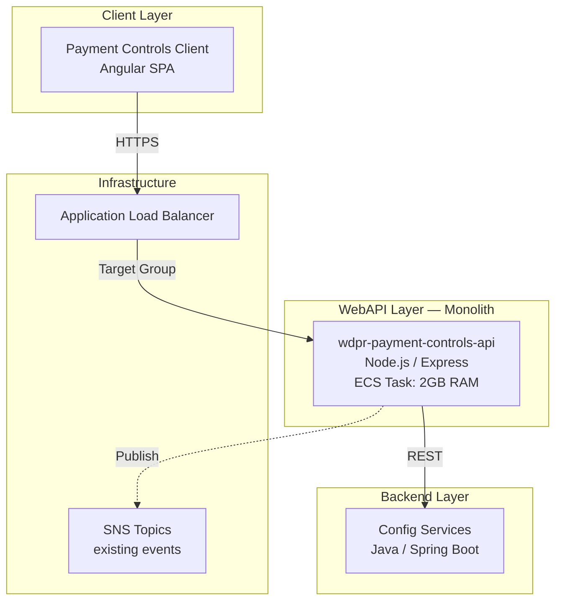
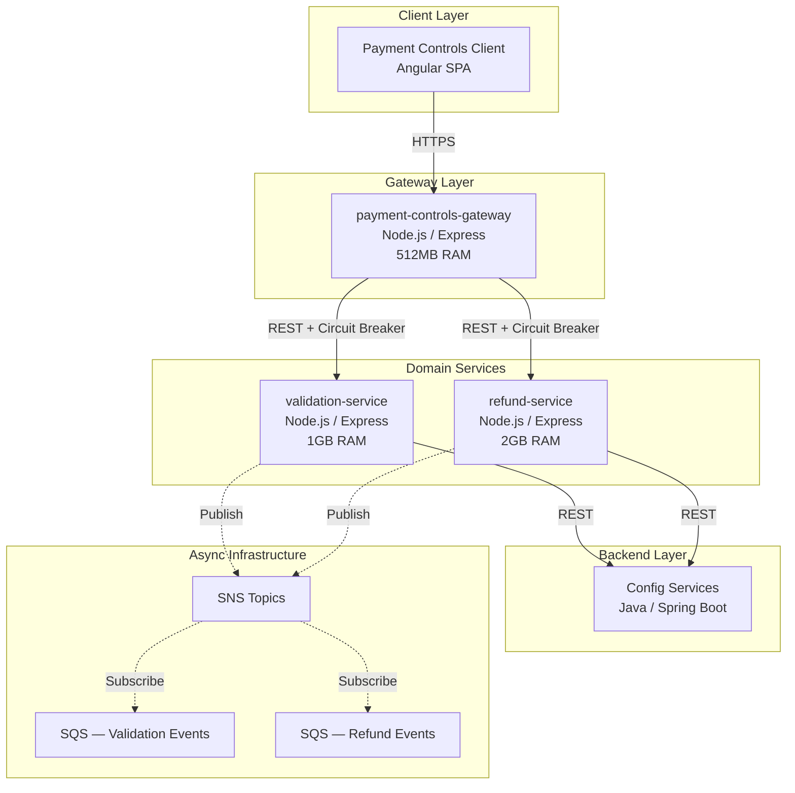
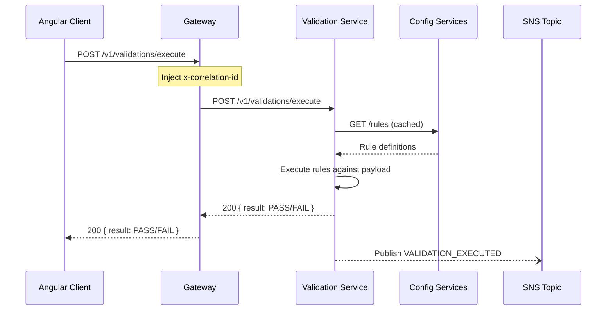
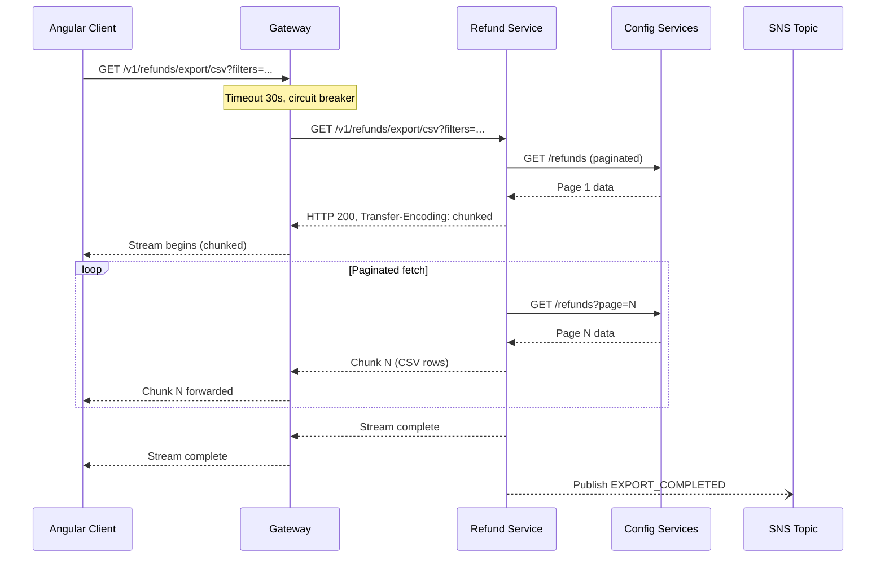
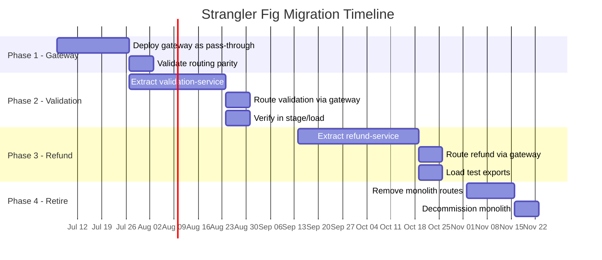
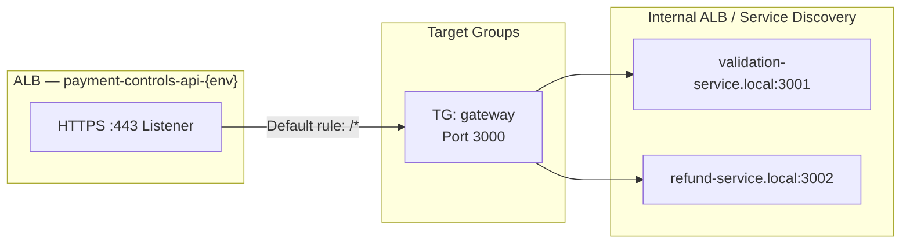

# Architecture Specification: Payment Controls API Decomposition

## 1. Executive Summary

### Motivation

The `wdpr-payment-controls-api` monolith is experiencing recurring OOM (Out of Memory) kills in ECS production tasks. Root cause: refund export operations (streaming large datasets into CSV/Excel) consume 1.5–2GB of heap, while validation endpoints require only 200–400MB but need low-latency responses. A single ECS task definition forces both workloads to share the same memory ceiling, causing:

- **OOMKilled events** during peak export periods that crash co-located validation endpoints
- **Scaling mismatch** — scaling for memory-heavy exports over-provisions CPU for validation; scaling for validation request count under-provisions memory for exports
- **Blast radius** — any failure in one domain (refund timeout, validation rule error) degrades the entire API surface

### Goals

| Goal                        | Success Metric                                      |
| --------------------------- | --------------------------------------------------- |
| Eliminate OOM events        | Zero OOMKilled events in 30-day rolling window      |
| Independent scaling         | Each service scales on its primary resource driver   |
| Zero UI disruption          | Angular client requires no URL/contract changes     |
| Faster deployments          | Deploy validation without risking refund stability   |
| Observability               | End-to-end tracing across all 3 services            |

### Approach

**Strangler Fig pattern** over 4 phases (~22 weeks). A thin API gateway is deployed first as a pass-through proxy retaining the existing DNS, then routes are progressively migrated to dedicated backend services until the monolith is retired.

---

## 2. Component Diagrams

### 2.1 Current State (Monolith)



### 2.2 Target State (3 Services)



### 2.3 Network Topology / Deployment View

```mermaid
graph TB
    subgraph "Public"
        DNS[payment-controls-api-{env}.wdprapps.disney.com]
    end

    subgraph "AWS VPC"
        subgraph "Public Subnet"
            ALB[Application Load Balancer<br/>HTTPS :443]
        end

        subgraph "Private Subnet A"
            GW_TASK[Gateway ECS Tasks<br/>2-6 tasks]
        end

        subgraph "Private Subnet B"
            VS_TASK[Validation ECS Tasks<br/>3-12 tasks]
            RS_TASK[Refund ECS Tasks<br/>2-8 tasks]
        end

        subgraph "Service Discovery"
            SD_VS[validation-service.local]
            SD_RS[refund-service.local]
        end

        subgraph "Shared Services"
            CS_ALB[Config Services ALB]
        end
    end

    DNS --> ALB
    ALB --> GW_TASK
    GW_TASK --> SD_VS --> VS_TASK
    GW_TASK --> SD_RS --> RS_TASK
    VS_TASK --> CS_ALB
    RS_TASK --> CS_ALB
```

---

## 3. Service Specifications

### 3.1 Payment Controls Gateway

| Attribute            | Value                                                              |
| -------------------- | ------------------------------------------------------------------ |
| **Repository**       | `wdpr-payment-controls-gateway`                                    |
| **Purpose**          | Thin reverse proxy; route adapter; auth pass-through               |
| **DNS**              | `payment-controls-api-{env}.wdprapps.disney.com` (retains current) |
| **Tech Stack**       | Node.js 20 LTS, Express, http-proxy-middleware, opossum            |
| **CPU**              | 256 CPU units (0.25 vCPU)                                          |
| **Memory**           | 512 MB                                                             |
| **Scaling**          | Target tracking — 2-6 tasks, metric: ALBRequestCountPerTarget      |
| **Health Check**     | `GET /health` → 200 `{ status: "ok", service: "gateway" }`        |

**Responsibilities:**
- Retain all `/v1/*` route paths for backward compatibility
- Route validation requests to `validation-service`
- Route refund requests to `refund-service`
- Propagate auth headers (JWT / Disney SSO tokens) downstream
- Inject/propagate `x-correlation-id` header
- Circuit breaker per downstream service (opossum)
- Rate limiting (optional, future)

**API Surface (pass-through routes):**

| Route Pattern                    | Downstream Target    |
| -------------------------------- | -------------------- |
| `GET/POST /v1/validations/*`     | validation-service   |
| `GET/POST /v1/rules/*`           | validation-service   |
| `GET/POST /v1/refunds/*`         | refund-service       |
| `GET /v1/refunds/export/*`       | refund-service       |
| `GET /v1/health`                 | local (gateway)      |

---

### 3.2 Validation Service

| Attribute            | Value                                                             |
| -------------------- | ----------------------------------------------------------------- |
| **Repository**       | `wdpr-payment-controls-validation`                                |
| **Purpose**          | Execute validation rules, manage rule configurations              |
| **DNS**              | `validation-service-{env}.wdprapps.disney.com`                    |
| **Service Discovery**| `validation-service.payment-controls.local`                       |
| **Tech Stack**       | Node.js 20 LTS, Express, ajv (schema validation), node-cache     |
| **CPU**              | 512 CPU units (0.5 vCPU)                                          |
| **Memory**           | 1024 MB (1 GB)                                                    |
| **Scaling**          | Target tracking — 3-12 tasks, metric: RequestCountPerTarget (500) |
| **Health Check**     | `GET /health` → 200 `{ status: "ok", service: "validation" }`    |

**Responsibilities:**
- Execute payment validation rules against incoming payloads
- Fetch and cache rule configurations from Config Services
- Return synchronous pass/fail validation results
- Publish validation events (pass/fail/error) to SNS

**API Surface:**

| Method | Path                          | Description                        |
| ------ | ----------------------------- | ---------------------------------- |
| POST   | `/v1/validations/execute`     | Execute rules against payload      |
| GET    | `/v1/rules`                   | List configured validation rules   |
| GET    | `/v1/rules/:id`               | Get rule by ID                     |
| POST   | `/v1/rules`                   | Create validation rule             |
| PUT    | `/v1/rules/:id`               | Update validation rule             |
| DELETE | `/v1/rules/:id`               | Delete validation rule             |
| GET    | `/health`                     | Service health                     |

---

### 3.3 Refund Service

| Attribute            | Value                                                             |
| -------------------- | ----------------------------------------------------------------- |
| **Repository**       | `wdpr-payment-controls-refund`                                    |
| **Purpose**          | Refund processing, report generation, large data exports          |
| **DNS**              | `refund-service-{env}.wdprapps.disney.com`                        |
| **Service Discovery**| `refund-service.payment-controls.local`                           |
| **Tech Stack**       | Node.js 20 LTS, Express, exceljs (streaming), csv-stringify       |
| **CPU**              | 1024 CPU units (1 vCPU)                                           |
| **Memory**           | 2048 MB (2 GB)                                                    |
| **Scaling**          | Target tracking — 2-8 tasks, metric: MemoryUtilization (70%)     |
| **Health Check**     | `GET /health` → 200 `{ status: "ok", service: "refund" }`        |

**Responsibilities:**
- Process refund requests (CRUD operations proxied to Config Services)
- Generate and stream large export files (CSV, Excel)
- Handle long-running export jobs with progress tracking
- Publish refund lifecycle events to SNS

**API Surface:**

| Method | Path                          | Description                        |
| ------ | ----------------------------- | ---------------------------------- |
| GET    | `/v1/refunds`                 | List refunds with filtering        |
| GET    | `/v1/refunds/:id`             | Get refund detail                  |
| POST   | `/v1/refunds`                 | Create refund record               |
| PUT    | `/v1/refunds/:id`             | Update refund record               |
| GET    | `/v1/refunds/export/csv`      | Stream CSV export                  |
| GET    | `/v1/refunds/export/excel`    | Stream Excel export                |
| GET    | `/v1/refunds/export/:id/status` | Export job status                |
| GET    | `/health`                     | Service health                     |

---

## 4. Integration Patterns

### 4.1 Synchronous Communication

**Circuit Breaker Configuration (opossum at Gateway):**

| Parameter           | Validation Service | Refund Service |
| ------------------- | ------------------ | -------------- |
| Timeout             | 5 000 ms           | 30 000 ms     |
| Error threshold (%) | 50                 | 50             |
| Reset timeout       | 15 000 ms          | 30 000 ms     |
| Rolling window      | 10 000 ms          | 10 000 ms     |
| Volume threshold    | 10                 | 5              |

**Retry Policy:**
- Validation: 1 retry with 500ms backoff (idempotent reads only)
- Refund exports: no retry (streaming; client re-requests)
- Refund mutations: no retry (non-idempotent)

**Timeout Hierarchy:**
```
ALB idle timeout:       60s
Gateway → Validation:    5s
Gateway → Refund:       30s (exports need time)
Service → Config Svcs:  10s
```

### 4.2 Asynchronous Communication (SNS/SQS)

**Topic Structure:**

| SNS Topic                                   | Publisher          | Purpose                        |
| ------------------------------------------- | ------------------ | ------------------------------ |
| `payment-controls-validation-events-{env}`  | validation-service | Rule execution outcomes        |
| `payment-controls-refund-events-{env}`      | refund-service     | Refund lifecycle changes       |

**Event Schemas:**

```json
// Validation Event
{
  "eventId": "uuid",
  "eventType": "VALIDATION_EXECUTED",
  "timestamp": "ISO-8601",
  "correlationId": "uuid",
  "payload": {
    "ruleId": "string",
    "result": "PASS | FAIL | ERROR",
    "entityType": "string",
    "entityId": "string"
  }
}
```

```json
// Refund Event
{
  "eventId": "uuid",
  "eventType": "REFUND_CREATED | REFUND_UPDATED | EXPORT_COMPLETED",
  "timestamp": "ISO-8601",
  "correlationId": "uuid",
  "payload": {
    "refundId": "string",
    "status": "string",
    "exportFormat": "CSV | EXCEL"
  }
}
```

**SQS Subscriptions:**

| Queue                                        | Subscribes To        | Consumer           |
| -------------------------------------------- | -------------------- | ------------------ |
| `validation-events-dlq-{env}`                | (dead letter)        | Ops alerting       |
| `refund-events-dlq-{env}`                    | (dead letter)        | Ops alerting       |

### 4.3 Data Flow: Validation Request



### 4.4 Data Flow: Refund Export



---

## 5. Cross-cutting Concerns

### 5.1 Observability

| Layer          | Tool                  | Detail                                              |
| -------------- | --------------------- | --------------------------------------------------- |
| **Tracing**    | AWS X-Ray             | Correlation ID propagated via `x-correlation-id`    |
| **Metrics**    | CloudWatch + StatsD   | Latency p50/p95/p99, error rate, circuit state      |
| **Logging**    | CloudWatch Logs       | Structured JSON, includes correlationId per request  |
| **Dashboards** | CloudWatch Dashboards | Per-service health, combined system view            |
| **Alerting**   | CloudWatch Alarms     | OOM, 5xx rate > 1%, circuit open, DLQ depth > 0    |

**Structured Log Format:**
```json
{
  "timestamp": "ISO-8601",
  "level": "info|warn|error",
  "service": "gateway|validation|refund",
  "correlationId": "uuid",
  "method": "GET",
  "path": "/v1/validations/execute",
  "statusCode": 200,
  "durationMs": 45,
  "message": "Request completed"
}
```

### 5.2 Security

| Concern                  | Implementation                                              |
| ------------------------ | ----------------------------------------------------------- |
| **Auth propagation**     | Gateway forwards `Authorization` header unchanged           |
| **Service-to-service**   | AWS Security Groups restrict ingress to gateway only        |
| **mTLS (future)**        | ECS Service Connect supports mTLS; defer to Phase 4+        |
| **Secrets**              | AWS Secrets Manager, injected via ECS task role             |
| **Input validation**     | Each service validates its own request schemas (ajv)         |
| **CORS**                 | Gateway handles CORS; downstream services accept all from GW |

### 5.3 Error Handling and Resilience

| Pattern                 | Implementation                                               |
| ----------------------- | ------------------------------------------------------------ |
| **Circuit breaker**     | opossum at gateway; open state returns 503 with retry-after  |
| **Bulkhead**            | Separate ECS services = process-level isolation              |
| **Timeout cascade**     | Each layer has progressively shorter timeouts                |
| **Graceful degradation**| If refund-service is down, validation continues unaffected   |
| **DLQ**                 | Failed async messages route to DLQ; alarm triggers review    |
| **Health checks**       | ALB + ECS health checks; unhealthy tasks replaced in 30s     |
| **Backpressure**        | Refund export uses streaming to avoid buffering entire dataset|

---

## 6. Migration Strategy (Strangler Fig)

### Phase Breakdown



### Phase Details

| Phase | Sprint(s) | Scope                                                                 | Exit Criteria                                    |
| ----- | --------- | --------------------------------------------------------------------- | ------------------------------------------------ |
| **1** | 1-2       | Deploy gateway as transparent proxy to existing monolith              | 100% traffic routed through GW, zero errors      |
| **2** | 3-4       | Extract validation domain into `validation-service`; gateway routes   | Validation latency p95 < 200ms, all tests pass   |
| **3** | 5-6       | Extract refund domain into `refund-service`; streaming exports        | Export 100k rows without OOM, p95 < 25s          |
| **4** | 6         | Remove monolith, clean up legacy infra                                | Monolith ECS service deleted, DNS confirmed      |

### Risk Mitigation

| Risk                                  | Mitigation                                                    |
| ------------------------------------- | ------------------------------------------------------------- |
| Gateway introduces latency            | Phase 1 validates < 5ms added latency via load test           |
| Validation extraction breaks rules    | Shadow-mode: run both, compare results before cutover         |
| Export streaming fails through proxy   | Test chunked transfer through gateway in Phase 1              |
| Config Services overwhelmed by 3 callers | No change in total request volume; same traffic, split origin |
| Auth token not propagated correctly   | Integration tests validate auth flow per phase                |

### Rollback Strategy

| Phase | Rollback Mechanism                                                      | RTO     |
| ----- | ----------------------------------------------------------------------- | ------- |
| 1     | Remove gateway from ALB target group; point back to monolith            | < 5 min |
| 2     | Gateway routes validation back to monolith (config toggle / env var)    | < 2 min |
| 3     | Gateway routes refund back to monolith (config toggle / env var)        | < 2 min |
| 4     | Re-deploy monolith from last known good image (container still in ECR)  | < 15 min|

**Feature Flags (route toggles):**
```
ROUTE_VALIDATION_TARGET=monolith|validation-service  (default: monolith)
ROUTE_REFUND_TARGET=monolith|refund-service          (default: monolith)
```

---

## 7. Deployment Topology

### 7.1 ECS Task Definitions

| Service             | CPU    | Memory  | Port | Image Tag Pattern              |
| ------------------- | ------ | ------- | ---- | ------------------------------ |
| gateway             | 256    | 512 MB  | 3000 | `gateway:{git-sha}`            |
| validation-service  | 512    | 1024 MB | 3001 | `validation:{git-sha}`         |
| refund-service      | 1024   | 2048 MB | 3002 | `refund:{git-sha}`             |

**Task Role Permissions (per service):**
- Gateway: X-Ray write, CloudWatch metrics/logs, Secrets Manager read
- Validation: X-Ray write, CloudWatch metrics/logs, Secrets Manager read, SNS publish
- Refund: X-Ray write, CloudWatch metrics/logs, Secrets Manager read, SNS publish

### 7.2 ALB Routing



- External ALB routes all traffic to gateway target group
- Gateway uses **ECS Service Connect** (Cloud Map) to resolve downstream services
- No path-based routing at ALB level — gateway owns routing logic

### 7.3 DNS Strategy

| DNS Record                                          | Points To          | Purpose                      |
| --------------------------------------------------- | ------------------- | ---------------------------- |
| `payment-controls-api-{env}.wdprapps.disney.com`    | External ALB        | Client-facing (unchanged)    |
| `validation-service-{env}.wdprapps.disney.com`      | Internal ALB / SD   | Direct access (ops/testing)  |
| `refund-service-{env}.wdprapps.disney.com`          | Internal ALB / SD   | Direct access (ops/testing)  |

Angular client continues hitting existing DNS — zero changes required.

### 7.4 Environment Matrix

| Environment | Gateway Tasks | Validation Tasks | Refund Tasks | Purpose                    |
| ----------- | ------------- | ---------------- | ------------ | -------------------------- |
| **latest**  | 1             | 1                | 1            | Dev integration            |
| **stage**   | 2             | 2                | 2            | QA / acceptance            |
| **load**    | 2             | 3                | 2            | Performance validation     |
| **prod**    | 2 (min)       | 3 (min)          | 2 (min)      | Production (auto-scales)   |

**Auto-scaling Policies (prod):**

| Service    | Min | Max | Metric                       | Target |
| ---------- | --- | --- | ---------------------------- | ------ |
| Gateway    | 2   | 6   | ALBRequestCountPerTarget     | 1000   |
| Validation | 3   | 12  | RequestCountPerTarget        | 500    |
| Refund     | 2   | 8   | ECSServiceAverageMemory (%)  | 70     |

---

## Appendix: Decision Records

| Decision                                | Rationale                                                        |
| --------------------------------------- | ---------------------------------------------------------------- |
| Node.js for all 3 services              | Team expertise; existing codebase is Node; no reason to change   |
| No direct DB ownership                  | Config Services is the system of record; avoid data duplication  |
| Gateway as separate service (not ALB rules) | Need circuit breakers, correlation injection, route toggles   |
| SNS/SQS over direct service-to-service events | Decouples producers/consumers; supports future subscribers  |
| ECS Service Connect over custom SD      | Native AWS integration, less operational overhead                |
| Streaming exports over pre-generation   | Avoids memory spike; progressive delivery to client              |
