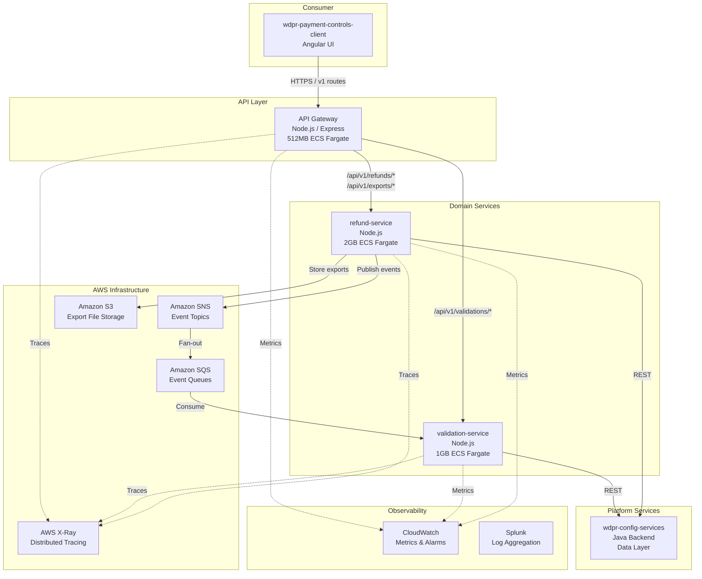
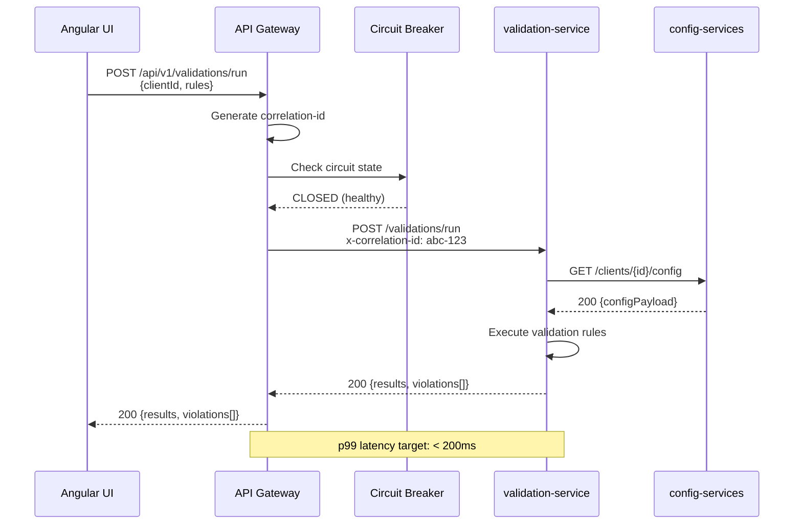
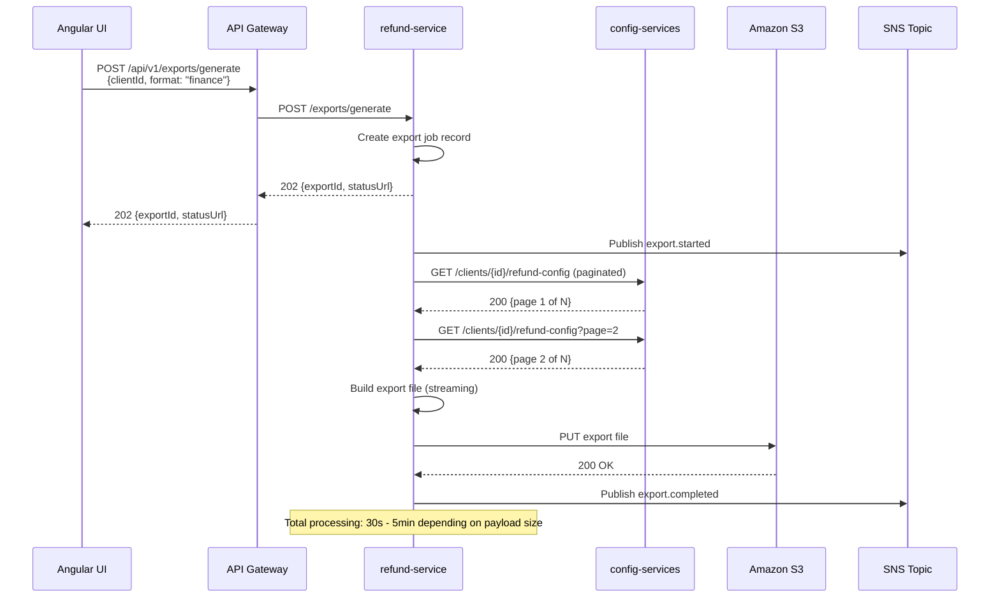
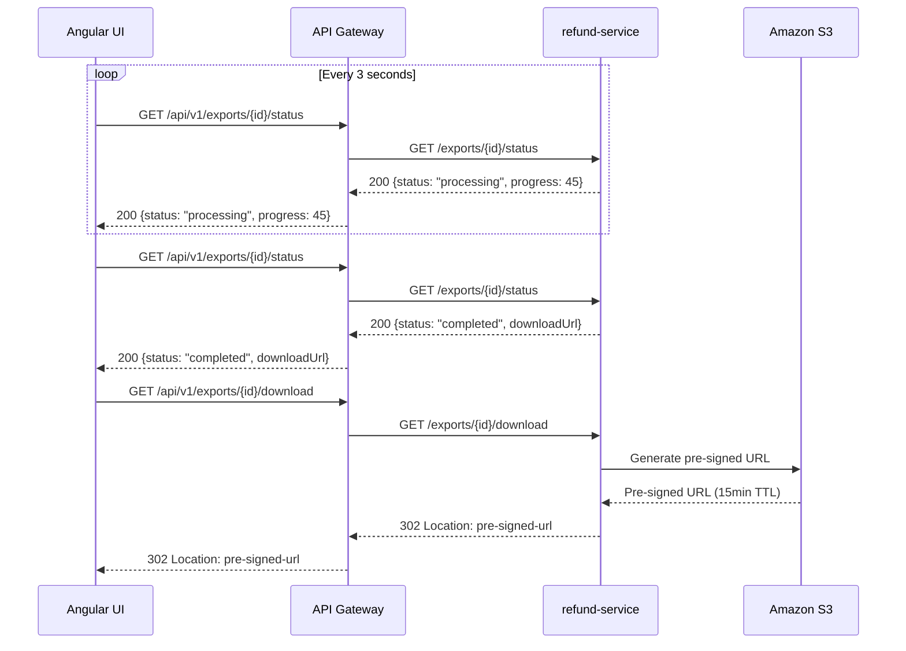

# Architecture Specification: Payment Controls API Decomposition

**Document Status:** DRAFT for Stakeholder Review  
**Date:** 2026-06-20  
**Author:** Architecture Team  
**Version:** 1.0  

---

## 1. Executive Summary

### Problem Statement

The `wdpr-payment-controls-api` monolith suffers recurring **Out-of-Memory (OOM) failures** in production. Root cause: memory-intensive refund export operations (generating large CSV/Excel payloads) share a single Node.js process with high-frequency, low-latency validation endpoints. When export operations spike memory usage, validation requests — critical to Config Studio's core workflow — experience degraded response times or outright failures.

### Target State

Decompose the monolith into **three independently deployable services** using the strangler fig pattern:

| Service | Purpose | Memory | Scaling Strategy |
|---------|---------|--------|-----------------|
| **API Gateway** | Route delegation, backward compat, circuit breaking | 512MB | 2-6 tasks / request count |
| **validation-service** | Low-latency config validation & comparison | 1GB | 3-12 tasks / request count |
| **refund-service** | Memory-heavy export report generation | 2GB | 2-8 tasks / memory utilization |

### Key Benefits

- **Fault isolation** — OOM in refund exports cannot crash validation endpoints
- **Independent scaling** — each service scales on its own dimension (requests vs. memory)
- **Zero UI changes** — Angular client continues hitting existing DNS/routes unchanged
- **Reduced blast radius** — deploy refund fixes without risking validation uptime
- **Cost optimization** — right-sized memory per workload instead of over-provisioning the monolith

---

## 2. Component Diagram



---

## 3. Service Boundaries

### 3.1 API Gateway

**Responsibility:** Thin routing layer maintaining backward compatibility with the Angular UI.

| Concern | Detail |
|---------|--------|
| Routes owned | All `/api/v1/*` — delegates downstream |
| Auth | JWT validation, session pass-through |
| Circuit breaking | Opossum per downstream service |
| Rate limiting | Per-client throttling |
| Correlation ID | Generates `x-correlation-id` if absent |
| Health | `/health`, `/ready` |

**Does NOT own:** Business logic, data transformation, direct config-services calls.

### 3.2 validation-service

**Responsibility:** Low-latency configuration validation, comparison, and search.

| Concern | Detail |
|---------|--------|
| Routes (internal) | `POST /validations/run` |
| | `GET /validations/clients` |
| | `GET /validations/clients/:id/config` |
| | `POST /validations/compare` |
| | `POST /validations/promote` |
| | `GET /validations/search` |
| Data flow | Reads from wdpr-config-services |
| Events consumed | `export.completed` (cache invalidation) |
| SLA | p99 < 200ms |

### 3.3 refund-service

**Responsibility:** Long-running export report generation, refund configuration management.

| Concern | Detail |
|---------|--------|
| Routes (internal) | `POST /exports/generate` |
| | `GET /exports/:id/status` |
| | `GET /exports/:id/download` |
| | `GET /refunds/clients/:id` |
| | `PUT /refunds/clients/:id` |
| Data flow | Reads from wdpr-config-services, writes to S3 |
| Events published | `export.started`, `export.completed`, `export.failed` |
| SLA | Export initiation < 500ms, completion < 5min |

---

## 4. Integration Patterns

### 4.1 Synchronous (HTTP)

All inter-service HTTP communication follows these conventions:

```
Headers:
  x-correlation-id: <uuid>        # Propagated from gateway
  x-request-source: <service>     # Originating service
  x-amzn-trace-id: <xray-id>     # X-Ray trace propagation
  Authorization: Bearer <token>    # Pass-through JWT
```

**Gateway → Domain Services:**
- Protocol: HTTP/1.1 (internal ALB)
- Timeout: 30s (validation), 120s (exports)
- Retry: 1 retry on 5xx with exponential backoff (validation only)

**Domain Services → config-services:**
- Protocol: HTTP/1.1
- Timeout: 10s
- Retry: 2 retries on 5xx with jitter

### 4.2 Asynchronous (SNS/SQS)

**Topic Structure:**

| Topic ARN | Publisher | Subscribers |
|-----------|-----------|-------------|
| `payment-controls-export-events-{env}` | refund-service | validation-service, gateway |
| `payment-controls-config-events-{env}` | validation-service | refund-service |

**Event Schema (CloudEvents v1.0 envelope):**

```json
{
  "specversion": "1.0",
  "id": "uuid-v4",
  "source": "refund-service",
  "type": "export.completed",
  "time": "2026-06-20T18:00:00Z",
  "datacontenttype": "application/json",
  "correlationid": "uuid-from-request",
  "data": {
    "exportId": "exp-12345",
    "clientId": "client-abc",
    "format": "finance",
    "s3Key": "exports/2026/06/exp-12345.xlsx",
    "rowCount": 15420
  }
}
```

**Event Catalog:**

| Event Type | Trigger | Data Payload |
|------------|---------|--------------|
| `export.started` | Export job begins | `{ exportId, clientId, format, requestedBy }` |
| `export.completed` | Export file ready | `{ exportId, clientId, format, s3Key, rowCount }` |
| `export.failed` | Export job errors | `{ exportId, clientId, error, retryable }` |
| `config.promoted` | Config promoted to env | `{ clientId, sourceEnv, targetEnv, promotedBy }` |

### 4.3 Export Progress Pattern (Polling)

The gateway exposes a polling endpoint for long-running exports:

```
POST /api/v1/exports/generate  → 202 Accepted { exportId, statusUrl }
GET  /api/v1/exports/:id/status → 200 { status: "processing"|"completed"|"failed", progress: 0-100 }
GET  /api/v1/exports/:id/download → 302 redirect to S3 pre-signed URL
```

---

## 5. Deployment Topology

```mermaid
graph TB
    subgraph "Route 53 DNS"
        DNS1[payment-controls-api-{env}.wdprapps.disney.com]
        DNS2[validation-service-{env}.wdprapps.disney.com]
        DNS3[refund-service-{env}.wdprapps.disney.com]
    end

    subgraph "Application Load Balancers"
        ALB_PUB[Public ALB<br/>External-facing]
        ALB_INT[Internal ALB<br/>Service-to-service]
    end

    subgraph "ECS Cluster: payment-controls-{env}"
        subgraph "Gateway Service"
            GW1[Task 1<br/>512MB / 0.25 vCPU]
            GW2[Task 2<br/>512MB / 0.25 vCPU]
        end

        subgraph "Validation Service"
            VS1[Task 1<br/>1GB / 0.5 vCPU]
            VS2[Task 2<br/>1GB / 0.5 vCPU]
            VS3[Task 3<br/>1GB / 0.5 vCPU]
            VSN[... up to 12]
        end

        subgraph "Refund Service"
            RS1[Task 1<br/>2GB / 1 vCPU]
            RS2[Task 2<br/>2GB / 1 vCPU]
            RSN[... up to 8]
        end
    end

    DNS1 --> ALB_PUB
    DNS2 --> ALB_INT
    DNS3 --> ALB_INT

    ALB_PUB -->|/*| GW1
    ALB_PUB -->|/*| GW2
    ALB_INT -->|/validations/*| VS1
    ALB_INT -->|/validations/*| VS2
    ALB_INT -->|/validations/*| VS3
    ALB_INT -->|/exports/* /refunds/*| RS1
    ALB_INT -->|/exports/* /refunds/*| RS2
```

### Environment Matrix

| Environment | Gateway Tasks | Validation Tasks | Refund Tasks |
|-------------|---------------|-----------------|--------------|
| dev | 1 | 1 | 1 |
| stage | 2 | 2 | 2 |
| load | 2 | 6 | 4 |
| prod | 2-6 | 3-12 | 2-8 |

### Auto-Scaling Policies

| Service | Metric | Target | Scale-in Cooldown | Scale-out Cooldown |
|---------|--------|--------|-------------------|--------------------|
| Gateway | RequestCountPerTarget | 1000 req/min | 300s | 60s |
| Validation | RequestCountPerTarget | 500 req/min | 300s | 60s |
| Refund | MemoryUtilization | 70% | 300s | 120s |

---

## 6. Data Flow Diagrams

### 6.1 Validation Request Flow



### 6.2 Refund Export Flow



### 6.3 Export Progress Polling Flow



---

## 7. Resilience Patterns

### 7.1 Circuit Breakers (Opossum)

Implemented at the **API Gateway** for each downstream service:

| Parameter | validation-service | refund-service |
|-----------|--------------------|----------------|
| Timeout | 5,000ms | 30,000ms |
| Error threshold | 50% | 50% |
| Volume threshold | 10 requests | 5 requests |
| Reset timeout | 30,000ms | 60,000ms |
| Rolling window | 10,000ms | 30,000ms |

**Fallback behaviors:**
- validation-service OPEN → return `503 Service Unavailable` with `Retry-After` header
- refund-service OPEN → return `503` for new exports; polling/download continue from cache

### 7.2 Retry Strategy

| Caller → Target | Max Retries | Backoff | Jitter | Retryable Codes |
|-----------------|-------------|---------|--------|-----------------|
| Gateway → validation | 1 | 100ms | ±50ms | 502, 503, 504 |
| Gateway → refund | 0 (async) | N/A | N/A | N/A |
| validation → config-services | 2 | 200ms exponential | ±100ms | 502, 503, 504, ECONNRESET |
| refund → config-services | 3 | 500ms exponential | ±200ms | 502, 503, 504, ECONNRESET |

### 7.3 Timeouts

| Boundary | Timeout | Rationale |
|----------|---------|-----------|
| ALB → Gateway | 60s | Covers longest sync path |
| Gateway → validation | 5s | Validation must be fast |
| Gateway → refund (initiate) | 10s | Only job creation, not processing |
| Gateway → refund (poll) | 5s | Simple status lookup |
| Refund → config-services | 30s | Large paginated fetches |

### 7.4 Bulkhead Isolation

- **Process isolation** — each service runs in its own ECS task (primary bulkhead)
- **Connection pools** — each service maintains independent HTTP agent pools to config-services (max 50 sockets per service)
- **Queue isolation** — dedicated SQS queues per consumer prevent noisy-neighbor message processing

### 7.5 Graceful Degradation

| Failure | Degraded Behavior |
|---------|-------------------|
| config-services down | Gateway returns 503; cached validation results (5min TTL) served if available |
| refund-service down | Export buttons disabled via feature flag; validation unaffected |
| S3 unavailable | Exports fail gracefully; already-generated pre-signed URLs remain valid until TTL |
| SNS/SQS failure | Events queued client-side with DLQ; no user-facing impact |

---

## 8. Migration Strategy (Strangler Fig)

### Phase 1: Foundation (Sprints 1-2, Weeks 1-6)

**Objective:** Deploy Gateway as a pass-through proxy; no traffic split yet.

| Task | Details |
|------|---------|
| Scaffold gateway service | Express app, Opossum, correlation-id middleware |
| Scaffold validation-service | Repo, Dockerfile, Harness pipeline |
| Scaffold refund-service | Repo, Dockerfile, Harness pipeline |
| Deploy to dev | All 3 services running, gateway proxies 100% to monolith |
| Observability setup | X-Ray, CloudWatch dashboards, Splunk log forwarding |

**Acceptance Criteria:**
- [ ] Gateway deployed, receives traffic, proxies to monolith with zero errors
- [ ] Correlation IDs appear in all service logs
- [ ] X-Ray traces span gateway → monolith
- [ ] Harness pipelines green for all 3 services in dev
- [ ] No change to Angular UI behavior

### Phase 2: Validation Extraction (Sprints 3-4, Weeks 7-12)

**Objective:** Migrate validation endpoints to validation-service; gateway routes validation traffic to new service.

| Task | Details |
|------|---------|
| Port validation logic | Move validation handlers from monolith to validation-service |
| Integration tests | Contract tests against config-services |
| Traffic split (canary) | 10% → 50% → 100% over 1 week in stage |
| Production cutover | Gateway routes `/validations/*` to validation-service |
| Remove dead code | Strip validation logic from monolith |

**Acceptance Criteria:**
- [ ] validation-service handles 100% of validation traffic in prod
- [ ] p99 latency ≤ 200ms (same or better than monolith)
- [ ] Zero UI-visible errors during cutover
- [ ] Monolith memory usage decreases measurably
- [ ] Circuit breaker trips correctly under simulated failure

### Phase 3: Refund Extraction (Sprints 5-6, Weeks 13-18)

**Objective:** Migrate export/refund endpoints to refund-service with async pattern.

| Task | Details |
|------|---------|
| Port export logic | Move to refund-service with streaming/S3 pattern |
| Implement async polling | 202 → status → download flow |
| SNS/SQS setup | Event topics and dead-letter queues |
| Traffic split (canary) | 10% → 50% → 100% over 1 week in stage |
| Production cutover | Gateway routes `/exports/*`, `/refunds/*` to refund-service |

**Acceptance Criteria:**
- [ ] refund-service handles 100% of export traffic in prod
- [ ] No OOM events in any service
- [ ] Exports complete within 5-minute SLA
- [ ] SNS events flowing correctly between services
- [ ] DLQ alarms configured and tested

### Phase 4: Monolith Decommission (Sprint 7+, Weeks 19-22)

**Objective:** Remove monolith; gateway becomes the sole entry point.

| Task | Details |
|------|---------|
| Remove monolith routes | Gateway no longer proxies to old service |
| Decommission monolith ECS service | Scale to 0, then delete |
| Update DNS | Ensure clean cutover, no stale records |
| Documentation | Update runbooks, architecture diagrams, on-call guides |
| Cost analysis | Validate projected savings |

**Acceptance Criteria:**
- [ ] Monolith fully decommissioned (zero running tasks)
- [ ] All traffic served by new architecture for 2+ weeks with no incidents
- [ ] Cost savings documented (target: 20% reduction in compute spend)
- [ ] Runbooks updated for new architecture
- [ ] Team trained on new deployment topology

---

## 9. Risks and Mitigations

| # | Risk | Likelihood | Impact | Mitigation |
|---|------|-----------|--------|------------|
| R1 | Network latency increase from additional hop (gateway → service) | Medium | Low | Internal ALB in same VPC/AZ; budget 2-5ms per hop; load test to validate |
| R2 | Config-services becomes single point of failure for both new services | High | High | Circuit breakers, short-TTL caching (5min), health checks; engage config-services team for SLA |
| R3 | Data consistency during partial migration (some requests hit monolith, some hit new services) | Medium | Medium | Stateless services reading from same config-services; no split-brain possible |
| R4 | Angular UI behavior change if response shapes differ | Low | High | Contract tests with JSON schema validation; shadow traffic comparison in stage |
| R5 | Export memory pressure shifts to S3 costs | Low | Low | S3 lifecycle policy (7-day expiry); cost monitoring alarm at $100/month |
| R6 | SNS/SQS message loss causing stale UI state | Low | Medium | DLQ with CloudWatch alarms; idempotent consumers; polling as source of truth |
| R7 | Team cognitive load managing 3 repos + pipelines | Medium | Medium | Shared npm packages for common middleware; unified Harness template; monorepo option if needed |
| R8 | Strangler fig incomplete — monolith lingers indefinitely | Medium | Medium | Phase 4 has hard deadline; track with OKR; alert if monolith receives traffic post-cutover |
| R9 | Circuit breaker misconfiguration causes cascading failures | Low | High | Load test circuit breaker thresholds in stage; gradual tuning; runbook for manual override |
| R10 | Harness pipeline differences across services cause deployment drift | Low | Medium | Shared pipeline template; infrastructure-as-code for ECS task definitions |

---

## 10. Decision Log (ADRs)

| ADR | Decision | Status | Rationale |
|-----|----------|--------|-----------|
| ADR-001 | Decompose into 3 services (gateway + 2 domain) | **Accepted** | OOM isolation requires process-level separation; 2 domain services map to distinct scaling dimensions |
| ADR-002 | Use strangler fig over big-bang rewrite | **Accepted** | Zero UI changes required; incremental risk reduction; rollback capability at each phase |
| ADR-003 | Gateway retains existing DNS and v1 routes | **Accepted** | Angular UI must not change; DNS continuity eliminates client-side migration |
| ADR-004 | Async export pattern (202 + polling) | **Accepted** | Prevents long-held HTTP connections; enables progress visibility; decouples export duration from gateway timeout |
| ADR-005 | S3 for export file storage | **Accepted** | Removes export payload from Node.js memory after generation; pre-signed URLs avoid gateway proxying large files |
| ADR-006 | Opossum for circuit breaking | **Accepted** | Already used in existing codebase; Node.js native; well-maintained; team familiarity |
| ADR-007 | SNS/SQS over direct HTTP callbacks | **Accepted** | Decouples services temporally; DLQ provides durability; fan-out capability for future subscribers |
| ADR-008 | ECS Fargate over EKS | **Accepted** | Team expertise in ECS; lower operational overhead; no container orchestration complexity needed for 3 services |
| ADR-009 | No shared database — config-services is the data layer | **Accepted** | Avoids distributed data ownership; single source of truth; services remain stateless |
| ADR-010 | CloudEvents schema for async messages | **Accepted** | Industry standard envelope; enables future event mesh integration; self-describing messages |

---

## Appendix A: Route Mapping

| Angular UI Route | Gateway Route | Target Service | Method |
|-----------------|---------------|----------------|--------|
| Search clients | `/api/v1/validations/clients` | validation-service | GET |
| Get client config | `/api/v1/validations/clients/:id/config` | validation-service | GET |
| Run validation | `/api/v1/validations/run` | validation-service | POST |
| Compare clients | `/api/v1/validations/compare` | validation-service | POST |
| Promote config | `/api/v1/validations/promote` | validation-service | POST |
| Search configs | `/api/v1/validations/search` | validation-service | GET |
| Start export | `/api/v1/exports/generate` | refund-service | POST |
| Export status | `/api/v1/exports/:id/status` | refund-service | GET |
| Download export | `/api/v1/exports/:id/download` | refund-service | GET |
| Get refund config | `/api/v1/refunds/clients/:id` | refund-service | GET |
| Update refund config | `/api/v1/refunds/clients/:id` | refund-service | PUT |

## Appendix B: Shared NPM Packages

| Package | Purpose | Used By |
|---------|---------|---------|
| `@wdpr/controls-common` | Correlation ID middleware, logging, error types | All 3 services |
| `@wdpr/controls-auth` | JWT validation, token refresh | All 3 services |
| `@wdpr/controls-tracing` | X-Ray SDK wrapper, segment propagation | All 3 services |
| `@wdpr/controls-health` | Health check endpoint, readiness probes | All 3 services |

---

*End of Architecture Specification*
