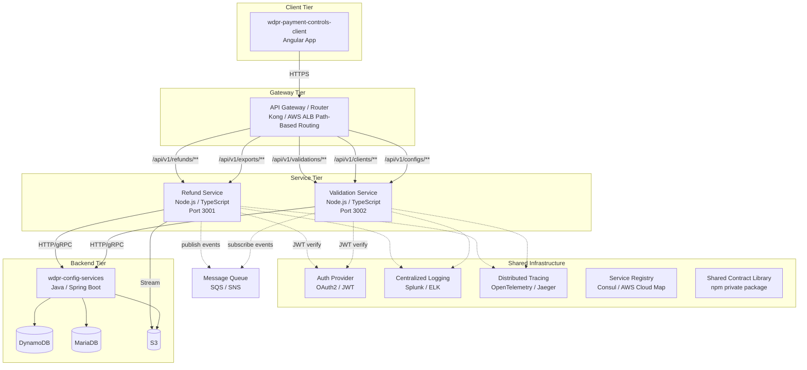
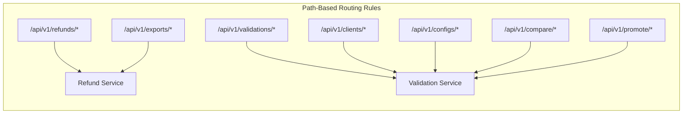
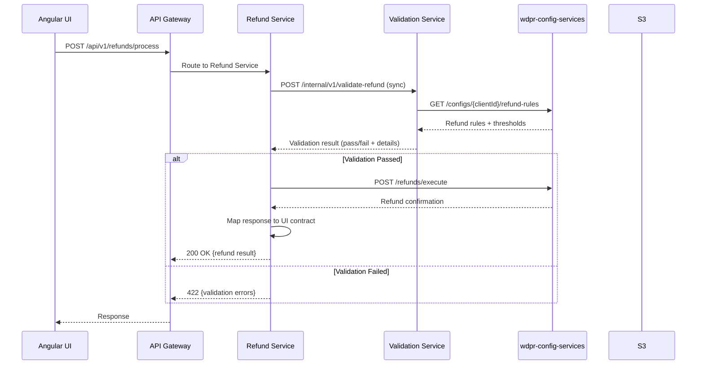
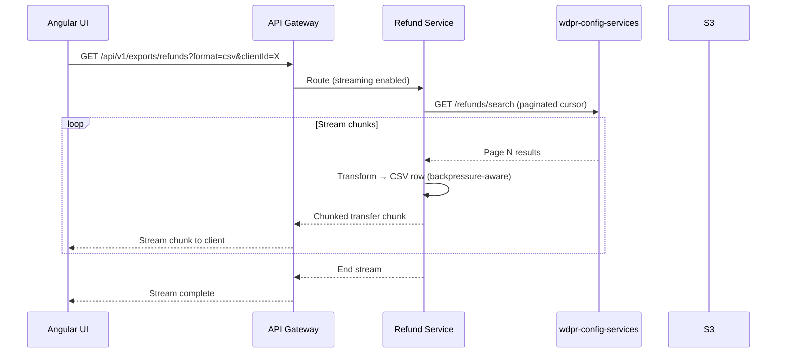
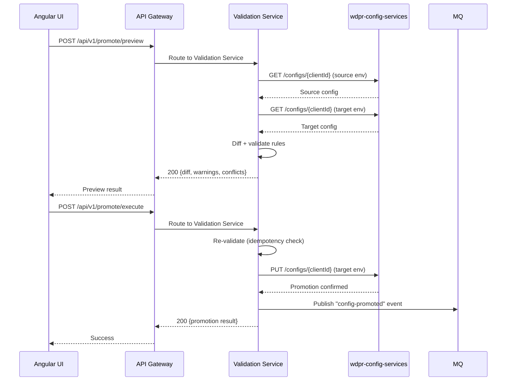
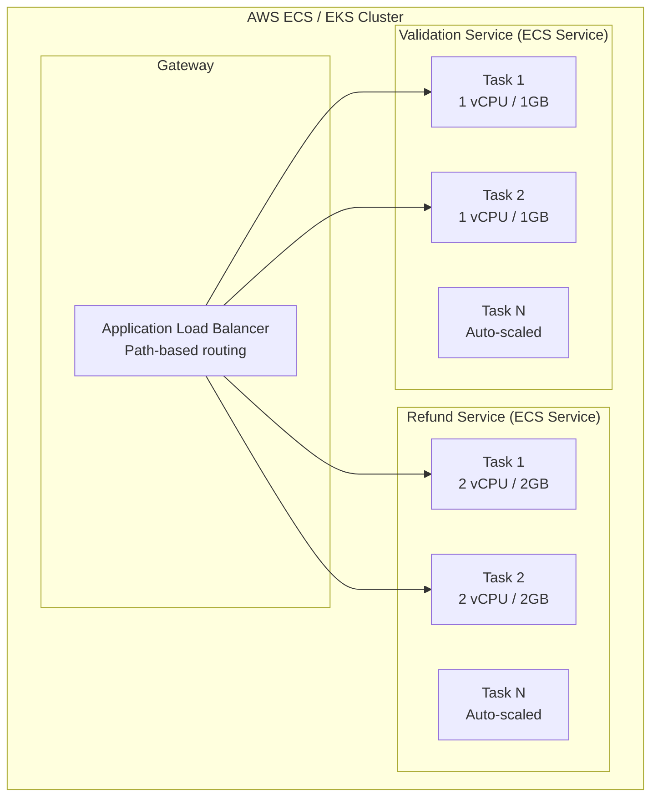
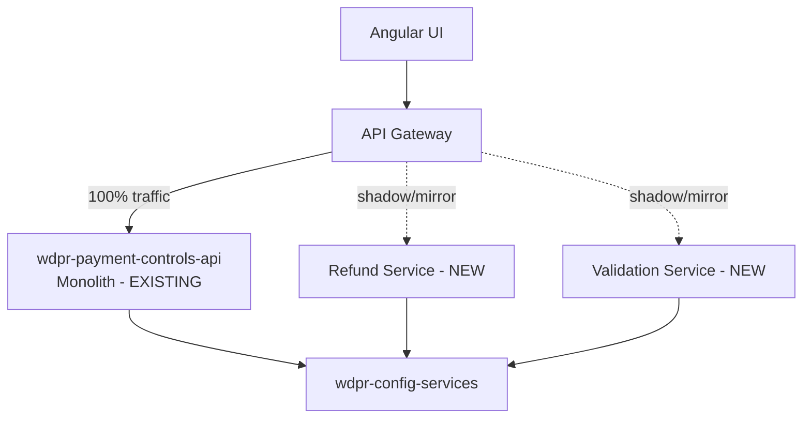
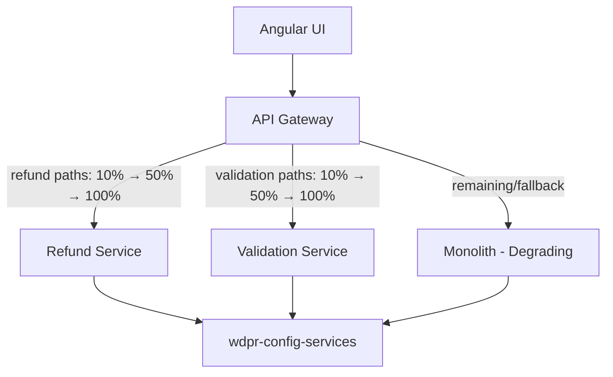
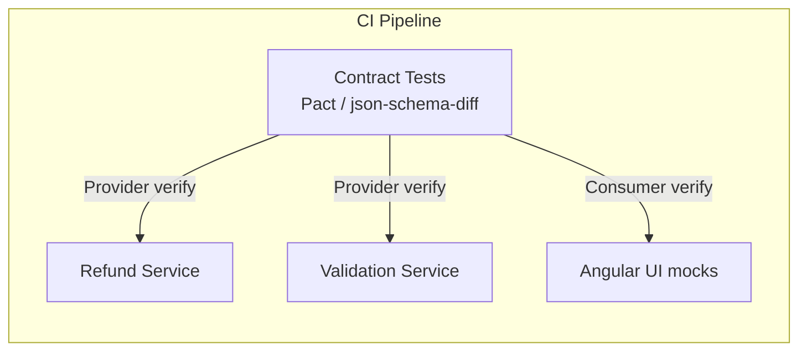

# Architecture Design: Splitting wdpr-payment-controls-api

## Executive Summary

Split the monolithic `wdpr-payment-controls-api` Node.js BFF into two independently deployable microservices:

- **Refund Service** — Owns refund processing, orchestration, streaming exports, and response mapping for refund-related operations
- **Validation Service** — Owns configuration validation, promotion previews, client comparison logic, and rule evaluation

An **API Gateway / Router** layer sits in front to preserve existing URL contracts for the Angular UI.

---

## 1. Component Diagram



---

## 2. Integration Patterns

### 2.1 Synchronous Communication (Primary)

| Pattern | Usage | Technology |
|---------|-------|------------|
| REST/JSON over HTTPS | UI → Gateway → Service | Express.js with OpenAPI 3.x contracts |
| Streaming HTTP (NDJSON/chunked) | Large exports (refund reports) | Node.js `pipeline()` + `Transform` streams |
| Internal service-to-service | Validation Service called by Refund Service pre-processing | HTTP with circuit breaker (opossum) |

### 2.2 Asynchronous Communication (Secondary)

| Pattern | Usage | Technology |
|---------|-------|------------|
| Event-driven | Refund completed → notify Validation cache invalidation | AWS SNS/SQS |
| Config promotion events | Validation publishes "config promoted" → Refund reloads rules | AWS SNS fanout |

### 2.3 API Gateway Routing



### 2.4 Shared Contracts

```
@wdpr/payment-controls-contracts (private npm package)
├── src/
│   ├── schemas/          # JSON Schema / Zod definitions
│   │   ├── refund.ts
│   │   ├── validation.ts
│   │   └── client-config.ts
│   ├── types/            # TypeScript interfaces
│   │   ├── api-responses.ts
│   │   └── api-requests.ts
│   └── errors/           # Shared error codes & formats
│       └── error-codes.ts
```

---

## 3. Data Flow Diagrams

### 3.1 Refund Processing Flow



### 3.2 Streaming Export Flow



### 3.3 Validation / Config Promotion Flow



---

## 4. Deployment Topology



### Scaling Strategy

| Service | Scaling Metric | Min | Max | Notes |
|---------|---------------|-----|-----|-------|
| Refund Service | CPU > 60%, Request count | 2 | 10 | Higher memory for streaming |
| Validation Service | CPU > 70%, Request latency p95 | 2 | 8 | Stateless, fast scale |

### Deployment Specifications

| Concern | Refund Service | Validation Service |
|---------|---------------|-------------------|
| Container | Node.js 20 Alpine | Node.js 20 Alpine |
| Memory | 2 GB (streaming buffers) | 1 GB |
| CPU | 2 vCPU | 1 vCPU |
| Health check | GET /health | GET /health |
| Readiness | GET /ready (checks CS connectivity) | GET /ready |
| Deploy strategy | Rolling update (25% at a time) | Rolling update |
| Circuit breaker | On CS calls, on VS calls | On CS calls |

---

## 5. Migration Strategy (Strangler Fig Pattern)

### Phase 1: Parallel Deploy (Weeks 1–3)



- Deploy new services alongside monolith
- Shadow traffic to new services (read-only comparison)
- Log response diffs for verification
- No UI changes

### Phase 2: Canary Routing (Weeks 4–6)



- Route by path prefix, incrementally shift traffic
- Feature flags control which service handles each route
- Automated rollback on error rate spike (>1% 5xx)
- UI remains unchanged — same API contract

### Phase 3: Monolith Decommission (Weeks 7–8)

- 100% traffic to new services
- Monolith kept on standby (zero-traffic, not terminated)
- After 2 weeks of stable operation → decommission monolith
- Remove gateway fallback rules

### Migration Rules

1. **No breaking changes** — Response shapes are identical
2. **Additive only** — New fields can be added, never removed
3. **Feature flags** — `X-Service-Version` header for A/B testing
4. **Dual-write validation** — Both monolith and new service process, compare results in shadow mode

---

## 6. Shared Concerns

### 6.1 Authentication & Authorization

```typescript
// Shared middleware from @wdpr/payment-controls-contracts
export const authMiddleware = (requiredScopes: string[]) => {
  return async (req: Request, res: Response, next: NextFunction) => {
    const token = req.headers.authorization?.replace('Bearer ', '');
    const decoded = await verifyJWT(token, { issuer: AUTH_ISSUER });
    req.user = decoded;
    if (!hasScopes(decoded, requiredScopes)) {
      return res.status(403).json({ error: 'INSUFFICIENT_SCOPE' });
    }
    next();
  };
};
```

- JWT validation at each service (no shared session)
- Scopes: `refund:read`, `refund:write`, `config:read`, `config:write`, `export:read`
- Internal service-to-service: mTLS + service account tokens

### 6.2 Logging

- Structured JSON logs (pino)
- Correlation ID propagated via `X-Correlation-Id` header
- Log levels: `info` for requests, `warn` for retries, `error` for failures
- Ship to Splunk/ELK via Fluentd sidecar

### 6.3 Distributed Tracing

- OpenTelemetry SDK (Node.js auto-instrumentation)
- W3C Trace Context headers (`traceparent`, `tracestate`)
- Spans: HTTP in/out, DB calls, stream lifecycle
- Export to Jaeger/X-Ray

### 6.4 Error Handling

```typescript
// Shared error format from contracts package
interface ApiError {
  code: string;          // e.g. "REFUND_LIMIT_EXCEEDED"
  message: string;       // Human-readable
  details?: unknown[];   // Validation errors array
  traceId: string;       // For support correlation
  timestamp: string;     // ISO 8601
}
```

- Consistent error shape across both services
- Circuit breaker (opossum) on downstream calls — open after 5 failures in 30s
- Retry with exponential backoff for transient failures (503, ECONNRESET)
- Graceful degradation: if Validation Service is down, Refund Service returns 503 (not silent failure)

### 6.5 Shared Middleware Stack

```
@wdpr/payment-controls-contracts
├── middleware/
│   ├── auth.ts              # JWT verification
│   ├── correlation-id.ts    # Propagate/generate correlation ID
│   ├── request-logger.ts    # Structured request/response logging
│   ├── error-handler.ts     # Global error → ApiError mapping
│   ├── rate-limiter.ts      # Per-client rate limiting
│   └── stream-helpers.ts    # Backpressure-aware streaming utilities
```

---

## 7. API Contract Strategy

### 7.1 Versioning Scheme

- **URL-based major versions**: `/api/v1/`, `/api/v2/`
- **Header-based minor negotiation**: `Accept-Version: 1.2`
- **Default behavior**: Latest minor within the major version

### 7.2 Backward Compatibility Rules

| Rule | Example |
|------|---------|
| Never remove fields | `clientName` stays even if `clientDisplayName` is added |
| Never change field types | `amount: number` cannot become `amount: string` |
| New fields are optional | Consumers ignore unknown fields |
| Deprecate before removal | `X-Deprecated-Fields: oldField` header for 2 releases |
| Enum values only grow | New status values are additive |

### 7.3 Contract Testing



- **Pact** consumer-driven contract tests
- UI publishes expected request/response shapes
- Services verify they satisfy the contract in CI
- Breaking change detection blocks merge

### 7.4 OpenAPI Specification

Each service publishes its OpenAPI 3.1 spec:

- `GET /api/v1/openapi.json` — machine-readable
- Schemas shared via `$ref` to contracts package
- Automated SDK generation for UI client (openapi-typescript)

### 7.5 Endpoint Mapping (Monolith → Split)

| Current Monolith Route | New Owner | New Route |
|------------------------|-----------|-----------|
| `POST /api/v1/refunds` | Refund Service | `POST /api/v1/refunds` (unchanged) |
| `GET /api/v1/refunds/search` | Refund Service | `GET /api/v1/refunds/search` |
| `GET /api/v1/exports/refunds` | Refund Service | `GET /api/v1/exports/refunds` |
| `POST /api/v1/validate` | Validation Service | `POST /api/v1/validations/evaluate` |
| `GET /api/v1/clients` | Validation Service | `GET /api/v1/clients` |
| `GET /api/v1/configs/:id` | Validation Service | `GET /api/v1/configs/:id` |
| `POST /api/v1/compare` | Validation Service | `POST /api/v1/compare` |
| `POST /api/v1/promote` | Validation Service | `POST /api/v1/promote` |

The gateway maps old paths 1:1 — **UI sees no change**.

---

## Technology Summary

| Concern | Choice | Rationale |
|---------|--------|-----------|
| Runtime | Node.js 20 LTS | Matches existing stack |
| Language | TypeScript 5.x (strict) | Type safety, shared contracts |
| Framework | Express.js + express-openapi-validator | Lightweight, proven |
| Streaming | Node.js `stream.pipeline()` + Transform | Backpressure, memory-safe |
| Validation | Zod (runtime) + TypeScript (compile) | Schema-first, composable |
| HTTP Client | undici (Node built-in) | Fast, streaming-friendly |
| Circuit Breaker | opossum | Battle-tested Node.js library |
| Logging | pino | Fast structured JSON logging |
| Tracing | @opentelemetry/sdk-node | Vendor-neutral, W3C standard |
| Testing | Vitest + Pact + Supertest | Fast unit + contract + integration |
| Container | Docker (node:20-alpine) | Small image, fast deploy |
| Orchestration | AWS ECS Fargate / EKS | Serverless containers, auto-scale |
| Gateway | AWS ALB + path rules | No additional infra, native integration |
| IaC | Terraform / CDK | Matches enterprise patterns |
