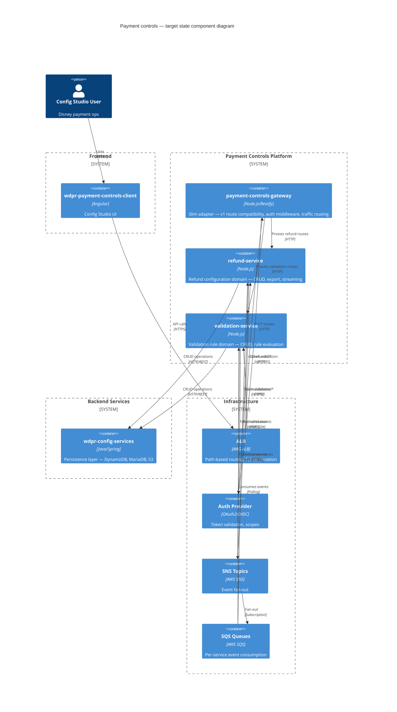
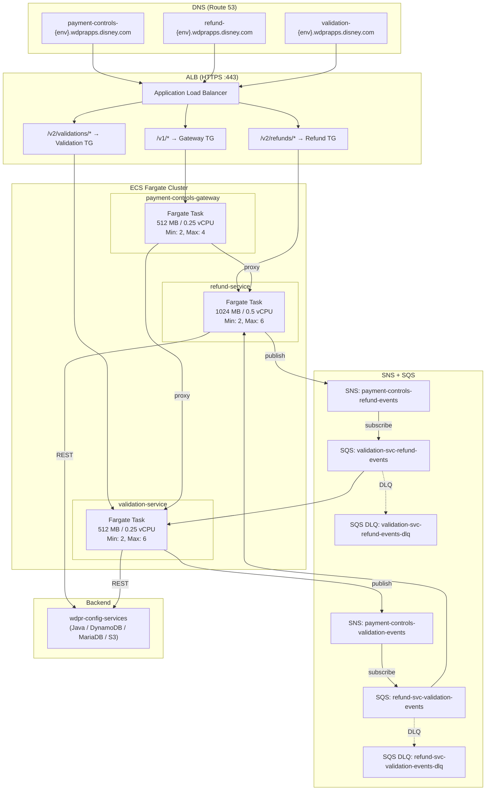

# Target architecture: payment controls service decomposition

## Executive summary

This document defines the target architecture for splitting `wdpr-payment-controls-api` into three independent services: a slim backward-compatibility gateway, a refund configuration service, and a validation rule service. The migration follows a strangler fig pattern over ~22 weeks, using SNS+SQS for async coordination and path-based ALB routing to shift traffic incrementally.

---

## 1. Component diagram



---

## 2. Integration patterns

### 2.1 Synchronous patterns

#### HTTP routing strategy

| Layer   | Mechanism              | Behavior                                                                 |
|---------|------------------------|--------------------------------------------------------------------------|
| ALB     | Path-based rules       | Routes `/v2/refunds/*` → refund TG, `/v2/validations/*` → validation TG |
| ALB     | Default rule           | Routes `/v1/*` and unmatched → gateway TG                               |
| Gateway | Internal reverse proxy | Forwards to downstream services by path prefix                          |

#### API gateway behavior (slim gateway)

The gateway acts as a thin adapter during migration:

1. Accepts legacy `/v1` requests from the Angular client
2. Validates auth token (JWT verification, scope check)
3. Maps `/v1` request shape to the appropriate downstream `/v2` endpoint
4. Forwards request with original auth token in `Authorization` header
5. Maps `/v2` response back to `/v1` response shape if needed
6. Returns to client — no business logic

#### Request flow (during migration)

```
Angular → ALB → Gateway (/v1/refunds/config) → Refund Service (/v2/refunds/config) → config-services
```

#### Request flow (post-migration)

```
Angular → ALB → Refund Service (/v2/refunds/config) → config-services
```

### 2.2 Asynchronous patterns (SNS+SQS event topology)

#### Topics

| SNS Topic                               | Publisher          | Purpose                                        |
|-----------------------------------------|--------------------|------------------------------------------------|
| `payment-controls-refund-events`        | Refund service     | Refund config created/updated/deleted          |
| `payment-controls-validation-events`    | Validation service | Validation rule created/updated/activated      |

#### Queues

| SQS Queue                                        | Subscriber         | Subscribed Topic                            |
|--------------------------------------------------|--------------------|--------------------------------------------|
| `validation-svc-refund-events`                   | Validation service | `payment-controls-refund-events`           |
| `refund-svc-validation-events`                   | Refund service     | `payment-controls-validation-events`       |

#### Event schema

```json
{
  "eventId": "uuid",
  "eventType": "refund.config.updated",
  "version": "1.0",
  "timestamp": "ISO-8601",
  "source": "refund-service",
  "payload": { "configId": "...", "delta": {} },
  "correlationId": "uuid"
}
```

#### Guarantees

- At-least-once delivery (SQS standard queues)
- Idempotent consumers (dedup on `eventId`)
- DLQ after 3 failed processing attempts
- Message retention: 14 days on DLQ

### 2.3 Strangler fig routing strategy

Traffic shifts are controlled at the ALB rule level using weighted target groups and path-based rules:

| Phase | `/v1/validations/*`         | `/v1/refunds/*`            | `/v2/validations/*`   | `/v2/refunds/*`       |
|-------|-----------------------------|-----------------------------|------------------------|-----------------------|
| 0     | Gateway (100%)              | Gateway (100%)              | —                      | —                     |
| 1     | Gateway → Validation (proxy)| Gateway (100%)              | Validation svc (100%) | —                     |
| 2     | Gateway → Refund (proxy)    | Gateway → Refund (proxy)    | Validation svc (100%) | Refund svc (100%)     |
| 3     | ALB → Validation svc direct | ALB → Refund svc direct     | Validation svc (100%) | Refund svc (100%)     |
| 4     | Deprecated (410 Gone)       | Deprecated (410 Gone)       | Validation svc (100%) | Refund svc (100%)     |

Canary rollout per route group: 10% → 50% → 100% with automated rollback on 5xx spike.

### 2.4 Auth propagation pattern

```
┌─────────┐     ┌─────┐     ┌─────────┐     ┌─────────────┐
│  Client  │────▶│ ALB │────▶│ Gateway │────▶│ Domain Svc  │
└─────────┘     └─────┘     └─────────┘     └─────────────┘
     │                            │                  │
     │  Authorization: Bearer T   │  Authorization:  │  Authorization:
     │                            │  Bearer T        │  Bearer T
     │                            │  X-Request-Id: R │  X-Request-Id: R
     │                            │                  │  X-Forwarded-For
```

- Token passthrough: Original JWT forwarded unchanged to downstream services
- Each service independently validates the token (shared JWKS endpoint)
- Gateway adds `X-Request-Id` for distributed tracing if absent
- Post-migration: ALB routes directly to domain services; each service validates its own token
- Scopes: `refund:read`, `refund:write`, `validation:read`, `validation:write`

### 2.5 Error handling and circuit breaker strategy

| Concern            | Pattern                     | Implementation                                    |
|--------------------|-----------------------------|---------------------------------------------------|
| Downstream failure | Circuit breaker             | `opossum` (Node.js) — 50% failure threshold, 30s reset |
| Timeout            | Aggressive timeouts         | 5s for API calls, 60s for streaming exports       |
| Retry              | Exponential backoff         | 3 retries, jitter, idempotent operations only     |
| Fallback           | Graceful degradation        | Cache last-known-good config for read paths       |
| Bulkhead           | Connection pool isolation   | Separate HTTP agents per downstream               |
| Observability      | Structured error responses  | RFC 7807 problem details, correlation IDs         |

Circuit breaker states propagated via health check endpoints (`/health/ready`) so ALB can shift traffic on degradation.

---

## 3. Deployment topology



### Resource allocation rationale

| Service              | Memory  | CPU      | Justification                                               |
|----------------------|---------|----------|-------------------------------------------------------------|
| Gateway              | 512 MB  | 0.25 vCPU | Thin proxy, no business logic, no streaming                |
| Refund service       | 1024 MB | 0.5 vCPU  | Streaming export paths require higher memory ceiling       |
| Validation service   | 512 MB  | 0.25 vCPU | Request/response only, no streaming                        |

---

## 4. Migration phases

### Phase 1: Extract and deploy validation service (weeks 1–8)

| Week  | Activity                                                         | Rollback mechanism              |
|-------|------------------------------------------------------------------|---------------------------------|
| 1–2   | Scaffold validation-service repo, CI/CD, infra-as-code          | N/A                             |
| 3–4   | Implement `/v2/validations/*` endpoints, unit + integration tests| N/A (not yet receiving traffic) |
| 5     | Deploy to staging; gateway proxies `/v1/validations/*` to it    | Revert gateway proxy config     |
| 6     | Canary in production: 10% of validation traffic via gateway     | Feature flag off → 0%          |
| 7     | Ramp to 100% through gateway proxy                              | Feature flag off → 0%          |
| 8     | ALB rule routes `/v2/validations/*` directly; UI migrates calls | Remove ALB rule → fall to gateway |

### Phase 2: Extract and deploy refund service (weeks 9–16)

| Week  | Activity                                                         | Rollback mechanism              |
|-------|------------------------------------------------------------------|---------------------------------|
| 9–10  | Scaffold refund-service repo, CI/CD, infra-as-code              | N/A                             |
| 11–12 | Implement `/v2/refunds/*` endpoints including streaming export  | N/A (not yet receiving traffic) |
| 13    | Deploy to staging; gateway proxies `/v1/refunds/*` to it        | Revert gateway proxy config     |
| 14    | Canary in production: 10% of refund traffic via gateway         | Feature flag off → 0%          |
| 15    | Ramp to 100% through gateway proxy                              | Feature flag off → 0%          |
| 16    | ALB rule routes `/v2/refunds/*` directly; UI migrates calls     | Remove ALB rule → fall to gateway |

### Phase 3: Direct routing and gateway decommission (weeks 17–22)

| Week  | Activity                                                         | Rollback mechanism              |
|-------|------------------------------------------------------------------|---------------------------------|
| 17–18 | Angular client updated to call `/v2` endpoints directly         | Feature flag toggles base URL   |
| 19    | Gateway `/v1` routes return deprecation headers                 | Remove headers                  |
| 20    | Monitor: confirm zero traffic on gateway for 7 days             | Extend monitoring window        |
| 21    | Gateway returns 410 Gone for all `/v1` routes                   | Redeploy with proxy logic       |
| 22    | Decommission gateway service, remove ALB default rule           | Redeploy from last-known image  |

---

## 5. Key constraints and risks

### Constraints

| #  | Constraint                                        | Impact                                                    |
|----|---------------------------------------------------|-----------------------------------------------------------|
| C1 | No direct DB ownership                            | Both services depend on config-services availability      |
| C2 | Angular client is the sole consumer               | v1 deprecation only requires one client migration         |
| C3 | Streaming exports must not OOM                    | Refund service needs 1024 MB minimum; backpressure required|
| C4 | Auth tokens are short-lived JWTs                  | No token exchange needed — passthrough is sufficient      |
| C5 | No breaking changes to existing v1 contract       | Gateway must map responses faithfully during coexistence  |

### Risks and mitigations

| #  | Risk                                              | Likelihood | Impact | Mitigation                                                |
|----|---------------------------------------------------|------------|--------|-----------------------------------------------------------|
| R1 | config-services becomes single point of failure   | Medium     | High   | Circuit breakers, cached reads, health-check gating       |
| R2 | Event ordering issues between services            | Low        | Medium | Idempotent consumers, event versioning, timestamp-based dedup |
| R3 | Gateway proxy adds latency during migration       | High       | Low    | Keep gateway co-located (same AZ), connection pooling     |
| R4 | Streaming export OOM in refund service            | Medium     | High   | Backpressure (Node.js streams), memory alarms, auto-scaling |
| R5 | Angular client migration incomplete at decomm     | Low        | High   | Feature flags, extended deprecation window, traffic monitoring |
| R6 | Scope creep extends 22-week timeline              | Medium     | Medium | Strict phase gates, weekly architecture review            |
| R7 | SNS/SQS message loss during publish failures      | Low        | Medium | Transactional outbox pattern if volume justifies complexity |

---

## Appendix: DNS and endpoint mapping

| Environment | Gateway                                        | Refund service                           | Validation service                          |
|-------------|------------------------------------------------|------------------------------------------|---------------------------------------------|
| dev         | payment-controls-dev.wdprapps.disney.com       | refund-dev.wdprapps.disney.com           | validation-dev.wdprapps.disney.com          |
| stage       | payment-controls-stage.wdprapps.disney.com     | refund-stage.wdprapps.disney.com         | validation-stage.wdprapps.disney.com        |
| prod        | payment-controls-prod.wdprapps.disney.com      | refund-prod.wdprapps.disney.com          | validation-prod.wdprapps.disney.com         |
