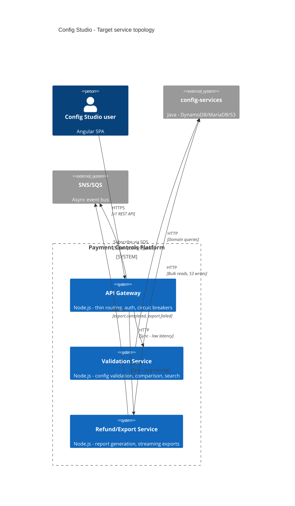
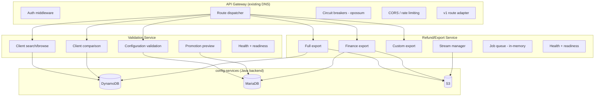
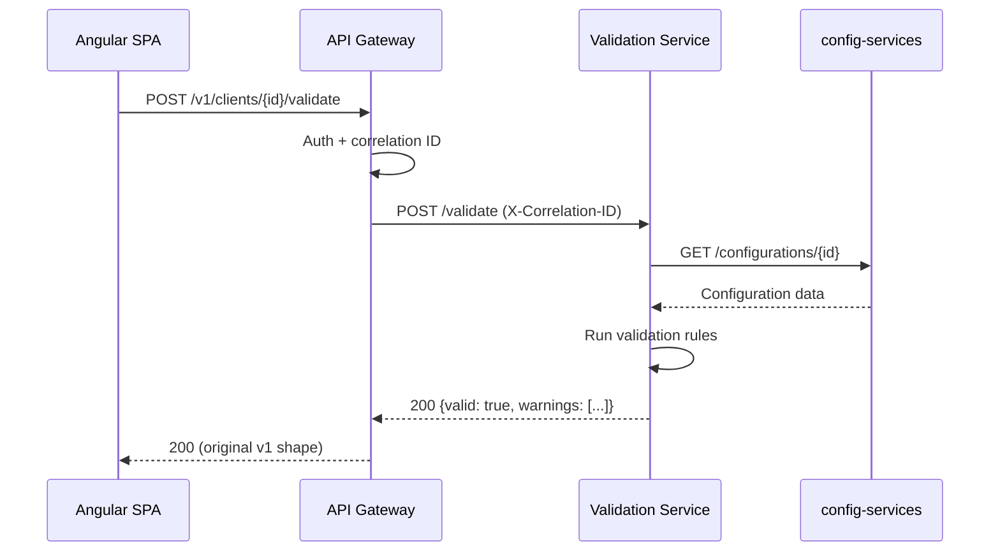
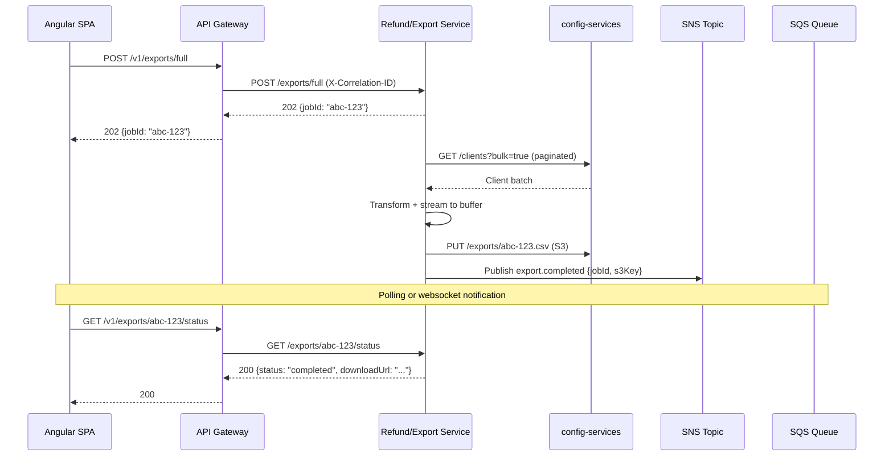
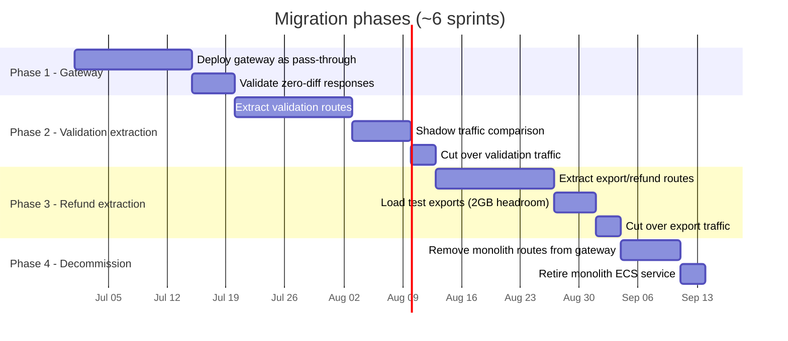
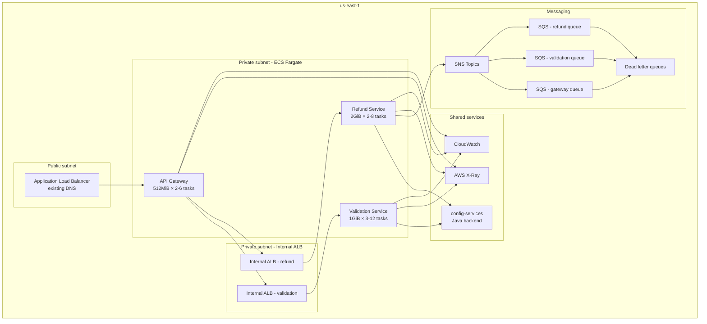
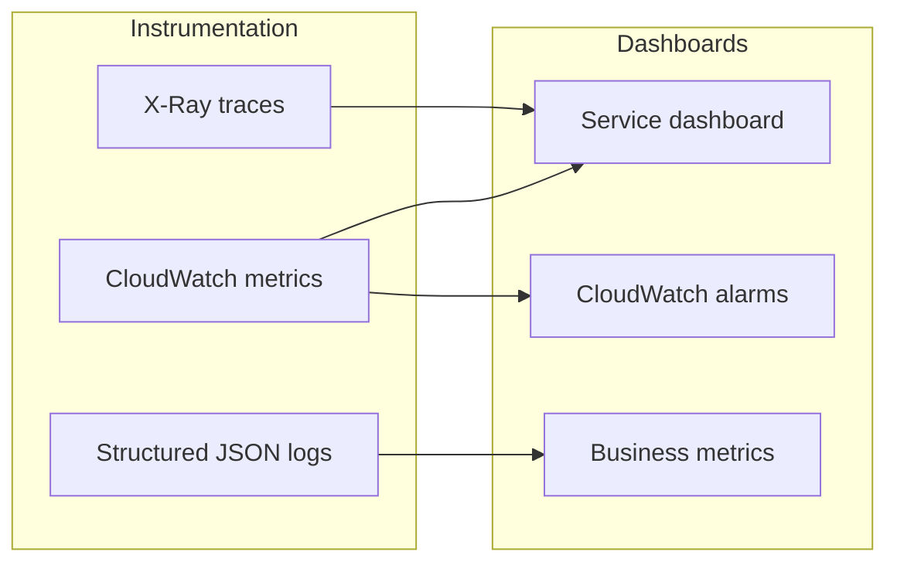

# Architecture specification: wdpr-payment-controls-api decomposition

## Executive summary

This document defines the target architecture for decomposing `wdpr-payment-controls-api` (the Config Studio WebAPI monolith) into three independently deployable services: an API gateway, a validation service, and a refund/export service.

### Motivation

| Problem | Impact | Resolution |
|---------|--------|------------|
| OOM kills in ECS (us-east-1) | Service restarts, dropped requests during peak export operations | Isolate memory-heavy export workloads into dedicated 2GB tasks |
| Coupled scaling | Validation latency degrades when exports consume memory | Independent scaling policies per domain |
| Blast radius | Single deployment affects all capabilities | Independent CI/CD and failure isolation |
| Resource waste | Over-provisioning validation tasks to accommodate export spikes | Right-sized containers per workload profile |

The current monolith runs at ~512MiB and is routinely OOMKilled when concurrent export operations spike memory usage. Splitting by domain allows each service to scale on its natural dimension (request count vs. memory pressure).

---

## Target architecture overview



---

## Component diagrams

### Service boundary decomposition



### Request flow - synchronous validation



### Request flow - async export



---

## Integration patterns

### Synchronous (HTTP)

| Pattern | Usage | Details |
|---------|-------|---------|
| Request/response | Gateway → validation-service | Low-latency calls (<200ms p99 target) |
| Request/response | Gateway → refund-service | Initiate exports, poll status |
| Request/response | Both services → config-services | Domain data access |

- Gateway uses [opossum][opossum] circuit breakers for all downstream calls
- Timeout: 5s for validation, 30s for export initiation
- Retry: 1 retry with exponential backoff for 5xx (not for 4xx)

### Asynchronous (SNS/SQS)

| Topic | Publisher | Subscribers | Payload |
|-------|-----------|-------------|---------|
| `config-studio-export-events` | refund-service | gateway (optional SSE push) | `{eventType, jobId, s3Key, timestamp, correlationId}` |
| `config-studio-validation-events` | validation-service | refund-service (cache invalidation) | `{eventType, clientId, timestamp}` |
| `config-studio-promotion-events` | config-services | validation-service, refund-service | `{eventType, environment, clientId}` |

- Each subscriber gets a dedicated SQS queue with DLQ (maxReceiveCount: 3)
- Message retention: 4 days on main queue, 14 days on DLQ
- Visibility timeout: 60s (export events), 10s (validation events)

### Service mesh headers

All inter-service calls carry:

```
X-Correlation-ID: <uuid> (generated at gateway if absent)
X-Request-Source: <service-name>
X-Amzn-Trace-Id: <xray-trace-id>
```

---

## Service specifications

### API gateway

| Property | Value |
|----------|-------|
| Runtime | Node.js 20 LTS |
| Memory | 512MiB |
| CPU | 0.25 vCPU |
| Scaling | 2–6 tasks, target: 60% CPU |
| DNS | `payment-controls-api-{env}.wdprapps.disney.com` (existing) |
| Health | `GET /health` → 200 `{status, uptime, version}` |
| Readiness | `GET /ready` → checks downstream circuit states |

### Validation service

| Property | Value |
|----------|-------|
| Runtime | Node.js 20 LTS |
| Memory | 1GiB |
| CPU | 0.5 vCPU |
| Scaling | 3–12 tasks, target: request count (500 req/min/task) |
| DNS | `validation-service-{env}.wdprapps.disney.com` |
| Health | `GET /health` → 200 `{status, uptime, version}` |
| Readiness | `GET /ready` → checks config-services connectivity |

### Refund/export service

| Property | Value |
|----------|-------|
| Runtime | Node.js 20 LTS |
| Memory | 2GiB |
| CPU | 1 vCPU |
| Scaling | 2–8 tasks, target: 70% memory utilization |
| DNS | `refund-service-{env}.wdprapps.disney.com` |
| Health | `GET /health` → 200 `{status, uptime, activeJobs, version}` |
| Readiness | `GET /ready` → checks config-services + S3 connectivity |

---

## Migration strategy: strangler fig



### Phase details

#### Phase 1: Gateway deployment (sprint 1)

- Deploy gateway to existing DNS via weighted ALB target group (canary 5% → 50% → 100%)
- Gateway proxies all requests to existing monolith (pass-through)
- Add correlation ID injection and X-Ray tracing
- Validate: response parity via shadow comparison logs
- Rollback: revert ALB target group weight to monolith

#### Phase 2: Validation extraction (sprints 2–3)

- Deploy validation-service with internal ALB
- Gateway routes validation paths to new service
- Shadow mode: gateway calls both monolith and validation-service, compares responses, logs diffs
- Cut over when diff rate < 0.1% for 48 hours
- Routes extracted: `/clients/search`, `/clients/{id}/compare`, `/configurations/validate`, `/promotions/preview`

#### Phase 3: Refund/export extraction (sprints 4–5)

- Deploy refund-service with internal ALB
- Gateway routes export paths to new service
- Load test: simulate 50 concurrent full exports (target: zero OOM, p99 < 45s)
- Routes extracted: `/exports/full`, `/exports/finance`, `/exports/custom`, `/exports/{id}/status`, `/exports/{id}/download`

#### Phase 4: Monolith decommission (sprint 6)

- Remove monolith from ALB target groups
- Scale monolith to 0 tasks (keep task definition 30 days for rollback)
- Delete monolith ECS service after 30-day bake period
- Archive monolith repository

---

## Deployment topology



### DNS mapping

| Service | DNS pattern | Example (stage) |
|---------|-------------|-----------------|
| Gateway | `payment-controls-api-{env}.wdprapps.disney.com` | `payment-controls-api-stage.wdprapps.disney.com` |
| Validation | `validation-service-{env}.wdprapps.disney.com` | `validation-service-stage.wdprapps.disney.com` |
| Refund | `refund-service-{env}.wdprapps.disney.com` | `refund-service-stage.wdprapps.disney.com` |

---

## Observability and resilience patterns

### Observability



| Layer | Tool | Key metrics |
|-------|------|-------------|
| Tracing | AWS X-Ray | Latency per segment, error rates, trace maps |
| Metrics | CloudWatch | Request count, p50/p95/p99 latency, memory %, active jobs |
| Logging | CloudWatch Logs (JSON) | Correlation ID, request path, duration, error stack |
| Alerting | CloudWatch Alarms → SNS → PagerDuty | OOM events, 5xx spike >5%, circuit open, DLQ depth >0 |

### Structured log format

```json
{
  "timestamp": "2026-07-15T10:30:00.000Z",
  "level": "info",
  "service": "refund-service",
  "correlationId": "abc-123-def-456",
  "traceId": "1-abc-def",
  "message": "Export completed",
  "duration": 12340,
  "jobId": "export-789",
  "clientCount": 1250
}
```

### Resilience patterns

| Pattern | Implementation | Configuration |
|---------|---------------|---------------|
| Circuit breaker | [opossum][opossum] at gateway | Open after 5 failures in 30s, half-open after 15s |
| Timeout | Per-route at gateway | Validation: 5s, Export initiation: 30s, Status poll: 3s |
| Retry | Exponential backoff | Max 1 retry, only on 5xx/network errors, jitter ±200ms |
| Bulkhead | Separate connection pools per downstream | Validation: 20 connections, Refund: 10 connections |
| Graceful degradation | Gateway returns cached/partial responses | When validation-service circuit open, return last-known-good |
| Health checks | ECS health check + ALB target health | Interval: 10s, unhealthy threshold: 3, deregistration delay: 30s |
| Graceful shutdown | SIGTERM handler drains in-flight requests | Drain timeout: 30s, stop accepting new requests immediately |

### Backpressure (refund-service)

- In-memory job queue limited to 20 concurrent exports per task
- Returns `429 Too Many Requests` with `Retry-After` header when at capacity
- Gateway circuit breaker opens on sustained 429s (prevents cascade)

---

## Risks and mitigations

| # | Risk | Likelihood | Impact | Mitigation |
|---|------|-----------|--------|------------|
| 1 | Network latency between gateway and downstream services adds overhead | Medium | Low | Internal ALBs in same AZ; target <5ms added latency. Monitor with X-Ray segment timing. |
| 2 | config-services becomes bottleneck with increased connection count | Medium | High | Connection pooling with limits. Coordinate with config-services team on capacity. Add caching at validation-service for frequently accessed configs (TTL 60s). |
| 3 | Data inconsistency during shadow traffic phase | Low | Medium | Shadow mode is read-only comparison; no writes are duplicated. Diff logging catches divergence before cut-over. |
| 4 | Export jobs in-flight during deployment | Medium | Medium | Graceful shutdown with 30s drain. ECS rolling deployment with minimum healthy 50%. Job state persisted to allow resume on new task. |
| 5 | Operational complexity of 3 services vs. 1 | High | Low | Shared CDK constructs for infra. Unified dashboard. Runbook per service. Single on-call rotation covers all three. |
| 6 | SNS/SQS message ordering for export status | Low | Low | Use jobId for idempotency. Status is derived from latest message timestamp, not ordering. |
| 7 | Gateway becomes single point of failure | Low | High | Multi-AZ deployment (2+ tasks minimum). ALB health checks with fast failover. If gateway is entirely down, ALB returns 503 (same as current monolith behavior). |
| 8 | Memory leak in refund-service under sustained load | Medium | High | Memory-based autoscaling detects pressure early. CloudWatch alarm at 80% memory. Implement streaming (not buffering) for exports where possible. |

---

## Decision log

| Decision | Rationale | Alternatives considered |
|----------|-----------|------------------------|
| Thin gateway, not API Gateway (AWS) | Need streaming support for exports, custom circuit breaker logic, WebSocket potential | AWS API Gateway (lacks streaming), direct service-to-service (no single entry point) |
| SNS/SQS over EventBridge | Simpler model for point-to-point events, team familiarity | EventBridge (more complex rules engine not needed), direct HTTP callbacks |
| No direct DB ownership | config-services already owns persistence; duplicating would require data sync | Separate read replicas (operational overhead), CQRS (over-engineering for current scale) |
| Opossum for circuit breaking | Lightweight Node.js library, team already using in other services | Istio service mesh (infrastructure overhead), custom implementation (maintenance burden) |
| ECS Fargate over EKS | Team expertise, simpler operations, sufficient for service count | EKS (operational complexity not justified for 3 services), Lambda (cold starts unacceptable for validation) |

---

## Appendix: route mapping

| v1 route (gateway) | Target service | Method |
|---------------------|---------------|--------|
| `/v1/clients/search` | validation-service | GET |
| `/v1/clients/{id}` | validation-service | GET |
| `/v1/clients/{id}/compare` | validation-service | POST |
| `/v1/configurations/validate` | validation-service | POST |
| `/v1/promotions/preview` | validation-service | POST |
| `/v1/promotions/execute` | validation-service | POST |
| `/v1/exports/full` | refund-service | POST |
| `/v1/exports/finance` | refund-service | POST |
| `/v1/exports/custom` | refund-service | POST |
| `/v1/exports/{id}/status` | refund-service | GET |
| `/v1/exports/{id}/download` | refund-service | GET |
| `/v1/health` | gateway (local) | GET |

---

## References

- [opossum]: https://github.com/nodeshift/opossum — Node.js circuit breaker
- [strangler-fig]: https://martinfowler.com/bliki/StranglerFigApplication.html — Migration pattern
- [xray-sdk]: https://docs.aws.amazon.com/xray/latest/devguide/xray-sdk-nodejs.html — AWS X-Ray SDK for Node.js

[opossum]: https://github.com/nodeshift/opossum
[strangler-fig]: https://martinfowler.com/bliki/StranglerFigApplication.html
[xray-sdk]: https://docs.aws.amazon.com/xray/latest/devguide/xray-sdk-nodejs.html
