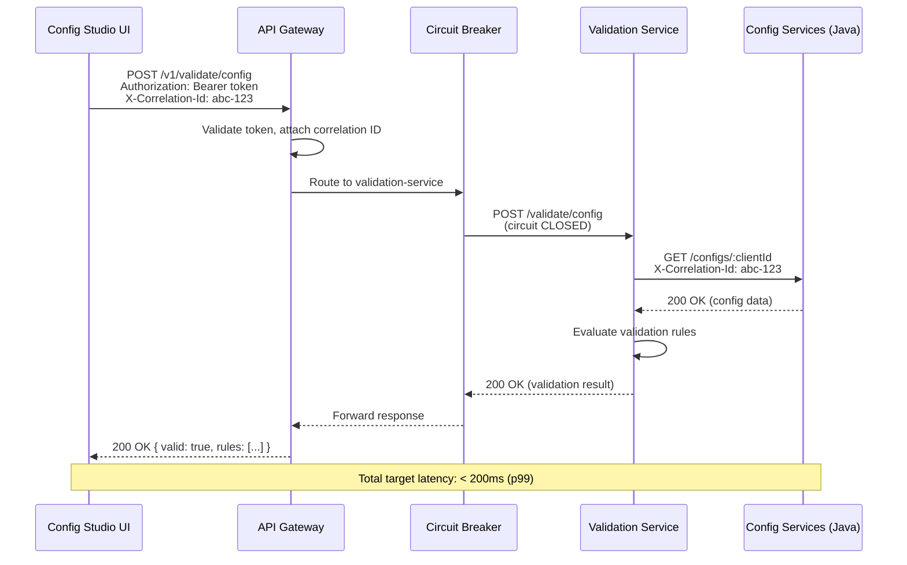
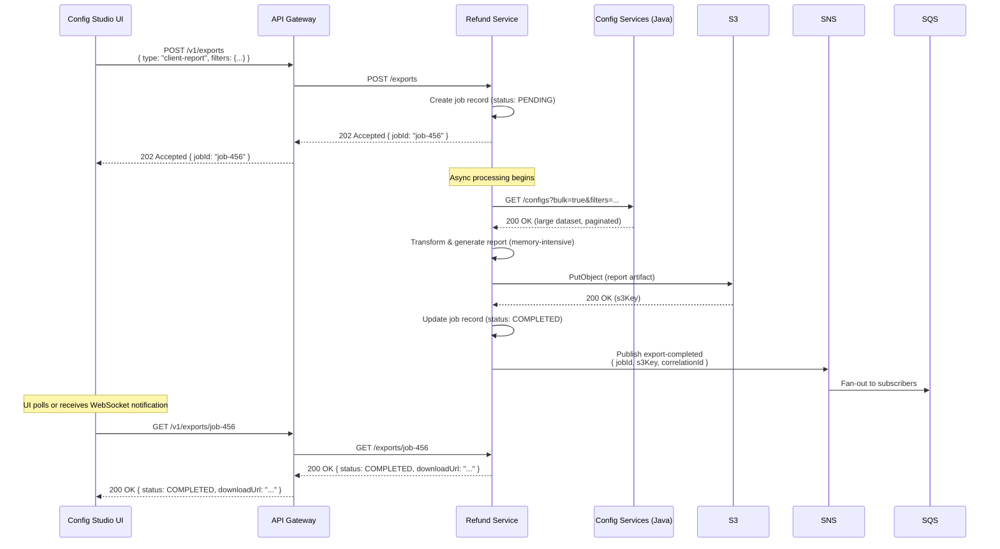
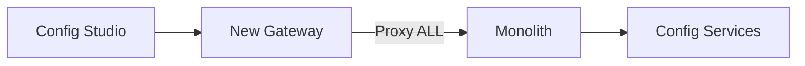
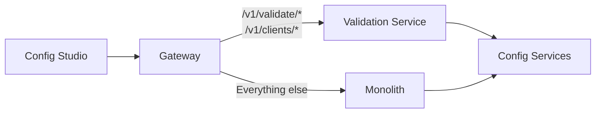
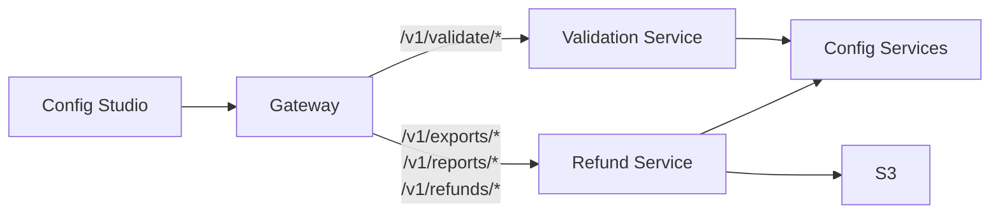

# Architecture Specification: wdpr-payment-controls-api Decomposition

**Document Version:** 1.0  
**Date:** 2026-06-22  
**Status:** Proposed  
**Authors:** Platform Engineering Team  
**Review Date:** June 16 Design Session (prior context)

---

## 1. Executive Summary

### Problem Statement

The `wdpr-payment-controls-api` monolith — a Node.js BFF serving Config Studio — suffers from recurring OOM crashes. Fargate tasks allocated at 512 MiB are exhausted during memory-intensive export/report operations, causing cascading failures that degrade low-latency validation endpoints sharing the same process.

### Proposed Solution

Decompose the monolith into three independently deployable services using the strangler fig pattern:

| Service | Responsibility | Fargate Task Size | Scaling |
|---------|---------------|-------------------|---------|
| **API Gateway** | Thin router, auth passthrough, circuit breaking | 512 MiB | 2–6 (request count) |
| **Validation Service** | Real-time config validation, rule evaluation | 1 GB | 3–12 (request count) |
| **Refund Service** | Report generation, exports, bulk operations | 2 GB | 2–8 (memory utilization) |

### What This Achieves

- **OOM Isolation** — Memory-heavy export operations run in dedicated 2 GB tasks; validation endpoints are never starved.
- **Independent Scaling** — Each service scales on its own dimension (request count vs. memory) with appropriate task sizing.
- **Team Autonomy** — Independent CI/CD pipelines, deployment cadences, and ownership boundaries.
- **Zero UI Breaking Changes** — Gateway retains the current DNS; Config Studio (Angular) requires no changes.

---

## 2. Component Diagram

```mermaid
graph TB
    subgraph "Client Layer"
        UI[Config Studio UI<br/>Angular]
    end

    subgraph "Gateway Layer"
        GW[API Gateway Service<br/>Node.js - 512 MiB<br/>wdpr-payment-controls-api-{env}.wdprapps.disney.com]
    end

    subgraph "Domain Services"
        VS[Validation Service<br/>Node.js - 1 GB<br/>validation-{env}.wdprapps.disney.com]
        RS[Refund Service<br/>Node.js - 2 GB<br/>refund-{env}.wdprapps.disney.com]
    end

    subgraph "Backend Services"
        CS[wdpr-config-services<br/>Java Backend]
    end

    subgraph "AWS Infrastructure"
        DDB[(DynamoDB)]
        MDB[(MariaDB)]
        S3[(S3<br/>Export Artifacts)]
        SNS[SNS Topics]
        SQS[SQS Queues]
    end

    %% Sync HTTP flows
    UI -->|HTTPS| GW
    GW -->|HTTP + Circuit Breaker| VS
    GW -->|HTTP + Circuit Breaker| RS
    VS -->|HTTP| CS
    RS -->|HTTP| CS
    CS --> DDB
    CS --> MDB

    %% Async flows
    RS -->|Publish| SNS
    VS -->|Publish| SNS
    SNS -->|Fan-out| SQS
    SQS -->|Consume| RS
    SQS -->|Consume| VS

    %% Storage
    RS -->|Upload exports| S3

    %% Styling
    linkStyle 0,1,2,3,4,5,6 stroke:#2196F3,stroke-width:2px
    linkStyle 7,8,9,10,11 stroke:#FF9800,stroke-width:2px,stroke-dasharray:5
```

**Legend:**  
- Solid blue lines → Synchronous HTTP/REST  
- Dashed orange lines → Asynchronous SNS/SQS messaging

---

## 3. Service Boundaries

### 3.1 API Gateway Service

| Aspect | Detail |
|--------|--------|
| **Owns** | Routing, auth token passthrough, response aggregation, circuit breaking |
| **Routes** | All existing `/v1/*` paths (backward-compatible) |
| **Auth** | Validates JWT/OAuth tokens, forwards `Authorization` header downstream |
| **Resilience** | Opossum circuit breakers per downstream service |
| **Does NOT own** | Business logic, data transformation, direct DB access |

**Key Endpoints (proxied):**
- `GET /v1/clients/*` → Validation Service
- `POST /v1/validate/*` → Validation Service
- `GET /v1/reports/*` → Refund Service
- `POST /v1/exports/*` → Refund Service
- `POST /v1/refunds/*` → Refund Service

### 3.2 Validation Service

| Aspect | Detail |
|--------|--------|
| **Owns** | Real-time validation rules, config comparison logic, client search/browse |
| **Latency Target** | p99 < 200ms |
| **Scaling Dimension** | Request count (CPU-bound) |
| **Data Source** | wdpr-config-services (HTTP) |

**Endpoints:**
- `POST /validate/config` — Validate a configuration payload against rules
- `POST /validate/promotion` — Pre-validate environment promotion
- `GET /clients` — Search/browse clients
- `GET /clients/:id/config` — Retrieve client configuration
- `GET /compare` — Compare configurations across environments
- `GET /health` — Liveness/readiness probe

**Events Published:**
- `validation-completed` — Result of validation (pass/fail + details)
- `validation-failed` — Critical validation failure requiring attention

### 3.3 Refund Service

| Aspect | Detail |
|--------|--------|
| **Owns** | Report generation, export streaming to S3, bulk refund operations |
| **Latency Target** | p99 < 5s (initiation); exports are async |
| **Scaling Dimension** | Memory utilization (memory-bound) |
| **Data Source** | wdpr-config-services (HTTP), S3 (export artifacts) |

**Endpoints:**
- `POST /exports` — Initiate an export job (returns job ID immediately)
- `GET /exports/:id` — Poll export status
- `GET /exports/:id/download` — Redirect to S3 pre-signed URL
- `POST /refunds/bulk` — Initiate bulk refund operation
- `GET /reports/:type` — Generate on-demand report
- `GET /health` — Liveness/readiness probe

**Events Published:**
- `export-completed` — Export finished, artifact available in S3
- `export-failed` — Export job failed (with error context)
- `bulk-operation-completed` — Bulk operation finished

**Events Consumed:**
- `validation-completed` — To trigger post-validation report generation if configured

---

## 4. Integration Patterns

### 4.1 Synchronous Communication (HTTP/REST)

```
Gateway → Validation Service:  HTTP/1.1, JSON, timeout 5s
Gateway → Refund Service:      HTTP/1.1, JSON, timeout 30s (exports)
Services → Config Services:    HTTP/1.1, JSON, timeout 10s
```

All synchronous calls propagate:
- `Authorization` header (OAuth2 bearer token)
- `X-Correlation-Id` header (UUID, generated at gateway if absent)
- `X-Request-Start` header (timestamp for latency tracking)

### 4.2 Asynchronous Communication (SNS/SQS)

**SNS Topics:**

| Topic | Publisher | Purpose |
|-------|-----------|---------|
| `config-validation-events` | Validation Service | Validation results |
| `export-events` | Refund Service | Export lifecycle events |
| `bulk-operation-events` | Refund Service | Bulk operation lifecycle |

**SQS Queues (per consumer):**

| Queue | Subscriber | Source Topic | DLQ |
|-------|-----------|--------------|-----|
| `refund-svc-validation-events` | Refund Service | `config-validation-events` | Yes (maxReceiveCount: 3) |
| `gateway-export-notifications` | Gateway (WebSocket push) | `export-events` | Yes (maxReceiveCount: 3) |

### 4.3 Circuit Breaker Configuration (Opossum)

```javascript
// Gateway circuit breaker defaults per downstream service
const circuitOptions = {
  timeout: 5000,            // 5s before trip
  errorThresholdPercentage: 50,  // trip at 50% failure rate
  resetTimeout: 30000,      // half-open after 30s
  rollingCountTimeout: 10000,    // 10s rolling window
  rollingCountBuckets: 10,
  volumeThreshold: 10       // minimum requests before evaluation
};

// Refund service gets extended timeout for export initiation
const refundCircuitOptions = {
  ...circuitOptions,
  timeout: 30000  // 30s for export operations
};
```

**Fallback Behavior:**
- Validation Service down → Return cached validation result if available, else 503
- Refund Service down → Return 503 with `Retry-After` header

### 4.4 Retry / Backoff Strategy

| Layer | Strategy | Config |
|-------|----------|--------|
| Gateway → Services | Exponential backoff | 3 attempts, base 500ms, max 4s, jitter |
| Services → Config Services | Exponential backoff | 3 attempts, base 200ms, max 2s |
| SQS consumers | Visibility timeout extension | Initial 30s, max 3 receives before DLQ |

### 4.5 Correlation ID Propagation

```
┌─────────┐     X-Correlation-Id: uuid-abc-123     ┌─────────┐
│ Gateway │ ──────────────────────────────────────► │ Service │
└─────────┘                                         └─────────┘
     │                                                   │
     │  AWS X-Ray: TraceId linked to Correlation ID      │
     │  CloudWatch Logs: { correlationId: "uuid-abc-123" }│
     ▼                                                   ▼
```

- Gateway generates `X-Correlation-Id` (UUIDv4) if not present in the inbound request.
- All downstream HTTP calls and SNS message attributes carry the correlation ID.
- Structured log entries include `correlationId` field for cross-service tracing.

---

## 5. Deployment Topology

```mermaid
graph TB
    subgraph "Route 53 DNS"
        DNS1[wdpr-payment-controls-api-{env}.wdprapps.disney.com]
        DNS2[validation-{env}.wdprapps.disney.com]
        DNS3[refund-{env}.wdprapps.disney.com]
    end

    subgraph "Application Load Balancer"
        ALB[ALB<br/>TLS Termination]
        TG1[Target Group: Gateway]
        TG2[Target Group: Validation]
        TG3[Target Group: Refund]
    end

    subgraph "AWS Fargate - ECS Cluster"
        subgraph "Gateway Tasks (512 MiB / 0.25 vCPU)"
            GW1[Task 1]
            GW2[Task 2]
        end
        subgraph "Validation Tasks (1 GB / 0.5 vCPU)"
            VS1[Task 1]
            VS2[Task 2]
            VS3[Task 3]
        end
        subgraph "Refund Tasks (2 GB / 1 vCPU)"
            RS1[Task 1]
            RS2[Task 2]
        end
    end

    subgraph "Service Discovery (Cloud Map)"
        SD1[validation.config-studio.local]
        SD2[refund.config-studio.local]
    end

    DNS1 --> ALB
    DNS2 --> ALB
    DNS3 --> ALB
    ALB --> TG1
    ALB --> TG2
    ALB --> TG3
    TG1 --> GW1
    TG1 --> GW2
    TG2 --> VS1
    TG2 --> VS2
    TG2 --> VS3
    TG3 --> RS1
    TG3 --> RS2

    GW1 -.->|Service Discovery| SD1
    GW1 -.->|Service Discovery| SD2
```

### DNS Strategy

| Service | Public DNS | Internal (Cloud Map) |
|---------|-----------|---------------------|
| Gateway | `wdpr-payment-controls-api-{env}.wdprapps.disney.com` | — |
| Validation | `validation-{env}.wdprapps.disney.com` | `validation.config-studio.local` |
| Refund | `refund-{env}.wdprapps.disney.com` | `refund.config-studio.local` |

### ALB Routing Rules

| Priority | Condition | Target Group |
|----------|-----------|--------------|
| 1 | Host: `validation-{env}.*` | Validation TG |
| 2 | Host: `refund-{env}.*` | Refund TG |
| 3 | Host: `wdpr-payment-controls-api-{env}.*` | Gateway TG |

Gateway uses **internal** Cloud Map DNS to route to downstream services (bypasses ALB for inter-service calls, reducing latency and cost).

---

## 6. Data Flow Diagrams

### 6.1 Validation Request Flow (Synchronous, Low-Latency)



### 6.2 Export/Report Flow (Asynchronous, Memory-Heavy)



---

## 7. Migration Phases (Strangler Fig)

### Overview Timeline

| Phase | Duration | Sprint(s) | Outcome |
|-------|----------|-----------|---------|
| Phase 1 | ~4 weeks | Sprints 1–2 | Gateway deployed as transparent pass-through |
| Phase 2 | ~8 weeks | Sprints 3–5 | Validation service extracted, gateway routes validation traffic |
| Phase 3 | ~8 weeks | Sprints 6–8 | Refund service extracted, gateway routes export traffic |
| Phase 4 | ~2 weeks | Sprint 9 | Monolith decommissioned |

### Phase 1: Gateway as Pass-Through (~4 weeks)

**Goal:** Deploy the gateway service with zero behavioral change. All requests proxied to the existing monolith.



**Deliverables:**
- Gateway service scaffolded (Express/Fastify, opossum, correlation ID middleware)
- ALB listener rule updated: DNS points to gateway
- Health checks verified
- Feature flags for route-by-route migration (`FF_ROUTE_VALIDATION`, `FF_ROUTE_REFUND`)
- Smoke tests passing in Stage

**Rollback:** DNS revert to monolith ALB target group (< 5 min).

### Phase 2: Extract Validation Service (~8 weeks)

**Goal:** Validation logic runs in dedicated 1 GB tasks. Gateway routes validation paths to new service.



**Deliverables:**
- Validation service deployed (independent CI/CD)
- Routes migrated: `/v1/validate/*`, `/v1/clients/*`, `/v1/compare/*`
- Circuit breakers active; fallback to monolith if validation-service unavailable
- Integration tests passing
- Performance benchmarks met (p99 < 200ms)
- SNS topic `config-validation-events` publishing

**Rollback:** Feature flag `FF_ROUTE_VALIDATION=false` → gateway routes back to monolith.

### Phase 3: Extract Refund Service (~8 weeks)

**Goal:** Export/report operations run in dedicated 2 GB tasks. OOM issue resolved.



**Deliverables:**
- Refund service deployed (independent CI/CD, 2 GB tasks)
- Routes migrated: `/v1/exports/*`, `/v1/reports/*`, `/v1/refunds/*`
- Async export pattern implemented (202 Accepted + polling)
- S3 integration for export artifacts
- SNS topics publishing export lifecycle events
- Load test confirms no OOM under peak export concurrency

**Rollback:** Feature flag `FF_ROUTE_REFUND=false` → gateway routes back to monolith.

### Phase 4: Retire Monolith (~2 weeks)

**Goal:** Monolith decommissioned. All traffic served by new services.

**Deliverables:**
- Confirm zero traffic to monolith (ALB metrics, access logs)
- Remove monolith ECS service and task definitions
- Archive monolith repository (read-only)
- Remove feature flags (hardcode new routing)
- Update runbooks and on-call documentation
- Cost analysis: expected savings from right-sized tasks

---

## 8. Non-Functional Requirements

### 8.1 Latency Targets

| Service | Endpoint Type | p50 | p95 | p99 |
|---------|--------------|-----|-----|-----|
| Gateway | Pass-through overhead | < 5ms | < 15ms | < 30ms |
| Validation | Sync validation | < 80ms | < 150ms | < 200ms |
| Refund | Export initiation (202) | < 200ms | < 500ms | < 1s |
| Refund | Report generation (async) | — | — | < 60s total |

### 8.2 Scaling Policies

| Service | Metric | Scale-Out | Scale-In | Min | Max |
|---------|--------|-----------|----------|-----|-----|
| Gateway | RequestCountPerTarget > 1000/min | +1 task | -1 task (300s cooldown) | 2 | 6 |
| Validation | RequestCountPerTarget > 500/min | +2 tasks | -1 task (300s cooldown) | 3 | 12 |
| Refund | MemoryUtilization > 70% | +1 task | -1 task (600s cooldown) | 2 | 8 |

### 8.3 Observability

**AWS X-Ray:**
- Tracing enabled on all services
- X-Ray SDK segments correlated via `X-Correlation-Id`
- Service map auto-generated for dependency visualization

**CloudWatch:**
- Custom metrics per service: request count, error rate, latency percentiles
- Alarms: p99 latency breach, error rate > 5%, OOM task restarts
- Dashboard per service + unified cross-service dashboard

**Structured Logging (JSON):**
```json
{
  "timestamp": "2026-06-22T15:30:00.000Z",
  "level": "info",
  "service": "validation-service",
  "correlationId": "abc-123-def-456",
  "traceId": "1-abc-def",
  "method": "POST",
  "path": "/validate/config",
  "statusCode": 200,
  "duration": 45,
  "clientId": "resort-ops"
}
```

**Log Groups:** `/ecs/config-studio/{service-name}/{environment}`

### 8.4 Security

| Control | Implementation |
|---------|---------------|
| **Service-to-service auth** | mTLS via AWS Certificate Manager Private CA; each service has unique certificate |
| **IAM Roles** | Per-task IAM role (least privilege): refund-service gets S3 write, SNS publish; validation-service gets SNS publish only |
| **Network** | Services in private subnets; ALB in public subnets; security groups restrict ingress to ALB only |
| **Secrets** | AWS Secrets Manager for API keys/credentials; injected via ECS task definition |
| **WAF** | AWS WAF on ALB for rate limiting, geo-blocking, SQL injection protection |
| **Token Validation** | Gateway validates OAuth2 tokens; downstream services trust gateway (mTLS proves origin) |

### 8.5 Reliability

| Requirement | Target |
|-------------|--------|
| Availability | 99.9% (per service) |
| RTO | < 5 minutes (Fargate auto-recovery) |
| RPO | N/A (stateless services; state in Config Services/S3) |
| Health checks | `/health` endpoint, 10s interval, 3 consecutive failures = unhealthy |
| Graceful shutdown | SIGTERM handler drains in-flight requests (30s timeout) |

---

## Appendix A: Repository Structure

```
config-studio-platform/
├── services/
│   ├── gateway/              # API Gateway service
│   │   ├── src/
│   │   ├── Dockerfile
│   │   ├── buildspec.yml
│   │   └── package.json
│   ├── validation-service/   # Validation service
│   │   ├── src/
│   │   ├── Dockerfile
│   │   ├── buildspec.yml
│   │   └── package.json
│   └── refund-service/       # Refund service
│       ├── src/
│       ├── Dockerfile
│       ├── buildspec.yml
│       └── package.json
├── infrastructure/
│   ├── terraform/            # Shared infra (VPC, ALB, SNS/SQS)
│   └── service-templates/    # ECS task definitions per service
└── docs/
    └── architecture/         # This document
```

## Appendix B: Decision Records

| Decision | Rationale | Alternatives Considered |
|----------|-----------|------------------------|
| Node.js for all new services | Team expertise, shared tooling, npm ecosystem | Go (rejected: team ramp-up), Java (rejected: already have config-services in Java, BFF layer is Node) |
| Opossum for circuit breaking | Already in use, lightweight, well-maintained | Polly (.NET only), custom implementation (rejected: maintenance burden) |
| SNS/SQS over EventBridge | Simpler model for point-to-point events, team familiarity | EventBridge (considered: adds schema registry but more complexity than needed) |
| Cloud Map over Consul | Native AWS integration, no additional infrastructure | Consul (rejected: operational overhead), ALB-only (rejected: adds latency for inter-service) |
| Strangler Fig over Big Bang | Lower risk, incremental validation, easy rollback per phase | Big Bang rewrite (rejected: high risk, long freeze), Branch by Abstraction (rejected: adds code complexity in monolith) |
