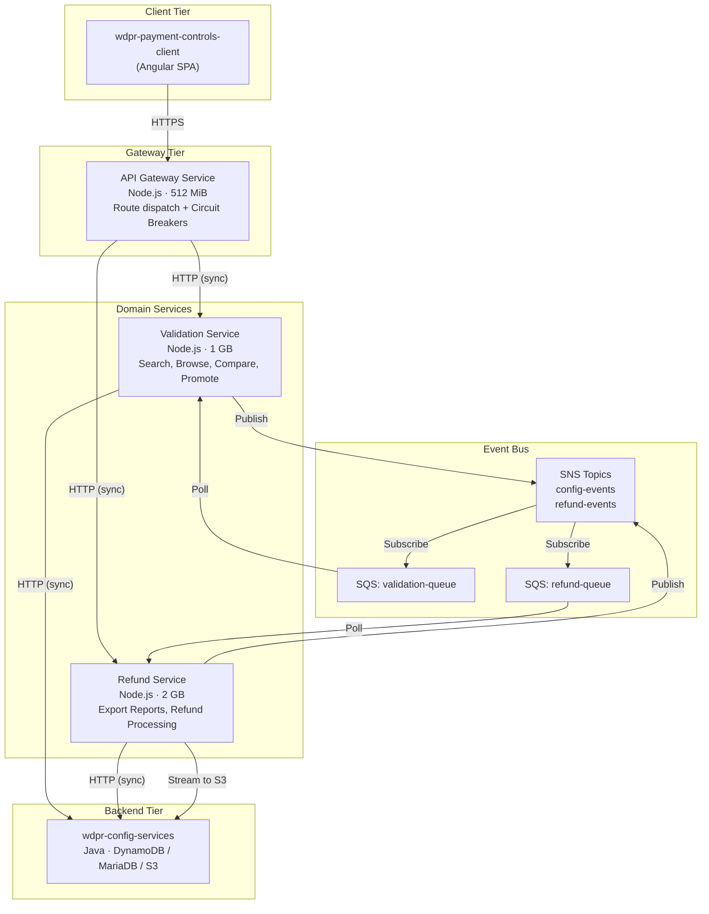

# Architecture Specification: Config Studio BFF Decomposition

**Document Version:** 1.0  
**Date:** 2026-06-24  
**Status:** Proposed  
**Author:** Architecture Team  

---

## 1. Executive Summary

The `wdpr-payment-controls-api` Node.js BFF is being decomposed from a single 512 MiB ECS monolith into three purpose-built microservices to resolve recurring OOMKilled failures caused by unbounded memory buffering during export/refund operations.

**Target State:** A thin API Gateway fronts two domain-specific services—a Validation Service (low-latency, high-throughput) and a Refund Service (memory-intensive, export-oriented). The gateway retains existing DNS and route structure, ensuring zero changes to the Angular UI (`wdpr-payment-controls-client`). Both downstream services remain stateless, delegating persistence to the existing Java backend (`wdpr-config-services`).

**Key Outcomes:**
- Eliminates OOM failures by isolating memory-heavy export operations in a dedicated 2 GB service
- Enables independent scaling: validation scales on request count, refund scales on memory utilization
- Maintains backward compatibility—no UI or API contract changes during migration
- Introduces observability (X-Ray, correlation IDs) and resilience (circuit breakers) patterns
- Delivered incrementally via strangler fig over ~6 sprints with zero-downtime cutover

---

## 2. Component Architecture

### Service Responsibilities

| Service | Responsibility | Memory | Scaling Strategy |
|---------|---------------|--------|-----------------|
| API Gateway | Route dispatch, auth passthrough, circuit breaking, correlation ID injection | 512 MiB | 2–6 tasks, request count |
| Validation Service | Config search, browse, compare, promote orchestration, rule validation | 1 GB | 3–12 tasks, request count |
| Refund Service | Export report generation, refund calculations, bulk CSV/PDF streaming | 2 GB | 2–8 tasks, memory utilization |

