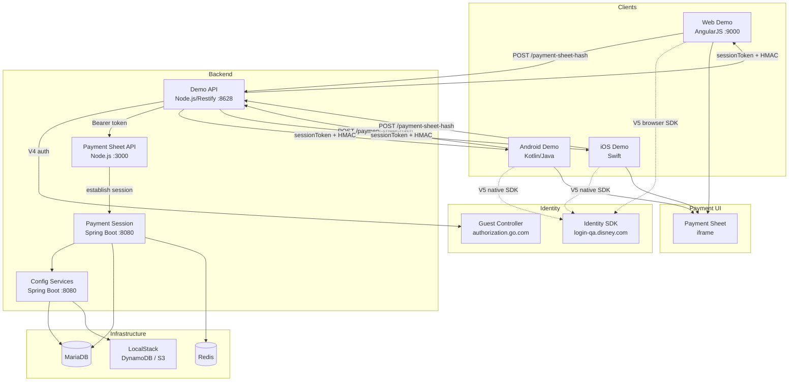

# Payment Demo

> Extends [app-team](../README.md) — inherits dev-core, qa, shared rules and context.

Demo applications and payment infrastructure for E2E payment flow testing across web, Android, and iOS.

## Architecture



## Repos

| Layer | Repo | Tech |
|-------|------|------|
| Web Demo UI | wdpr-payment-demo | AngularJS SPA |
| Web Demo API | wdpr-payment-demo-api | Node.js (Restify) |
| Payment Sheet UI | wdpr-payment-sheet | Embedded iframe/fragment |
| Payment Sheet API | wdpr-payment-sheet-api | Node.js |
| Session Service | wdpr-payment-session | Java/Spring Boot |
| Config Services | wdpr-config-services | Java/Spring Boot |
| Shared Lib | wdpr-payments-ref | Java |
| Android Demo | dpay-android-ui | Kotlin/Java (Android) |
| iOS Demo | dpayios | Swift (iOS) |

## Setup

```bash
koda workspace apply app-demo
```

## Key Flows

```
Web:     Demo UI → Demo API → Payment Sheet API → Session Service
Android: TestPage → Demo API → Payment Sheet API → Session Service
iOS:     Demo UI → Demo API → Payment Sheet API → Session Service
```

## Environments

| App | Latest | Stage |
|-----|--------|-------|
| Demo App | https://latest.commerceplatforms.wdprapps.disney.com | https://stage.commerceplatforms.wdprapps.disney.com |
| Payment Sheet | https://latest.paymentsheet.wdprapps.disney.com | https://stage.paymentsheet.wdprapps.disney.com |

## Identity V5

| Platform | SDK | Notes |
|----------|-----|-------|
| Web | Identity Web SDK (cdn-qa.disneyaccount.com/v5/sdk.js) | Browser-side redirect |
| Android | Identity SDK Android 5.x (Artifactory) | Native, `launchIdentityFlow()` |
| iOS | Identity SDK iOS 5.x (SPM) | Native, `launchIdentityFlow()` |
| B2B | AuthZ client_credentials | Unchanged, server-to-server only |

## Jira

- **Prefix:** DPAY-
- **Board:** https://myjira.disney.com/secure/RapidBoard.jspa?rapidView=4498
