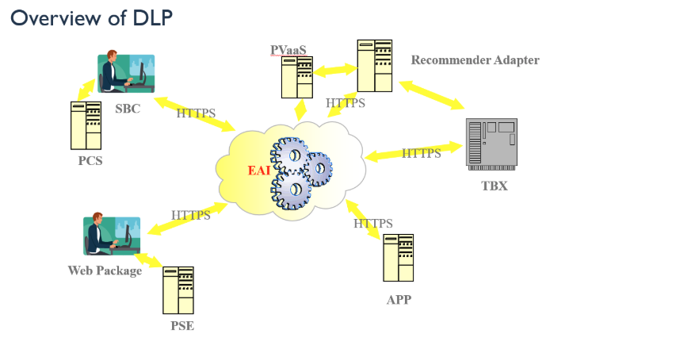

# DLP EAI Workspace

## Overview

Workspace for the DLP EAI (Enterprise Application Integration). EAI is a middleware that allows communication between SBC and WEB (Clients) and the different services for the DLP reservation.

## Architecture

EAI is the central integration hub connecting all DLP systems over HTTPS:

| System               | Role                                          |
|----------------------|-----------------------------------------------|
| SBC / PCS            | Sales Booking Channel (CRC agent UI)          |
| PVaaS                | Product Validation as a Service               |
| Recommender Adapter  | RMA offer recommendations                     |
| TBX                  | Travelbox (core reservation system)           |
| Web Package / PSE    | Digital guest-facing website                  |
| APP                  | Mobile application                            |

## Context

| File              | Purpose                                                                    |
| -------------------| ----------------------------------------------------------------------------|
| `eai-steering.md` | Consolidated development standards, workflow conventions, and golden rules |

## Profiles Enabled

| Profile    | Agents | Purpose                                                              |
| ------------| :------:| ----------------------------------------------------------------------|
| `dev-core` | 21     | Orchestrator, planner, code review, architecture, security, PRs      |
| `dev-web`  | 5      | Backend (Java), WebAPI (Node), UI (Angular/Vue), UX, Astro           |
| `dev-ui`   | 3      | Angular legacy & uplift, Polymer, AWS Lambda                         |
| `qa`       | 16     | Test planning, automation, defect analysis, API testing, coverage    |
| `pm`       | 6      | Sprint management, standups, retros, risk tracking, delivery reports |
| `ba`       | 8      | Requirements, scope, stories, PRDs, estimation                       |
