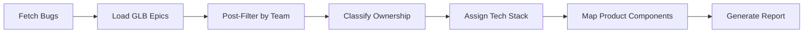
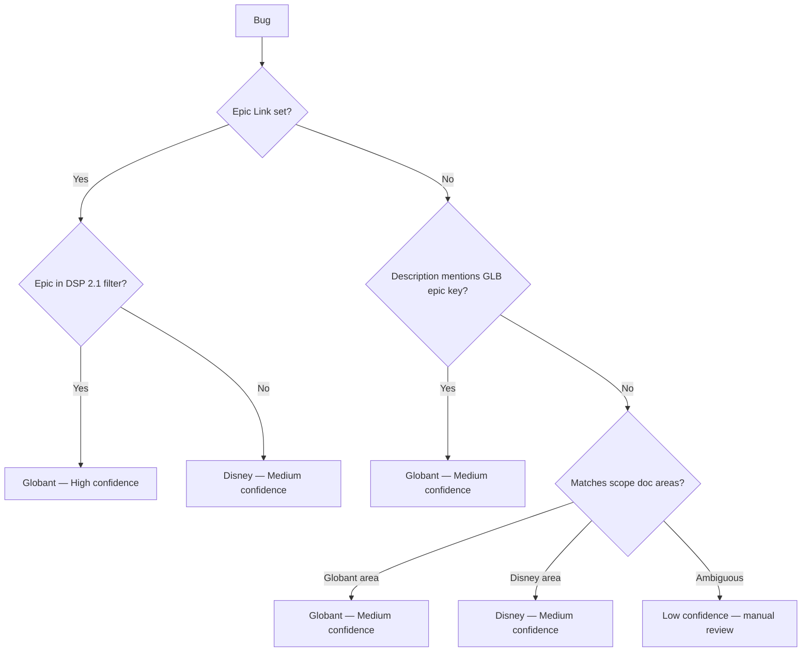

# DSP Bug Triage Agent

**Profile:** qa  
**Status:** Active  
**Version:** 1.0  

---

## Overview

The DSP Bug Triage Agent automates the classification of production bugs for the Disney Selling Platform (DSP) project. It determines whether each bug belongs to **Globant** or **Disney**, assigns the correct tech stack, maps product components, and produces a structured report — all without making automatic Jira changes.

### Problem It Solves

Before this agent, triage was a manual process:
- Release managers spent 1–2 hours per sprint reviewing 50+ new bugs
- Ownership was determined by checking epic links and reading descriptions
- Misrouted bugs caused delays of 2–5 days before reaching the right team

The agent reduces this to a **2-minute review cycle** with confidence-scored recommendations.

---

## How It Works



### Step-by-Step

1. **Fetch Bugs** — Queries Jira for open bugs in target releases (DSP 2.1.1, 2.1.2, 2.1.3) without the `glb-prod-triage` label
2. **Load GLB Epics** — Caches all epics from the "DSP 2.1" filter as the Globant scope reference
3. **Post-Filter by Team** — Reads `customfield_10001` (Team) and excludes Disney teams (Heimdall, Bifrost, etc.)
4. **Classify Ownership** — Matches bug's epic link and description keywords against GLB epics
5. **Assign Tech Stack** — Maps to Android, PHP, React, Go, or Data based on affected area
6. **Map Product Components** — Keyword matching to 50+ product areas
7. **Generate Report** — Outputs Globant bugs only + a separate table for unassigned-team bugs

---

## Output Format

The agent produces three sections:

### 1. Globant Bug Table (main output)

| Ticket | Summary | Tech Stack | Product Component(s) | Related Epic | Confidence |
|--------|---------|------------|---------------------|--------------|------------|
| POS-XXXX | ... | PHP/Go/Android/React/Data | Component1, Component2 | POS-YYYY | High/Medium/Low |

### 2. Bugs Without Team (informational)

| Ticket | Summary | Assignee | Priority |
|--------|---------|----------|----------|
| POS-XXXX | ... | Name | High/Medium |

### 3. Summary Statistics

- Total bugs analyzed
- Globant vs Disney split (count + %)
- Tech stack distribution
- Suggested Jira updates per bug
- Suggested comment per bug (ownership rationale)

---

## Key Design Decisions

| Decision | Rationale |
|----------|-----------|
| **Post-filter instead of JQL for team** | `customfield_10001` (Team) doesn't support JQL operators in this Jira Cloud instance |
| **Epic link checked first** | Most reliable ownership signal — direct match = High confidence |
| **Only Globant bugs listed** | Disney bugs are their own responsibility; listing them adds noise |
| **No auto-updates** | All Jira changes require explicit user approval |
| **`glb-prod-triage` label** | Marks processed bugs to avoid re-processing on next run |

---

## Configuration

### Agent Files

| File | Purpose |
|------|---------|
| `.kiro/agents/bug_triage_agent.json` | Agent config (tools, resources, welcome message) |
| `.kiro/prompts/bug_triage_agent.md` | Full agent prompt with workflow and rules |
| `DSP-Receipts-Scope-Differentiation.md` | Scope reference doc for Receipts area |

### Tools Used

- `@jira/*` — Search, fetch, comment, update issues
- `@confluence/*` / `@mywiki/*` — Reference documentation
- `@yax/*` — Persistent memory for session caching
- `thinking` — Step-by-step reasoning for complex classifications

### JQL Query

```
project = POS AND issuetype = Bug 
AND "Target Release[Short text]" in ("DSP 2.1.1", "DSP 2.1.2", "DSP 2.1.3") 
AND labels not in ("glb-prod-triage") 
AND status in (Open, New, "To Do", Reopened)
```

Then post-filtered by `customfield_10001` (Team) to exclude:
- POS - Heimdall
- POS - Bifrost
- POS - Finance Testing
- POS - OSI Testing
- POS - Product
- POS - Studio Hiro

---

## Ownership Classification Logic



---

## Tech Stack Classification

| Stack | Owned Areas | Keywords |
|-------|-------------|----------|
| **Android** | DSP Go mobile UI | DSP Go, mobile UI, Kotlin, mobile layout |
| **PHP** | Connect API, Checkout, Core API, Settings | connect-api, checkout, reduction, audit, venue, vendor, terminal, PHP, Zend |
| **React** | Connect UI, Flash Reports UI, Config Exceptions | flash-reports-ui, config-exceptions, React, JSX, Connect UI |
| **Go** | Orders/CAP, Product Catalog, CFA, Terminal/Flash Reports backend, Stock Count | orders, CAP, product-catalog, all-items, CFA, stock-count, Go, Golang |
| **Data** | Reporting, Tableau, Snowflake | reporting, tableau, snowflake, ETL, analytics |

---

## Usage

### Invoke the Agent

```
Triage bugs for DSP 2.1.1
```

Or triage all three releases at once:

```
Triage all DSP bugs
```

### After Review

Once you approve the recommendations:
1. Agent adds `glb-prod-triage` label to processed bugs
2. Agent adds ownership comment to each bug
3. Bugs won't appear in the next triage run

---

## Confidence Levels

| Level | Meaning | Action Required |
|-------|---------|-----------------|
| **High** | Direct epic link match or exact keyword in summary/components | Auto-approve safe |
| **Medium** | Inferred from description keywords or indirect references | Quick sanity check |
| **Low** | Ambiguous — could belong to either team | Manual review needed |

---

## Guardrails

- ✅ Never updates Jira without explicit user approval
- ✅ Uses POS project key (not DSP) for all queries
- ✅ Caches GLB epic list per session (1 query only)
- ✅ Gracefully handles API errors — reports what failed, continues with the rest
- ✅ Flags potential duplicates in the output
- ✅ Surfaces unassigned-team bugs for manual routing

---

## Metrics (Sample Run)

From a typical triage session of 50 bugs:

| Metric | Value |
|--------|-------|
| Globant bugs | 2–5 per batch |
| Disney bugs (excluded) | 40–48 per batch |
| No-team bugs | 1–3 per batch |
| Processing time | ~30 seconds |
| Manual review needed | 1–2 bugs (Low confidence) |

---

## Future Enhancements

- [ ] Auto-pagination to process all bugs beyond the first 50
- [ ] Batch Jira updates after approval (label + comment in one action)
- [ ] Trend tracking across triage sessions via yax memory
- [ ] Slack notification integration for new Globant bugs
- [ ] Support additional target releases as they're created
