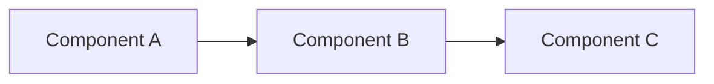

## ADR-{NNN}: {Decision Title}

### Status
{Proposed | Accepted | Deprecated | Superseded}

### Date
{YYYY-MM-DD}

### Context
{What prompted this decision. Include ticket references, scaling
concerns, or technical constraints that make this non-trivial.}

### System Diagram

### Decision Drivers
- {Driver 1: e.g., "ActivateX must remain backward compatible"}
- {Driver 2: e.g., "Need independent scaling for X"}
- {Driver 3: e.g., "Team ownership boundary"}

### Options Considered

#### Option 1: {Name}
- **Description:** {How it works}
- **Pros:** {Benefits}
- **Cons:** {Risks, complexity}
- **Effort:** {S/M/L/XL}
- **Backward compat:** {Yes/No/Partial}

#### Option 2: {Name}
- **Description:** {How it works}
- **Pros:** {Benefits}
- **Cons:** {Risks, complexity}
- **Effort:** {S/M/L/XL}
- **Backward compat:** {Yes/No/Partial}

#### Option 3: {Name} (if applicable)
- **Description:** {How it works}
- **Pros:** {Benefits}
- **Cons:** {Risks, complexity}
- **Effort:** {S/M/L/XL}
- **Backward compat:** {Yes/No/Partial}

### Decision
{Chosen option with clear rationale. Why this option over the others.}

### Consequences

#### Positive
- {What improves}

#### Negative
- {What becomes harder or more complex}

#### Risks
- {What to watch for post-implementation}

### Migration Path
1. {Step 1: Deploy without enabling (feature flag OFF)}
2. {Step 2: Enable in staging → validate}
3. {Step 3: Enable in production → monitor}
4. {Step 4: Remove old code path after stabilization}

### Follow-up Actions
- [ ] {Action item 1 with owner}
- [ ] {Action item 2 with owner}
- [ ] {Update documentation}
