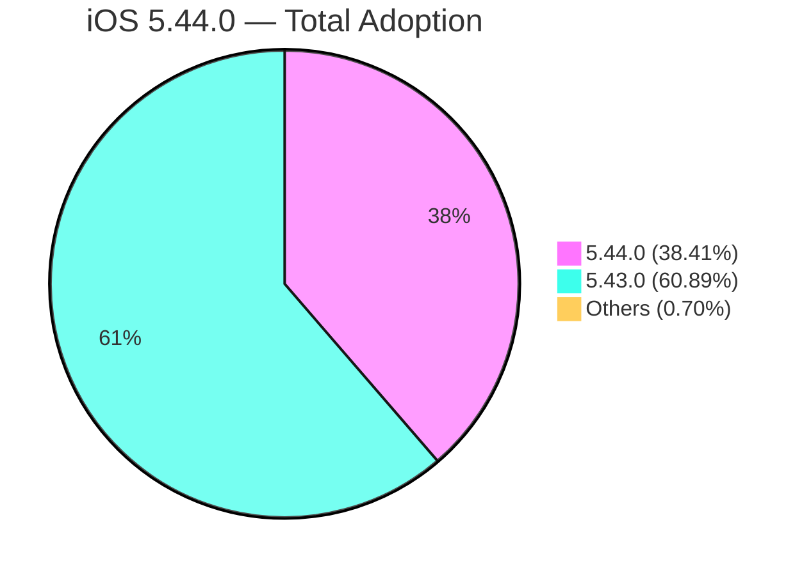
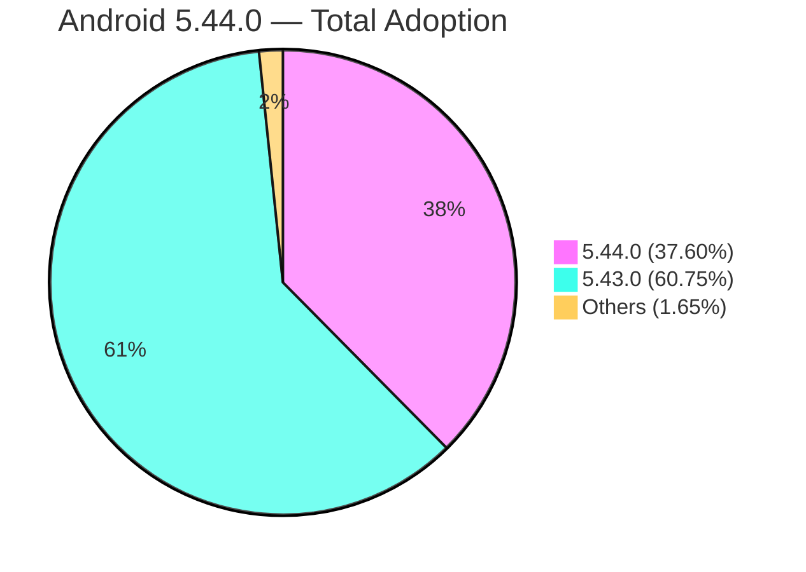
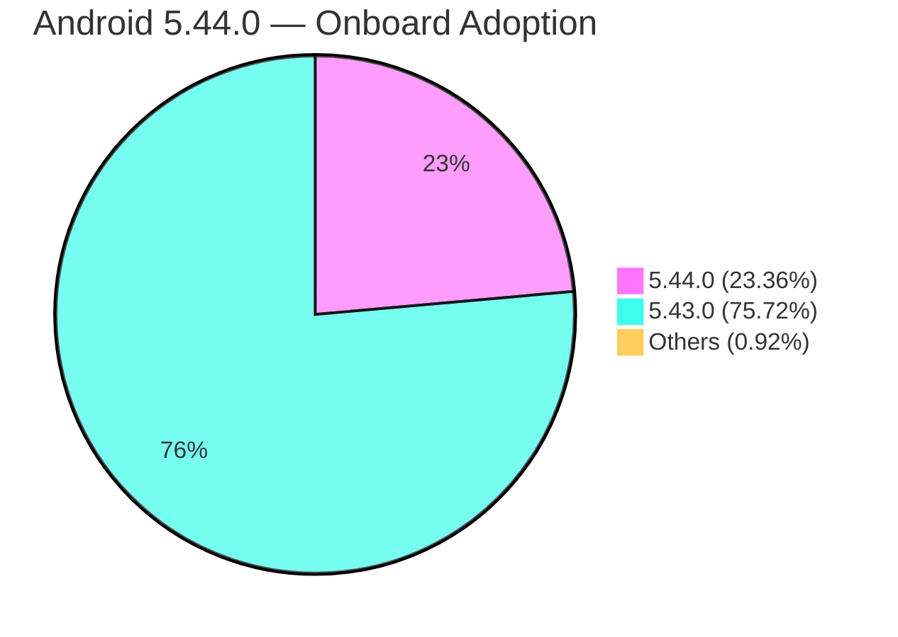

# Disney Cruise Line Mobile — iOS Release Follow Up
# iOS 5.44.0

Live 04/28/2026 @ 12 PM ESTData: 04/28/2026 12:00 PM — 04/30/2026 12:00 PM EST

---

## iOS 5.44.0 - Overview

<table style="width:100%;border-collapse:collapse;font-size:13px;">
<tr style="background:#333;color:white;"><th style="padding:6px;text-align:left;">Metric</th><th style="padding:6px;text-align:left;">Value</th></tr>
<tr><td style="padding:5px;border:1px solid #ddd;">Crash Rate (Total)</td><td style="padding:5px;border:1px solid #ddd;background:#d4edda;"><strong>0.088%</strong> (< 0.5%)</td></tr>
<tr><td style="padding:5px;border:1px solid #ddd;">Guest Experience Crash (Total)</td><td style="padding:5px;border:1px solid #ddd;background:#d4edda;"><strong>0.400%</strong> (< 1%)</td></tr>
<tr><td style="padding:5px;border:1px solid #ddd;">Crash Rate (At Home)</td><td style="padding:5px;border:1px solid #ddd;background:#d4edda;"><strong>0.095%</strong> (< 0.5%)</td></tr>
<tr><td style="padding:5px;border:1px solid #ddd;">Guest Experience Crash (At Home)</td><td style="padding:5px;border:1px solid #ddd;background:#d4edda;"><strong>0.258%</strong> (< 1%)</td></tr>
<tr><td style="padding:5px;border:1px solid #ddd;">Crash Rate (Onboard)</td><td style="padding:5px;border:1px solid #ddd;background:#d4edda;"><strong>0.084%</strong> (< 0.5%)</td></tr>
<tr><td style="padding:5px;border:1px solid #ddd;">Guest Experience Crash (Onboard)</td><td style="padding:5px;border:1px solid #ddd;background:#f8d7da;"><strong>1.346%</strong> (< 1%)</td></tr>
<tr><td style="padding:5px;border:1px solid #ddd;">Adoption Rate (Total)</td><td style="padding:5px;border:1px solid #ddd;background:#f8f9fa;"><strong>38.41% (44,955 / 117,028 devices)</strong></td></tr>
<tr><td style="padding:5px;border:1px solid #ddd;">Adoption Rate (Onboard)</td><td style="padding:5px;border:1px solid #ddd;background:#f8f9fa;"><strong>24.60% (5,162 / 20,986 devices)</strong></td></tr>
<tr><td style="padding:5px;border:1px solid #ddd;">Avg Response Time</td><td style="padding:5px;border:1px solid #ddd;background:#f8d7da;"><strong>2.09s</strong> (< 1s)</td></tr>
<tr><td style="padding:5px;border:1px solid #ddd;">99th Percentile Response Time</td><td style="padding:5px;border:1px solid #ddd;background:#f8f9fa;"><strong>5.25s</strong></td></tr>
<tr><td style="padding:5px;border:1px solid #ddd;">HTTP Error Rate</td><td style="padding:5px;border:1px solid #ddd;background:#f8d7da;"><strong>2.69%</strong> (< 2%)</td></tr>
<tr><td style="padding:5px;border:1px solid #ddd;">Network Failure Rate</td><td style="padding:5px;border:1px solid #ddd;background:#f8d7da;"><strong>3.11%</strong> (< 2%)</td></tr>
</table>

---

## iOS 5.44.0 - Top 3 General Crashes (Taking since the release datetime)

| # | Description | Sessions | Ticket | Affects Version | Fix Version |
|---|-------------|----------|--------|----------------|-------------|
| 1 | `[ChatMessage clearMessageBody]` | 50 | [DCLMSUST-19637](https://myjira.disney.com/browse/DCLMSUST-19637) | Mobile 5.43.0 | None |
| 2 | `NSInvalidArgumentException` in OneID.framework (0x000902FC) | 37 | [IDY-82144](https://jira.disney.com/browse/IDY-82144) | — | None |
| 3 | `NSInvalidArgumentException` in OneID.framework (0x0008EFBC) | 32 | [IDY-82144](https://jira.disney.com/browse/IDY-82144) | — | None |

---

## iOS 5.44.0 - Top 3 Crashes At Home (Taking since the release datetime)

| # | Description | Sessions | Ticket | Affects Version | Fix Version |
|---|-------------|----------|--------|----------------|-------------|
| 1 | `NSInvalidArgumentException` in OneID.framework (0x000902FC) | 37 | [IDY-82144](https://jira.disney.com/browse/IDY-82144) | — | None |
| 2 | `NSInvalidArgumentException` in OneID.framework (0x0008EFBC) | 32 | [IDY-82144](https://jira.disney.com/browse/IDY-82144) | — | None |
| 3 | `SIGABRT` in Flutter.framework | 21 | [DCLMSUST-19044](https://myjira.disney.com/browse/DCLMSUST-19044) | — | None |

---

## iOS 5.44.0 - Top 3 Crashes Onboard (Taking since the release datetime)

| # | Description | Sessions | Ticket | Affects Version | Fix Version |
|---|-------------|----------|--------|----------------|-------------|
| 1 | `[ChatMessage clearMessageBody]` | 45 | [DCLMSUST-19637](https://myjira.disney.com/browse/DCLMSUST-19637) | Mobile 5.43.0 | None |
| 2 | `SIGSEGV` in `Result<VoyageStatus, RequestError>` | 10 | [DCLMSUST-19044](https://myjira.disney.com/browse/DCLMSUST-19044) | — | None |
| 3 | `libobjc.A.dylib (0x00001B44)` | 6 | **Ticket to be created** | — | — |

---

## iOS 5.44.0 - Adoption Rate

| Version | Total Devices | Onboard Devices |
|---------|--------------|-----------------|
| 5.44.0 | 44,955 (38.41%) | 5,162 (24.60%) |
| 5.43.0 | 71,255 (60.89%) | 15,792 (75.25%) |
| 5.41.1 | 416 | 18 |
| Others | 402 | 14 |

---
---

# Disney Cruise Line Mobile — Android Release Follow Up
# Android 5.44.0

Live 04/28/2026 @ 12 PM ESTData: 04/28/2026 12:00 PM — 04/30/2026 12:00 PM EST

---

## Android 5.44.0 - Overview

<table style="width:100%;border-collapse:collapse;font-size:13px;">
<tr style="background:#333;color:white;"><th style="padding:6px;text-align:left;">Metric</th><th style="padding:6px;text-align:left;">Value</th></tr>
<tr><td style="padding:5px;border:1px solid #ddd;">Crash Rate (Total)</td><td style="padding:5px;border:1px solid #ddd;background:#d4edda;"><strong>0.085%</strong> (< 0.5%)</td></tr>
<tr><td style="padding:5px;border:1px solid #ddd;">Guest Experience Crash (Total)</td><td style="padding:5px;border:1px solid #ddd;background:#d4edda;"><strong>0.361%</strong> (< 1%)</td></tr>
<tr><td style="padding:5px;border:1px solid #ddd;">Crash Rate (At Home)</td><td style="padding:5px;border:1px solid #ddd;background:#d4edda;"><strong>0.063%</strong> (< 0.5%)</td></tr>
<tr><td style="padding:5px;border:1px solid #ddd;">Guest Experience Crash (At Home)</td><td style="padding:5px;border:1px solid #ddd;background:#d4edda;"><strong>0.182%</strong> (< 1%)</td></tr>
<tr><td style="padding:5px;border:1px solid #ddd;">Crash Rate (Onboard)</td><td style="padding:5px;border:1px solid #ddd;background:#d4edda;"><strong>0.102%</strong> (< 0.5%)</td></tr>
<tr><td style="padding:5px;border:1px solid #ddd;">Guest Experience Crash (Onboard)</td><td style="padding:5px;border:1px solid #ddd;background:#f8d7da;"><strong>1.302%</strong> (< 1%)</td></tr>
<tr><td style="padding:5px;border:1px solid #ddd;">Adoption Rate (Total)</td><td style="padding:5px;border:1px solid #ddd;background:#f8f9fa;"><strong>37.60% (9,776 / 25,998 devices)</strong></td></tr>
<tr><td style="padding:5px;border:1px solid #ddd;">Adoption Rate (Onboard)</td><td style="padding:5px;border:1px solid #ddd;background:#f8f9fa;"><strong>23.36% (1,354 / 5,795 devices)</strong></td></tr>
<tr><td style="padding:5px;border:1px solid #ddd;">Avg Response Time</td><td style="padding:5px;border:1px solid #ddd;background:#d4edda;"><strong>0.95s</strong> (< 1s)</td></tr>
<tr><td style="padding:5px;border:1px solid #ddd;">99th Percentile Response Time</td><td style="padding:5px;border:1px solid #ddd;background:#f8f9fa;"><strong>3.38s</strong></td></tr>
<tr><td style="padding:5px;border:1px solid #ddd;">HTTP Error Rate</td><td style="padding:5px;border:1px solid #ddd;background:#d4edda;"><strong>0.68%</strong> (< 2%)</td></tr>
<tr><td style="padding:5px;border:1px solid #ddd;">Network Failure Rate</td><td style="padding:5px;border:1px solid #ddd;background:#f8d7da;"><strong>12.08%</strong> (< 2%)</td></tr>
</table>

---

## Android 5.44.0 - Top 3 General Crashes (Taking since the release datetime)

| # | Description | Sessions | Ticket | Affects Version | Fix Version |
|---|-------------|----------|--------|----------------|-------------|
| 1 | `IndexOutOfBoundsException` in ChatAutoCompleteTextView.createChip | 12 | [DCLMSUST-18666](https://myjira.disney.com/browse/DCLMSUST-18666) | Mobile 5.36.0, 5.38.0, 5.36.1 | DCLM Backlog |
| 2 | `UninitializedPropertyAccessException` in DclFoundationParentActivity | 10 | [DCLMSUST-19829](https://myjira.disney.com/browse/DCLMSUST-19829) | Mobile 5.43.0 | **5.45.0** ✅ |
| 3 | `RuntimeException: Keystore key generation failed` | 9 | [DCLMSUST-18898](https://myjira.disney.com/browse/DCLMSUST-18898) | Mobile 5.38.0, 5.39.0 | None |

---

## Android 5.44.0 - Top 3 Crashes At Home (Taking since the release datetime)

| # | Description | Sessions | Ticket | Affects Version | Fix Version |
|---|-------------|----------|--------|----------------|-------------|
| 1 | `RuntimeException: Keystore key generation failed` | 9 | [DCLMSUST-18898](https://myjira.disney.com/browse/DCLMSUST-18898) | Mobile 5.38.0, 5.39.0 | None |
| 2 | `PendingTransactionActions$StopInfo.run` | 3 | [DCLMSUST-18041](https://myjira.disney.com/browse/DCLMSUST-18041) | Mobile 5.36.0 | DCLM Backlog |
| 3 | `NullPointerException` in DashboardStateroomFragment.newInstance | 2 | [DCLMSUST-18233](https://myjira.disney.com/browse/DCLMSUST-18233) | Mobile 5.26.0 | None |

---

## Android 5.44.0 - Top 3 Crashes Onboard (Taking since the release datetime)

| # | Description | Sessions | Ticket | Affects Version | Fix Version |
|---|-------------|----------|--------|----------------|-------------|
| 1 | `IndexOutOfBoundsException` in ChatAutoCompleteTextView.createChip | 12 | [DCLMSUST-18666](https://myjira.disney.com/browse/DCLMSUST-18666) | Mobile 5.36.0, 5.38.0, 5.36.1 | DCLM Backlog |
| 2 | `UninitializedPropertyAccessException` in DclFoundationParentActivity | 10 | [DCLMSUST-19829](https://myjira.disney.com/browse/DCLMSUST-19829) | Mobile 5.43.0 | **5.45.0** ✅ |
| 3 | `NullPointerException` in DclFoundationParentActivity.openExplorePage | 4 | **Ticket to be created** | — | — |

---

## Android 5.44.0 - Adoption Rate

| Version | Total Devices | Onboard Devices |
|---------|--------------|-----------------|
| 5.44.0 | 9,776 (37.60%) | 1,354 (23.36%) |
| 5.43.0 | 15,795 (60.75%) | 4,388 (75.72%) |
| 5.41.0 | 210 | 17 |
| Others | 217 | 36 |

---
---

# Summary

## Key Metrics Comparison

<table style="width:100%;border-collapse:collapse;font-size:13px;">
<tr style="background:#333;color:white;"><th style="padding:6px;text-align:left;">Metric</th><th style="padding:6px;text-align:center;">iOS</th><th style="padding:6px;text-align:center;">Android</th></tr>
<tr><td style="padding:5px;border:1px solid #ddd;">Crash Rate (Total)</td><td style="padding:5px;border:1px solid #ddd;background:#d4edda;text-align:center;"><strong>0.088%</strong></td><td style="padding:5px;border:1px solid #ddd;background:#d4edda;text-align:center;"><strong>0.085%</strong></td></tr>
<tr><td style="padding:5px;border:1px solid #ddd;">Crash Rate (At Home)</td><td style="padding:5px;border:1px solid #ddd;background:#d4edda;text-align:center;"><strong>0.095%</strong></td><td style="padding:5px;border:1px solid #ddd;background:#d4edda;text-align:center;"><strong>0.063%</strong></td></tr>
<tr><td style="padding:5px;border:1px solid #ddd;">Crash Rate (Onboard)</td><td style="padding:5px;border:1px solid #ddd;background:#d4edda;text-align:center;"><strong>0.084%</strong></td><td style="padding:5px;border:1px solid #ddd;background:#d4edda;text-align:center;"><strong>0.102%</strong></td></tr>
<tr><td style="padding:5px;border:1px solid #ddd;">Guest Exp Crash (Total)</td><td style="padding:5px;border:1px solid #ddd;background:#d4edda;text-align:center;"><strong>0.400%</strong></td><td style="padding:5px;border:1px solid #ddd;background:#d4edda;text-align:center;"><strong>0.361%</strong></td></tr>
<tr><td style="padding:5px;border:1px solid #ddd;">Guest Exp Crash (At Home)</td><td style="padding:5px;border:1px solid #ddd;background:#d4edda;text-align:center;"><strong>0.258%</strong></td><td style="padding:5px;border:1px solid #ddd;background:#d4edda;text-align:center;"><strong>0.182%</strong></td></tr>
<tr><td style="padding:5px;border:1px solid #ddd;">Guest Exp Crash (Onboard)</td><td style="padding:5px;border:1px solid #ddd;background:#f8d7da;text-align:center;"><strong>1.346%</strong></td><td style="padding:5px;border:1px solid #ddd;background:#f8d7da;text-align:center;"><strong>1.302%</strong></td></tr>
<tr><td style="padding:5px;border:1px solid #ddd;">Adoption (Total)</td><td style="padding:5px;border:1px solid #ddd;background:#f8f9fa;text-align:center;"><strong>38.41%</strong></td><td style="padding:5px;border:1px solid #ddd;background:#f8f9fa;text-align:center;"><strong>37.60%</strong></td></tr>
<tr><td style="padding:5px;border:1px solid #ddd;">Adoption (Onboard)</td><td style="padding:5px;border:1px solid #ddd;background:#f8f9fa;text-align:center;"><strong>24.60%</strong></td><td style="padding:5px;border:1px solid #ddd;background:#f8f9fa;text-align:center;"><strong>23.36%</strong></td></tr>
<tr><td style="padding:5px;border:1px solid #ddd;">Avg Response Time</td><td style="padding:5px;border:1px solid #ddd;background:#f8d7da;text-align:center;"><strong>2.09s</strong></td><td style="padding:5px;border:1px solid #ddd;background:#d4edda;text-align:center;"><strong>0.95s</strong></td></tr>
<tr><td style="padding:5px;border:1px solid #ddd;">HTTP Error Rate</td><td style="padding:5px;border:1px solid #ddd;background:#f8d7da;text-align:center;"><strong>2.69%</strong></td><td style="padding:5px;border:1px solid #ddd;background:#d4edda;text-align:center;"><strong>0.68%</strong></td></tr>
<tr><td style="padding:5px;border:1px solid #ddd;">Network Failure Rate</td><td style="padding:5px;border:1px solid #ddd;background:#f8d7da;text-align:center;"><strong>3.11%</strong></td><td style="padding:5px;border:1px solid #ddd;background:#f8d7da;text-align:center;"><strong>12.08%</strong></td></tr>
</table>

## Key Observations

- 🔴 **Guest Exp Crash Onboard exceeds KPI on both platforms** — iOS 1.346%, Android 1.302% (KPI < 1%)
- 🔴 **iOS network metrics all exceed KPIs** — Response Time 2.09s, HTTP Errors 2.69%, Network Failures 3.11%
- 🔴 **Android Network Failure Rate very high (12.08%)** — likely onboard connectivity related
- 🟢 **All crash rates well within KPI** (< 0.5%) on both platforms
- 🟢 **Android performance healthy** — response time 0.95s, HTTP errors 0.68%
- **iOS #1 crash is ChatMessage clearMessageBody** (50 sessions, found in 5.43.0) — no fix version assigned yet
- **iOS OneID crashes** (69 sessions combined) — IDY-82144 open, unassigned, no fix version
- **Android ChatAutoCompleteTextView** (12 sessions, found in 5.36.0) — in DCLM Backlog, long-standing
- **DCLMSUST-19829 fixed in 5.45.0** — will not appear in next release follow-up
- **Adoption strong at ~38%** for both platforms

---

_Data source: New Relic account 786801_
_Dashboard: https://onenr.io/0nQxmpOXpwV_
_Time window: 2026-04-28 12:00 PM EST → 2026-04-30 12:00 PM EST_
_Jira project: DCLMSUST_
