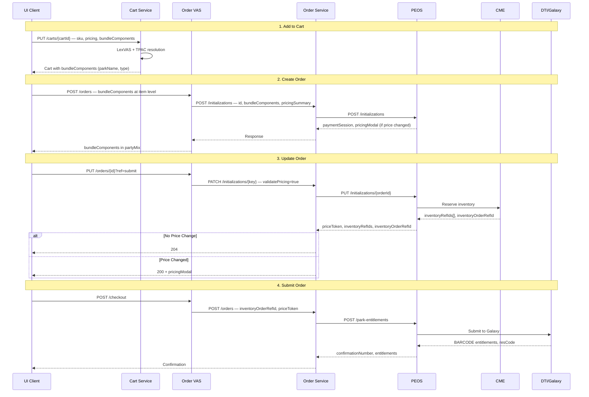

# TEP3 — API Contract Patterns

## Contract Repository

All TEP3 API contracts: `github.disney.com/commerce/ecommerce-project-tech-documentation`

Path convention: `TEP3/<service>/<flow>/<contract-type>.json`

## bundleComponents Structure by Service

```
Cart Request:         { id, sku, date }
Cart Response:        { id, sku, date, parkName, type, [name] }
Order VAS Create:     { id, sku, date, type }  (at item level)
Order VAS Other:      { id, sku, date, displayDate, parkName, type, [name] }  (in partyMix)
Order Svc Standalone: { sku, date, parkName, type, [name] }  (in entitlementOrderItems)
Order Svc Response:   { sku, date, type }  (minimal in responses)
Order Svc Package:    { id, date, classification }  (THEME_PARK_TICKET/LLMP_PRODUCT)
PEOS:                 { sku, date, type }  (same as Order Svc)
TMS:                  { productId, productIdType, visualId, eventStartDate, eventEndDate }
EVAS/TMS Response:    { visualId, sku, productInstanceId, productTypeId, category, facilityId, parkName, ... }
```

## Order Lifecycle Data Flow



## Pricing Structures

### Standalone Tickets
- Request: `pricingSummary.guestPrices` (ticket-only pricing)
- Response: `priceSummary.totals` with unit/tax/total per guest type

### Bolt Kits (combined ticket + voucher)
- Request: `bundlePricing` replaces `pricingSummary`
- Response has 3 levels:
  - `bundlePricing` — combined (ticket+voucher)
  - `priceSummary` — ticket-only
  - `boltKitComponents[].priceSummary` — voucher-only
- PricingModal for kits uses combined price

### Submit Response Suppression
- `priceToken` must NOT appear in `bundlePricing` on submit response
- Fix: null out `bundlePricing.priceToken` before serialization
- `@JsonInclude(NON_NULL)` handles omission from JSON

### Data Flow (MapStruct, no manual copy)
```
PEOS response JSON → Jackson → Item.bundlePricing (PricingSummaryDTO)
→ MapStruct toDomainModel → EntitlementItem.bundlePricing (PricingSummary)
→ MapStruct toWebResource → ItemResource.bundlePricing (PricingSummary)
→ Jackson serializes to API response
```

## Key Field: `id` in partyMix

The `id` field inside `partyMix` is the **cart item ID** — unique identifier generated by cart service (format: `474854715828-1673576-4659807-8098827`).

Flow through the chain:
- **Cart:** Generated on add-to-cart
- **Order VAS Create:** In `partyMix[].id` with `unitPrice`
- **Order VAS Update/Submit:** Same `id` with nested `bundleComponents[]`
- **Error handling:** Returned in `errorInfos.apiParams` (comma-separated) to identify unavailable items

It is NOT the guest ID, product ID, or order ID.

## Error Patterns

### Inventory Unavailability

| Service | HTTP | Error Code | Field |
|---------|------|-----------|-------|
| PEOS | 400 | `PRODUCT_INVENTORY_NOT_AVAILABLE` | `errorInfos.apiParams` = item IDs |
| Order Svc (standalone) | 500 | `TICKET_INVENTORY_NOT_AVAILABLE` / 564 | `errorInfos.apiParams` = item IDs |
| Order Svc (package) | 500 | `INVENTORY_NOT_AVAILABLE` / 559 | `errorInfos.apiParams` = cart item ID |
| TTC | 400 | `PRODUCT_INVENTORY_NOT_AVAILABLE` / 401 | Direct PEOS pass-through |

### Handling Flow (UC SPA)
1. Order VAS returns error with `itemIds` and `runErrorProcessor` flag
2. UC SPA removes unavailable items in background via cart service
3. Create error → redirect to origin with `510` param
4. Update/submit error → message displayed on UC page

### TTC Invalid Price
- HTTP 200, `status: "FAILED"`, `errorCode: "562"` (maintains Peach design pattern)

### TPAC Null Price
- Throws `TPAC_SERVICE_ERROR` when CME/LexVAS product config is incomplete

### Package Price Change
- POS returns warning code `POS6568` → UC displays price change modal

## Pending Contract Fields

### High Priority (not yet implemented)
| Field | Service | Impact |
|-------|---------|--------|
| `bundlePricing` | PEOS | Bolt/bulk kit pricing |
| `offerCollectionId` | Order Svc | Package ticket pricing modal |
| `ticketPortfolio` | Order Svc | Package ticket component grouping |

### Medium Priority
| Field | Service | Impact |
|-------|---------|--------|
| `offerPrice` | Order Svc | Package room+ticket combined price |
| `packageCode` (domain) | Order Svc | New domain package code format |
| `guestRefs[]` in partyMixMembers | Order Svc | Guest refs for packages |

### Implemented ✅
`bundleComponents[]`, `inventoryRefIds[]`, `inventoryOrderRefId`, `pricingModal`, `cancelReservationIds[]`, `freeze` object, `offerId`, `validatePricing`, `V2 Cancel API`, `priceToken`
