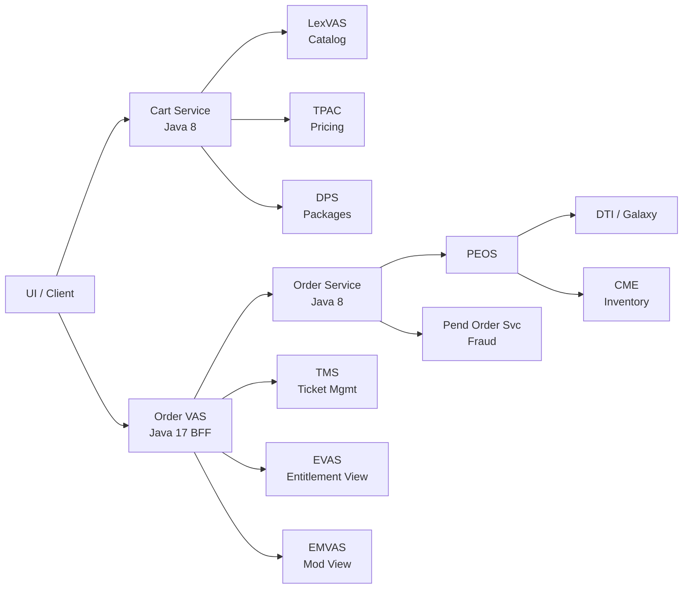

# TEP3 — Architecture & Service Chain

## Overview

TEP3 (Ticket Entitlement Platform v3) is the next-generation package-based ticketing architecture for Disneyland Resort (DLR), replacing TEP2. Core change: multi-day tickets become **bundles of per-day components**. Each component has its own ticket-id, pricing, and inventory.

There is NO explicit TEP2/TEP3 flag. Detection is **implicit** — presence of `bundleComponents` in the request determines the code path:
```
TEP2 request: no bundleComponents → hasBundleComponents() = false → legacy flow
TEP3 request: has bundleComponents → hasBundleComponents() = true → TEP3 flow
```

## Service Chain



## Repositories

| Repository | Org | Language | Purpose |
|-----------|-----|----------|---------|
| `cart-service-java8` | wdprd-development | Java 8, Spring 3.2, CXF, MariaDB, Redis | Cart management, pricing, availability, PCM |
| `ecommerce-order-vas-java-17` | wdpro-peplite | Java 17, Spring Boot, Maven | Order BFF — orchestrates 15+ downstream services |
| `order-service` | wdprt-paap-api | Java 8, Spring Boot 1.5.19, DynamoDB, Redis | Order persistence, state machine (v1-v4 APIs) |
| `wdpr-park-entitlement-order-service` | wdprt-paap-api | Java | PEOS — DTI/CME integration, inventory fulfillment |
| `wdpr-ecommerce-booking-svc` | wdprt-paap-api | Java | Booking orchestration |
| `pend-order-service` | wdprt-paap-api | Java, Spring Boot 1.5.19, MariaDB | Fraud-pended order pipeline (Accertify) |
| `wdpr-mock-svc` | WDPR-Commerce | Java | Wiremock service for dependency mocking |
| `wdpr-ecommerce-uc-spa` | WDPR-Commerce | Angular | Unified Checkout SPA |
| `com-uc-ui-components` | WDPR-Commerce | Angular | Shared UC UI component library |

All use Gitflow with `develop` as the integration branch. Host: `github.disney.com`.

## TEP2 vs TEP3 — Key Differences

| Aspect | TEP2 | TEP3 |
|--------|------|------|
| Product model | 1 ticket = entire stay | 1 bundle = N daily components |
| Ticket ID | Same ID for all days + LLMP | Different ID per day per type |
| Ledger blocks | 2 (TKT + LL) | N (1 per day per type). 3-day PH+LLMP = 6 blocks |
| Park selection | `parkReservations[]` with facilityId/slotId | `bundleComponents[]` with parkName/parkCode per day |
| Add-ons | `supplements[]` | Deprecated → `bundleComponents[]` with type LLMP |
| Pricing | Single price for whole ticket | Per-bundle pricing, dynamic per day via DPE |
| Price tokens | Passed through all layers | Stored in Redis, not exposed to UI |
| Inventory | No CME integration | CME `inventoryRefIds[]` + `inventoryOrderRefId` |
| Update API (PEOS) | Reused /initialize | NEW dedicated PUT endpoint |
| Update response | Always 200 with priceTokens | 204 (no change) or 200 (pricingModal) |
| Downstream (EVAS/TMS) | `supplements[]` | `components[]` with `isBundle: true` |
| Mods | parkReservations + supplements | bundleComponents + cancelReservationIds |

## Core Concept: bundleComponents

TEP3 products use a bundled component model:

- `bundleComponents[]` on ticket items — each has `sku`, `date`, `type`, `parkName`, `parkCode`, `classification`
- `hasBundleComponents()` gates ALL TEP3 behavior
- New `productTypeIds`: `dlr-theme-park-bundle`, `dlr-theme-park-component`, `dlr-llmp-addon`
- Component types: `TICKET` (theme park admission), `LLMP` (Lightning Lane Multi Pass)

**Request example (2-Day Park Hopper with LLMP):**
```json
{
  "bundleComponents": [
    { "sku": "1DPH_AD_DL",  "date": "2026-07-03", "type": "TICKET" },
    { "sku": "1DPH_AD_DCA", "date": "2026-07-04", "type": "TICKET" },
    { "sku": "1D_LLMP",     "date": "2026-07-03", "type": "LLMP" },
    { "sku": "1D_LLMP",     "date": "2026-07-04", "type": "LLMP" }
  ]
}
```

## Inventory & Pricing Flow

1. **Create**: No inventory refs, no price tokens
2. **Update** (NEW for TEP3): PEOS → CME reserves inventory → returns `inventoryRefIds[]` + `inventoryOrderRefId` + `priceToken`
3. **Submit**: Passes `inventoryOrderRefId` + `priceToken` to DTI
4. **Abandon**: Passes `inventoryRefId` + `inventoryOrderRefId` for CME cleanup
5. **Bolt Bulk**: Explicitly excluded from CME integration (no inventory refs)

Price tokens from DTI QEP stored in Redis by Order Service (deviation from Peach which passed through all layers).

## Sales Channels

| Channel | Code | Description | Store ID |
|---------|------|-------------|----------|
| Digital (DTC) | — | Consumer website/mobile app | `dlr` |
| UAD | Unified Agent Desktop | Internal call center (cast members) | `dlr_uad`, `dlr_uad_ta` |
| TTC | Travel Trade Connect | 3rd party wholesalers | Uses `tsmac`/`tsloc` |
| Bolt | — | Group/bulk ticket sales | `dlr_bolt_dlr_youth_dpa_00001` (example) |

## SKU Patterns

### Format
```
{days}D{parks}_{age}_{channel}
```

### Examples
| SKU | Meaning |
|-----|---------|
| `2DPH_AD_TKTBNDL` | 2-Day Park Hopper, Adult, Standalone Bundle |
| `2D1P_AD_TKTBNDL` | 2-Day 1-Park, Adult, Standalone Bundle |
| `2DPH_CH_TKTPKG` | 2-Day Park Hopper, Child, Package |
| `PKG2DPH-A-BCON` | 2-Day Park Hopper, Adult, Bolt/Bulk |
| `1DPH_AD_DL` | 1-Day Park Hopper, Adult, Disneyland (component) |
| `1D_LLMP` | 1-Day Lightning Lane Multi Pass (component) |

### LexVAS Product Instance ID
```
dlr-theme-park-bundle_2_A_P_0_RF_AF_SOF_progenstr
│                    │ │ │ │ │   │   │   └── store context
│                    │ │ │ │ │   │   └────── Standard Offer Flag
│                    │ │ │ │ │   └────────── Affiliation Flag
│                    │ │ │ │ └────────────── Resident Flag
│                    │ │ │ └──────────────── 0 = no add-on tier
│                    │ │ └────────────────── P = Park Hopper (1P = 1-Park)
│                    │ └──────────────────── A = Adult (C = Child)
│                    └────────────────────── number of days
└─────────────────────────────────────────── product type (-bundle = TEP3)
```

## Supplements → Components Migration

All downstream services deprecate `supplements` for TEP3:
- EVAS: `supplements` → `components[]` with `isBundle: true`
- TMS: `supplements` → `components[]` with `isBundle: true`
- EMVAS: `supplements` → `components[]` in mod options
- Keyring: `ticketDetails.supplements` → `ticketDetails.components[]`
